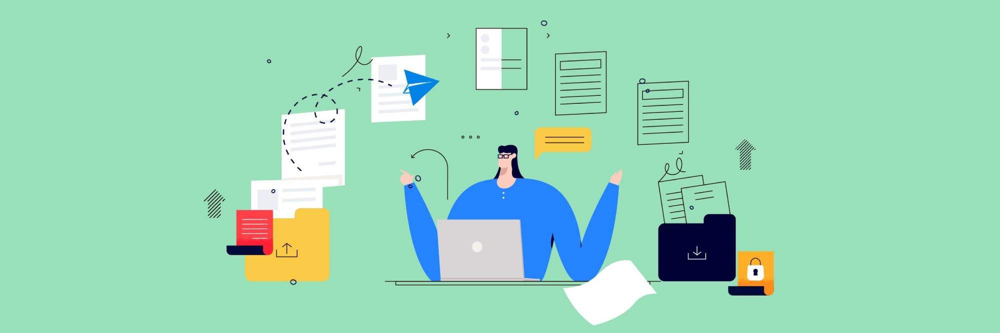
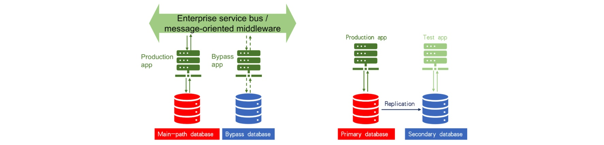

Author: Tianshuang Qin (Principal Solutions Architect at PingCAP)

_This article is based on a talk given by Tianshuang Qin at [TiDB DevCon 2020](https://pingcap.com/community/devcon2020/)._

When we convert from a standalone system to a distributed one, one of the challenges is migrating the database. We're faced with questions such as:

* Should I migrate full or incremental data?
* Should I perform an online or offline migration?
* Should I use a ready-made data replication tool or develop a new one?

When it comes to data migration, users are often faced with many options. At PingCAP, we've probably tried most of them. Over the years, we've migrated many heterogeneous databases between different database platforms and application scenarios. Today, I'll save you some time by sharing with you the approaches that worked best.

## A typical database migration process 

A typical heterogeneous database migration process involves:

1. [Application adaptation development](#1-application-adaptation-development)
2. [Application verification testing](#2-application-verification-testing)
3. [Migration testing](#3-migration-testing)
4. [Database migration and production database switch](#4-data-migration-and-production-database-switch)

### 1. Application adaptation development

Almost all early TiDB users have gone through this step. In version 3.0 or earlier, TiDB supports optimistic concurrency control and Repeatable Read (RR) isolation level, and its transaction size is limited to about 100 MB. Given these features and capacity, users need to put a lot of effort into adapting their applications. In contrast, TiDB 4.0 supports pessimistic concurrency control, Read Committed (RC) isolation, and large transactions with a maximum size of 10 GB. Users can adapt their applications to TiDB at a much lower cost.

### 2. Application verification testing

There are two ways to perform application verification testing. You can combine the two methods to effectively verify your application.

 Application verification 

The first method is to test your application with production data. To do this, you must first use database replication technology to replicate the data from the production database to TiDB. Then, you use a testing application to perform a stress test. To stress TiDB and ensure that it will be stable in your production environment, apply a workload 10 to 20 times higher than your real production traffic. One of the advantages of replicating data from the production database to TiDB is that you **avoid wide variations between test data and production data, which may cause many problems**. For example, an SQL query, which has been tuned in the testing environment to achieve its highest performance, may become a slow SQL query in the production environment if the data is not replicated to TiDB for testing.

The second way to verify your application is to test it with production traffic. In this case, you must adopt a service bus similar to the enterprise service bus (ESB) for banks or message queuing technology. For example, you can use the Kafka message queuing mechanism to implement the multi-path replication of production traffic. Whether an application can successfully run in the production environment depends on the main path of the existing production database. There is also a bypass for the application. We can load an application that has been adapted to TiDB on the bypass and connect the application to TiDB for application verification.

### 3. Migration testing

Migration testing mainly involves verifying operations completed during the maintenance window. For example, you must follow the migration activity specified in the migration manual in advance to verify that the manual is correct and to determine whether the migration maintenance window is long enough to perform the migration. You also need to perform rollback testing, because if your deployment to production fails, you may need to roll back to the previous database.

### 4. Data migration and production database switch

Your applications may run 24/7 or you may only have a short maintenance window to switch over databases, so you must migrate your data before the maintenance window ends. To do that, you must use heterogeneous database replication technology. During the maintenance window, you can stop all running applications, replicate incremental data to the secondary database, perform a comparison to ensure that the secondary database is synchronized with the primary database, and then verify applications. Once the application verification testing is completed, database switchover starts. If the switchover is successful, TiDB will run as a primary database in the production environment.

## Application scenarios of database replication

Heterogeneous database replication has these application scenarios:

* Migrating data
* Creating a heterogeneous disaster recovery database
* Creating a read-only or archive database
* Aggregating data from multiple sources

### Migrating data

We've talked about this application scenario in the [previous section](#a-typical-database-migration-process).

### Creating a disaster recovery database 

If you use Oracle as the primary database, you can use TiDB as its disaster recovery database. If you've just deployed a TiDB database in the production environment without sufficient verification, you can use an Oracle database as the disaster recovery database for TiDB. That way, if the TiDB database suddenly crashes, you can promptly migrate the data back to the original production database.

### Creating a read-only or archive database

First, let's look at the application scenario of building a read-only database. This is applicable to some bank clients. A bank's core services run in a closed system, and it may be impossible to migrate them to an open platform or a distributed database in a short time. However, some read-only applications, such as querying account details, bills, or monthly statements on the app client, can be completed without accessing the core production database, which only processes real transactions. Therefore, we can use database replication technology to replicate such read-only application data from the production database to the TiDB database and perform the read-only operations only in the TiDB database.

Another scenario is building an archive database. If you use a traditional standalone database for production and its capacity is limited, but your application data is growing quickly, the data cannot be migrated to a distributed database in a short time. A solution is to save data in the production database for a specific period (for example, 30 or 40 days), delete expired data from the production database, and store the deleted data in TiDB. That is, the deletion operation is performed only in the production database, and TiDB is used as an archive database.

### Aggregating data from multiple sources

**You can use TiDB as a data hub.** You might run multiple applications in Online Transactional Processing (OLTP) databases and want to use the database replication technology to aggregate data from multiple sources to one TiDB database. Then, you can perform in-depth analysis on or read-only queries in the TiDB database. The main challenge for multi-source aggregation lies in the cross-database query after data is successfully aggregated to the TiDB database. The data may come from heterogeneous databases. It is impossible to create database links among them as database links can only be created among Oracle databases. To solve this problem, you can use heterogeneous database replication and use the TiDB database in a role similar to a widely deployed operational data store (ODS) for aggregating data.

## Replicating heterogeneous databases

This section discusses some commonly used heterogeneous database replication methods.

### Data transfer via interface files

This method is widely used when transferring data between OLTP and Online Analytical Processing (OLAP) systems. As the data transfer involves two different systems, it's difficult to connect two database networks. Databases belong to backend systems. For security reasons, it is not suitable to directly connect them.

A comma-separated values (CSV) file is a typical interface file. The interface file here refers to the file generated by an application, based on the predefined format and rules for adding delimiters and line breaks. After receiving a generated interface file, the receiving end parses the interface file based on the agreed format, converts the file into an `INSERT` statement, and inserts it into the target database. 

The advantage of this method is that it applies to any database. As long as the upstream and downstream databases support standard SQL interfaces, you can transfer data through an interface file.

However, this approach has several disadvantages:

* It requires additional development in your application code. For example, if the application was originally developed in Java, you need to add more programming logic. If you add logic to the upstream database code that generates an interface file, you also need to add logic to the downstream database code that imports the interface file. Moreover, to improve performance, you may need to control the concurrency of the file import.
* Interface files are only useful for full refresh and append write operations. It is difficult to obtain data changes generated by `UPDATE` and `DELETE` operations through an interface file. 
* Data may not be timely. As 5G technology gradually rolls out, terminal devices require lower latency. For example, banks are gradually changing from the traditional [T+1](https://www.investopedia.com/terms/t/tplus1.asp) analytics to T+0 or even near real-time analytics. When you transfer data using an interface file, it's hard to ensure that the data is timely. This is because the interface file triggers file loading at a specific time with low frequency and efficiency.
* When data is exported, the upstream database must be scanned extensively to access the data through the SQL interface. This may affect performance. Therefore, as a common practice, the upstream application will open an SQL interface in the secondary database for exporting a read-only file to the downstream database.

### Developing an ETL job and scheduling the job for data transfer

You can develop an extract, transform, load (ETL) job and schedule the job on a regular basis to transfer data. This method is commonly applied to data transfer and processing between OLTP and OLAP systems.

If you need to run ETL jobs for a long time, you may take a long time to obtain the incremental data and write it to the target database. This requires the ability to schedule ETL jobs, which involves additional development. 

Using an ETL job has the following advantages:

* Just like an interface file, an ETL job uses SQL interfaces and is applicable to any database. As long as the upstream and downstream databases support SQL standards, you can use ETL jobs. 
* Additionally, you can process data during the ETL job. If the upstream and downstream databases have different table schemas, or if you need to add logic to the table schema, ETL jobs are the best choice. 

The disadvantages of an ETL job are similar to those of using an interface file:

* **An ETL job requires additional development**. You need to create a set of independent SQL jobs and build up a scheduling system. 
* The **data changes** incurred by `UPDATE` and `DELETE` operations are **difficult to obtain** via ETL jobs. Compared to using an interface file, **the timeliness of ETL may be slightly better**, but it depends on the scheduling frequency. However, the scheduling frequency is actually related to the processing time required by the job after each scheduling. For example, when data is imported each time, if a job requires 5 minutes for processing, the delay may be as long as 5 to 10 minutes.
* **To access the data through the SQL interface, extensive scanning of the upstream database is required. This may affect performance.**

### Using a CDC tool

We recommend that you use change data capture (CDC) tools to replicate heterogeneous databases. There are many CDC tools, such as Oracle GoldenGate (OGG), IBM InfoSphere CDC, and [TiDB Data Migration](https://docs.pingcap.com/tidb-data-migration/stable/overview) (DM).

The following table summarizes the advantages and disadvantages of using CDC tools. As you can see, there are far more advantages.

<table>
  <tr>
   <td><strong>Advantages</strong>
   </td>
   <td><strong>Disadvantages</strong>
   </td>
  </tr>
  <tr>
   <td>Your application requires no additional development.

CDC tools can obtain all DML changes, like <code>DELETE</code> and <code>UPDATE</code>.

Because the workload is distributed through the day, these tools have higher performance.

CDC tools bring low latency and near real-time replication.

Upstream data is obtained by reading redo logs, which does not impact the SQL performance.
   </td>
   <td>CDC tools are mostly commercial products, and you need to purchase them.

Most CDC tools only allow a specific database as an upstream database. If you have multiple types of upstream databases, you need to use multiple CDC tools.
   </td>
  </tr>
</table>

## Best practices for heterogeneous database replication in TiDB

I'd like to offer some best practice tips for heterogeneous database replication in TiDB:

Tips based on replication tasks: 

* If you want to replicate incremental changes incurred by operations such as `UPDATE` and `DELETE`, a CDC tool is your best choice. 
* If you want full data replication, you can use lightweight ETL tools dedicated to data migration such as Kettle or DataX. You do not need to purchase CDC tools or build other architectures to complete the replication. Instead, you only need to ensure that the ETL tool can access the upstream and downstream databases simultaneously and perform ETL jobs to do the full data replication.

Tips based on scenarios:

* If you are [creating a disaster recovery database](#creating-a-disaster-recovery-database), [creating a read-only or archive database](#creating-a-read-only-or-archive-database), or [aggregating data from multiple sources](#aggregating-data-from-multiple-sources), we recommend that you use a CDC tool for data replication. If you use ETL jobs in these scenarios to obtain all DML changes, the development costs will be very high.

If your upstream database is a MySQL-like database or a MySQL-based database (such as Amazon RDS on the public cloud, including Aurora and some sharding products developed based on MySQL), you can use the TiDB DM tool for data transfer. For more information about DM, see [TiDB Data Migration Overview](https://docs.pingcap.com/tidb-data-migration/stable/overview). 

If you have any questions on any of the topics we covered today, you can join our [community on Slack](https://slack.tidb.io/invite?team=tidb-community&channel=everyone&ref=pingcap-blog), and send us your feedback. 
