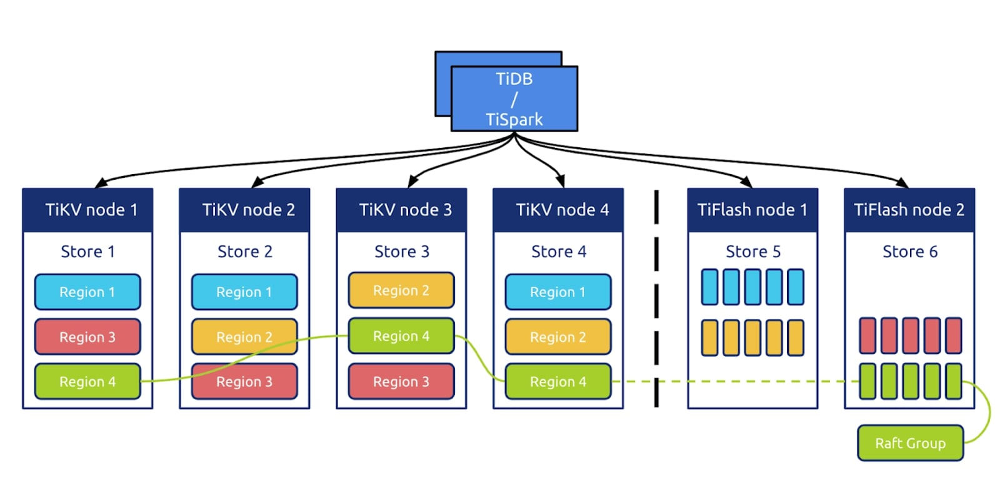
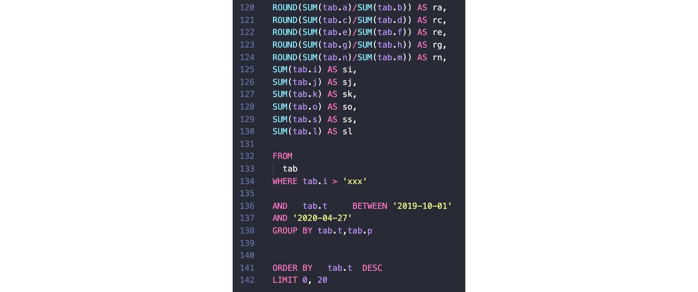
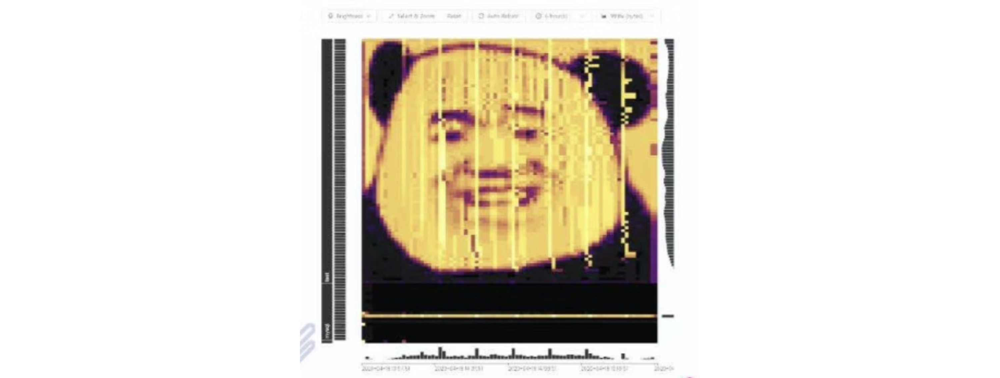

**Industry:** Live Streaming 

**Author:** Jiaqing Xu (DBA at BIGO)

**Transcreator:** [Ran Huang](https://github.com/ran-huang); **Editors:** [Caitin Chen](https://github.com/CaitinChen), Tom Dewan

Founded in 2014, [BIGO](https://www.bigo.sg/about) is a fast-growing social networking company based in Singapore. Based on our powerful audio and video processing, global real-time transmission, and content delivery network (CDN) technology, BIGO has launched products like Bigo Live (live video streaming), Likee (short-form video), and imo (video conferencing). BIGO now boasts nearly 400 million active users per month, and our products and services cover more than 150 countries and regions.

The rapid growth of our businesses is inseparable from the contribution of our infrastructure and software. As our application data quickly grew, we tried [PhxSQL](https://github.com/Tencent/phxsql), MySQL, and [Pika](https://github.com/Qihoo360/pika) to manage our data, but their weakness in horizontal scalability or complex queries disappointed us.

Thanks to [TiDB](https://docs.pingcap.com/tidb/stable), an open-source, MySQL-compatible, horizontally scalable database with strong consistency, we are able to better handle our data. In this article, we'll talk about how we benefit from TiDB and its new features in [TiDB 4.0](https://docs.pingcap.com/tidb/stable/release-4.0-ga).

## Why we chose TiDB

Before we used TiDB, we tried PhxSQL, MySQL, and Pika, but they had these shortcomings:

* PhxSQL:
    * Difficult to scale out and shard
    * Couldn't handle high queries per second (QPS)
    * Almost unmaintained
* MySQL:
    * Difficult to scale out
    * Not good at executing complex SQL queries
* Pika:
    * Difficult to perform complex queries and range queries

We looked for a new solution and found that TiDB, an open-source, distributed, [Hybrid Transactional/Analytical Processing](https://en.wikipedia.org/wiki/Hybrid_transactional/analytical_processing) (HTAP) database, was a good choice. We adopted TiDB because it had these advantages:

* **It's compatible with the MySQL protocol.** To migrate a production application to TiDB, we only need to modify a small amount of code.
* It's suitable for various use cases that require **strong consistency** and **high availability** with large-scale data.
* **It supports horizontally scaling in or out.** TiDB's architecture separates computing from storage and enables us to separately scale out or scale in the computing or storage capacity online as needed.
* It's easy to [deploy](https://docs.pingcap.com/tidb/stable/production-deployment-using-tiup).

## TiDB 4.0 in BIGO

[TiDB](https://github.com/pingcap/tidb) is an open source, distributed SQL database that provides horizontal scalability, high availability, and real-time HTAP. In May 2020, TiDB released the 4.0 GA version, marking a milestone in its history.

Earlier this year, we started using TiDB 4.0 beta. We created a test cluster, which would iterate along with the latest development version of TiDB. Therefore, we upgraded to TiDB 4.0 GA soon after its release.

We took a bold step and deployed two TiDB clusters in the production environment, mostly for analytical processing.

* One was used to analyze network monitoring metrics. This cluster's data volume grew fast, and its SQL statements were mostly analytical. The application also needed quick response.
* The other was deployed as the downstream storage for the big data system. After being processed by big data tools, the data in the TiDB cluster was provided for online real-time services. The data volume of a single table is large.

In TiDB 4.0, [TiUP](https://docs.pingcap.com/tidb/stable/tiup-overview) is used for cluster deployment, [Pump](https://docs.pingcap.com/tidb/stable/tidb-binlog-overview#pump) and [Drainer](https://docs.pingcap.com/tidb/stable/tidb-binlog-overview#drainer) are used to replicate data across different continents based on binlogs, and [TiFlash](https://docs.pingcap.com/tidb/stable/tiflash-overview) is used for real-time data analytics. We use these TiDB 4.0 components widely in our system.

## Why we upgraded to TiDB 4.0

A new version of the database can bring instability to the existing system. However, after prudent and thorough consideration, we decided to upgrade to TiDB 4.0. The major factors were our application requirements and the need for efficient database maintenance.

### Application requirements

When the application team puts forward new requirements, as DBAs, we always do our best to meet their needs.

The application developers used to complain that TiDB's character set sorting didn't work as expected. They were right. Before 4.0, TiDB couldn't identify letter cases in its sorting. It treated uppercase and lowercase the same way. Thanks to 4.0, TiDB now supports case sensitivity through [character sets and collations](http://docs.pingcap.com/tidb/stable/character-set-and-collation).

In TiDB 4.0, [the pessimistic transaction model](https://docs.pingcap.com/tidb/stable/pessimistic-transaction), an important feature for e-commerce and financial platforms, is generally available. With TiDB 4.0, applications no longer need to put much focus on inconsistencies or data conflicts.

### Maintenance requirements

With TiDB 4.0, maintenance is also easier.

#### TiUP: better package management

[TiUP](https://docs.pingcap.com/tidb/stable/tiup-overview) is a package manager that enables us to deploy and maintain TiDB with only a single line of TiUP commands. It makes managing TiDB components easy and flexible.

In addition, we can use TiUP to look into the status of the entire cluster. We don't have to go to each cluster and look at its status separately.

#### Backup & Restore

Another good feature of TiDB 4.0 is [Backup & Restore (BR)](https://github.com/pingcap/br). BR is a command-line tool for distributed backup and restore of TiDB cluster data. Compared with mydumper or loader, BR is more suitable for clusters with huge data volume.

Prior to TiDB 4.0, we could only perform backup and restore via mydumper or by creating disk snapshots, which makes it difficult for DBAs to maintain the databases. Though we wanted to try our core applications with TiDB, the lack of a complete backup and restore feature prevented us from doing so.

With BR, we'll use TiDB in more of our applications and go further and more confidently with this distributed database.

#### TiFlash: real-time HTAP

If you ask me what's my favorite feature of TiDB 4.0, the answer is absolutely [TiFlash](https://docs.pingcap.com/tidb/stable/tiflash-overview). TiFlash is the component that makes TiDB a true HTAP database.

TiDB has two storage engines: TiKV, a row store, and TiFlash, a column store. TiFlash is a columnar extension of TiKV, which replicates data from TiKV according to the [Raft](https://en.wikipedia.org/wiki/Raft_(computer_science)) consensus algorithm.

TiDB Architecture with TiFlash

We usually divide requests into two types: Online Transactional Processing (OLTP) and Online Analytical Processing (OLAP). We may take it for granted that the requests from real-time online applications are OLTP workloads, and the summaries of big data analytics are OLAP workloads. But is that really the case? In actual use scenarios, to meet the operational requirements, many online applications make queries of real-time reports.

Simply using big data tools, these queries may take T+1 or even T+N days to process. That's nowhere near real time. One of the existing solutions is to make queries on the OLTP storage. Other solutions include modifying indexes, replicating the same data to different storage, or writing the same data to different tables. These solutions are either inefficient or troublesome. **TiFlash gives us a new option: adding a columnar replica to achieve real-time analytics.**

An example of a large SQL query

The image above is a large SQL statement from a real-time application. It is over 100 lines long and contains lots of tables and `GROUP BY` clauses, some conditions, and a `SUM` aggregate function. Usually, the request is processed in the online MySQL database or a TiDB database with TiKV as the only engine, and it could take minutes or even hours to complete. But with TiFlash, a columnar storage engine, we successfully reduced the processing time to only 50 seconds. Moreover, since the data in TiFlash is replicated from TiKV, and their consistency is guaranteed by Raft, not only does the TiFlash query run fast, but it also returns consistent, real-time results.

TiDB can also be combined with our existing big data system. It provides [TiSpark](https://docs.pingcap.com/tidb/stable/tispark-overview), a layer built for running Apache Spark on top of TiDB. We can use TiSpark to access the storage layer, including both TiKV and TiFlash.

In TiDB 4.0 GA, TiFlash introduces two new parameters that let it push down more operators and merge more Region requests. (A Region is the basic unit of data storage in TiDB's storage engine.) By configuring these parameters, we can boost performance significantly. In our test, **TiFlash improved the performance by 100%, and the query time dropped from 25 seconds to 11~12 seconds.** This means that online data is analyzed in almost real time. Compared to TiFlash, the [extract, transform, load](https://en.wikipedia.org/wiki/Extract,_transform,_load) (ETL) processing of our big data system has to go through a long data pipeline. Without two-way data validation, this might cause data inconsistency or even data loss. Now, all of our applications tend to choose TiFlash rather than traditional big data solutions.

In summary, the TiDB 4.0 cluster for each of our online applications has at least one TiFlash replica. Even if the TiFlash replica goes down, we can still push down requests to TiKV. For DBAs, database stability is a priority, and TiFlash makes sure that the database keeps working—even in difficult situations. That's an important reason why we chose TiDB 4.0 and TiFlash.

## Our future plans for TiDB 4.0

TiDB 4.0 offers many possibilities that we have yet to explore. In this section, I'll talk about how we plan our next steps with TiDB 4.0.

### TiCDC: multi-source replication

As our businesses spread across more than one continent,  our applications often have to deal with multi-source replication. Previously, we used [Pump](https://docs.pingcap.com/tidb/stable/tidb-binlog-overview#pump) and [Drainer](https://docs.pingcap.com/tidb/stable/tidb-binlog-overview#drainer) to implement the replication, but when data was written from multiple sources, we also had to deduplicate the written data.

In such a scenario, Pump and Drainer are not the ideal solution. They have deployment and availability issues, consume too many resources, and produce undesired binlogs. With TiDB 4.0, we'll experiment with [TiCDC](https://docs.pingcap.com/tidb/dev/ticdc-overview), a change data capture tool, to replicate data between multiple TiDB clusters and between various data sources. We'll also develop some features on our own, such as conflict resolution and data merging.

### Placement-Driver-based service discovery

Many applications use TiKV and TiFlash as storage engines, and the TiDB server is a stateless service. Most applications are integrated with this stateless service, and use a proxy-like service to forward requests to different TiDB servers to achieve load balancing. Such an architecture is not very elegant. When the proxy is connected with a container, the cluster might perform elastic scheduling through the container or by other methods. In such cases, the proxy might not be unable to detect back-end changes quickly enough.

[Placement Driver](https://docs.pingcap.com/tidb/stable/tidb-scheduling) (PD) solves this issue because it provides [etcd](https://github.com/etcd-io/etcd)-based interfaces. We can find available TiDB nodes in these interfaces. When the cluster is elastically scaled out, such as during the peak hours, it can quickly scale out a stateless TiDB node. Then, PD can quickly spot the TiDB server, and we can find the service from the client and route the increased traffic towards that server.

In this way, a scaled-out service can go online in a short time, and we don't have to alter much of the application code. If we do this in the old way, a scaled-out database has to register the service and then register in the proxy again, which might delay the whole process.

### TiDB Dashboard: what the database workload looks like

[TiDB Dashboard](https://docs.pingcap.com/tidb/dev/dashboard-intro) is a graphical interface with built-in widgets that let users easily diagnose, monitor, and manage clusters. In a single interface, users can check a distributed cluster's runtime status and manage the cluster, including:

* Quickly finding cluster hotspots
* Analyzing SQL statements' execution performance
* Viewing slow queries
* Generating cluster diagnostic reports
* Searching and exporting logs
* Profiling instances

TiDB Dashboard

As a DBA, I sometimes run into conflicts with the application developers. The developers might insist that they didn't make any requests, saw no changes, and, therefore, the data doesn't have a hotspot. Before TiDB 4.0, we didn't have a way to prove or disprove such a claim. Now with TiDB Dashboard, **we can see clearly** **what the database workload looks like**.

For example, take the widget, [Key Visualizer](https://pingcap.com/blog/observe-distributed-databases-to-discover-unknowns). It's a visual diagnostic tool that lets users observe their TiDB cluster's read and write volume over time and presents the data as a heat map.

<iframe src="https://download.pingcap.com/images/blog/key-visualizer.mp4" width="100%" height="auto" frameborder="0" webkitallowfullscreen mozallowfullscreen allowfullscreen></iframe>

 Key Visualizer 

In this heat map:

* The X axis represents time.
* The Y axis represents the key ranges, with mappings between key ranges to tables and indexes.
* The colors represent the read or write volume of key ranges. The brighter the color, the higher the read or write volume.

Key Visualizer is popular among users. We heard that a user even created an emoji heatmap for fun with Key Visualizer:

 An emoji heatmap in Key Visualizer 

With Key Visualizer, we can observe the workload for a key range. Thus, when the application team claims that their data doesn't have a hotspot, DBAs can show them the heat map and explain. After all, the application might not be aware of the  cluster workload and the trend. This complete workload snapshot brings us lots of insight.

Of course, TiDB Dashboard has other benefits. It accurately monitors [slow queries](https://pingcap.com/blog/easier-troubleshooting-for-distributed-databases#slow-query-viewing), enables us to [search for logs on all instances](https://pingcap.com/blog/easier-troubleshooting-for-distributed-databases#log-search), and can even [display profiling data as a flame graph](https://pingcap.com/blog/easier-troubleshooting-for-distributed-databases#instance-profiling) with a single click. With this powerful tool, we can better troubleshoot cluster abnormalities and ensure the stable operation of the database.

## Conclusion

It's been more than a year since we started using TiDB. Its **MySQL compatibility**, **strong consistency**, and easy-to-use features have helped us in various situations and delivered the quality results we expected.

We look forward to TiDB's future innovations, and we'll continue to work closely with the project to boost the growth of our global businesses.
