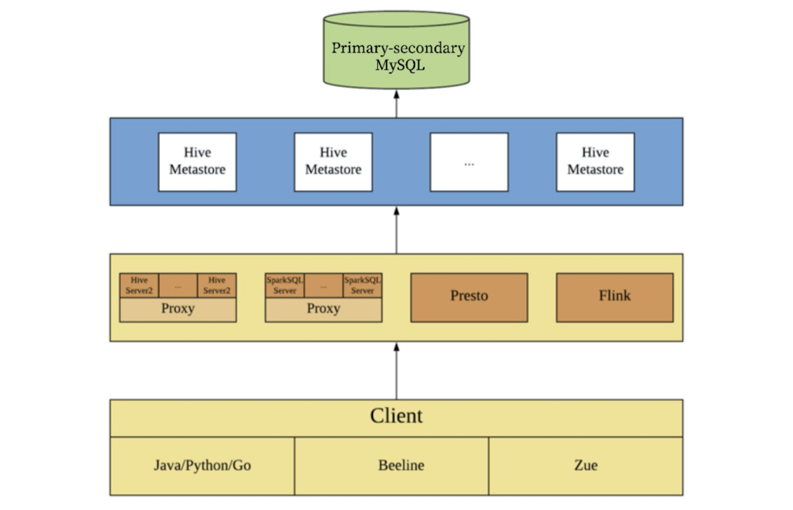
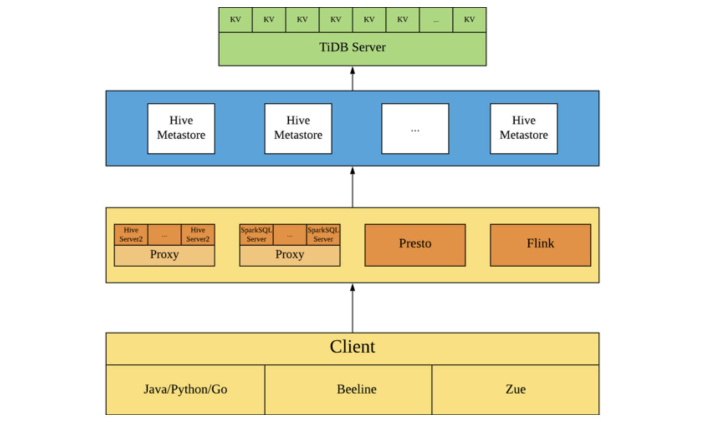

**Industry:** Knowledge Sharing

**Author:** Mengyu Hu (Platform Engineer at Zhihu)

**Transcreator:** [Caitin Chen](https://github.com/CaitinChen); **Editor:** Tom Dewan


[Zhihu](https://en.wikipedia.org/wiki/Zhihu) which means "Do you know?" in classical Chinese, is the Quora of China: a question-and-answer website where all kinds of questions are created, answered, edited, and organized by the community of its users. As [China's biggest knowledge sharing platform](https://walkthechat.com/zhihu-chinas-largest-qa-platform-content-marketers-dream/), we have 220 million registered users and 30 million questions with more than 130 million answers on the site. In August 2019, we completed [$450 million in F-round funding](https://pandaily.com/zhihu-completes-largest-funding-round-ever-of-450-million/).

At Zhihu, we used MySQL as the Hive Metastore. With data growth in Hive, MySQL stored about 60 GB of data, and the largest table had more than 20 million rows of data. Although the data volume was not excessive for a standalone MySQL database, running queries or writing data in Hive caused frequent operations in Metastore. In this case, MySQL, Metastore's backend database, became the bottleneck for the entire system. We compared multiple solutions and found that [TiDB](https://docs.pingcap.com/tidb/v4.0), an open-source distributed [Hybrid Transactional/Analytical Processing](https://en.wikipedia.org/wiki/HTAP) (HTAP) database was the optimal solution. **Thanks to TiDB's elastic scalability, we can horizontally scale our Hive metadata storage system without worrying about database capacity.**

Last year, we published a [post](https://pingcap.com/case-studies/lesson-learned-from-queries-over-1.3-trillion-rows-of-data-within-milliseconds-of-response-time-at-zhihu) that showed how we kept our query response times at milliseconds levels despite having over 1.3 trillion rows of data. This post became a hit on various media platforms like [Hacker News](https://news.ycombinator.com/item?id=20758702) and [DZone](https://dzone.com/articles/lesson-learned-from-queries-over-13-trillion-rows-1). Today, I'll share with you how we use TiDB to horizontally scale Hive Metastore to meet our growing business needs.

## Our pain point

[Apache Hive](https://en.wikipedia.org/wiki/Apache_Hive) is a data warehouse software project built on top of Apache Hadoop that provides data query and analysis. Hive Metastore is Hive's metadata management tool. It provides a series of interfaces for operating metadata, and its backend storage generally uses a relational database like Derby or MySQL. In addition to Hive, many computing frameworks support using Hive Metastore as a metadata center to query the data in the underlying Hadoop ecosystem, such as Presto, Spark, and Flink.

At Zhihu, we used MySQL as the Hive Metastore. As data grew in Hive, a single table stored more than 20 million rows of data in MySQL. When a user's task had intensive operations in Metastore, it often ran slow or even timed out. This greatly affected task stability. If this continued, MySQL would be overwhelmed. Therefore, it was critical to optimize Hive Metastore.

To reduce MySQL's data size and ease the pressure on Metastore, we regularly deleted metadata in MySQL. However, in practice this policy had the following drawbacks:

* Data grew much faster than it was deleted.
* When we deleted partitions of a very large partitioned table that had millions of partitions, it caused pressure on MySQL. We had to control the concurrency of such queries, and at peak hours only one query could be executed at a time. Otherwise, this would affect other operations in Metastore such as `SELECT` and `UPDATE` operations.
* At Zhihu, when metadata was deleted, the corresponding data was also deleted. (We deleted outdated data in the Hadoop Distributed File System to save costs.) In addition, Hive users would sometimes improperly create tables and set a wrong partition path. This resulted in data being deleted by mistake.

Therefore, we began to look for another solution.

## Solutions we compared

We compared multiple options and chose TiDB as our final solution.

### MySQL sharding

We considered using MySQL sharding to balance the load of multiple MySQL databases in a cluster. However, we decided against this policy because it had these issues:

* To shard MySQL, we would need to modify the Metastore interface to operate MySQL. This would involve a lot of high-risk changes, and it would make future Hive upgrades more complicated.
* Every day, we replicated MySQL data to Hive for data governance and data life cycle management. We used the internal data replication platform to replicate data. If we had used MySQL sharding, we would need to update the replication logic for the data replication platform.

### Scaling Hive Metastore using Federation

We thought we could scale Hive Metastore using Federation. We could form an architecture that consisted of MySQL and multiple sets of Hive Metastore and add a proxy in front of Metastore to distribute requests according to certain rules.

But after investigation, we found this policy also had flaws:

* To enable Federation on Hive Metastore, we wouldn't need to modify Metastore, but we would have to maintain a set of routing components. What's more, we need to carefully set routing rules. If we divided the existing MySQL store to different MySQL instances, divisions might be uneven. This would result in unbalanced loads among subclusters.
* Like the MySQL sharing solution, we would need to update the replication logic for the data replication platform.

### TiDB, with elastic scalability, is the perfect solution

[TiDB](https://github.com/pingcap/tidb) is a distributed SQL database built by [PingCAP](https://pingcap.com/) and its open-source community. **It is MySQL compatible and features horizontal scalability, strong consistency, and high availability.** It's a one-stop solution for both OLTP and OLAP workloads. You can learn more about TiDB's architecture [here](https://docs.pingcap.com/tidb/v4.0/architecture).

As you recall, our problem was that when the data size increased, MySQL, limited by its standalone performance, could not deliver good performance. When individual MySQL databases formed a cluster, the complexity drastically increased. If we could find a distributed, MySQL-compatible database, we could solve this problem. Therefore, TiDB is a perfect match.

We chose TiDB because it had the following advantages:

* **TiDB is compatible with the MySQL protocol.** Our tests showed that TiDB supported all inserts, deletes, updates, and selects in Metastore. Using TiDB would not bring any compatibility-related issues. Therefore, all we needed to do is dump MySQL data to TiDB.
* Due to its distributed architecture, **TiDB far outperforms MySQL on large data sets and large number of concurrent queries**.
* **TiDB has excellent horizontal scalability.** It supports elastic scalability. Whether we choose MySQL sharding or Hive Metastore Federation, we could encounter bottlenecks again. Then, we would need to do sharding or Hive Metastore Federation again. But TiDB solves this problem.
* **TiDB is widely used in Zhihu**, and the related technologies are relatively mature, so we can control the migration risk.

## The Hive architecture

### Before migration to TiDB

Before we migrated from MySQL to TiDB, our Hive architecture was as follows. In this architecture, Zue is a visual query interface for Zhihu's internal use.


<div class="caption-center"> The Hive architecture before migration to TiDB </div>

### After migration to TiDB

After we migrated from MySQL to TiDB, the Hive architecture looks like this:


<div class="caption-center"> The Hive architecture after migration to TiDB </div>

You can see that after we migrated metadata to TiDB, the architecture has almost no change. The query requests, which were on a single MySQL node, are now distributed in the TiDB cluster. The larger the TiDB cluster, the higher the query efficiency and the greater the performance improvement.

## The migration process

We migrated from MySQL to TiDB this way:

1. We used MySQL as the primary database and TiDB as the secondary database to replicate data from MySQL to TiDB in real time.

2. We reduced the number of Metastore nodes to one to prevent multiple Metastore nodes from writing to MySQL and TiDB simultaneously, which would cause inconsistent metadata.

3. During the application's off-peak hours, we switched from the primary database to the secondary. We used TiDB as the primary and restarted Metastore.

4. We added back Metastore nodes.

During the migration process, the application was not affected. Now TiDB successfully runs in our production environment.

## The application's running status

### Operation execution time in the application peak

We tested the database from the Hive level, simulated the application peak, and concurrently deleted and added partitions for tables with millions of partitions. We executed Hive SQL statements as follows:

```sql
ALTER TABLE '${table_name}' DROP IF EXISTS PARTITION(...);
ALTER TABLE '${table_name}' ADD IF NOT EXISTS PARTITION(...);
```

The operation execution time dropped from 45–75 seconds before migration to under 10 seconds after migration.

### The impact of large queries on the database

From the Metastore level, we tested some of the SQL statements submitted by Metastore, especially SQL statements that would cause great pressure on the Metastore, for example:

```sql
SELECT `A0`.`PART_NAME`,`A0`.`PART_NAME` AS `NUCORDER0` FROM `PARTITIONS` `A0` LEFT OUTER JOIN `TBLS` `B0` ON `A0`.`TBL_ID` = `B0`.`TBL_ID` LEFT OUTER JOIN `DBS` `C0` ON `B0`.`DB_ID` = `C0`.`DB_ID` WHERE `C0`.`NAME` = '${database_name}' AND `B0`.`TBL_NAME` = '${table_name}' ORDER BY `NUCORDER0`
```

When the number of partitions of a Hive table was very large, this SQL statement would trigger great pressure on the Metastore. Before migration to TiDB, the execution time of this type of SQL statement in MySQL was 30–40 seconds. After migration, the execution time was 6–7 seconds. What a remarkable improvement!

### Replication time

The safety data sheet (SDS) table, with more than 10 million rows of data, is one of the biggest tables in Metastore. The replication time of the SDS table in Metastore on the data replication platform was reduced from 90 seconds to 15 seconds.

## What's next

In the Hive Metastore case, TiDB helps us horizontally scale our metadata storage database so we no longer need to worry about our database storage capacity. We hope that, in the future, TiDB can provide cross-data center (DC) services: through the cross-DC deployment of data replicas, TiDB could connect online and offline scenarios so we can do real-time extract, transform, load (ETL) tasks offline without causing pressure on online services. This will improve offline ETL tasks' real-time performance. Therefore, we're developing [TiBigData](https://github.com/pingcap-incubator/TiBigData).

This project was initiated by [Xiaoguang Sun](https://github.com/sunxiaoguang), a TiKV Maintainer at Zhihu. Currently, it's an incubation project in [PingCAP Incubator](https://github.com/pingcap-incubator). PingCAP Incubator aims to establish an incubation system for TiDB ecological open-source projects. For all projects, see [pingcap-incubator on GitHub](https://github.com/pingcap-incubator). You can check out PingCAP Incubator's documentation [here](https://github.com/pingcap/community/tree/master/incubator).

The TiBigData project has provided the read-only support of Presto and Flink for TiDB. In the future, with the support of the PingCAP Incubator plan, we hope to build the TiBigData project together with the community and strive to enhance TiDB's big data capabilities.
