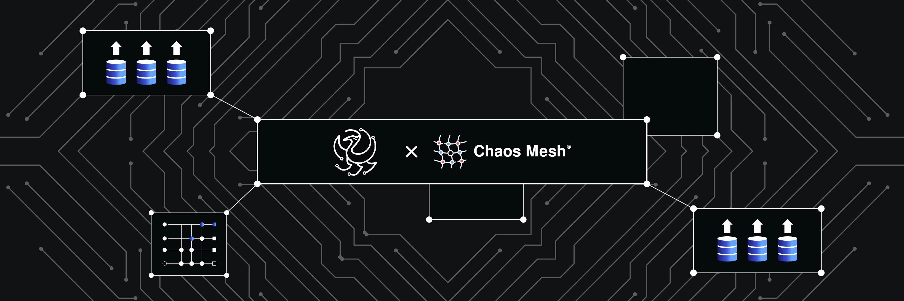
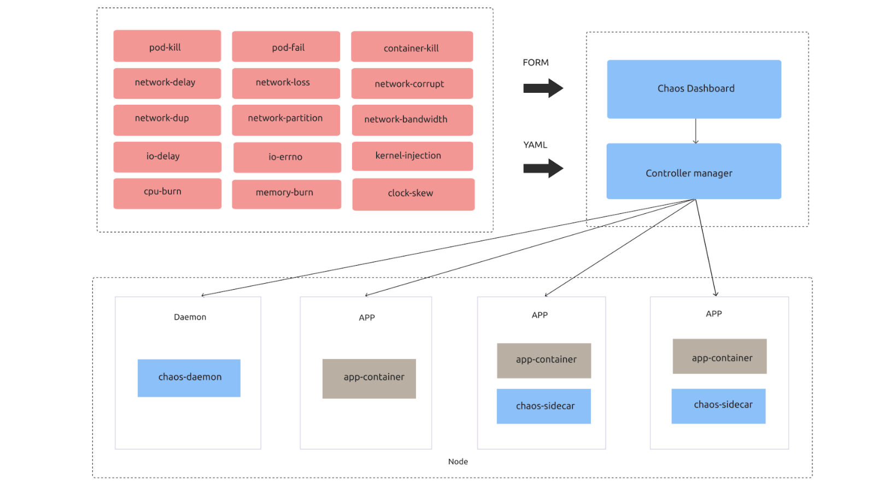
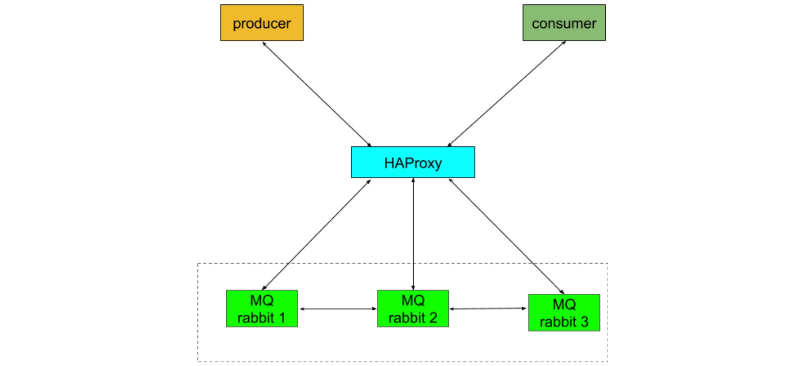
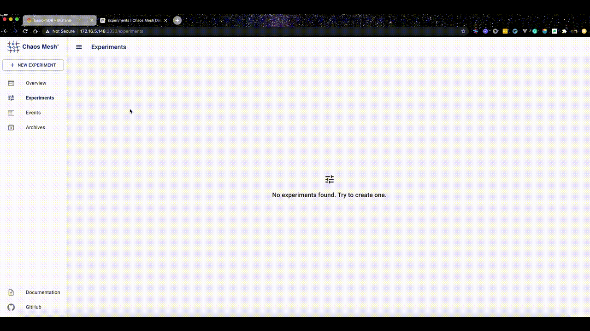

**Author:** Hui Zhang at Fuxi Lab, NetEase

NetEase Fuxi AI Lab is China's first professional game AI research institution. Researchers use our Kubernetes-based Danlu platform for algorithm development, training and tuning, and online publishing. Thanks to the integration with Kubernetes, our platform is much more efficient. However, due to Kubernetes- and microservices-related issues, we are constantly testing and improving our platform to make it more stable.

In this article, I'll discuss one of our most valuable testing tools, [Chaos Mesh](https://github.com/chaos-mesh/chaos-mesh). Chaos Mesh is an open-source Chaos Engineering tool that provides a wide range of fault injections and excellent fault monitoring through its Dashboard. 

## Why Chaos Mesh

We started our search for a Chaos Engineering tool in 2018. We were looking for a tool with:

* Cloud-native support. Kubernetes is practically the de facto standard for service orchestration and scheduling, and the application runtime has been fully standardized. For applications that run entirely on K8s, cloud-native support is a must for any tools that go with them. 
* Sufficient fault injection types. For stateful services, network failure simulation is particularly important. The platform must be able to simulate failures at different levels, such as Pods, network, and I/O. 
* Good observability. Knowing when a fault is injected and when it can be recovered is vital for us to tell whether there is an abnormality in the application. 
* Active community support. We want to use an open-source project that is thoroughly tested and consistently maintained. That's why we value sustained and timely community support.
* No intrusion on existing applications, with no domain knowledge required.
* Actual use cases for us to evaluate and build upon.

In 2019, when Chaos Mesh, a Chaos Engineering platform for Kubernetes was open-sourced, we found the tool we were looking for. It was still in its early stage; however, we were immediately struck with the richness of fault types it supported. This was a big advantage over other chaos engineering tools, because, to a certain degree, it determines the number of issues that we can locate in the system. We instantly realized that Chaos Mesh met our expectations in almost every way. 

 Chaos Mesh architecture 

## Our journey with Chaos Mesh

Chaos Mesh has helped us find several important bugs. For example, it detected a brain-split issue in [rabbitMQ](https://www.rabbitmq.com/), the open-source message-queueing software for Danlu. According to [Wikipedia](https://en.wikipedia.org/wiki/Split-brain), "a split-brain condition indicates data or availability inconsistencies originating from the maintenance of two separate data sets with overlap in scope." When a rabbitMQ cluster has a brain split error, there will be data write conflicts or errors, which cause more serious problems such as data inconsistencies in the messaging service. As shown in our architecture below, when brain split happens, consumers do not function normally and keep reporting server exceptions.

 Architecture of a RabbitMQ cluster 

With Chaos Mesh, we could stably reproduce this issue by injecting `pod-kill` faults into our container instances cloud.

Chaos Mesh also found several other issues including a startup failure, a join failure for crashed broker clusters, a heartbeat timeout, and a connection channel shutdown. Over time, our development team fixed these issues and greatly improved the stability of the Danlu platform.

## A fast-growing project

Chaos Mesh is constantly updated and improved. When we first adopted it, it hadn't even reached a stable version. It didn't have a debugging or log collection tool, and the Dashboard component only applied to TiDB. The only way we could use Chaos Mesh to test other applications was to execute the YAML configuration file via `kubectl apply`. 

[Chaos Mesh 1.0](https://chaos-mesh.org/blog/chaos-mesh-1.0-chaos-engineering-on-kubernetes-made-easier) fixed or improved most of these limitations. It offers more fine-grained and powerful chaos support, a generally-available Chaos Dashboard, enhanced observability, and more accurate chaos scope control. These are all driven by an open, collaborative, and vibrant community.

 Chaos Dashboard is now generally available 

## Looking forward

It's amazing to see how much Chaos Mesh has grown and how much traction it's gaining. We're also happy with what we have achieved with it. 

However, Chaos Engineering is a big area to work on. In the future, we'd like to see the following features:

* Atomic fault injection
* Unattended fault inject that combines customized fault types with standardized methods to validate experimental objects
* Standard test cases for general components such as MySQL, Redis, and Kafka

We've discussed these features with those who maintain Chaos Mesh, and they said these features are on the Chaos Mesh 2.0 roadmap. 

If you are interested, join the Chaos Mesh community via [Slack](https://join.slack.com/t/cloud-native/shared_invite/zt-fyy3b8up-qHeDNVqbz1j8HDY6g1cY4w) (#project-chaos-mesh) or [GitHub](https://github.com/chaos-mesh/chaos-mesh). 
