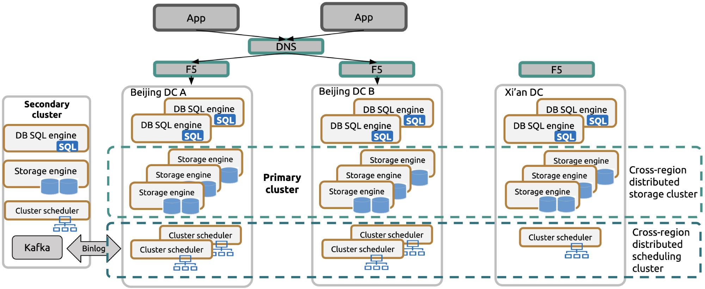
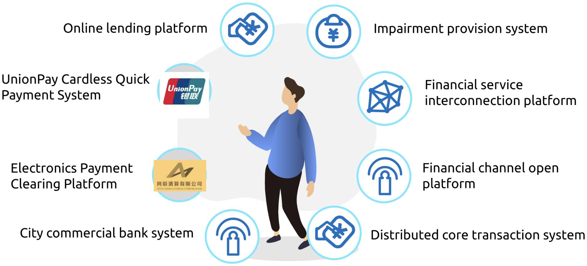

**Industry:** Banking

**Author:** Zhendong Chen (Software Development Engineer at Bank of Beijing)

**Transcreator:** [Caitin Chen](https://github.com/CaitinChen); **Editor:** Tom Dewan

[Bank of Beijing](https://en.wikipedia.org/wiki/Bank_of_Beijing) (BOB) is an urban commercial bank based in Beijing, China. As of June 30, 2020, our total assets amounted to 2.88 trillion Yuan, and we hold a brand value of 59.7 billion Yuan. On the World Top 1000 Banks list, we rank No. 62 in terms of Tier-1 capital and have been in the World Top 100 for seven years in a row.

As our emerging businesses rapidly grew and data size increased, we sought a **horizontally scalable database** with the ability to handle **highly concurrent requests**. We preferred an **open-source database** because we wanted the expertise and support of a large community. After our investigation, we found [TiDB](https://docs.pingcap.com/tidb/stable/overview), an open-source, distributed, Hybrid Transactional/Analytical Processing (HTAP) database, was a good solution.

In this post, I'll share with you why we chose TiDB and how we use it to **achieve horizontally scalable, always-on infrastructure**.

## Why we chose TiDB, a distributed SQL database

In the age of a fast-developing industrial technology revolution, we faced these challenges:

* To tackle our rapidly developing businesses and highly concurrent requests, our system **required higher performance**.
* To deal with rapidly changing financial markets, we needed to quickly deliver information products.
* It was difficult to control the costs of old-fashioned architecture.
* We needed to **avoid risks involved in using software from a single company**.

Therefore, we looked for a database solution with the following characteristics:

* Excellent horizontal scalability
* The ability to handle highly concurrent requests
* The ability to quickly iterate
* Cost-effective
* Open source

[TiDB](https://github.com/pingcap/tidb) is an open-source, distributed SQL database built by [PingCAP](https://pingcap.com/) and its open-source community. It is MySQL compatible and features horizontal scalability, strong consistency, and high availability. It's a one-stop solution for both Online Transactional Processing (OLTP) and Online Analytical Processing (OLAP) workloads.

We found that TiDB fulfilled our database requirements, so we adopted it.

## How we're using TiDB

In 2018, we deployed TiDB to production. Based on the bank's security regulations, we built three data centers (DCs) in two cities.

 Cluster deployment for high availability 

We use a primary-secondary, multi-active architecture:

* The primary cluster works in the production environment of Beijing and Xi'an and undertakes daily production services.
* The secondary cluster is a remote disaster recovery DC built in Xi'an.
* We use Kafka to replicate the binlog between the primary and secondary clusters.

In the past two years, we have cooperated with PingCAP on several important issues:

* **Network latency between DCs:** In the deployment of three DCs in two cities, network latency between two DCs in different cities can greatly impact the cluster performance. We compress the gRPC message format and use [Multi-Raft](https://pingcap.com/blog/2017-08-15-multi-raft) to ensure that the [leader](https://docs.pingcap.com/tidb/stable/glossary#leaderfollowerlearner) replicas are always in the Beijing DCs.
* **Incremental backup:** Some systems require incremental backup. Along with PingCAP, we researched incremental backup and the data restore method for a specified time. We saved the binlog locally in the protobuf form and then used [Reparo](https://docs.pingcap.com/tidb/stable/tidb-binlog-reparo) to restore data to the specified time.
* **Transactions:** In the financial industry, database transaction issues, such as large transactions, Read Committed (RC) isolation, and pessimistic locking, are important issues. [TiDB 4.0](https://docs.pingcap.com/tidb/stable/release-4.0-ga) supports all these features.

Next, I'll introduce TiDB's application scenarios in BOB.

### Electronics Payment Clearing Platform and UnionPay Cardless Quick Payment System

According to the requirements of China's central bank, all payment transactions handled by third-party providers must connect to the Electronics Payment Clearing Platform. BOB has integrated its applications and systems to meet the challenges of large data volume and highly concurrent requests brought by Internet finance.

After we deployed TiDB in the Electronics Payment Clearing Platform and the UnionPay Cardless Quick Payment System for production, the two systems successfully handled challenges on November 11, 2018 and November 11, 2019, the days of an annual Chinese shopping festival. On the festival day in 2019, the **peak traffic reached 7,500 queries per second (QPS)**, more than 10 times the usual QPS. Our IT team performed multiple online operations and maintenance tasks, including version upgrades and patching, and used TiDB's multiple replicas to **achieve zero downtime in operations and maintenance**.

When we upgraded the BOB system, we upgraded the applications in the business chain of the Electronics Payment Clearing Platform to the TiDB distributed architecture.

### The online lending application platform

The online lending platform is mainly engaged in application batch processing for loans and IOUs.

**Thanks to TiDB's horizontal scalability, we quickly built an online lending system database.** At first, the project team planned to build a database cluster for the online lending platform by purchasing physical servers. However, procurement took a long time, so we finally decided to scale in databases for the Electronics Payment Clearing Platform and the UnionPay Cardless Quick Payment System. After scaling in, we use the five extra [TiKV](https://docs.pingcap.com/tidb/stable/tidb-architecture#tikv-server) nodes and the two extra [TiDB](https://docs.pingcap.com/tidb/stable/tidb-architecture#tidb-server) nodes for the online lending platform. And both the online lending system and the Electronics Payment Clearing Platform use [Placement Driver](https://docs.pingcap.com/tidb/stable/tidb-architecture#placement-driver-pd-server) (PD) nodes.

It took about an hour to process 30 million rows of data in batch. Later, if we upgrade the version and optimize the system, we may significantly improve performance.

### Other application scenarios

Once we integrated TiDB into the two transaction systems described above, we applied it to all the financial scenarios including payment, accounting, and financial channels at BOB.

 TiDB's financial scenarios in BOB 

## Lessons learned when building the TiDB distributed architecture

Here, I'd like to share with you some lessons we learned when we built the TiDB distributed architecture.

### Application transformation

Our bank's survival depends on satisfied customers. For example, some customers like to snap products up in the middle of the night, so we need a flexible system that can handle a large amount of data traffic. TiDB was the clear choice.

### Dynamic maintenance

Banks have very high requirements for application continuity. Now, by taking full advantage of TiDB's distributed database architecture and dynamically adjusting our cluster nodes, we truly **achieve zero downtime**.

### Ecology in the industry

Within BOB, more and more projects are adopting TiDB's distributed microservice architecture. We're thinking about how to plan and design our applications under this distributed architecture and technology stack.

## What's next for distributed databases in financial scenarios

In the future, the BOB distributed database team will mainly work on two tasks:

* **Applying TiDB in more scenarios**
    * We'll continue to explore the use of TiDB in core application scenarios like bank accounts and customer information.
    * To continuously implement distributed databases in the financial field, we'll combine the features of partitioned tables, pessimistic locking, and even HTAP with the banking system.
    * We also face challenges from deploying two DCs in the same city.
* **Making progress through cooperation**
    * As more and more projects in the industry begin to use TiDB to shift to microservices, our system developers need to think about how to design and develop code under a distributed architecture.
    * Adopting TiDB's distributed database has brought some challenges to managing and operating our architecture. Based on past experience, we need to form a mature banking system construction methodology.
    * As part of building our distributed database, BOB helped formulate standards for the financial industry. In the future, we'll continue to contribute to the industry.

In addition, we'll study the pilot HTAP application. TiDB 4.0 introduced [TiFlash](https://docs.pingcap.com/tidb/dev/tiflash-overview), an extended analytical engine and columnar store for TiDB. A TiDB database that incorporates TiFlash lets users perform **real-time HTAP analytics**. We believe that HTAP is the future of databases.

If you'd like to learn more about our experience with TiDB or if you have any questions, you can join the [TiDB community on Slack](https://slack.tidb.io/invite?team=tidb-community&channel=everyone&ref=pingcap-blog).
