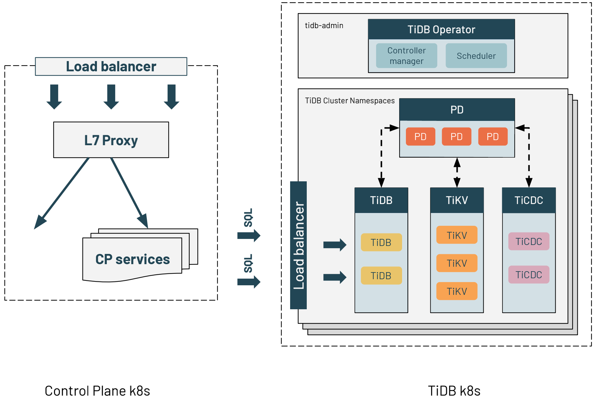
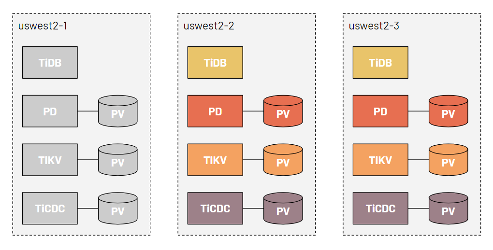
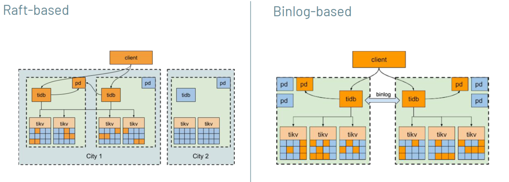

**Industry:** Information Technology

**Author:** Min Zhou (Staff engineer at Databricks)

**Editors:** [Yajing Wang](https://github.com/anotherrachel), Tom Dewan

Databricks is an enterprise software company founded by the creators of Apache Spark. The company has also created many other popular open-source projects like Delta Lake and MLflow, helping data teams solve some of the world's toughest problems.

In this article, I'll discuss some of the design decisions we made as well as some of the lessons we learned from adopting [TiDB](https://github.com/pingcap/tidb), an elastic, real-time Hybrid Transactional/Analytical Processing (HTAP) database, at Databricks.

## Our pain points

At Databricks, we use Amazon Relational Database Service (RDS) and MySQL as our standard databases. Unfortunately, MySQL cannot scale beyond a single node. The lack of a scalable database has been a source of challenges at Databricks. 

Currently, we deploy our MySQL databases across three clouds: Amazon Web Services (AWS), Azure, and Google Cloud Platform, in close to 100 regions. Because of MySQL's scalability limit, we have to deploy many MySQL instances in each region—one instance per service. The data on top of those regions totals tens of terabytes. To address this issue, we needed to find an alternative that is:

* Horizontally scalable
* Highly available
* Strongly consistent
* Fully compatible with MySQL

Our research led us to TiDB.

## Challenges with TiDB

We decided to run TiDB ourselves. However, using self-operating TiDB to replace cloud providers' managed MySQL services brought the following challenges:

* How to handle more operational overhead such as provisioning, upgrading, migration, backup, and monitoring
* How to ensure data security and workload isolation because different services may use the same TiDB clusters
* How to keep the same user experience when TiDB is deployed on Kubernetes—for example, in terms of high availability disaster recovery (HADR), service level agreement (SLA), and performance

## How we use TiDB at Databricks

### The architecture of our TiDB deployment

We deployed TiDB in a dedicated Kubernetes cluster for each region. The application services are behind an L7 proxy on another Kubernetes cluster. The application service uses the DNS name of each TiDB cluster's load balancer to query TiDB. This is exactly the same way application services connect to RDS MySQL. Therefore, migrating from MySQL to TiDB did not need significant configuration changes.

TiDB Operator helps manage TIDB on Kubernetes and automates operating tasks. TiDB Operator is in the `tidb-admin` namespace. One Kubernetes cluster can run multiple TiDB clusters. The clusters are separated by Kubernetes namespaces. Each of the component parts is exclusively associated with one node for consistent performance.

### Zonal redundancy

TiDB is designed to survive software and hardware failures from server restarts to datacenter outages. The three cloud providers we use offer the option of deploying TiDB clusters across multiple availability zones (AZs).

The diagram above shows a minimal configuration of TiDB zonal redundancy. In each of the three regions, there is one Placement Driver (PD), one TiDB server, one TiKV server, and one change data capture framework (TiCDC).

We do not rely on cloud providers' zonal redundancy features like cross-zone remote disk attachment or remote snapshotting to recover TiDB cluster data. This is because:

* **These features are not supported by all of the cloud providers.** For example, AWS does not offer remote disk attachment between zones, and Azure's ultra disk does not support snapshots.
* **The snapshot restore process is slow and unmanageable via Kubernetes.** If data is restored to survival zones, the zonal allocation rules are broken. After we resolve a zonal failure, we usually balance the load manually.

Instead, we rely on the zonal redundancy provided by TiDB. All replicas are distributed among three AZs with high availability and disaster recovery. If one AZ goes down, the other two AZs automatically restart the leader election and resume the service within a configurable period.

### Regional redundancy

TiDB provides two approaches for regional redundancy: Raft-based and binlog-based.

The core mechanism of TiDB's disaster recovery is Raft: a consensus algorithm based on logs and state machines. The Raft-based approach takes advantage of TiDB's native Raft support by placing two replicas in two zones, and the third replica in a different data region, or three replicas in three regions.

The binlog-based approach is akin to the [traditional MySQL replication method](https://dev.mysql.com/doc/refman/5.7/en/group-replication-primary-secondary-replication.html), which used asynchronous replication. We deploy one TiDB cluster in each region and pair the clusters through an internal replication service.

We chose the binlog-based approach because:

* In some cloud regions, the inter-region network latency can exceed 500 milliseconds. A Raft-based approach will result in poor performance.
* The binlog-approach is more aligned to our internal policies on the multi-region active-active application framework. This approach is eventually consistent.

### Backup and restore

We also provide a complete backup plan. We will back up TiDB clusters to external storage such as AWS S3 or Azure Blob storage once a day, and then retain the backup for seven days. We use TiDB's BR for backup and restoration. BR does not yet allow backup to Azure; however, we're working with PingCAP to implement this feature.

### Failover

In a TiDB cluster, failures can occur at several levels, including the disk, Pod, Kubernetes node, and network partition. TiDB has demonstrated its excellent stability and viability through formal testing. Examples include:

* **TiDB container exit.** In this case, the container runtime restarts the container to recover it.
* **TiDB Pod exit.** If the Pod has been deleted or is facing a crash, Kubernetes reschedules the Pod. If it runs into a crash loop, human intervention is required.
* **Kubernetes node failure.** One Databricks's internal tool will delete the node object, which triggers Kubernetes to reschedule the Pod to another node. 
* **Remote disk failure.** If the disk fails for more than 30 minutes (which is rare), the PD adds the replica to the existing nodes. Otherwise, the TiDB cluster continues to function normally with two replicas storing the data.

> **Note:**
>
> If a network partition fails, TiDB is unavailable. This failure needs human intervention.

### Operations

TiDB offers many types of manual operations, including the following:

* **Updating a TiDB cluster.** It's straightforward to upgrade the TiDB version, or scale TiDB in or out. We only need to edit the CustomResourceDefinition (CRD) YAML file and apply it, and TiDB Operator performs a rolling update. 
* **Fixing deployment failures.** In this case, we pause a reconciliation on TiDB Operator to stop the failure from spreading to the other Pods and do a manual auto-rollback on a case-by-case basis.
* **Rolling upgrade.** At Databricks, we have a standard way to upgrade the Kubernetes nodes. Our Kubernetes team currently doubles the node pool size before upgrading and executes a rolling upgrade by deleting an old node, waiting for the Pod migration, and then repeating the process. Typically, it only takes a few minutes to replace a node.

### Storage

Cloud providers usually offer both local storage physically attached to the machine as well as remote disks. According to our benchmarks, the local disk and the remote disk have the same read performance. Although local disks offer the best write latency, they add significant overhead to operations. For example, If we replace a host, we must migrate all the data on it. In some extreme scenarios, if we update all the machines in the cluster, we must copy all the data on that cluster to another fleet. Furthermore, because local disks are ephemeral, a local disk configuration cannot tolerate concurrent maintenance of machines.

To reduce the overhead of remote disks, we propose a cost-effective solution. This also improves the throughput of the remote disk and lowers the latency to an acceptable level.

### Service isolation

Data sharing comes with penalties. The queries of one service may affect the queries of another. In other words, a bad query may occupy the resource of a certain node, thereby slowing down other services on it. To avoid this situation, we propose:

* **Two-tier TiDB clusters.** We divide Databricks services into two tiers according to their importance. The tier-zero services are each equipped with one TiDB cluster, while the other tier-one services share another TiDB cluster. The two tiers of TiDB clusters run on the same Kubernetes cluster.
* **Placement Rules.** Placement Rules is the TiDB built-in replica rule system that guides PD to generate schedulers for replicas stored in TiKV. With Placement Rules, we can pin replicas to a defined group of TiKV Pods to reach our isolation goals.
* **Placement Rules in SQL** (under development). This feature will allow TiDB users to configure Placements Rules using data definition list (DDL) statements. Users won't have to know the mapping between tables and low-level replicas. This feature will greatly improve TiDB's usability.

## Next steps

We began evaluating TiDB earlier this year, starting with a single TiDB cluster without isolation, and we're now deploying TiDB in two of our regions. We expect to implement Placement Rules in SQL through joint efforts with PingCAP in Q4 2021.

If you'd like to learn more about our experience with TiDB, or if you have any questions, you can join the [TiDB community on Slack](https://slack.tidb.io/invite?team=tidb-community&channel=everyone&ref=pingcap-blog). If you're interested, you can get started with TiDB [here](https://pingcap.com/download).

*This article is based on a talk given by Min Zhou at PingCAP DevCon 2021.*
