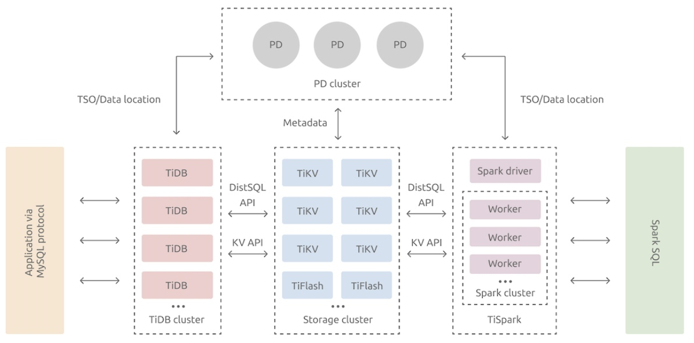
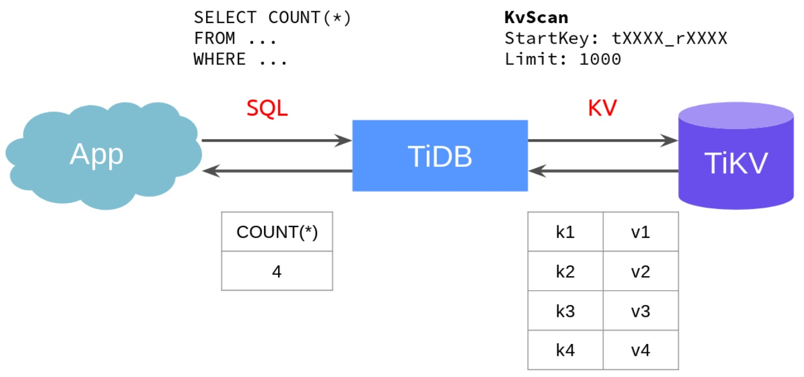

**Author:** [Xuanwo](https://github.com/Xuanwo)

**Transcreator:** [Caitin Chen](https://github.com/CaitinChen); **Editor:** Tom Dewan


In September 2020, I was honored to participate in the TiKV [Linux Foundation's](https://lfx.linuxfoundation.org/tools/mentorship/) (LFX) Mentorship Program. I worked on the [Coprocessor support ENUM/SET](https://github.com/tikv/tikv/issues/8605) project to help enable [TiKV Coprocessor](https://docs.pingcap.com/tidb/v3.0/tikv-overview) to support `ENUM` and `SET` calculations. This helped improve TiKV's calculation performance.

In this post, I'll share with you some background information about my project, how I implemented the project, my lessons learned during community cooperation, and my future plans for this project.

## Background information

### What is the LFX Mentorship Program?

The [LFX Mentorship Programs](https://lfx.linuxfoundation.org/tools/mentorship/) teach developers—many of whom are first-time open source contributors—to effectively experiment, learn, and contribute to open source communities. The Cloud Native Computing Foundation (CNCF) uses these programs as a CNCF mentorship platform. TiKV is a CNCF-graduated project. It proposed the Coprocessor support ENUM/SET project. 

### Introduction to `ENUM` and `SET`

When you create a table, two of the values you specify are `ENUM` and `SET`. These are MySQL string objects. `ENUM` defines the permissible values for a table column. `SET` represents a string object that has zero or more values. When you create a table, you choose the values from a predefined list. In this example, `ENUM` defines five possible sizes for the `shirts` table:

```
CREATE TABLE shirts (
    name VARCHAR(40),
    size ENUM('x-small', 'small', 'medium', 'large', 'x-large')
);
```

When we create a table, we can specify the table type as `ENUM` and provide all optional values. Later, when we insert a value into the table, we must use the specified value. Otherwise, an error is reported:

```
INSERT INTO shirts (name, size) VALUES ('dress shirt','large'), ('t-shirt','medium'),
  ('polo shirt','small');

SELECT name, size FROM shirts WHERE size = 'medium';
+---------+--------+
| name    | size   |
+---------+--------+
| t-shirt | medium |
+---------+--------+
```

The usage and implementation in TiDB of `SET` is similar to that of `ENUM`. We won't discuss it in detail here. For detailed information about `ENUM` and `SET`, you can check the MySQL documents: [The `ENUM` Type](https://dev.mysql.com/doc/refman/8.0/en/enum.html) and [The `SET` Type](https://dev.mysql.com/doc/refman/8.0/en/set.html).

### Why we need this project

In this section, I'll briefly introduce TiKV Coprocessor and then explain why I built the Coprocessor support ENUM/SET project.

[TiDB](https://docs.pingcap.com/tidb/stable) is an open-source, distributed SQL database, and [TiKV](https://docs.pingcap.com/tidb/stable/tikv-overview) is its storage layer. The following figure shows their relationship:

[TiDB server](https://github.com/pingcap/tidb) is a stateless SQL layer that processes users' SQL queries, accesses data in the storage layer, and returns the corresponding results to the application. [TiKV server](https://github.com/pingcap/tikv) is TiDB's underlying storage engine.


<div class="caption-center"> TiDB architecture </div>

We can construct this model to show how TiDB and TiKV interact with each other:

1. App sends SQL statements to TiDB.
2. TiDB queries TiKV to get the underlying data.
3. TiDB performs calculations on the data and returns the results to App.


<div class="caption-center"> TiDB and TiKV interaction model </div>

The model has these problems:

* There is a high transmission overhead between TiDB and TiKV. Take `COUNT` in the figure as an example. The application only needs to know the result of `COUNT`, but TiDB still needs to get all the key-value (KV) pairs from TiKV.
* The load on the TiDB node is heavy, but the load on TiKV is light. Resources are not fully used.

Therefore, engineers proposed that part of a calculation task can be handed over to TiKV, and the TiKV module responsible for this work is called Coprocessor. This work process is also called operator pushdown.

In the past, **all calculation tasks involving `ENUM` or `SET` could not be pushed down**. To solve this problem, I built the Coprocessor support ENUM/SET project.

## How I implemented the project

1. I [enabled TiKV to support MySQL `ENUM`/`SET`](https://github.com/tikv/tikv/pull/8849).

2. According to [Request for Comments](https://github.com/tikv/rfcs/pull/57) (RFC) requirements, I implemented [`ChunkedVecEnum`](https://github.com/tikv/tikv/pull/8948) and [`ChunkedVecSet`](https://github.com/tikv/tikv/pull/8988).

    `ChunkedVec` is a new form of memory data expression introduced in TiKV. It represents a column of data. Compared with the row form, it can more effectively use the CPU cache, and it optimized single data, multiple data (SIMD) computing. See the [RFC](https://github.com/tikv/rfcs/pull/43/files).

    To completely implement `ChunkedVecEnum` and `ChunkedVecSet`, we needed to implement decoding. However, it was difficult to estimate the time required to accomplish this, so we couldn't implement our original plan, which was to have TiDB perform this function. However, I was able to implement these functions in TiKV.

3. I [added `Enum` and `Set` evaluation types to `VectorValue`](https://github.com/tikv/tikv/pull/9021). Because enum `VectorValue` was widely used in Coprocessor's parts, it took me a lot of time to carefully handle the new cases where the enum is used.

4. I [modified `codegen`-related logic](https://github.com/tikv/tikv/pull/9133) to make it support code with input parameters `EnumRef` and `SetRef`. After my pull request (PR)  was merged, we could implement the `ENUM`- and `SET`-related functions:

    ```
    #[rpn_fn]
    #[inline]
    fn cast_enum_as_int(val: EnumRef) -> Result<Option<Int>> {
        Ok(Some(val.value() as Int))
    }

    #[rpn_fn]
    #[inline]
    fn cast_set_as_int(val: SetRef) -> Result<Option<Int>> {
        Ok(Some(val.value() as Int))
    }
    ```

    The most exciting thing is that we can implement these functions without waiting for TiDB to support pushdowns. In order to support `ENUM` and `SET` pushdown, both TiDB and TiKV need to implement it. But my work makes it possible to implement the TiKV side without TiDB's support. 

5. I implemented `ENUM` and `SET` support for each aggregate function, including [`COUNT`](https://github.com/tikv/tikv/pull/9143), [`FIRST`](https://github.com/tikv/tikv/pull/9135), [`SUM`](https://github.com/tikv/tikv/pull/9148), [`AVG`](https://github.com/tikv/tikv/pull/9186), [`MAX`](https://github.com/tikv/tikv/pull/9146) and [`MIN`](https://github.com/tikv/tikv/pull/9184). This way, I made TiKV support `ENUM` and `SET`.

## Lesson learned during community cooperation

### Export the mod before compilation

When I was trying to implement `ChunkedVecSet`, I had a disagreement with a repository Maintainer. Because I modified enums, to avoid introducing too many changes in a single PR, I implemented the mod but didn't export it. As a result, the mod couldn't be compiled. 

I planned to complete this part in my future PR, but the Maintainer insisted that a PR should be the smallest compilable unit.

Honestly, I think he's right. If everyone does things like me, TiKV's master branch will get more and more non-compilable code. After many iterations, this PR finally got the Maintainer's approval.

In hindsight, exporting the mod was essential. After we exported it, we found issues in the mode exporting implementation. But we didn't notice them, because we hadn't compiled it before. In addition, when I fixed compilation problems, I got a better understanding of the code involved in this part. This made my follow-up work smoother.

### Add a macro expansion test when implementing a macro

After I implemented `ChunkedVec{Enum,Set}`, I [implemented a macro that supported `Enum` and `Set` parameters](https://github.com/tikv/tikv/pull/9133).

A similar story occurred again. The Maintainer asked me to add a macro expansion test. I wanted to add it in my next PR, but the Maintainer thought that the test was highly related to this PR, so that it should be included in this PR.

Therefore, I decided to add a macro expansion test in the PR. To avoid the impact of whitespace characters on the content, my initial implementation was to remove all whitespace and line breaks. However, this changed code semantics. Because I'm a perfectionist, I implemented an algorithm based on `TokenTree` comparison. As long as all valid tokens were the same, the semantics for the two pieces of code are the same. Finally, this algorithm was applied to the module's all macro expansion tests.

## What's next

So far, we've implemented all the features that are needed for `ENUM` and `SET` pushdowns in TiKV. Next, we'll completely implement decoding and add this support in TiDB. This way, users can smoothly push down `ENUM`- and `SET`-related functions. This will make their calculations faster.

For this purpose, I proposed a PR: [copr: Roadmap to chunk-based Enum/Set support in TiKV](https://github.com/tikv/tikv/issues/9066). I'm working on it with TiDB developers. Maybe this year the PRs will be merged.

Thanks to my mentor [@skyzh](https://github.com/skyzh/) for his guidance. His advice enabled me to complete this project. I'd also like to thank [@andylokandy](https://github.com/andylokandy) and [@zhongzc](https://github.com/zhongzc) and developers on the [sig-copr](https://slack.tidb.io/invite?team=tidb-community&channel=sig-copr&ref=pingcap-blog) Slack channel. Their reviews greatly improved my understanding of Rust and helped me understand what makes good code. This may be my biggest gain in this project.

*This post was originally published on the [TiKV website](https://tikv.org/blog/my-experience-in-flx-for-tikv/).*
