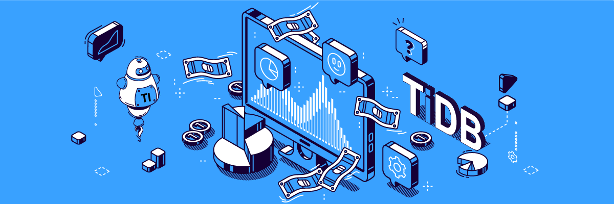
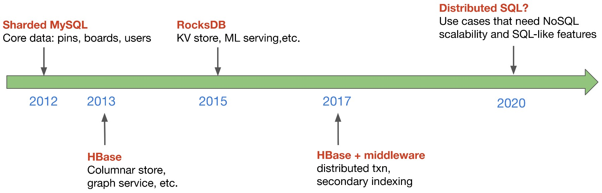
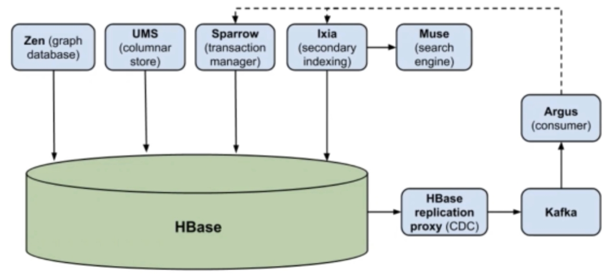
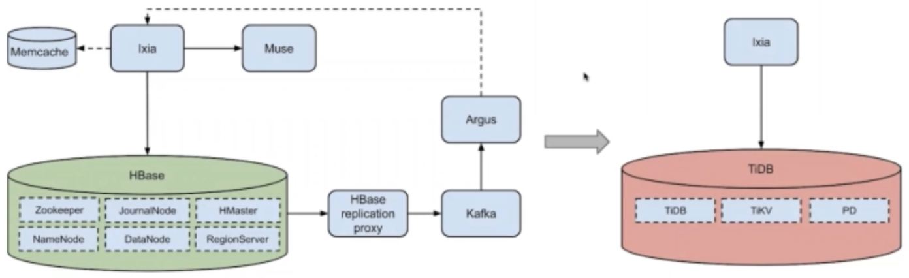

**Industry:** Media and Entertainment

**Author:** Lianghong Xu (Engineering Manager for Storage & Cache Team at Pinterest)

**Editors:** [Yajing Wang](https://github.com/anotherrachel), [Caitin Chen](https://github.com/anotherrachel), Tom Dewan

[Pinterest](https://en.wikipedia.org/wiki/Pinterest) is an American visual discovery engine for finding ideas like recipes, home and style inspiration, and more. As of March 2021, it had more than 478 million global monthly active users.

In recent years, we used the HBase ecosystem to serve our critical online applications. But this **infrastructure was complex**. It had **limited functionalities** and brought **high maintenance and infrastructure costs**. We looked for a new storage solution that supports **distributed transactions** and **SQL compatibility**.

After we compared YugaByteDB, CockroachDB, and [TiDB](https://docs.pingcap.com/tidb/stable), an open-source scale-out database, we chose TiDB because it best met our requirements for stability and performance. TiDB helps us **reduce system complexity and infrastructure cost and achieve stronger consistency**.

In this article, I'll describe:

* [The storage evolution at Pinterest](#evolution-of-pinterest-online-storage)
* [Our HBase ecosystem](#hbase-at-pinterest)
* [Our exploration of distributed SQL](#in-search-of-new-storage)
* [TiDB's challenges and opportunities](#tidb-challenges-and-opportunities)

## Evolution of Pinterest online storage

* In 2012, we introduced sharded MySQL into Pinterest's tech stack. We used it to store the core data models including pins, boards, and users.
* In 2013, we introduced HBase as Pinterest's first NoSQL database system. Since then, HBase has been very popular, and it has been serving many of our critical services. Based on HBase, we’ve built a columnar data store, a graph service, and a number of other applications.
* In 2015, we introduced RocksDB as a high performance C++ based storage engine. It powers our key-value (KV) store and machine learning serving applications. 
* In 2017, customers wanted us to add more features to our NoSQL databases—for example, distributed transactions. NoSQL users asked for secondary indexing. We built a number of middle layer systems to meet these requests.
* In 2021, we're again seeing many use cases that require a sweet spot between SQL and NoSQL. Users want NoSQL kind of scalability but they also want to enjoy SQL-like features. This leads us to think: will a distributed SQL database be a promising technology for our next-generation storage service?

 Evolution of Pinterest online storage 

## HBase at Pinterest

### How we use HBase

In 2013, we introduced HBase into Pinterest. Today, we have about 50 clusters, hosting 10+ PB of data, aggregating 100 million+ queries per second (QPS), and serving 100+ critical use cases. Since it was introduced, HBase has been a building block of our Pinterest infrastructure. Today, it still serves our critical online path.

We have built the following components with or on top of HBase:

* A graph service with HBase + Memcache
* A wide columnar data store built on top of HBase + Memcache
* A distributed transactional database based on HBase + Apache Omid as its middle layer
* An indexed data store that provides near real-time indexing for HBase applications + Muse (our in-house search engine)

This diagram gives you an architectural overview of our HBase ecosystem:

 HBase ecosystem at Pinterest 

In this ecosystem:

* HBase is in the center.
* On top of it, we have a graph database, a columnar store, a transaction manager, and secondary indexing.
* On the right side of the graph, we have the change data capture (CDC) pipeline where we have built our customized HBase replication proxy. This proxy streams right-hand logs from HBase, which in turn streams them into Kafka. Then Argus, our downstream consuming system consumes the logs. We feed a notification back to other services.

### Problems with HBase

Over the years, HBase served us well. However, we faced a number of challenges, including: 

* **High maintenance cost**

    Over the past eight years, because of the old HBase version we used, we suffered from long-standing tech debt. HBase was a complicated system, and it had high barriers to entry. As a result, it took a lot of effort to keep HBase up and running. This was one of our top pain points. 

* **Limited functionalities**

    HBase was powerful, but its interface was simple. While our users initially enjoyed its simple KV interface, they wanted richer functionalities, like stronger consistency. It will be hard to build middle layer systems on top of a NoSQL store to satisfy all these requirements.

* **High complexity**

    Because we had to keep satisfying our customer requirements, we had been building these "Lego pieces" over time to support SQL-like features from a NoSQL data store—not to mention that HBase itself had many components and dependencies like ZooKeeper and Hadoop Distributed File System (HDFS).

* **High infrastructure cost**

    Our infrastructure cost was high because we used primary-standby cluster pairs to achieve high availability, and we used six replicas for a unique dataset.

### Top customer pain points with our HBase system

Our customers also had pain points with our existing HBase system.

#### Pain points with Zen 

Zen is our in-house graph service that provides a graph data model. Essentially, users can do CRUD operations with a data model of nodes and edges. They can define customized indexes like unique, non-unique, edge query, or local indexes.

Zen had two major pain points:

* **Data inconsistencies**

    Because HBase did not provide cross-table or cross-row transactions, inconsistent data introduced a lot of problems. Our customers were confused, and they had to do more coding to ensure consistent data.

* **Limited query support**

    Because HBase had limited functionalities, complicated queries like query joints would be hard to run.

#### Pain points with Ixia

Ixia is our in-house index data store. It is built on top of HBase + Muse (our in-house index engine). We use CDC for asynchronous indexing. Source of truth data is written to HBase, and we build indexes asynchronously in the search engine.

Ixia's major pain points were:

* **Occasional index failures and inconsistencies**. This frustrated customers, and we spent many hours helping them debug inconsistency-related issues.
* **Problem diagnosis could be time-consuming** due to system complexity.

As a result, we looked for new storage solutions that can gracefully handle those situations for us. 

## In search of new storage

Currently, we have a gap in our storage solutions. We're missing:

* Functionalities like **distributed transactions** from which we can get stronger consistency when needed and good performance, which is very important for online applications.
* **SQL compatibility** so that we can execute expressive queries and provide our users with a seamless experience.

We thought of something like Google Spanner. It inspired us to explore open-source distributed SQL systems.

### Exploration of distributed SQL

We evaluated about 15 technologies including in-house systems, open-source technologies, and cloud solutions.

There were many dimensions that we considered, including operational load, migration cost,

programming language, community support, and cost efficiency. Open-source distributed SQL systems stood out. In the last round of our search, we mainly focused on three: YugaByteDB, CockroachDB, and [TiDB](https://pingcap.com/download). **We chose TiDB because it best met our requirements for stability and performance.**

### What is TiDB?

TiDB is an open-source, distributed SQL database that supports Hybrid Transactional and Analytical Processing (HTAP) workloads. It is MySQL compatible and features horizontal scalability, strong consistency, and high availability. You can learn more about TiDB's architecture [here](https://docs.pingcap.com/tidb/stable/tidb-architecture).

### Evaluation with TiDB

We did a dark traffic evaluation with Pinterest production traffic. We used Ixia as the target system. It's our near real-time indexing system on HBase, as shown in the following figure:

 Dark traffic evaluation 

In this figure:

* The graph on the left shows Ixia's architecture. As you can see, it's pretty complicated. It has HBase and a CDC pipeline. It has Ixia and a thrift server. It also uses Memcache and a search engine.
* On the right side is our dark traffic application built on top of TiDB.

In contrast, the TiDB architecture is much simpler.

TiDB has given us:

* **Greatly reduced system complexity and stronger consistency**, because TiDB provides distributed transactions
* **Reduced** **infrastructure cost**, because the number of components is reduced
* **Comparable performance—and sometimes even better performance**—for the same type of queries

This is the result of just one of our use cases. We evaluated other use cases, and, in general, we are satisfied with TiDB's performance and reliability.

## TiDB challenges and opportunities

We really appreciate the continuous support from the TiDB community and [PingCAP](https://pingcap.com/). As we continue our collaboration, we’re thinking about new challenges and how and where we can make TiDB even more useful and powerful for companies like Pinterest. For example:

* TiDB has gained a lot of community popularity, and it’s still maturing. We are looking forward to more product maturity and more functionalities over time.
* We also want to see online recovery when we have a quorum loss.
* As Pinterest plans to go beyond the USA, another major focus for us is multi-region deployment.
* We also would like to see a good solution for fast data ingestion for large-scale data on the order of hundreds of terabytes.
* Because we have a very big ecosystem on HBase, how do we achieve zero downtime migration from HBase to TiDB also remains an open question.

If you'd like to learn more about our experience with TiDB, or if you have any questions, you can join the [TiDB community on Slack](https://slack.tidb.io/invite?team=tidb-community&channel=everyone&ref=pingcap-blog). If you’re interested, you could get started with TiDB [here](https://pingcap.com/download).
