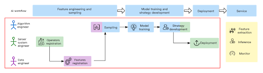
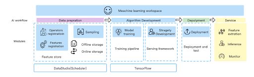
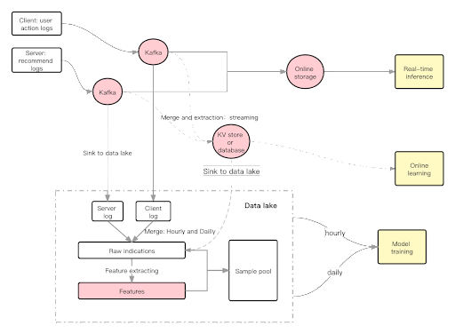
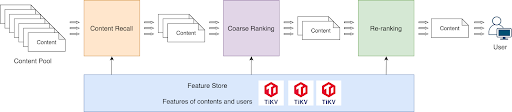
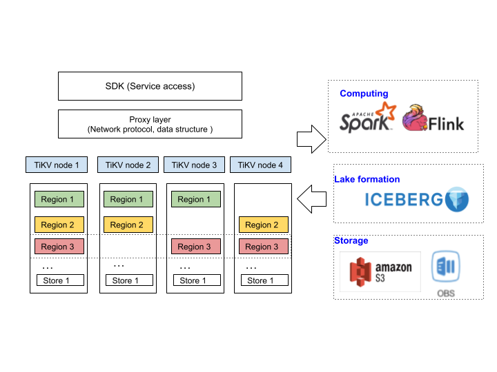

**Industry:** Internet
**Author:** Marshall Zhu (Big Data Director at SHAREit)
**Editors:** Tom Dewan, [Calvin Weng](https://github.com/dcalvin)

[SHAREit Group](https://www.ushareit.com/) builds high quality content platforms that connect users and content globally. Our diversified field of applications—including our app SHAREit—has been installed by nearly 2.4 billion users worldwide. The business network has reached 150 countries and regions in 45 different languages. 

SHAREit was recently ranked as the second top Southeast Asia headquartered applications publisher worldwide for 2020 by App Annie. In short, SHAREit is an app that delivers all kinds of content, pictures, videos, and applications. We serve users globally. And we have hundreds of millions of monthly active users and diverse big data scenarios.

In this article, I'll share our AI workflow, the challenges that we faced, and how two PingCAP products power our AI platform and recommendation system: TiDB, an open source Hybrid Transactional and Processing (HTAP) database, and TiKV, an open source transactional key-value database.

## The AI workflow: the key to our discussion

Understanding how a database powers AI is a complex subject, so let's use the AI workflow as our entry point. It introduces the whole topic: from identifying our major pain point, analyzing our workflow to make it more efficient, implementing our AI platform, and applying what we learned to our recommendation system. 

## Painpoint: identifying our most pressing problem

We spoke with our frontline colleagues and found that the biggest pain point in our AI workflow is that algorithm engineers or machine learning engineers spend too much time doing non-algorithm work.

To understand the issue more clearly, let's look at how engineers spend their time:

| % Time taken | Process                                         | Roles                                 |
|--------------|---------------------------------------------------|---------------------------------------|
|      50      | Data preparation (feature engineering & sampling) | Data and algorithm engineers          |
|      40      | Model training and strategy development           | Algorithm and server system engineers |
|      10      | Deployment                                        | Server system engineers               |

The diagram analyzes how engineers spend their time within our AI workflow. Time consumption is divided into three parts:

* Data preparation takes up 50% of algorithm engineers' time and also involves data engineers.
* Model training and strategy development is the algorithm engineer's job, but due to vague standards, this task also involves interaction with system engineers.
* Deployment. Although this task doesn't take much time, the scheduling relies on the system engineers. The slow pace leads to lower efficiency and higher risk.

### Feature engineering and sampling issues

In many companies—especially startups— the data platform and metadata governance are often incomplete. Therefore, algorithm engineers often ask questions such as:

* Where is the data source?
* How to extract features?
* How to build the pipeline?

To resolve these issues, they often need help from data engineers.

### Model training and strategy development issues

It is difficult to avoid using Graphics Processing Unit (GPU) resources for model training. But distributed GPU training is not available out of the box, so the assistance of a system engineer is required. In addition, algorithm engineers often use Python. However, because a recommendation system is written in C++ or Go, translating code logic is really a headache.

### Deployment issues

In this stage, the algorithm engineer must wait until the server system engineers deploy the product. I believe that this difficult position is an inevitable state for most companies. To find out how to make this stage smoother and shorter, we need to dig deeper.

## Analysis: understanding our situation more deeply

Earlier, we identified the major steps of the AI workflow and discovered that the efficiency of each step was quite low. To understand our situation more clearly, let's look at the following flow chart.

AI workflow

As you can see, almost all processes need more than one role. However, too many dependencies can lead to endless communication. Every R&D friend should have the same experience. Dependencies and communications often bring efficiency problems.

When we refined these major steps, we found that the current workflow is inevitably serial, but the main problem is that the efficiency of each step is very low.

### Feature engineering and sampling

The feature engineering and sampling step now includes three processes: feature registration, operations registration, and sampling.

Features are the attributes or properties models used during training and inference to make predictions. For example, when we recommend a video list, useful features include video categories and the user's age. Generating a feature includes selecting the original fields, the operator, and the target feature name. 

Our operator registration is equivalent to writing a unified method. Feature registration combines original fields with a mathematical operator to complete a feature. For example, a feature called "Average Time on Page" might consist of user input from the screen and an average time operator.

The operator registration is currently being developed by the system engineer, because it is written in C++. The feature registration is developed by the data engineer, because it involves the complex modification of extract, transform, load (ETL) code.

The sample generation process is very important and is common to every machine learning workflow. This process requires frequent communication, which requires that data engineers and algorithm engineers must work together closely.

The model training and strategy development as well deployment required the same level of communication overhead. Our expanded workflow includes three service goals: feature extraction, inference, and feature monitor.

The entire workflow conforms to the AI ​​paradigm. However, the core time-consuming steps are caused by insufficient standards and frequent interactions. Therefore, we divide every step into many processes to solve each problem separately. 

## Implementation, using Feature Store as an example

In the stage of rapid business development, it is important for us to weigh long-term and short-term goals, so we built the platform on capabilities that we already have.

We have two principles:

* Build production lines through integration
* Divide and conquer

First, we build production lines to liberate the labor force that currently supports business requirements. Then, we focus more on the improvement of each module.

Before we launched our own AI platform, we investigated several products in the industry such as Amazon SageMaker. However, SageMaker was not a good fit for us. It is based on a series of standards, but we only use some of the modules. Also, there are some specific requirements that we don't support. For these reasons, it would be difficult to migrate our system to SageMaker.

So we designed our own solution.

As shown in the following figure, we have four modules which cover the entire machine learning workspace.

* Feature Store solves data preparation problems. It is composed of online and offline storage. Later, I'll discuss this in more detail.
* The training pipeline provides templates for training and strategy development. These templates are mainly composed of Python modules.
* The serving framework interacts with the application side. The most important application is our recommendation system.
* Deployment and testing are important processes for all technologies—not just for AI.

Machine learning workspace 

These modules give us the following benefits:

* Feature sharing: feature meta-information sharing. We will reuse the feature pipeline to reduce the compute cost.
* Sample pool management: can diversify the use of data, speed up calculations, and optimize costs.
* Model training: model management, automatic resource allocation, improved model training efficiency
* Deployment online: deployment process automation. 

### Feature Store architecture

To illustrate the implementation stage, I'll use the Feature Store as an example. Please see the figure below.

Feature store architecture 

Feature Store is composed of two links: online and offline storage.

#### Online storage

We collect the client log and server log to Kafka topics, use Flink for streaming computation, output raw fields and indicators, and write it to online storage. This serves the real-time inference and recommends contents to users.

We currently use a self-developed key-value (KV) store for online storage, named Sharestore, and we will gradually switch to TiKV. As the flow chart shows, the write and read queries per second (QPS) are very high, and performance requirements are very strict.

#### Offline storage

Raw data is synced to the data lake from Kafka. Then we use Spark to generate a raw indicators table through hourly and daily merges. Next, after feature extraction, a feature table is generated. Based on the raw indicators table and the feature table, algorithm engineers generate their own sample for offline training. These samples belong to the sample pool.

Throughout the pipeline, we are advancing modularized SQL to describe business logic. At the same time, we implement version control through slot mode and data lake technology, such as Iceberg and Hudi.

#### Online and offline skew

Let's move to the online and offline skew, we use the same Git repository to write the feature extraction code, generate a C++ shared object file and the configuration file, all feature extractions will use this package to solve the online/offline skew.

## Application, using the recommendation system as an example

 At SHAREit, our main scenario is the recommendation system. The following diagram shows our recommendation system architecture.

Recommendation system on TiKV

The recommendation architecture has a very mature paradigm, from recall, coarse ranking, re-ranking, to tuning. Here, we will focus more on the intersection of FeatureStore and the recommendation system. This is also where we face more challenges and where TiKV/TiDB help us.

In SHAREit, we have two scenarios involving recommendations: one is on the content side and the other is on the advertising side. We use a general recommendation architecture to support these scenarios, including a model server to complete the recommendation workflow and a prediction server to complete Click-Through-Rate Prediction.

In content scenarios, we focus on making recommendations quickly based on the user's behavior. Because there is a delay in the client's log reporting, we need to complete the client and server log's join through streaming computation.

In the advertising scenario, because of the huge amount of traffic, one request involves a large number of feature readings. The requirements of these scenarios are very strict for our KV or database selection.

Initially, we thought of Flink and a general KV. For example, let's say a user uses the feeds flow. Based on what they enter on the first screen, we want to recommend new content within 5 to 10 seconds. At the same time, we also thought about using a database. A database's SQL interface can not only improve the efficiency of development and maintenance, but it also lays a solid foundation for standardization and automation.

### How TiKV and TiDB help us

TiKV and TiDB help us in two ways. The first is in online storage interactions with the recommendation system. This is a typical way to use KV.

The second is what we are planning now: online learning. Online learning is very popular these days, and we're investigating whether we should support it. **Online machine learning** is a method of [machine learning](https://en.wikipedia.org/wiki/Machine_learning) in which data becomes available in a sequential order. It is used to update the best predictor for future data at each step. In other words, it uses incremental data which contains user impressions and clicks to enhance the older model.

We tend to call it combined storage, because the data merge and feature extraction can be finished in this streaming way. Based on the adjustment of the window, we can combine the streaming and the offline computation processes into one, and sync data to the lake through hourly scheduling. 

With the use of combined storage, we integrate the streaming process and the offline process as one, thereby greatly simplifying the offline logic.

## Why we use TiKV and TiDB

First of all, in the online storage scenario, we had a self-developed KV system before and invested a lot of human resources in it. However, by collaborating with the open source community, we benefit from their collective knowledge.

As for online learning, we hope that the storage can support high-concurrency streaming writes. At the same time, on the read side, it involves a lot of business logic descriptions. We hope to lay the foundation for future automation as much as possible, so it would be better if there is a SQL interface. If not, the logical description in Flink will inevitably become complicated.

Our online learning scenario hopes to train in 5-10 minutes. Depending on the amount of data, data lake latency can be a trade-off. So, after some testing, we decided TiDB is a reliable choice.

Further, we found that TiKV as a general KV store is something we need. We decided to embrace open source. At the same time, we also hope to abstract some of our internal experience and contribute to the community.

As shown in the following figure, we stand on TiKV's shoulders. There are two types of work involved:

TiKV as a general feature store

* The first is to support multiple types at the proxy layer; for example, set, zSet, hash, and counter. We have made a lot of progress now.
* In addition, as a storage role, KV interacts closely with the big data ecology, and in these scenarios, they often require batch input and batch export of data. Through this realization, we integrate TiKV/TIDB into the data & AI pipeline. Users don't have to worry about storage choices.

## How does database power AI?

Recall that before our AI workflow improvement effort, algorithm engineers spent 50% of their time on feature engineering and sampling. Now they spend 25% time (or less) on this task. Needless to say, they are a lot happier.

Today, when the big data paradigm is clear, users are often affected by the empirical thinking of the scenario. However, after we divided the scenario into several demand points based on different quantity needs, we came up with our own new solutions. Now the usage of DB brings us some new angles. Single link latency is very important, and hopefully the interface can lay the foundation for subsequent modularization and automation.

I hope you found this information helpful. If you face issues similar to ours, please consider investigating TiKV and TiDB. If you want to know more details about our story or have any questions, you're welcome to join the [TiDB community on Slack](https://slack.tidb.io/invite?team=tidb-community&channel=everyone&ref=pingcap-blog) and send your feedback.
