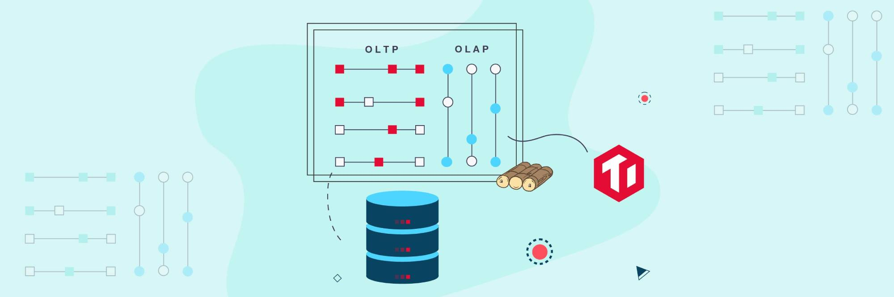
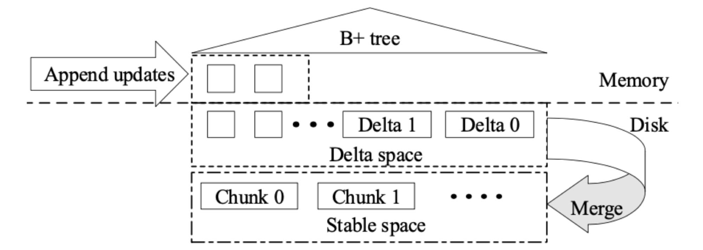
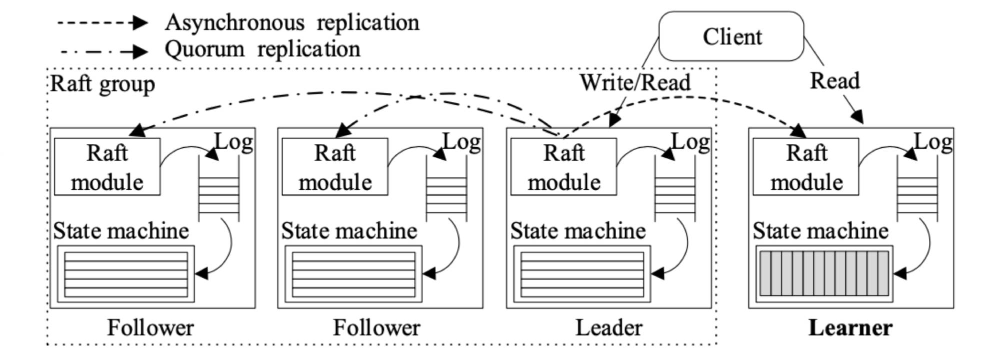
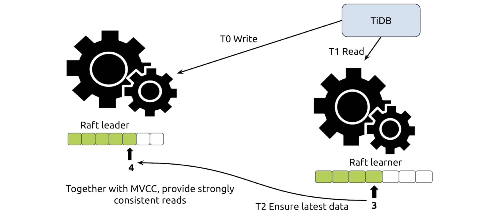

[TiDB](https://docs.pingcap.com/tidb/dev/overview) is an open-source, distributed SQL database that supports [Hybrid Transactional/Analytical Processing](https://en.wikipedia.org/wiki/HTAP) (HTAP) workloads. 

We're excited and proud about two recent TiDB milestones. First, our latest release, [TiDB 4.0](https://docs.pingcap.com/tidb/v4.0/release-4.0-ga), is now generally available. It introduces a new columnar engine, [TiFlash](https://docs.pingcap.com/tidb/v4.0/tiflash-overview), which is the key to TiDB's HTAP architecture. If you'd like to try TiDB 4.0, contact us at [info@pingcap.com](mailto:info@pingcap.com) or join our [community on Slack.](https://slack.tidb.io/invite?team=tidb-community&channel=everyone&ref=pingcap-blog)

Also, this August, the _Proceedings of the VLDB Endowment_ (PLVB) will publish our paper "TiDB: A Raft-based HTAP Database." This paper, authored by several [PingCAP](https://pingcap.com/) engineers, is the most technically-detailed description of TiDB yet. Having our paper accepted by a top conference proves our "HTAP" is not a self-proclaimed marketing buzzword, but the real deal. PingCAP has been nurtured by papers from other organizations, and we're happy to do the same thing in return.

## What we'll cover here

Today, we'll look at the design details of TiDB's HTAP architecture. If you want to understand TiDB's design in its entirety, be sure to read our paper in August's _PVLDB_. This blog post covers:

* [The real-time updatable columnar engine](#tidb-htap-storage)
* [The multi-Raft replication strategy](#tidbs-log-replication)
* [Smart selection](#smart-selection)

I will go deep into these topics one by one below.

## TiDB HTAP storage

### A design based on disk instead of memory

[Online transactional processing](https://en.wikipedia.org/wiki/Online_transaction_processing) (OLTP) and [online analytical processing](https://en.wikipedia.org/wiki/Online_analytical_processing) (OLAP) workloads prefer different storage formats. OLTP uses row format, and OLAP uses columnar format. However, because the differences are not significant in memory, Hasso Plattner, the author of [SAP HANA](https://en.wikipedia.org/wiki/SAP_HANA), proposed using the in-memory columnar format for both scenarios. Later, in 2014, Gartner invented the word "HTAP," mainly targeting in-memory technologies.

On disk, columnar format is not good at OLTP use cases. Why?

Efficient data access relies on "locality," which means putting all the data to access as close together as possible. By doing so, you avoid extra seek and cache inefficiency. Row and columnar formats, despite the factors of encoding and compression, essentially are about providing suitable locality for different access patterns:

* The row format stores row data together and makes single row access perform well. 
* The columnar format puts data for each column together and makes accessing a few columns in batch very efficient. 

On the other hand, we traditionally think it is expensive to update columnar data. This is partly because naively splitting a row by its column and putting data in the right position is very expensive and results in disastrous write speed. Those effects are obvious on disk but are mitigated in memory. This is part of the reasons for all these years when we referred to HTAP, we were actually talking about in-memory databases.

Although the price of memory chips is gradually dropping, it's still expensive. Research firms claim that HTAP simplifies your architecture and is potentially cheaper. But in fact, in-memory databases are limited to certain applications: unless architects require extremely low latency in their scenarios, they still have to convince their bosses whether the benefit brought by HTAP is worth an in-memory database.

Therefore, our design is based on disk instead of memory.

### Modular architecture

We are definitely not the first to try a hybrid data format. It might be a mixture of column and row format like PAX, or a smart algorithm to glue them together. No matter how much engineering effort is devoted to improving performance, the locality problem still exists: it's hard to achieve top performance for both sides at the same time, and, needless to say, there is engineering complexity in dealing with both.

To remove these engineering issues, we use modularization. We separate TiDB's SQL layer (the [TiDB servers](https://docs.pingcap.com/tidb/stable/architecture#tidb-server)) from TiDB's storage engine (the [TiKV servers](https://docs.pingcap.com/tidb/dev/architecture#tikv-server), with data in row format). Instead of tightly coupling the two formats in one engine, we chose [the Raft algorithm](https://raft.github.io/) to split-fuse row and column formats. This loosely-coupled approach has these advantages:

* We can consider one scenario (OLTP or OLAP) at a time. This only requires minimal changes to the current engine. 
* Modularization makes it easier to adopt other open-source projects (such as [ClickHouse](https://en.wikipedia.org/wiki/ClickHouse)) inside ours.

Other designs also use a tightly-coupled approach, such as sharing the memtable of a log-structured merge-tree (LSM tree) and generating a dual format when flushing the disk. It's true that LSM helps in-column updates, and we tried this as well. But due to read performance, we abandoned such a design. We will touch on this later.

### A columnar system that can be updated in real time

Because of the loosely-coupled design, we need to focus on a single question for our storage engine: how to build a columnar system that can be updated in real-time using the primary key. 

In some cases, the columnar format _does_ support updating. But generally, this kind of update is implemented by overwriting a large range of data all together. This is why a lot of times we have [T+1](https://www.investopedia.com/terms/t/tplus1.asp) updating in data warehouses. If we ignore updating by primary key, the engine will be free from sorting and ordering: storing by the primary key is not just for fast seek but for fast update as well. If you need to update a row, the engine needs to achieve dedupe as fast as possible. It doesn't matter if the dedupe happens on writes or on reads. Most analytical databases or Hadoop drop the support for it and in turn gain higher loading and reading performance. However, this does not meet our requirement. To reach the goal of HTAP, TiDB has to **support real-time updates and match TiKV's write performance**.

We are surely not the first to try updatable columnar stores. The database community has a common approach called delta-main for this purpose. Since columnar engines are not write-optimized, our idea is to store newly-written data in a write-optimized area and gradually move it to a read-optimized columnar area. As long as data moves frequently enough, the majority of data is in the read-optimized format and performance is acceptable. 

This is a simple idea dated to the "ancient time" of [C-Store](https://en.wikipedia.org/wiki/C-Store). As the pioneer of columnar databases, C-Store uses a row engine as the write-optimized area, where data is gradually compacted into columnar format areas.

Our updatable columnar engine follows a similar approach. On the macro level, DeltaTree cuts data by primary key into segments like TiKV's [Regions](https://docs.pingcap.com/tidb/dev/glossary#regionpeerraft-group), using the range partition strategy. When data physically exceeds a certain threshold, each segment splits.

 DeltaTree 

On the micro level, as shown in the diagram above, each segment consists of a delta space and a stable space. Delta space is mainly optimized for writes. It's formed by small batches in the order of writes. Since data is appended to the tail, storing by the written order instead of the key order makes it a lot faster to write. Each time deltas accumulate to a certain threshold, they are compacted to stable space. 

The stable space is similar to what [Parquet](https://en.wikipedia.org/wiki/Apache_Parquet) looks like: data is gathered in row groups, cut vertically by column, and stored in compressed format. The stable space is read-optimized. Without deltas, reading the stable area is blazingly fast. But in reality, data in the delta might need to overwrite older versions in the stable space. Therefore, the read operation is a two-way merging on the fly. To speed up the merging operation, the engine builds an auxiliary [B+ tree](https://en.wikipedia.org/wiki/B%2B_tree) index for delta data in memory. Although delta data itself is not physically ordered (keeping such an order physically drastically harms the write performance), it is still logically ordered. This reduces the merging cost. At the same time, due to the range split at the segment level, the compaction operation touches only a small range of the whole data each time. This alleviates write amplification.

Let's go back to the LSM + columnar format solution. In fact, you can consider LSM sort of a "delta-main" approach. When data is written into the memtable, it is in an append-only form. Regarding this, why not make LSM support updating in the column format? We tried, and it's viable. However, the read performance is not as good as the delta tree design. When LSM scans a range, it needs a heavy multi-way merge due to the overlap between layers: an N-Layer LSM might require an N-Way merge. We did an experiment on the LSM design based on a modified version of ClickHouse's merge tree engine, and the read speed is almost two times slower. 

<table>
  <tr>
   <td rowspan="2" ><strong>Tuple number</strong>
   </td>
   <td rowspan="2" ><strong>Storage engine</strong>
   </td>
   <td colspan="4" ><strong>Transactions per second</strong>
   </td>
  </tr>
  <tr>
   <td><strong>150</strong>
   </td>
   <td><strong>1,300</strong>
   </td>
   <td><strong>8,000</strong>
   </td>
   <td><strong>14,000</strong>
   </td>
  </tr>
  <tr>
   <td rowspan="2" >100 M
   </td>
   <td>Delta tree
   </td>
   <td>0.49
   </td>
   <td>0.48
   </td>
   <td>0.50
   </td>
   <td>0.45
   </td>
  </tr>
  <tr>
   <td>LSM tree
   </td>
   <td>1.01
   </td>
   <td>0.97
   </td>
   <td>0.94
   </td>
   <td>0.95
   </td>
  </tr>
  <tr>
   <td rowspan="2" >200 M
   </td>
   <td>Delta tree
   </td>
   <td>0.71
   </td>
   <td>0.74
   </td>
   <td>0.72
   </td>
   <td>0.75
   </td>
  </tr>
  <tr>
   <td>LSM tree
   </td>
   <td>1.59
   </td>
   <td>1.63
   </td>
   <td>1.67
   </td>
   <td>1.64
   </td>
  </tr>
</table>

Now, we have solved the columnar format updating problem. 

## TiDB's log replication

### Lower-level log replication

As we chose a loosely-coupled design in the storage layer and column and row formats stay in different modules, the problem becomes how to replicate data between engines. Traditionally, in a primary-secondary replication database architecture, we tend to use high-level replication strategies like MySQL binlog. In fact, this was also our first prototype design. Since replication details are well hidden at such a high level, we just need to make TiFlash replay logs. By replicating based on the binlog, we built the first prototype very fast. It leveraged the binlog to bridge two worlds. 

However, for production, we need to further build our own fault-tolerant and rebalancing strategies like in TiKV. To make things worse, TiDB is a multi-primary system. Each TiDB server instance generates its own binlog. To keep data in order, we have to introduce a sorting node. Otherwise, we run the risk of overwriting newer data with older versions. This instantly degrades the system from a distributed design into single-node design, and latency surges. Also because of that, prototype TiFlash cannot provide cross-engine queries: reading from both engines in a single query will lead to subtle data inconsistency.

Then, we turned to **lower-level log replication. Yes, it's the Raft layer.** The benefit is obvious: Raft logs preserved all details required for data replication. We made TiFlash a special TiKV node, and it inherited all the strengths of the multi-Raft system: data rebalances between nodes transparently, and Raft handles fault-tolerance. If a replica is lost, the storage layer automatically heals the lost data, and Raft ensures consistency between replicas. Replication from a lower level has its own great cost. We need to implement everything supporting multi-Raft design, such as splitting, merging, and transferring Regions, and fault-tolerant reads.

### Advantages of lower-level log replication

The new design is the key to our HTAP architecture. **It provides transparent and seamless integration between TiFlash and the whole storage layer**: the same replication and scheduling strategies, the same transaction, and the same consistency design. And the replication channel is fully distributed, load balanced, and fault-tolerant.

Compared to primary-secondary or dual format within the same node, **TiFlash's OLTP and OLAP nodes can be completely independent, and they can scale separately**. If you need more OLAP power, just add more TiFlash machines to your cluster. They do not interfere with each other's workloads or computing resources.

At the same time, **the replication naturally achieves load balancing and point-to-point (P2P) style**. Each Region leader directly sends data to its columnar replica without any intermediate node. When a Region becomes too large and splits, the columnar replica splits as well. When replicas are transferred by scheduling, the replication channels transfer accordingly. It sounds futuristic, but these are just basic multi-Raft features.

 Multi-Raft storage architecture 

Most importantly, the greatest benefit of multi-Raft is the **coexistence of consistency and asynchronized replication**.

Traditionally, if we want all replicas to be consistent, we must introduce synchronized replication. By doing so, an OLTP workload is impacted when columnar nodes suffer high pressure or network latency. To keep the replicas consistent, transactions on the row engine must wait for replication to finish; otherwise, a node crash causes data loss or inconsistency. Moreover, more columnar nodes introduce higher network latency. Although lots of other HTAP products entirely ignore workload interference, we still hope that delicate OLTP workloads enjoy better sheltering from OLAP workloads.

Luckily, Raft solves the workload interference issue. TiFlash acts as the learner role in the Raft hierarchy. This exempts columnar replicas from voting and disrupting the OLTP workload. Transactions in the row engine return as if there are no columnar replicas. 

You might be wondering: is there no consistency or no guarantee in data arrival? Actually, we don't need physical consistency. All we need is logical consistency on reads. 

This is also a key feature of Raft: although not all replicas are consistent at the same time, read consistency is still ensured. When a read operation occurs, a columnar replica sends a replication progress check request to the leader replica. When the leader receives this request, it returns the latest log sequence number. TiFlash waits until the latest data catches up. This approach ensures that TiFlash always reads the latest data that's consistent. It guarantees that the latest write can be retrieved from TiFlash, and this forms a standard of freshness required by read transactions. When TiFlash asynchronously replicates data, it filters the data by reading the timestamp and provides the same transaction consistency that TiKV does. This makes TiFlash more than a heterogeneous replication system. It behaves more like a special index, since it is able to serve queries mixed with TiKV, without worrying about subtle and untraceable errors.

 TiFlash always reads the latest and consistent data 

## Smart selection

In TiDB 4.0, the most important enhancement is access path auto-selection based on cost. Just as the common approach to select the right index is based on statistics, we apply a cost function as if the columnar engine is another sort of index and pick up the access path that costs the lowest. It does not matter which engine data is read from; it's just an ordinary access path. 

This technique is known as "smart scan," and almost all databases have used it for decades. It might be one of the most popular features for TiDB 4.0. TiDB HTAP uses smart selection to extend its scenarios from OLTP plus business intelligence (BI) reports to more hybrid cases. Using TiFlash can greatly simplify TiDB's hybrid architecture. 

For example, one of our clients used it in a logistics application. They wanted to do high concurrent queries on detailed orders as well as low concurrent shipping analysis, aggregating data for specific locations and time periods in real time. Without a columnar store, multi-dimensional analysis on large dataset is a lot slower compared to analytical databases. Empowered by TiFlash, TiDB blurs the boundary between OLTP and OLAP. In contrast, TiSpark, a thin layer built for running Apache Spark on top of TiDB to answer complex OLAP queries, still aligns with the team's bigdata. DBAs and business application teams prefer accessing TiFlash via TiDB.

## Give TiDB a try

This post took an in-depth look at TiDB's HTAP architecture. If you want a full analysis of TiDB, be sure to read "TiDB: A Raft-based HTAP Database," which will be published this August in the _Proceedings of the VLDB Endowment_, Volume 13, Issue 12. 

You're welcome to [try TiDB](https://docs.pingcap.com/tidb/v4.0/release-4.0-ga), join our [community on Slack](https://slack.tidb.io/invite?team=tidb-community&channel=everyone&ref=pingcap-blog), and send us your feedback. After all, TiDB is a product shaped by the entire community. To us, your feedback is as important as contributing code.
