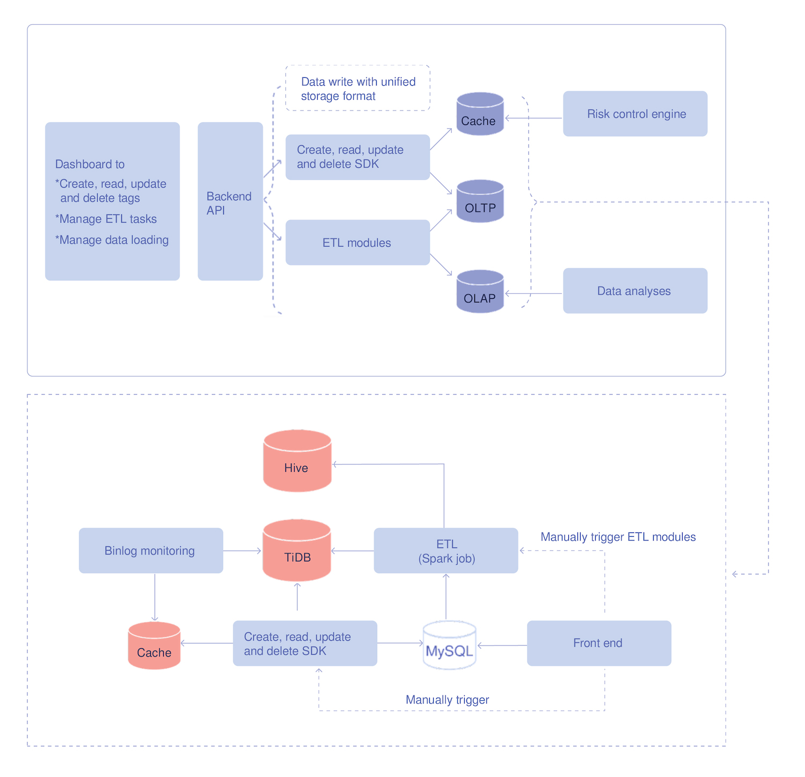
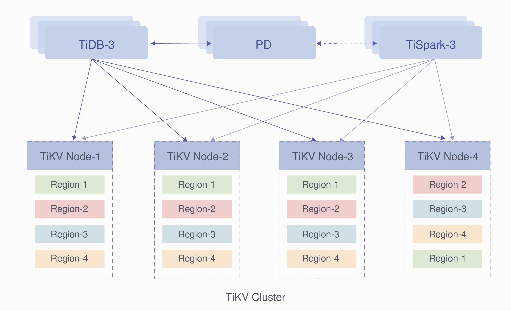
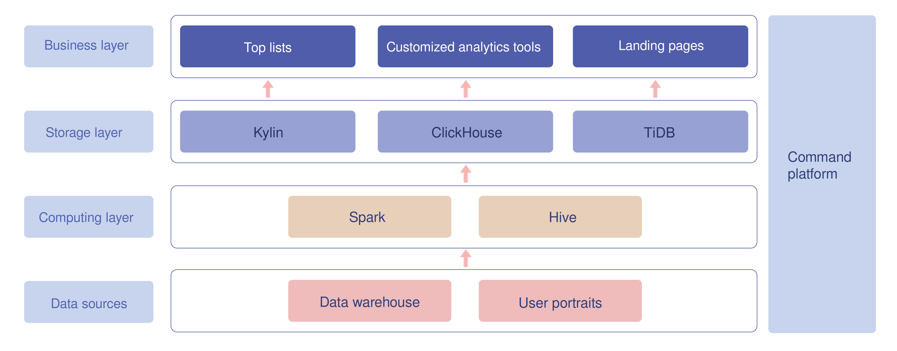

**Industry:** Media and Entertainment

**Author:** Xi Lu (Database engineer at iQIYI)

**Transcreator:** [Fendy Feng](https://github.com/septemberfd); **Editors:** Tom Dewan, [Ran Huang](https://github.com/ran-huang)

Launched on April 22, 2010, iQIYI is known for its high standards for its productions, as well as its youthful and stylish branding. Until now, iQIYI has achieved worldwide popularity, built up a massive user base, and has been considered as the leading power in China's online video industry.

## Our five-year relationship with TiDB

We discovered PingCAP's TiDB database five years ago, and since then it's been one of our most stable and productive tools. 

In 2017, we were in urgent search of a distributed database compatible with the MySQL protocol to hold iQIYI's soaring data size. Our first encounter with [TiDB](https://docs.pingcap.com/tidb/stable), a distributed, highly scalable and MySQL-compatible NewSQL database, showed us the light at the end of the tunnel and made us believe it was exactly what we had been looking for. 

Five years have passed, and we have now deployed over 100 TiDB clusters with more than 500 servers supporting over 30 business lines. 

In 2018, we shared [how TiDB helped us succeed](https://pingcap.com/case-studies/tidb-in-iqiyi) in risk monitoring and video transcoding. Today, I want to share more— especially how TiDB helps us win in real-time analytics scenarios. 

## Bottlenecks in traditional real-time analytics architectures

Before we met TiDB, like many other companies, we followed two popular architectures to process iQIYI's massive data: Lambda and Kappa. 

The table below summarizes these two architectures and their downsides.

<table>
  <tr>
   <td>
   </td>
   <td><strong>What is it?</strong>
   </td>
   <td><strong>Bottlenecks</strong>
   </td>
  </tr>
  <tr>
   <td><strong><a href="https://en.wikipedia.org/wiki/Lambda_architecture">Lambda architecture</a></strong>
   </td>
   <td>
<ul>

<li>
A way of processing massive quantities of data that provides access to batch-processing and stream-processing methods with a hybrid approach. 

<li>
Consists of three layers: the batch layer processes offline data, the speed layer processes real-time data, and the serving layer responds to queries. 
<ul>
</li>
</ul>
</li>
</ul>
   </td>
   <td>
<ul>

<li>
It has both batch and streaming systems, which is <strong>too tough and complicated for developers to establish and maintain.</strong>

<li>
The offline and real-time <strong>data</strong> <strong>cannot always remain consistent</strong>. 
<ul>
</li>
</ul>
</li>
</ul>
   </td>
  </tr>
  <tr>
   <td><strong><a href="https://www.oreilly.com/radar/questioning-the-lambda-architecture/">Kappa architecture</a></strong>
   </td>
   <td>
<ul>

<li>
A simplification of the Lambda architecture and can be seen as a Lambda architecture with the batch processing system removed. 

<li>
To replace batch processing, data is simply fed through the streaming system quickly. 
<ul>
</li>
</ul>
</li>
</ul>
   </td>
   <td>
<ul>

<li>
<strong>Too reliant on message middlewares</strong>, which is destined to have flaws in its performance. 

<li>
<strong>Data loss happens</strong> <strong>occasionally</strong> under this architecture.
<ul>
</li>
</ul>
</li>
</ul>
   </td>
  </tr>
</table>

## How does TiDB stand out?

Now that we understand the bottlenecks of traditional Lambda and Kappa architectures, let's see TiDB's data architecture and its strengths. 

TiDB uses a [Delta architecture](https://www.thedigitaltalk.com/blog/2019-9-introduction-to-delta-architecture/) to process massive real-time data. The Delta architecture can be seen as a further evolution of the Lambda and Kappa architectures, which processes data continuously and incrementally without having to choose between batching and streaming. This new architecture:

* Adopts a continuous data flow model to unify batch and streaming
* Uses intermediate hops to improve reliability and troubleshooting
* Makes the cost and latency trade off based on your needs
* Incrementally improves the quality of your data

This means that TiDB with a Delta architecture can reduce your maintenance burden, ensure your data quality and consistency, and improve the processing efficiency.

Let's see how TiDB comes into play in iQIYI's real-time analytics scenarios. 

  <a href="https://share.hsforms.com/1e2W03wLJQQKPd1d9rCbj_Q2npzm" onclick="trackViews('How TiDB Powers Real-Time Analytics for a Streaming Media Giant', 'subscribe-blog-btn-middle')"><button>Subscribe to Blog</button></a>
  <a href="/contact-us" onclick="trackViews('How TiDB Powers Real-Time Analytics for a Streaming Media Giant', 'contact-us-middle')"><button>Request a Demo</button></a>

### TiDB in the risk control system

Our risk control system includes a data service system. It is similar to a data warehouse and provides a unified tagging service and supports both Online Transactional Processing (OLTP) and Online Analytical Processing (OLAP) queries. 

The tagged data is originally written into and stored in TiDB in real time. By parsing the binlog files or manual trigger, TiDB can load data with specified tagging to the cache in the service layer so that the risk control engine can perform real-time queries. The extract, transform, load (ETL) module replicates data stored in TiDB to Hive by running a Spark job to ensure that both TiDB and Hive store the full amount of data. 

 The architecture of the data service system 

The image below shows how we deploy TiDB clusters in our entire risk control system. A TiSpark SQL helps us replicate the tagging data from TiDB to Hive. Then, Hive supports the offline OLAP queries, while TiDB responds to the OLTP queries.  

 The deployment architecture of TiDB clusters 

### TiDB in the BI system 

The Business Intelligence (BI) system helps BI operators analyze the performance of a certain TV episode released on the iQIYI platform based on indicators including its views, viewers, and ad clicks. It can also be used to compare the performance of different episodes, check the episode details, and conduct many other analyses. 

All data in the BI system originates from our internal data warehouses and user portraits. After being processed through Spark and Hive in the computing layer, the data goes to the storage layer and is stored in TiDB, ClickHouse, and Kylin. TiDB supports responses to landing page queries, for example, the real-time, daily, or accumulated views or clicks of a certain TV episode or album.

 The BI system architecture 

The data size in our BI system is enormous; it can be up to dozens of terabytes. Nevertheless, we are thrilled to see that TiDB not only can deal with such massive amounts of data, but it can also respond to OLAP and OLTP queries at the same time without interfering with either of them.  

## Conclusion

After five years of hands-on experience with TiDB and over 100 TiDB clusters deployed in our internal systems supporting over 30 business lines, we are proud to tell you that TiDB is a worthy database that:

* Is highly scalable, strongly MySQL compatible and ACID compliant
* Provides a simpler architecture for developers to deploy and maintain
* Ensures consistency between offline data and real-time data
* Perfectly supports real-time HTAP scenarios, and OLTP and OLAP queries do not interfere with each other 

Thanks to the PingCAP team for continuing to surprise us and help us succeed by delivering stronger products year by year. Each TiDB release brings us leaps in performance and efficiency. 

If you are also interested in TiDB, you can [request a demo](https://en.pingcap.com/contact-us/?_ga=2.26006143.375886924.1636296970-365976877.1630559498) from PingCAP right now. You can also [follow TiDB on GitHub](https://github.com/pingcap/tidb) or [join our community discussions on Slack](https://slack.tidb.io/invite?team=tidb-community&channel=everyone&ref=pingcap-blog) for further information. 
