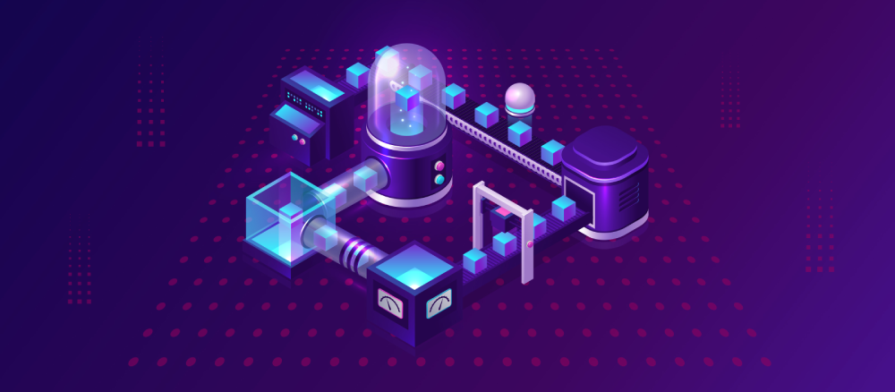
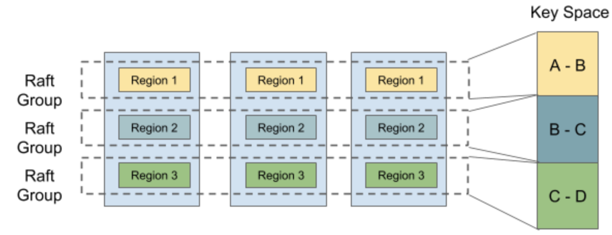
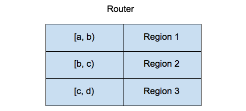
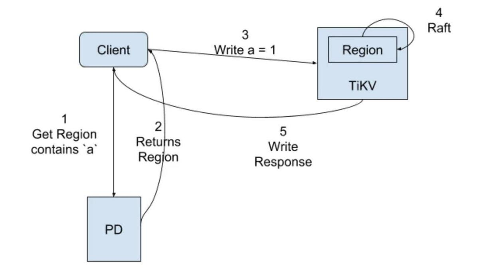
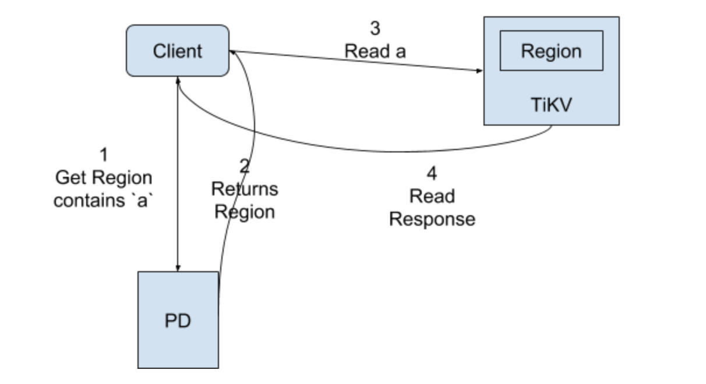
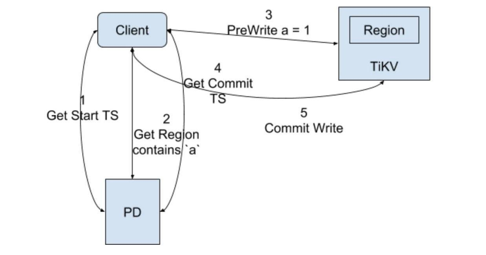
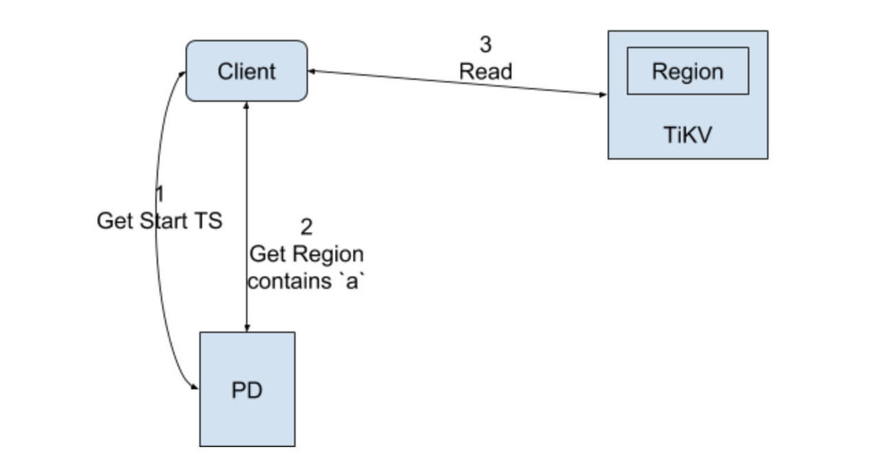

**Author:** [Siddon Tang](https://github.com/siddontang) (Chief Engineer at PingCAP)

**Transcreator:** [Calvin Weng](https://github.com/dcalvin)



This article introduces in detail how TiKV handles read and write operations. Together we will explore how TiKV, as a distributed database, stores the data contained in a write request and how it retrieves the corresponding data with consistency guaranteed.

## Before you read it

Before we begin, we need to introduce some essential concepts of TiKV to help you fully understand the process. If you are already familiar with these, you can skip to the next section.

### Raft


<div class="caption-center"> Raft Process in TiKV </div>

TiKV uses the Raft consensus algorithm to ensure data safety and consistency. By default, TiKV uses three replicas form a Raft Group.

When the client needs to write some data, it sends the request to the Raft Leader. This process is called Propose in TiKV. The Leader encodes the operation into an entry and writes it into its own Raft Log. This is called Append.

The Leader will also copy the entry to other Followers through the Raft algorithm. This is called Replicate. After the Follower receives the entry, it will also perform an Append operation, and in the meantime inform the Leader that the Append is successful.

When the Leader finds that the entry has been appended by majority of nodes, it considers that the entry Committed. Then, it can decode the operations in the entry, execute them, and apply them to the state machine. This is called Apply.

TiKV supports a feature called Lease Read. For Read requests, they can be sent directly to the Leader. If the Leader determines that its time-based lease has not expired, it directly provides the Read service without having to go through the Raft process. If the lease has expired, the Leader will be forced to go through the Raft process to renew the lease before it provides the Read service.

### Multi Raft


<div class="caption-center"> Multi Raft </div>

Because one Raft Group only processes a limited amount of data, we split the data into multiple Raft Groups, each of which corresponds to a Region. The way of splitting is to slice by range. That is, we sort the keys of the data in byte order to form an infinite sorted map, and then slice it into segments of continuous key ranges. Each key range is treated as a Region. The range of the Region uses the left-inclusive and right-exclusive mode - `[start, end)`. The end key of the previous Region is the start key of the next Region.

Regions in TiKV have a maximum size limit. When this threshold is exceeded, it splits into two Regions, such as [a, b) -> [a, ab) + [ab, b). Conversely, if there is very little data in the Region, it will be merged with the neighboring Regions to form a larger Region, such as [a, ab) + [ab, b) -> [a, b).

### Percolator

For the same Region, we can guarantee the consistency of the key operations through the Raft consensus protocol. But if we want to operate data that falls on different regions at the same time, we need distributed transactions to ensure the consistency of operations.

The most common method of distributed transactions is two-phase commit, also known as 2PC. TiKV draws its inspirations of 2PC implementation from Google's Percolator, with some practical optimizations to provide the distributed transaction support. For illustration purposes, let's highlight a few points of the mechanism:

First, Percolator needs a timestamp oracle (TSO) service to allocate global timestamps for transactions. This timestamp is monotonically increasing in time and globally unique. Any transaction gets a start timestamp (`startTS`) at the beginning, and then a commit timestamp (`commitTS`) when the transaction is committed.

Percolator provides three column families (CF)—Lock, Data and Write. When a key-value pair is written, the lock of this key is placed in the Lock CF, and the actual value in the Data CF. If the write is successfully committed, the corresponding commit information will be stored in the Write CF.

When the key is stored in the Data CF and the Write CF, the corresponding timestamp will be added to the Key — `startTS` for the Data CF, and `commitTS` for the Write CF.

Suppose we need to write `a = 1`, first a `startTS`, 10 for example, is obtained from the TSO; then comes the PreWrite stage of Percolator, when data is written in the Lock CF and the Data CF, as shown below:

> **Info:**
>
> The following operation instances use W for Write, R for Read, D for Delete, and S for Seek.

```
Lock CF: W a = lock
Data CF: W a_10 = value
```

If the PreWrite is successful, 2PC enters the Commit phase. A `commitTS`, 11 for example, is obtained firstly from TSO, and then the write continues as below:

```
Lock CF: D a
Write CF: W a_11 = 10
```

If the Commit is successful, the Data CF and the Write CF contain the record for the Key-Value, while the actual data is stored in the Data CF, and the corresponding `startTS` is recorded in the Write CF.

To read data, a `startTS`, 12 for example, is obtained from the TSO, and then the read is processed as below:

```
Lock CF: R a
Write CF: S a_12-> a_11 = 10
Data CF: R a_10
```

Below is how the Percolator model reads data:

1. Check to see if there is a lock in the Lock CF. If so, the read fails. If not, seek the latest commit version in the Write CF (11 in our case).

2. Get the corresponding startTS, (10 in our case), and then combine the key and startTS in the Data CF to read the corresponding data.

The above is just a brief introduction to the read and write processes of Percolator, which in reality will be more complicated than this.

### RocksDB

TiKV uses RocksDB as the underlying storage engine. For TiKV, any data is eventually be converted into one or more key-value pairs to be persisted in RocksDB.

Each TiKV contains two RocksDB instances. One of them is used to store Raft Log, which we call Raft RocksDB, and the other is to store the actual data, which we call KV RocksDB.

A TiKV store contains multiple Regions. In Raft RocksDB, we use the Region ID as the prefix of the key, which is combined with Raft Log ID to uniquely identify a Raft Log. For example, if there are two Regions with IDs of 1 and 2, then the Raft Log is stored in RocksDB as below:

```
1_1-> Log {a = 1}
1_2-> Log {a = 2}
...
1_N-> Log {a = N}
2_1-> Log {b = 2}
2_2-> Log {b = 3}
...
2_N-> Log {b = N}
```

Because we slice the key according to range, we use the key to save directly, similar to the following:

```
a-> N
b-> N
```

It stores two keys, a and b, but does not use any prefix to distinguish them.

RocksDB supports column families, so it can directly correspond to the column families in Percolator. In TiKV, we use the Default CF in RocksDB to directly correspond to the Data CF in Percolator, and use Lock and Write CFs of the same name.

### PD

Each TiKV reports the information of all Regions to Placement Driver (PD), so that PD is aware of the Region information for the entire cluster. Based on this, a Region routing table is formed as shown below:


<div class="caption-center"> Region Routing in TiKV </div>

When the Client needs to manipulate the data of a certain key, it first asks the PD which Region the key belongs to. For example, for key `a`, PD knows that it belongs to Region 1, and will return the related information to the Client, such as how many replicas are there for Region 1, which peer is the Leader now, and on which TiKV are the replicas of this leader residing, etc.

The client caches the relevant Region information locally, and proceed with subsequent operations. However it is possible that the Raft Leader of the Region is changed, or the Region is split and merged. The client will know that the cache is invalid, and then obtain the latest information from PD again.

PD also provides the global timing service. In the Percolator transaction model, we know that both the start and the commit points of a transaction need a timestamp, which is allocated by PD in our implementation.

<div class="trackable-btns">
    <a href="/download" onclick="trackViews('How TiKV Reads and Writes', 'download-tidb-btn-middle')"><button>Download TiDB</button></a>
    <a href="https://share.hsforms.com/1e2W03wLJQQKPd1d9rCbj_Q2npzm" onclick="trackViews('How TiKV Reads and Writes', 'subscribe-blog-btn-middle')"><button>Subscribe to Blog</button></a>
</div>

## Read and write in TiKV

Now that you learn about the basics, let's get down to the real businesses of read and write in TiKV. TiKV provides two sets of APIs for data operations, namely RawKV and Transactional KV (TxnKV). This section introduces how read and write in TiKV are processed using these two APIs.

## RawKV

RowKV API is a lower-level key-value API for interacting directly with individual key-value pairs. This is used when your application doesn't require data access for distributed transactions or multi-version concurrency control (MVCC).

### Write with RawKV


<div class="caption-center"> Write with RawKV </div>

A regular write operation with the RawKV API, writing `a = 1` for example, involves the following steps:

1. Client requests the Region for `a` from PD
2. PD returns the Region related information, mainly the TiKV node where the Leader is located
3. Client sends command to the TiKV node where Leader is located
4. Leader accepts the request and executes Raft process
5. Leader applies `a = 1` to KV RocksDB and returns write success to Client

### Read with RawKV


<div class="caption-center"> Read with RawKV </div>

Read is similar with write. The only difference is that Leader can directly apply a read without going through the Raft process.

## TxnKV

TxnKV corresponds to the Percolator mentioned above. It is a higher-level key-value API that provides ACID semantics. TxnKV is used when your application requires distributed transactions and/or MVCC.

### Write with TxnKV


<div class="caption-center"> Write with TxnKV </div>

For TxnKV, the situation is much more complicated. Most of the processes have been explained in the [Percolator](#percolator) section. For TiKV to quickly seek the latest commit, the following steps are performed:

1. Use big-endian to convert the timestamp to a 8-byte value, and then invert the bytes by bit.
2. Combine the inverted bytes with the original key for storage in RocksDB

This way the latest commits can be stored in the front, and the seek can be directly located. Of course, the corresponding TS is also encoded and processed in the same way.

For example, suppose a key now has two commits—commitTS is 10 and 12, and startTS is 9 and 11, then the order of keys in RocksDB is:

```
Write CF:

a_12-> 11
a_10-> 9

Data CF:

a_11-> data_11
a_9-> data_9
```

In addition, it should be noted that for small values, TiKV directly stores the value in the Write CF, so that only Read CF is required when reading. For write operations, the process is as follows:

```
PreWrite:

Lock CF: W a-> Lock + Data

Commit:
Lock CF: R a-> Lock + 10 + Data
Lock CF: D a

Write CF: W a_11-> 10 + Data
```

For TiKV, the Lock CF will be read during the Commit phase to determine transaction conflicts, so we can get data from the Lock CF and write it to the Write CF.

### Read with TxnKV


<div class="caption-center"> Read with TxnKV </div>

Refer to the [Percolator](#percolator) section for detailed write process with the TxnKV.

### SQL Key Mapping between TiDB and TiKV

TiKV is a distributed KV store. On top of it companies are building databases that speak different dialects. How can they use TiKV to do this? Let's take a look at [TiDB](https://pingcap.com/), a distributed relational database from PingCAP that speaks the MySQL protocol. You may wonder how a relational table is mapped to key-value. Take the following table:

```sql
CREATE TABLE t1 {
  id BIGINT PRIMARY KEY,
  name VARCHAR (1024),
  age BIGINT,
  content BLOB,
  UNIQUE (name),
  INDEX (age),
}
```

In this example, we create table t1 with 4 fields, with `ID` as the primary key, `name` as the unique index, and `age` as a non-unique index. So how does the data in this table correspond to TiKV?

In TiDB, each table has a unique ID, such as 11 here, and each index also has a unique ID, for example, 12 for the name index and 13 for the age index. We use prefixes `t` and `i` to distinguish between data and index in the table. For table `t1` above, suppose it now has two rows of data, which are `(1, "a", 10, "hello")` and `(2, "b", 12, "world")`. In TiKV, each row of data has different a corresponding key-value pair, as shown below:

```
Primary Key
t_11_1-> (1, "a", 10, "hello")
t_11_2-> (2, "b", 12, "world")

Unique Name
i_12_a-> 1
i_12_b-> 2

Index Age
i_13_10_1-> nil
i_13_12_2-> nil
```

Because PK is unique, we can use `t + Table ID + PK` to uniquely represent a row of data, and the value is this row of data. For the unique index, we use `i + Index ID + name` to represent it, and the value is the corresponding PK. If two names are the same, the uniqueness constraint is broken. To query with the unique index, TiKV first locates the corresponding PK, and then find the corresponding data through the PK.

For the ordinary index, we use `i + Index ID + age + PK` because no uniqueness constraint is required. The value is empty. Because the PK must be unique, even if the two rows of data have the same age, they will not conflict. To query with the ordinary index, TiKV seeks the data with the first key that is greater than or equal to the `i + Index ID + age` key, and then see if the prefix matches. If the prefix matches, TiKV decodes the corresponding PK, and get the actual data through it.

TiDB needs to ensure the consistency of keys when interacting with TiKV, so it uses the TxnKV mode.

## Conclusion

The above briefly introduces the process of reading and writing data in TiKV. There are still many things that have not been covered, such as error handling and performance optimization of Percolator. You can refer to [TiKV documentation](https://tikv.org/docs/3.0/concepts/overview/) and [deep dive TiKV](https://tikv.org/deep-dive/introduction/) for more details. Even better, join us in the development of the [TiKV](https://github.com/tikv/tikv) project!
