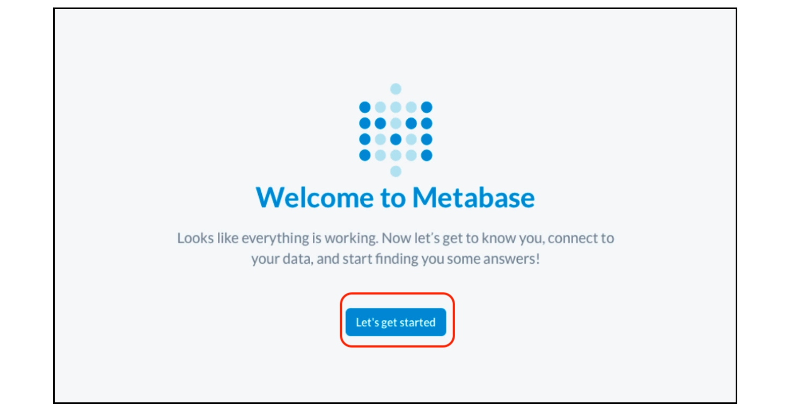
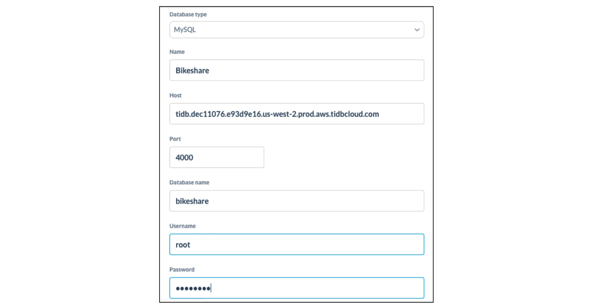
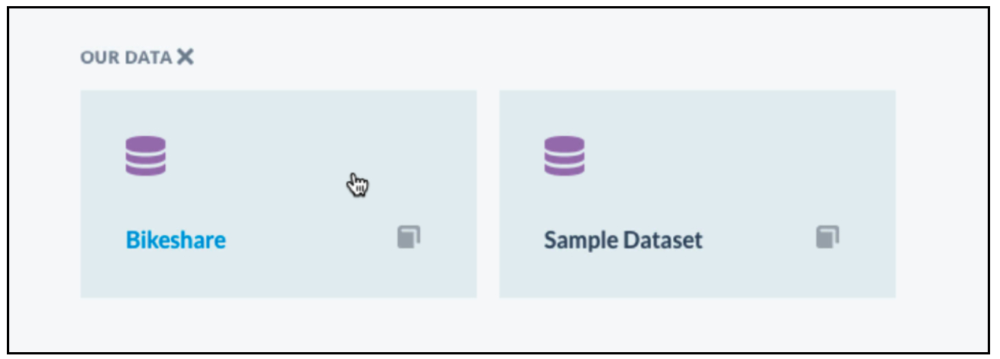
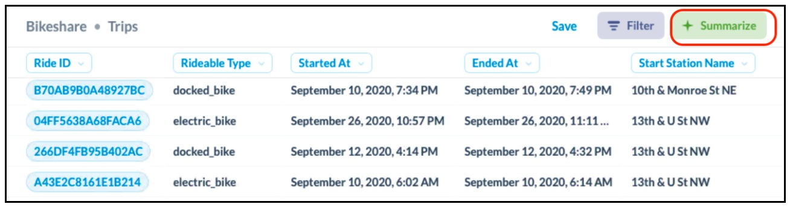
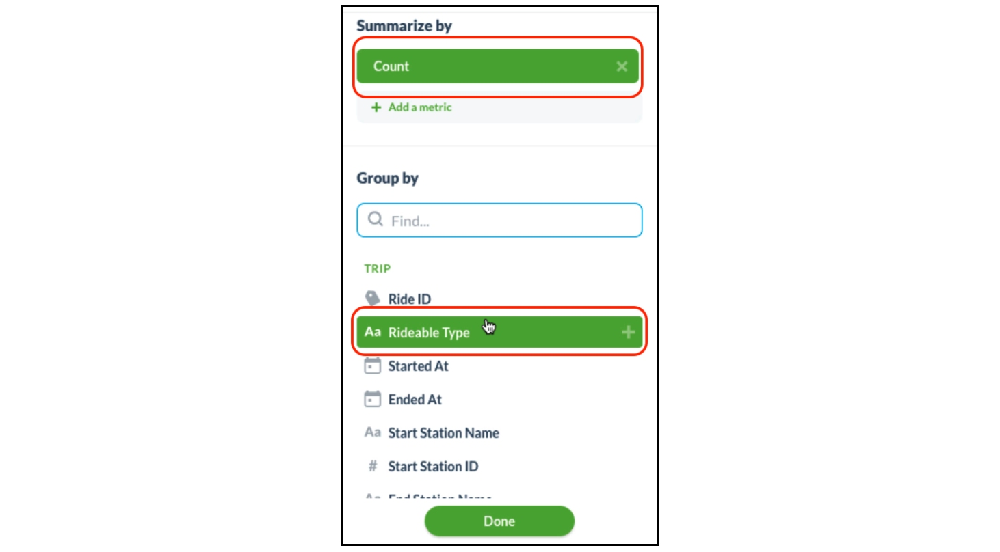

**Author:** [Phoebe He](https://github.com/phxwhe) (Content Developer at PingCAP)

**Editors:** [Calvin Weng](https://github.com/dcalvin), [Caitin Chen](https://github.com/caitinchen)

## Overview

[TiDB Cloud](https://docs.pingcap.com/tidbcloud/public-preview) is a fully-managed Database-as-a-Service (DBaaS) that brings everything great about TiDB to your cloud and lets you focus on your applications, not the complexities of your database.

In this 15-minute tutorial, you will learn how to connect TiDB Cloud to [Metabase](https://www.metabase.com/), an open source business intelligence (BI) tool. We will be using Metabase to build a BI dashboard and gain analytical insights using sample data from Capital Bikeshare (data released under the Capital Bikeshare Data License Agreement).

## Before you begin

* Create a TiDB Cloud cluster and import the Capital Bikeshare sample data following the [TiDB Cloud Quick Start Guide](https://docs.pingcap.com/tidbcloud/public-preview/tidb-cloud-quickstart).
* Install Metabase by following these [instructions](https://www.metabase.com/docs/latest/operations-guide/installing-metabase.html). You'll have the option of installing it on premise or in the cloud.

## Get TiDB Cluster IP address

1. Go to [https://tidbcloud.com/console/clusters](https://tidbcloud.com/console/clusters) and sign in to your cluster.

2. On the TiDB Cloud console, click **Connect** on the upper right of the pane.

    The **Connect to TiDB** dialog displays.

3. Create the traffic filter for the cluster.

    3.1 Depending on how you use Metabase, select a traffic filter from the following options:

        * If you are using an on-prem version of Metabase, click **Add Your Current IP Address**. Your IP Address will be automatically populated.
        * If you are using Metabase on a cloud platform,  click **Allow Access from Anywhere.**

    3.2 Click **Create Filter**.

4. Take note of the TiDB Cloud IP address, listed between the **-h** parameter and **-P** parameter, as you will use it at a later step. For example: `mysql -u root -h tidb.xxx.xxxxx.us-west-2.prod.aws.tidbcloud.com -P 4000 -p`

## Connect TiDB Cloud to Metabase

1. Start the Metabase application and click **Let's get started**.

    

2. Select your preferred language in step 1 and click **Next**.

3. Enter your information and account details in step 2 and click **Next**.

4. In the Add your data step, click the **Database type** drop down menu and select **MySQL**.

5. Specify the following settings

    * **Name:** `Bikeshare`
    * **Host:** *`<your_tidb_cloud_ip_address_obtained_in_the_previous_step>`*
    * **Port:** `4000`

6. **Database name:** `bikeshare`

    * **Username:** `root`
    * **Password:** *`<password_of_your_tidb_cluster>`*

    Here is an example:

    

7. Scroll down to the bottom and click **Next**.

8. For the Usage data preference step, change your preference if needed and click **Next**.

9. Click **Take me to Metabase**.

## Build BI Dashboard

In this exercise we will be analyzing the sample data from Capital Bikeshare to identify the most popular type of bicycle.

1. On the homepage of Metabase, scroll down to the **OUR DATA** section and click **Bikeshare**.

    

2. Click the **Trips** table.

3. Explore the trips table. This is the sample data set you imported to the TiDB Cloud cluster.

4. To display how many records are associated with each rideable bike type, click the **+Summarize** button on the top right.

    

5. Select **Count** as the metric and select **Rideable Type** for the Group by field.

    

    The bar chart displays immediately.

    

    We can see that docked bikes are the most popular bike type and electric bikes are the least popular kind of bike.

## Want to learn more?

Ready to [give TiDB Cloud a try](https://tidbcloud.com/signup?_ga=2.179445796.1809300235.1637569164-1325493959.1627016874)? TiDB Cloud [Developer Tier](https://pingcap.com/blog/tidb-cloud-introduces-developer-tier) is now available! It lets you run a TiDB cluster for free for one year on Amazon Web Services. Make sure to follow us on [Twitter](https://twitter.com/PingCAP) to stay updated on TiDB Cloud news!
