**Author:** [Mike Barlow](https://github.com/BarDev) (Solution Architect at PingCAP)

**Editors:** [Tina Yang](https://github.com/mangocake88), Tom Dewan, [Caitin Chen](https://github.com/CaitinChen)


## Overview

This two-part blog series will show you how to get a simple TiDB cluster up and running on Google Cloud Platform (GCP). The goal is to let you quickly set up TiDB and learn about its benefits. The entire process should take you about 30 minutes. In this first part, we'll prepare the GCP environment. In the second part, we'll set up and run TiDB on GCP.

By the end of this series your architecture will look similar to the following:


<div class="caption-center"> A TiDB/GCP reference architecture </div>

## Before you begin

Before you try the steps in this article, make sure you have:

* A basic understanding of GCP
* Google GCP gcloud installed and configured on your local computer
* The MacOS or Linux operating system installed on your local computer

**Preparing your environment**

The following diagram shows prerequisite operations. Each row indicates where you perform the corresponding task: either on your **Local** computer (or laptop) or on a **GCP instance**, which is a virtual machine instance that we will create in GCP.

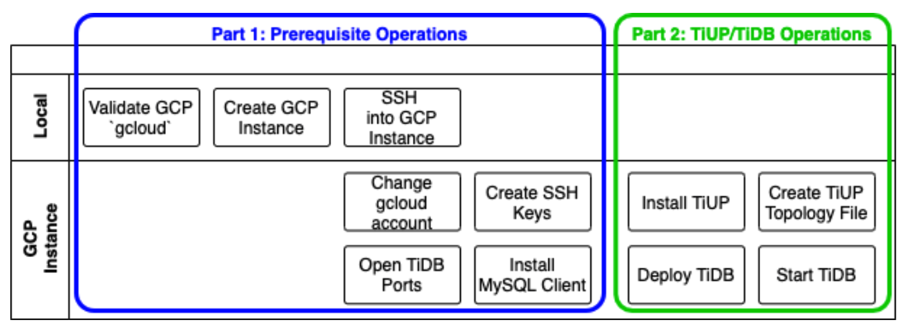
<div class="caption-center"> Prerequisite and TiUP/TiDB operations architecture </div>

## Validate the Google gcloud configuration on your local computer

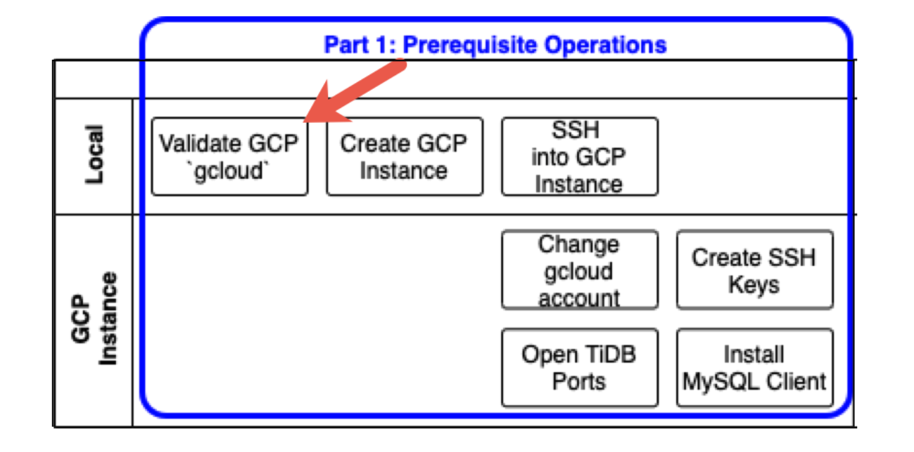
<div class="caption-center"> Validate Google gcloud configuration </div>

You should have Google gcloud installed and configured on your local computer. The gcloud configuration should look like this:

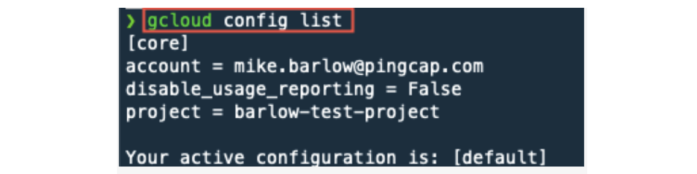

Notice that I'm using a user account; not a service account. Usually a service account ends with gserviceaccount.com.

In the following example, I have the `compute` configuration set for region and zone. Setting this information is optional. In this tutorial, when we use gcloud commands we will specify where the resource is located.

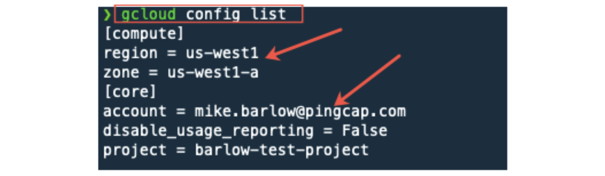

## Create a GCP instance


<div class="caption-center"> Create a GCP instance </div>

Let's create a GCP instance where we will run TiDB. Enter the commands below. This may take a few minutes to complete.

```
gcloud compute instances create tidb-vm \
  --image-family=ubuntu-1804-lts \
  --image-project=ubuntu-os-cloud \
  --machine-type=e2-medium \
  --boot-disk-size=200GB \
  --boot-disk-type=pd-standard \
  --boot-disk-device-name=tidb-vm \
  --zone=us-west1-a
```

As a sanity check, you can run the following command to validate that the instance is up and running:

```
gcloud compute instances list
```


If you get an error and cannot create an instance, most likely you do not have valid permissions with the GCP account that gcloud is associated with.

## SSH into the new GCP Instance


<div class="caption-center"> SSH into the new GCP instance </div>

Here we will use the gcloud ssh feature to access our newly-created GCP instance:

```
gcloud compute ssh --zone "us-west1-a" "tidb-vm"
```

The server we connect to via SSH has a prompt that references the tidb-vm instance. (See the red arrow.)

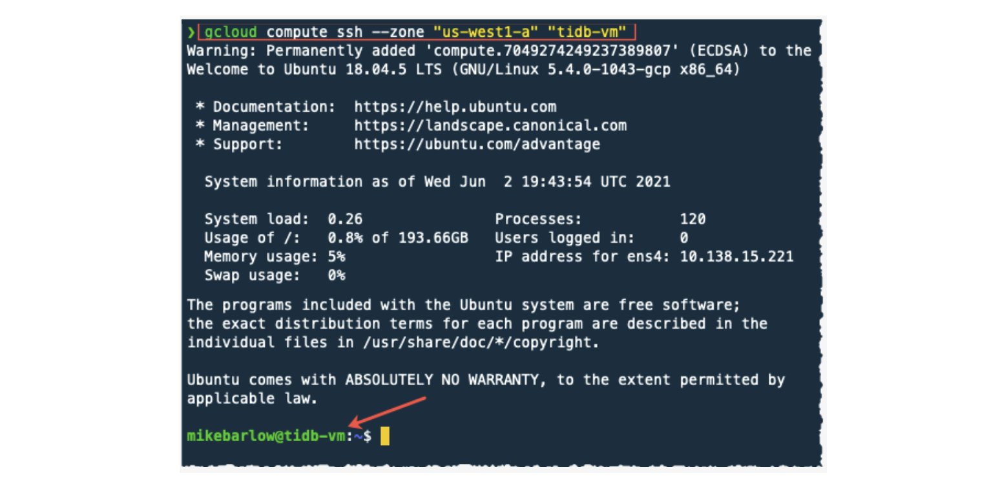

## GCP instance: change the service account to a user account

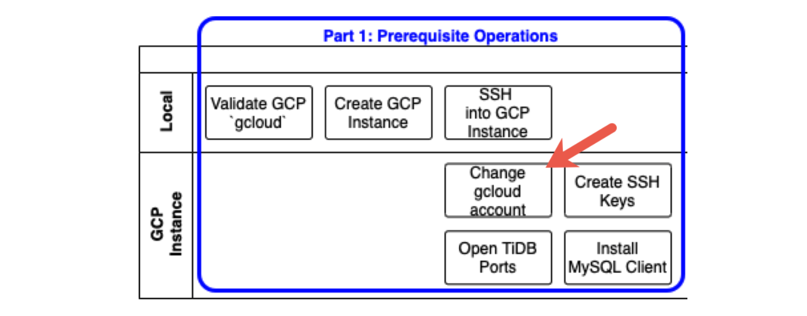
<div class="caption-center"> Change the gcloud account </div>

**gcloud account**

We should now be logged into the GCP instance tidb-vm.

To validate our level of access, we can display a list of our GCP instances:

```
gcloud compute instances lists
```

Sometimes you may get an error (as I did below). This was because my account associated with gcloud is a service account that does not have permissions to get a list of instances. A GCP service account is automatically added to your project and used by an application or virtual machine (VM) instance.

Even though you may not get an error, I recommend following the instructions below to change from a service account to your user account.

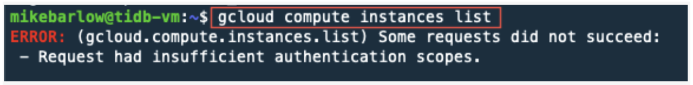

To check what account we are running, run the following command:

```
gcloud auth list
```

Take note of the account's email address and domain. If it ends in compute@developer.gserviceaccount.com, you are running as a service account. For this exercise, we want to execute gcloud commands with our user account.


**Changing from a service account to a user account**

To change from a service account to a user account:

1. Authorize login to gcloud.
2. Copy the URL and paste it in your browser.
3. Select the Google Cloud account.
4. "Allow" Google account.
5. Copy and paste the code to gcloud.

To start the process, run the following command:

```
gcloud auth login
```

You will see a long URL (see the image below). Copy this URL and paste it in your browser address bar.

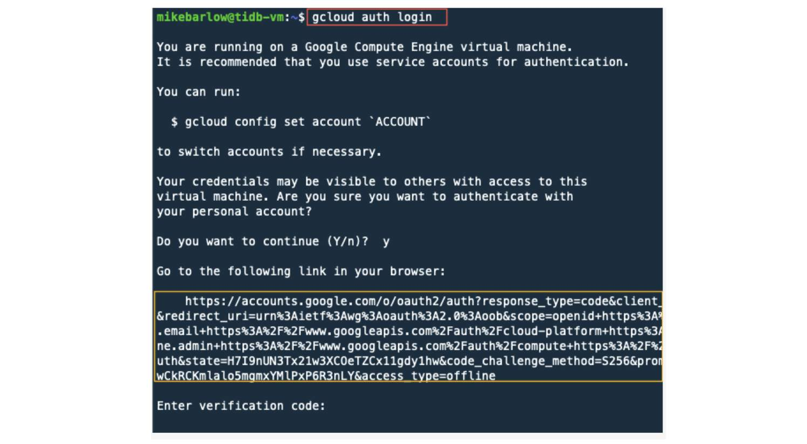

In the browser, select the Google Account that has the permissions you need. In some cases, this may be the same account you used when you created the GCP instance.

**Login with your GCP user account**

To log in to your GCP user account, do the following:

1. Log in with your GCP user account.

    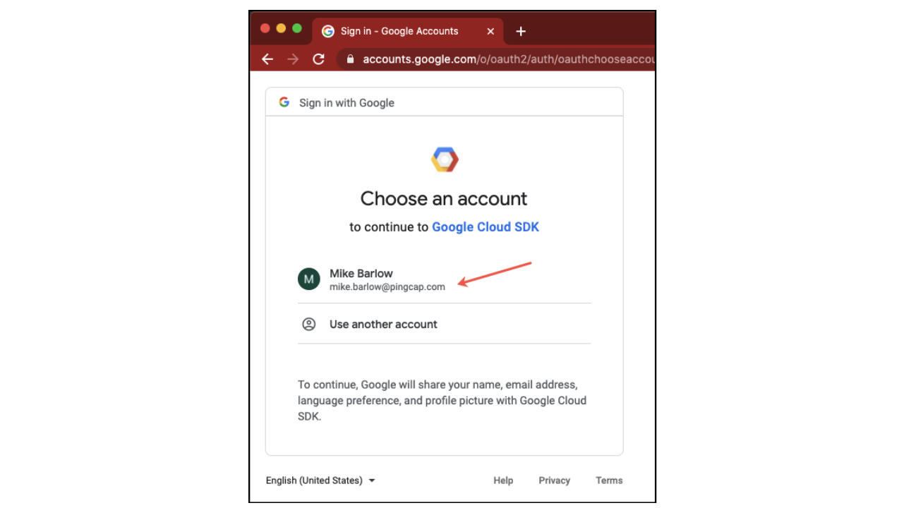
    <div class="caption-center"> Log in with your GCP user account </div>

2. A screen displayed asking you if the Google Cloud SDK can access your account. Click **Allow**.

    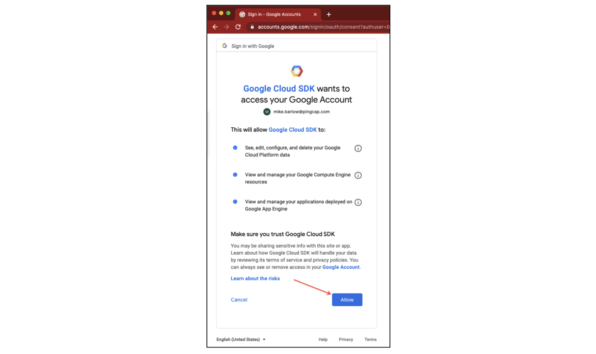
    <div class="caption-center"> Allow Google Cloud SDK to access your account </div>

3. Click the copy button (see arrow below).

    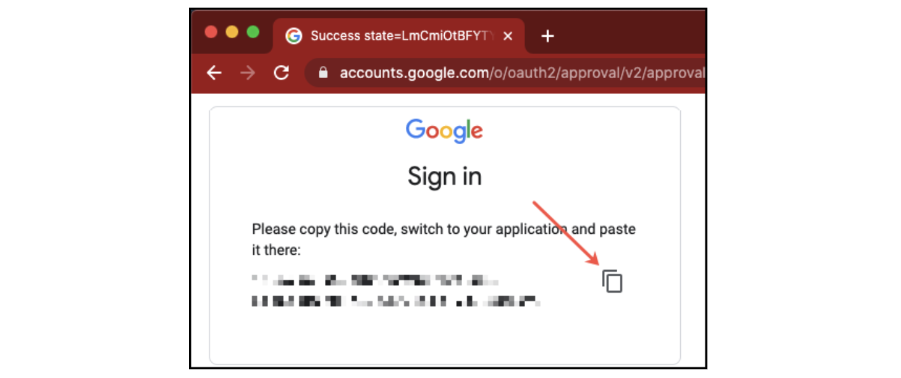
    <div class="caption-center"> Click the copy button </div>

4. Paste the verification code from the browser to the gcloud command line.

    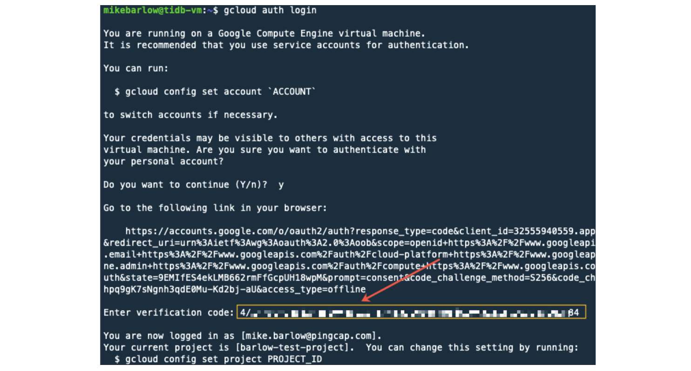

    Our user account should now be associated with gcloud.

5. As a sanity check, let's confirm the account we are running with the following command:

    ```
    gcloud auth list
    ```

    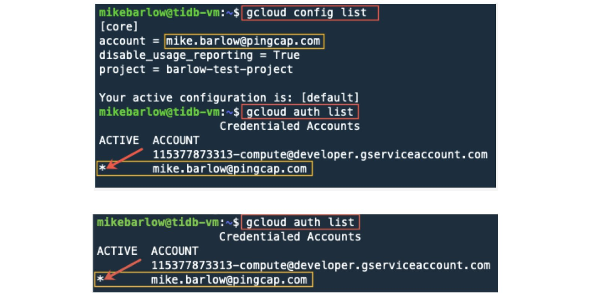

    If you see that your account is active, then your gcloud is now running under a user account. Let's try again to get a list of machines:

    ```
    gcloud compute instances lists
    ```

    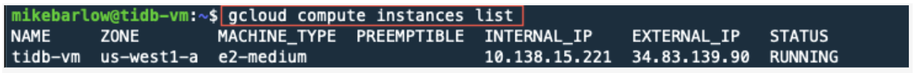

    While this doesn't prove that we have all the access we will need, it is a good baseline.

## Create SSH keys for TiUP

Think of [TiUP](https://docs.pingcap.com/tidb/stable/production-deployment-using-tiup) as a package manager that makes it easier to manage different cluster components in the TiDB ecosystem. We will install TiUP in Part 2, but here we will go ahead and configure SSH for TiUP.

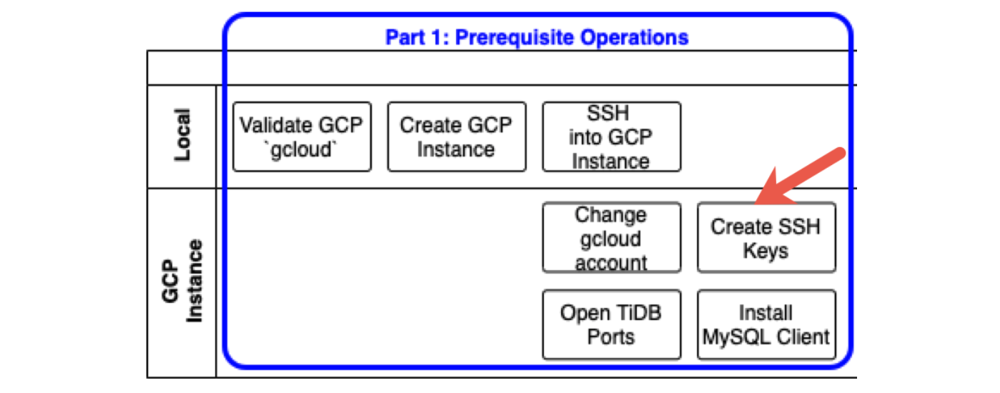
<div class="caption-center"> Create SSH keys for TiUP </div>

TiUP uses SSH, so first we will need to configure SSH.

Let's see what's in the .ssh directory:

```
ls -al .ssh
```

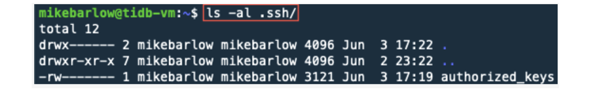

There are no actual keys in this directory. We can use gcloud to create the SSH keys that TiUP will need.

When you run the following command, you will be prompted to enter a passphrase. For simplicity, do not enter a passphrase. Just hit Return to provide an empty passphrase.

```
gcloud compute config-ssh
```

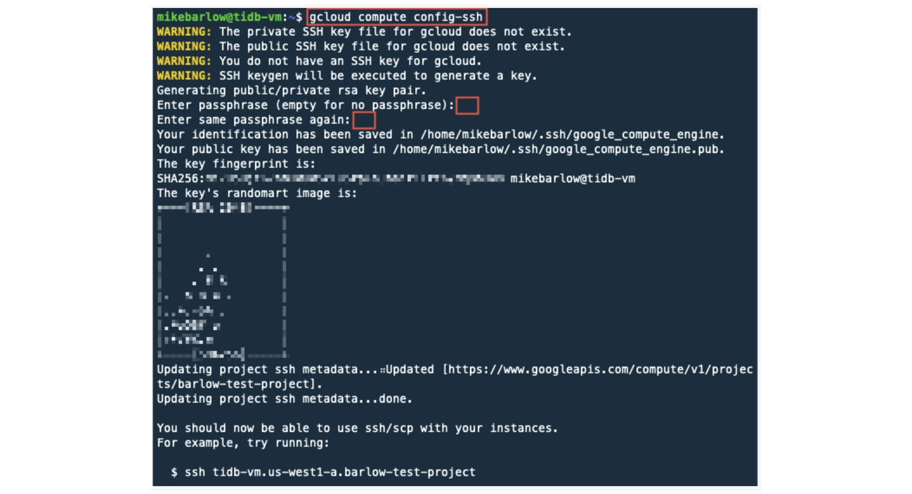

As a sanity check, let's see what files were created:

```
ls -al .ssh/
```

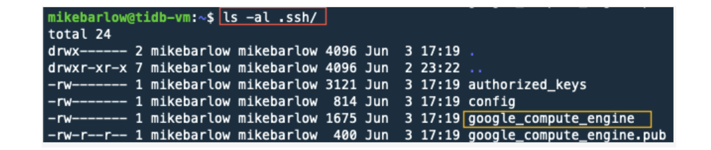

Note that we now have three new files. The primary file we are interested in is the `google_compute_engine`, which is the private key that TiUP will use for SSH.

## Open TiDB ports on the GCP network

You will want to access TiDB resources (TiDB Dashboard, Grafana, and Prometheus) from a browser on your local computer. To do this, you will need to open ports on the GCP network by creating a GCP firewall rule.

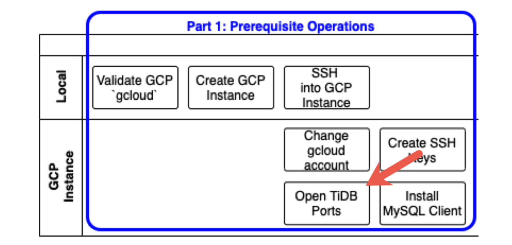
<div class="caption-center"> Open TiDB ports </div>

In the steps below, we'll create a firewall rule that allows only our local computer to access TiDB resources.

Let's get our local computer public IP Address. Here's a [link](https://www.cyberciti.biz/faq/how-to-find-my-public-ip-address-from-command-line-on-a-linux/) that provides different ways of getting your local IP.

We want our local computer IP address, **NOT** the GCP instance IP address. Therefore, run the following command on your local computer. For me, I'm running the following command on my MacBook<sup>®</sup>. Note in the image below that the command prompt does not include tidb-vm.

```
host myip.opendns.com resolver1.opendns.com
```

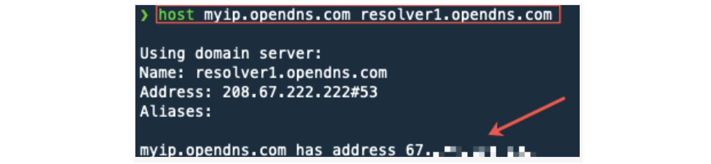

Notice the blurred-out IP address above. This is the IP address used in the following steps. Your IP address will be different and unique.

Let's go back to our GCP instance and look at the current firewall rules:

```
gcloud compute firewall-rules list
```

By default, GCP already has some firewall rules. We will create a new firewall rule because all the ports on a cloud instance are closed by default, and we need to tell the firewall which ports should be open. This way, we only open the necessary ports to retain security and prevent cyber-attacks.


We'll make the following TiDB ports available to our local computer:

* TiDB SQL Client: 4000
* Grafana: 3000
* Prometheus: 9090
* TiDB Dashboard: 2379

You can see a list of all the TiDB ports [here](https://docs.pingcap.com/tidb/stable/hardware-and-software-requirements#network-requirements).

Let's create a firewall rule with our local IP Address.

In the code example below, for the parameter `--source-ranges`, replace `<Your Local IP>` with your own local IP Address; however, keep the `/32`. This will limit access from your specific IP address.

```
gcloud compute firewall-rules create access-from-home \

  --allow tcp:4000,tcp:3000,tcp:9090,tcp:2379 \

  --description="Allow traffic from my personal computer" \

  --source-ranges="<Your Local IP>/32"
```

I added port 2379 to the above command. This port is different from the one shown below.

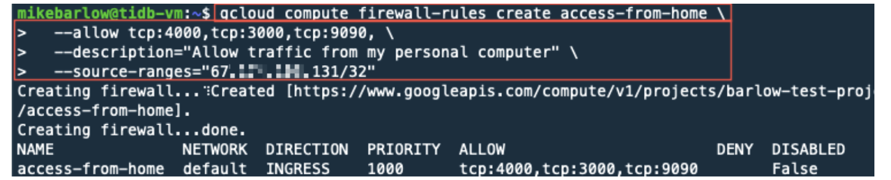

In Part 2 of our series, we will use these ports to access TiDB from our local computer.

## Install a MySQL client

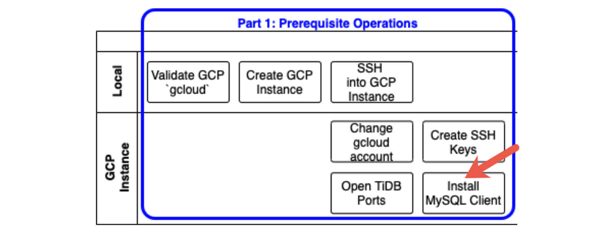
<div class="caption-center"> Install a MySQL client </div>

TiDB is [fully compatible with the MySQL 5.7 protocol](https://docs.pingcap.com/tidb/stable/mysql-compatibility) and the common features and syntax of MySQL 5.7.

In Part 2, we will install TiDB and access it with a MySQL client. Here, we will first install a MySQL client using `apt-get`:

```
sudo apt-get update
```

```
sudo apt-get install mysql-client
```

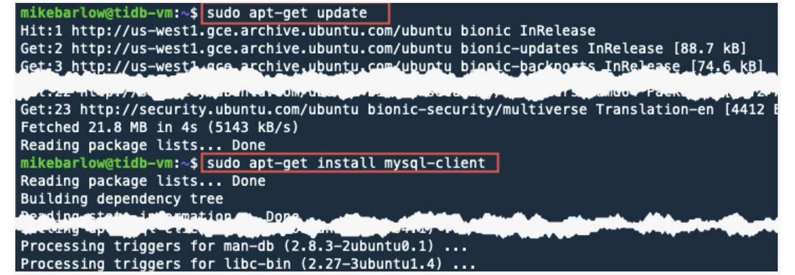

## Summary

You should now have a GCP instance set up where you'll be able to install and run a simple TiDB environment. Check out [Part 2](https://pingcap.com/blog/how-to-deploy-tidb-on-google-cloud-platform-part-2) where we install and run TiDB!
