**Author:** [Mike Barlow](https://github.com/BarDev) (Solution Architect at PingCAP)

**Editors:** [Tina Yang](https://github.com/mangocake88), Tom Dewan, [Caitin Chen](https://github.com/CaitinChen)


## Overview

Welcome to the second of a two-part blog series on getting a simple TiDB cluster up and running on Google Cloud Platform. The goal is to let you quickly set up TiDB and become familiar with its benefits. In [Part 1](https://pingcap.com/blog/how-to-deploy-tidb-on-google-cloud-platform-part-1), we created a GCP instance. Here in Part 2, we will install, configure, and run TiDB on that instance.

By the end of this article, your architecture may look similar to the following:.

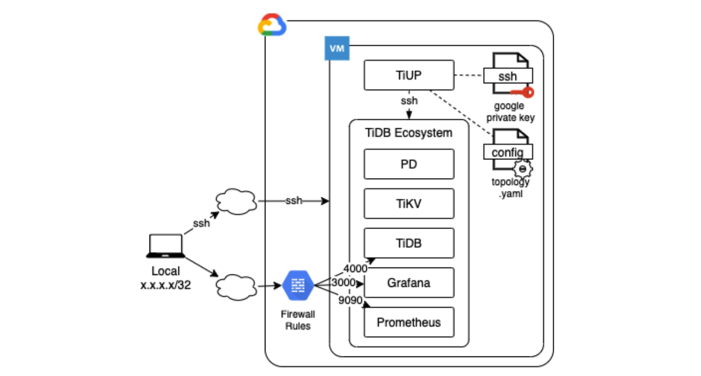
<div class="caption-center"> A TiDB/GCP reference architecture </div>

In [Part 1](https://pingcap.com/blog/how-to-deploy-tidb-on-google-cloud-platform-part-1), we focused on the Prerequisite Operations of setting up and configuring GCP in order to run TiDB. (See the image below.) Now, we will actually set up and run TiDB.

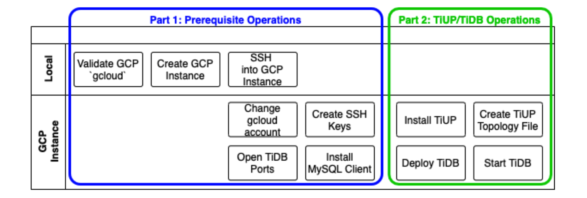
<div class="caption-center"> Run TiDB on a Google Cloud Platform instance </div>

## Before you begin

In [Part 1](https://hackmd.io/vmqIH4SMRIOUyvqOhExqsw) we had set up the following:

* GCP instance
* gcloud associated with a User Account
* Private keys
* Open ports for TiDB 
* Local computer with MacOS or Linux operating system

If you have not yet set these up, or are having any issues, please refer to Part 1. Also, your local computer will need to be a MacOS or Linux operating system. First, let's check that things are set up correctly. 

### SSH into GCP Instance

If you haven't securely logged into your GCP instance, do so now:

```
gcloud compute ssh --zone "us-west1-a" "tidb-vm"
```

Notice that the server we SSH into has a prompt that references the tidb-vm instance.

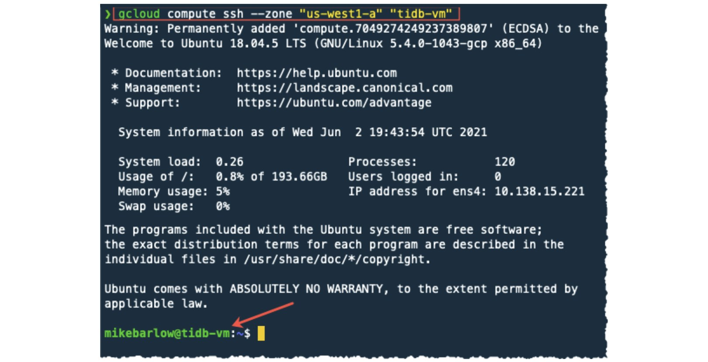

### gcloud account

Let's check the account that gcloud is associated with:

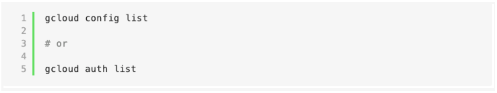

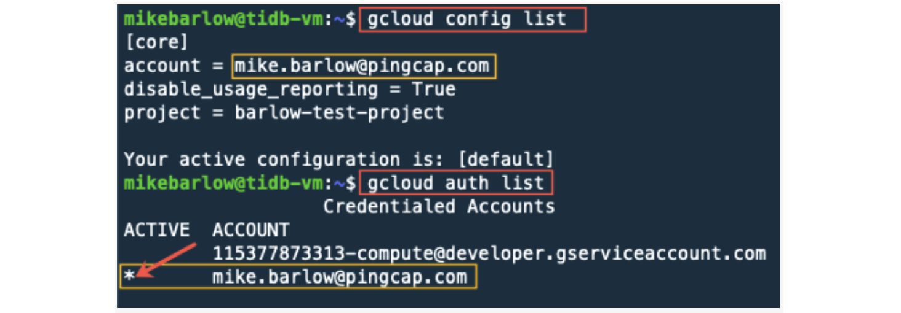

Once you see your registered email address, that confirms that you are running under the correct user account.

### SSH keys

Let's check which SSH keys we have available:

```
ls -al .ssh/
```

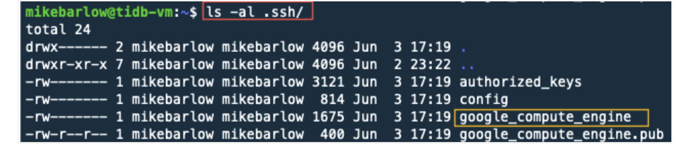

The primary file we are interested in is the `google_compute_engine`, which is the private key that TiUP will use for SSH.

### TiDB ports

We should have a firewall rule that grants our local computer access to TiDB components (TiDB Dashboard, Grafana, Prometheus, and the SQL interface). Let's check the rules with the following command:

```
gcloud compute firewall-rules list
```

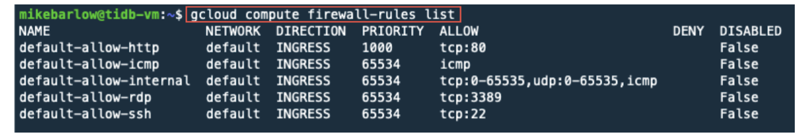

In Part 1, we had created the firewall rule `access-from-home`. GCP automatically created the other firewall rules. This should provide us a comfort level that the GCP instance is set up correctly to run TiDB.

## Install TiUP

TiUP is a package manager that makes it easier to manage different cluster components in the TiDB ecosystem.


<div class="caption-center"> Install TiUP </div>

TiUP references:

* [TiUP Overview](https://docs.pingcap.com/tidb/stable/tiup-overview)
* [Deploy a TiDB Cluster Offline Using TiUP](https://docs.pingcap.com/tidb/stable/production-offline-deployment-using-tiup)
* [Deploy a TiDB Cluster Using TiUP](https://docs.pingcap.com/tidb/stable/production-deployment-using-tiup)
* [Quick Start Guide for the TiDB Database Platform](https://docs.pingcap.com/tidb/stable/quick-start-with-tidb)

We don't want to accidentally install TiUP and TiDB on our local computer, so let's confirm that we are on the GCP instance. In the image below, notice that the command prompt prefix includes **tidb-vm**. This lets us know that we are on the GCP instance.

Next, let's install TiUP:

```
curl --proto '=https' --tlsv1.2 -sSf https://tiup-mirrors.pingcap.com/install.sh | sh
```

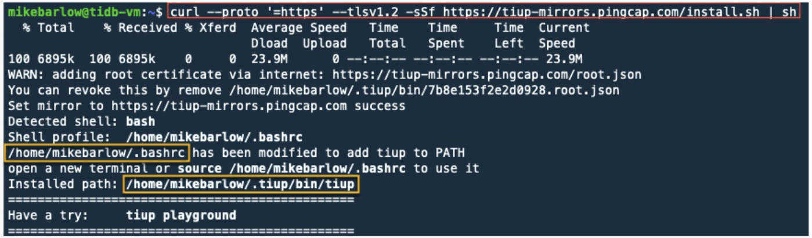

Notice that the `.bashrc` file was updated to include the path to the TiUP working directory that was created in our home directory under `.tiup/`.

Since the path has been updated in the `.bashrc`, we need to reload it by running the following command, which will not display any output: 

```
source .bashrc
```


As a sanity check, let's make sure that TiUP is installed:

```
tiup -v
```

```
tiup cluster list
```

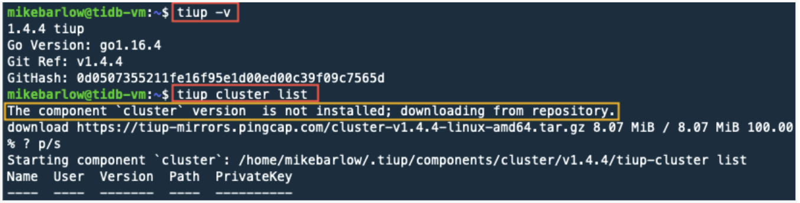

Notice the output for the **tiup cluster list** command. Here we can see that TiUP has been installed, and there are currently no TiDB clusters running. Your version of TiUP will probably be different. 

**Create a TiDB topology configuration file**

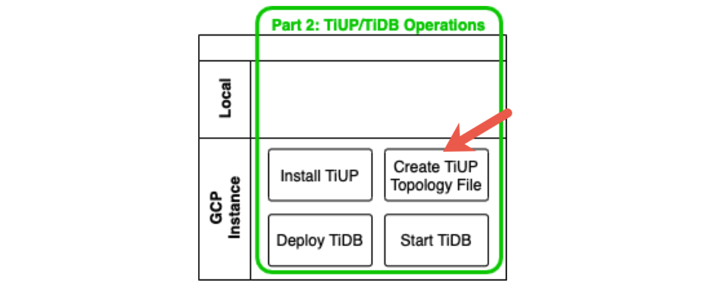
<div class="caption-center"> Create a TiUP topology file </div>

We use TiUP to deploy and scale the TiDB ecosystem. A topology file is a configuration file that identifies the components that will be deployed and on which server they will be deployed.

Let's create the topology.yaml file. This topology file is fairly simple and tells TiUP to do the following:

* Create a new Linux user called tidb.
* Manage the cluster over SSH Port 22.
* Deploy TiDB components to the directory `/home/tidb/tidb-deploy`.
* Store data in the directory `/home/tidb/tidb-data`.
* Install and run the following components all on the server with IP 127.0.0.1 (localhost):
    
    * Placement Driver (PD)
    * TiDB
    * TiKV
    * Monitoring Server
    * Grafana Server

```
vim topology.yaml
```

Copy and paste the following into the topology.yaml file:

```
global:
  user: "tidb"
  ssh_port: 22
  deploy_dir: "/home/tidb/tidb-deploy"
  data_dir: "/home/tidb/tidb-data"
server_configs: {}
pd_servers:
  - host: 127.0.0.1
tidb_servers:
  - host: 127.0.0.1
tikv_servers:
  - host: 127.0.0.1
monitoring_servers:
  - host: 127.0.0.1
grafana_servers:
  - host: 127.0.0.1
alertmanager_servers:
  - host: 127.0.0.1
```

Note that all the IP addresses are 127.0.0.1 (localhost). We are installing one instance of each component on the same computer (localhost). We do this on purpose to create an environment to test the different components.

To deploy a TiDB cluster, we use the TiUP command `tiup cluster`. Below is a check argument that does dry run to validate the topology.yaml file and determine whether ssh access is sufficient.

In [Part 1](https://pingcap.com/blog/how-to-deploy-tidb-on-google-cloud-platform-part-1), we created the Google private key for SSH. We will use this private key in the command below with the parameter `--identity_file`.

We include a reference the topology.yaml file:

```
tiup cluster check --identity_file ~/.ssh/google_compute_engine topology.yaml
```

Since we are doing a quick test, don't worry about the output of Pass, Fail, and Warn status.

You want to see output similar to the following:

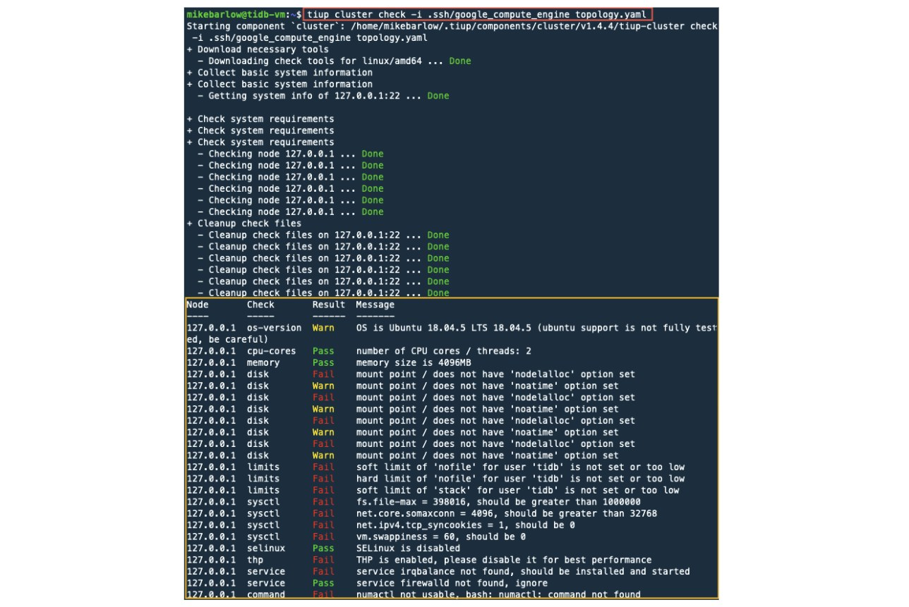

If things didn't work correctly, you may see certain error messages, as in the results below. Notice that on the command line I misspelled the private key name. TiUP couldn't find it and raised an error. If you do see this error, please reference [creating SSH Keys in Part 1](https://pingcap.com/blog/how-to-deploy-tidb-on-google-cloud-platform-part-1#create-ssh-keys-for-tiup).

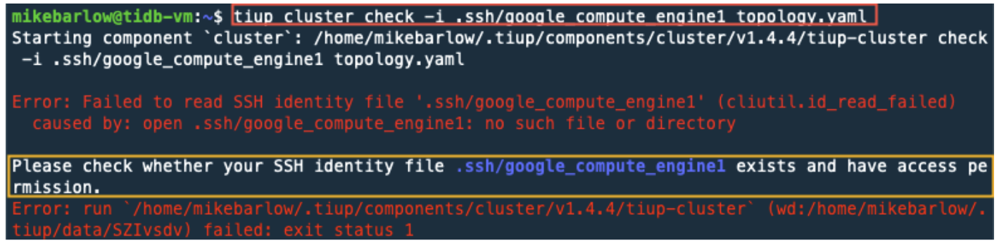

## Deploy TiDB using TiUP

In the previous section we did a dry run. Now, let's use TiUP to deploy TiDB.

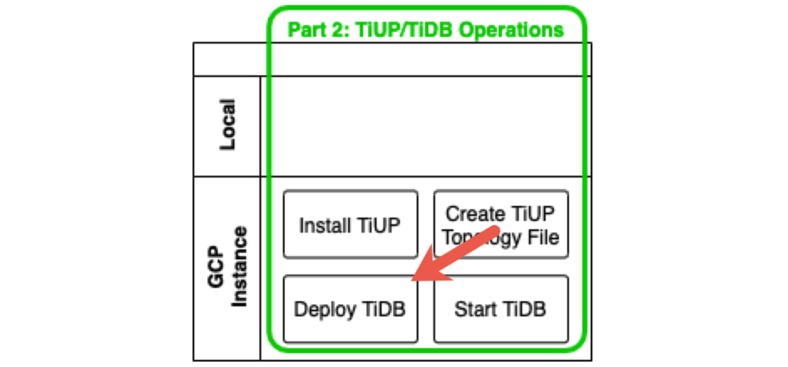
<div class="caption-center"> Deploy TiDB </div>

For a deployment, we need to add a few additional parameters. The main parameters are identified below:

```
tiup cluster deploy tidb-test v5.0.1 -i ~/.ssh/google_compute_engine topology.yaml
```

Here's a breakdown of the command:

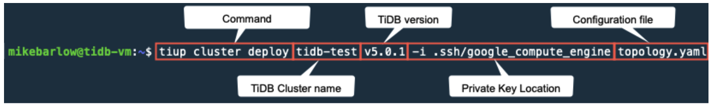

You'll see a prompt "Do you want to continue? [y/N]". Type `y` to continue. 

![Prompt "Do you want to continue? [y/N]"](media/prompt-continue.jpg)

We successfully deployed a TiDB cluster, but have not yet started the cluster.

Let's do a sanity check and confirm which cluster is being managed by TiUP:

```
tiup cluster list
```

The output should include the cluster name, path, and private key.

We should see only the one cluster that we deployed.

Let's see the details of the tidb-test cluster:

```
tiup cluster display tidb-test
```

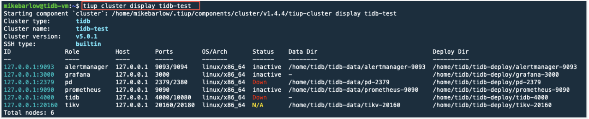

We haven't started TiDB and its components, so it is offline with the statuses of inactive, down, and N/A. Before we start TiDB, I like to see which service ports are open on the GCP instance. These ports are assigned to processes that run on the GCP instance, and are different from the GCP firewall rules that we had created.  After we start TiDB, we will run this command again and see which ports are associated with the different TiDB processes.

By default, Google GCP instances have assigned these ports to these processes:

```
sudo netstat -tulpn | grep LISTEN
```

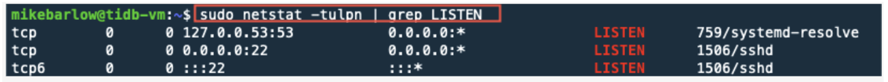

## Start TiDB and components

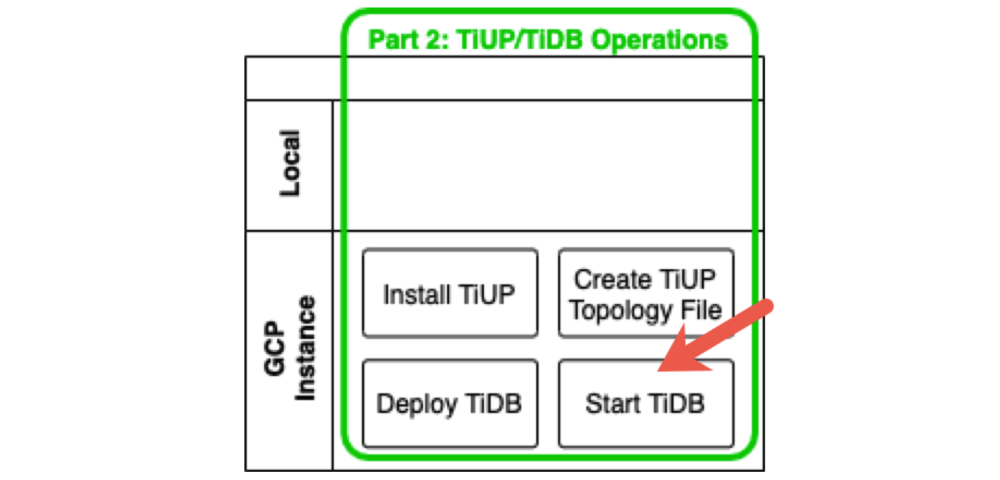
<div class="caption-center"> Start TiDB </div>

Let's start the TiDB ecosystem using `tiup cluster`:

```
tiup cluster start tidb-test
```

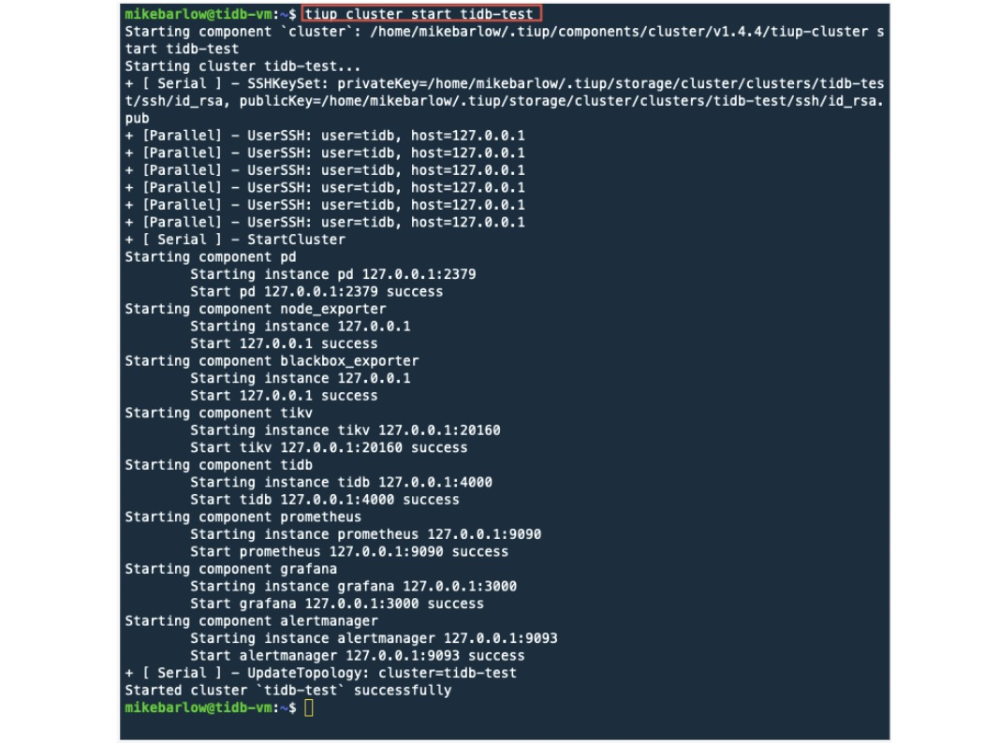

There's a lot going on here, but the key is that there are no errors being shown.

As a sanity check, let's see the details of the tidb-test cluster using the display parameter:

```
tiup cluster display tidb-test
```

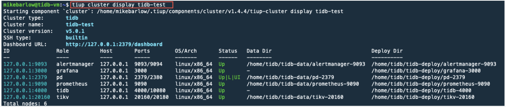

As we can see, all the components are up and running.

Let's see which ports and services are available:

```
sudo netstat -tulpn | grep LISTEN
```

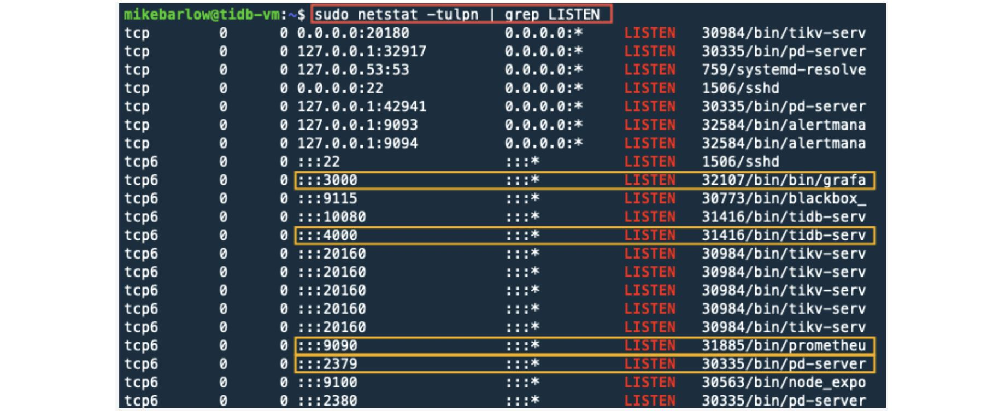

There are many processes running that have TCP ports associated with them. In the image above, I've highlighted the ports that we opened with the GCP firewall rule.

## Let's connect

In this section we will access the following components from a browser on our local computer: 

* TiDB Dashboard
* Grafana
* Prometheus
* SQL client

Also, we will use a local SQL client to access TiDB and run a few SQL commands. To access the TiDB components that are running on our GCP instance from our local computer, we will need the external IP address of our GCP instance:

```
gcloud compute instances list
```


Here we can see that the GCP instance's external IP address is 34.83.139.90. (Your IP address will be different.) We will use this IP address from our browser on our local computer.

### TiDB Dashboard

In a browser on your local computer, provide the URL that starts with your GCP instance IP address, port number 2379, and, at the end, add `/dashboard`. My URL is http://34.83.139.90:2379/dashboard. The IP address for your GCP instance will be different.

You shouldn't need to login, so go ahead and click the "Sign In" button:

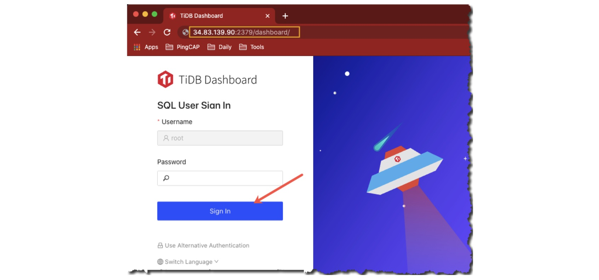
<div class="caption-center"> TiDB Dashboard sign-in </div>

Here's the TiDB Dashboard. To learn more about the dashboard, see our [online documentation](https://docs.pingcap.com/tidb/stable/tidb-monitoring-framework). 

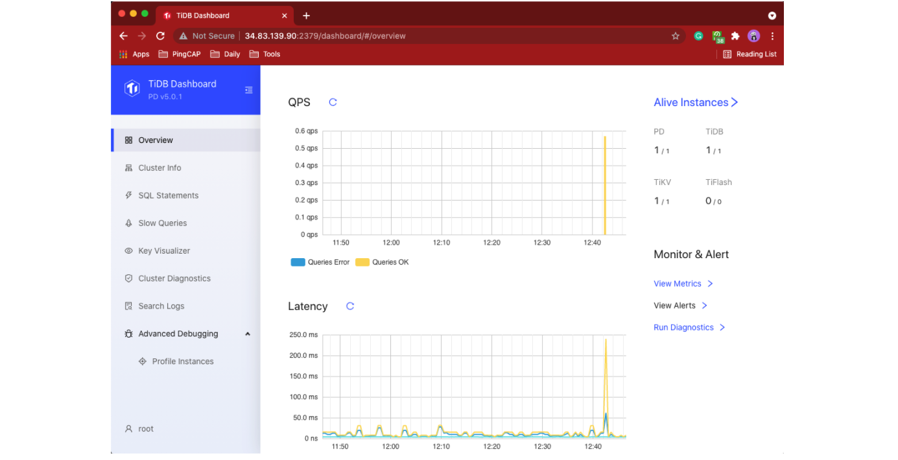
<div class="caption-center"> TiDB Dashboard </div>

### Grafana

To access Grafana, create a URL and use your GCP instance's public IP address with port 3000. My URL is <http://34.83.139.90:3000/>. Your IP address will be different.

Login to Grafana using `admin` for both the username and password.

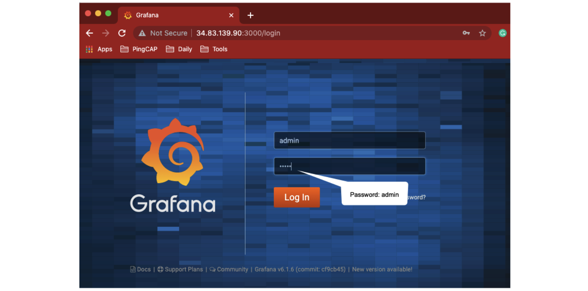
<div class="caption-center"> Grafana log-in </div>

You may be prompted to change your password. I selected "Skip" since this is a temporary system that only I have access to with my local computer.

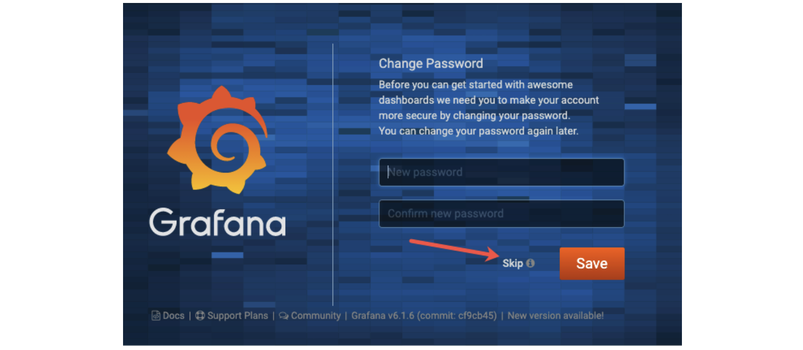
<div class="caption-center"> Grafana Change Password </div>

The initial Grafana Dashboard should look something like this:

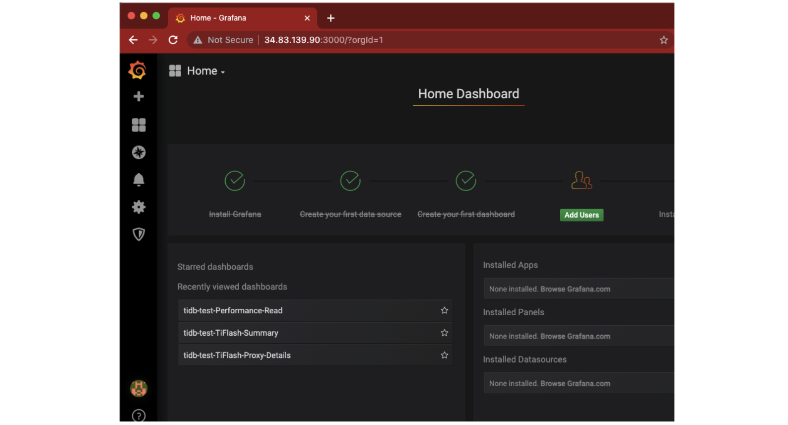
<div class="caption-center"> Grafana Dashboard </div>

### Prometheus

To access Prometheus, create a URL and use your GCP instance's public IP address with port 9090. For me, the URL will be <http://34.83.139.90:9090>. Your IP address will be different.

You should not need a user ID or password.

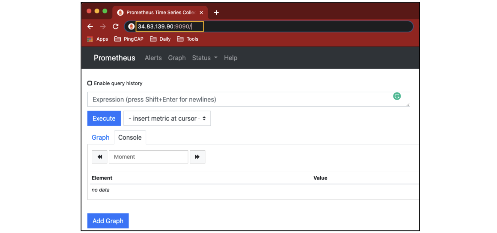
<div class="caption-center"> Prometheus Dashboard </div>

### MySQL Client

In [Part 1](https://pingcap.com/blog/how-to-deploy-tidb-on-google-cloud-platform-part-1), we installed a MySQL Client on the GCP Instance. Now, let's use the MySQL Client to connect to TiDB.

TiDB SQL interface default port is 4000.

From our GCP instance, run the following command. This command will start a MySQL Client and connect to 127.0.0.1 (localhost) on port 4000 with the username `root`:

```
mysql -h 127.0.0.1 -P 4000 -u root
```

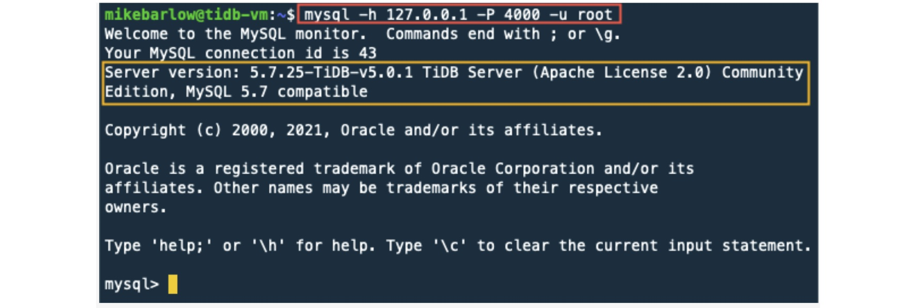

Now we should have a `mysql>` prompt. Let's run a few commands:

```
SELECT VERSION();
```

```
SHOW DATABASES;
```

```
exit
```

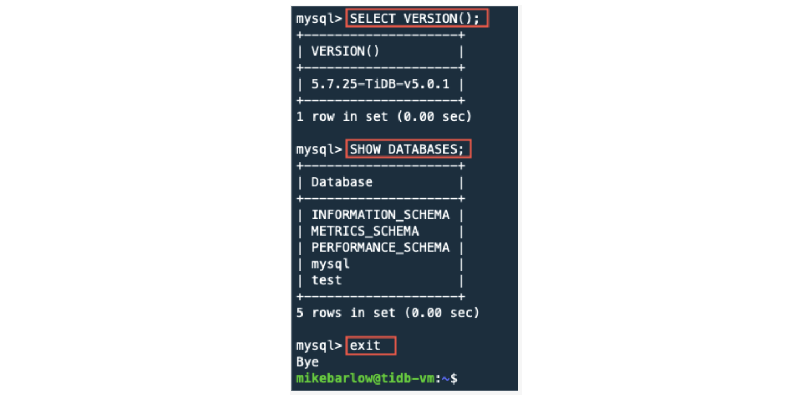

If you already have a MySQL Client or other tool, you can use it to access TiDB over port 4000. Just remember to use the GCP instance public IP address.

## Wrap up

**Congratulations! You have gotten a simple TiDB cluster up and running.** Now, you can access monitoring tools that include TiDB Dashboard, Grafana, and Prometheus. 

You now have a foundation to learn more about TiDB and try things out.

If you are done with the GCP instance, you can tear it down by following the steps below.

## Tear down

The easiest way to tear down this environment is by deleting the GCP instance.

From our local computer, let's get a list of GCP instances. We will then destroy (delete) the tidb-vm instance and then confirm the instance has been deleted.

From your local computer, run the following gcloud commands.

The delete command may take a few minutes to complete.

```
tiup cluster list
```

```
tiup cluster destroy tidb-test
```

```
tiup cluster list
```

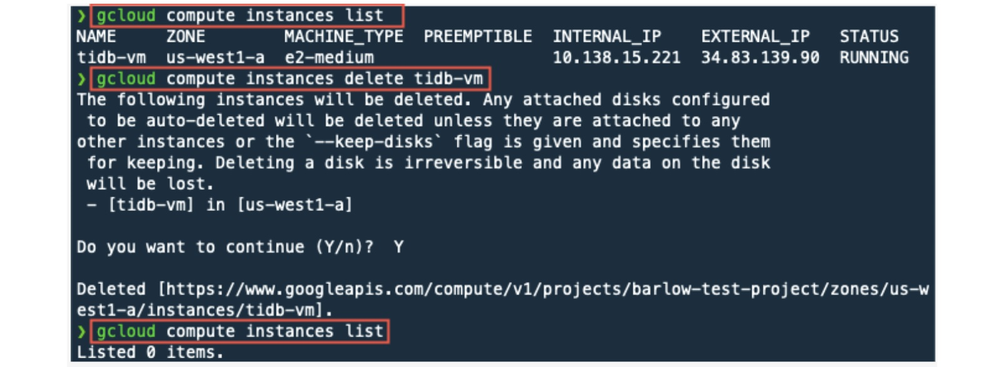

Let's remove the firewall rule that we created. In the commands below, we first get a list of firewall rules. Then, we delete the firewall rule access-from-home, and then validate that the rule was deleted.

```
gcloud compute firewall-rules list
```

```
gcloud compute firewall-rules delete access-from-home
```

```
gcloud compute firewall-rules list
```

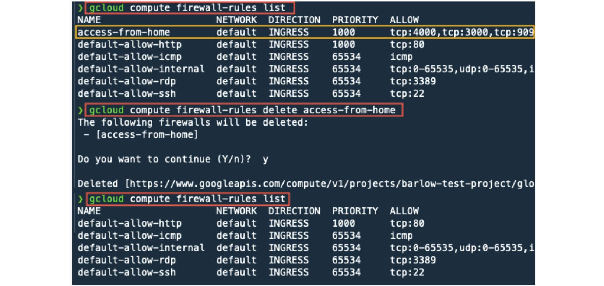

Your GCP environment should be cleaned up and back to its original state.
