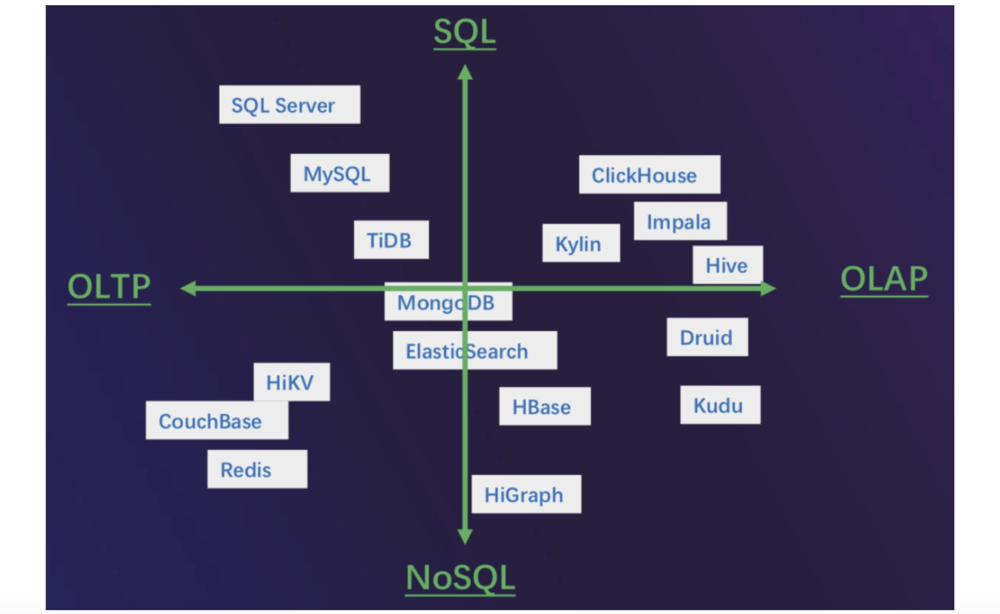
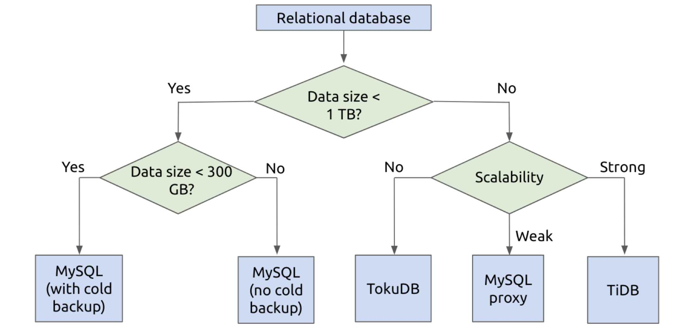
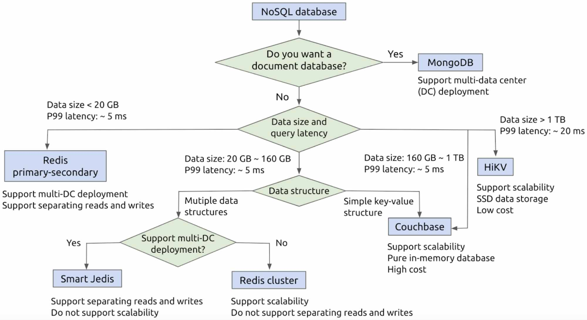

**Author:** Leitao Guo (Database and middleware manager at iQIYI)

**Transcreator:** [Caitin Chen](https://github.com/CaitinChen); **Editor:** Tom Dewan

Finding the right database solution for your application is not easy. At [iQIYI](https://en.wikipedia.org/wiki/IQIYI), one of the largest online video sites in the world, we're experienced in database selection across several fields: Online Transactional Processing (OLTP), Online Analytical Processing (OLAP), Hybrid Transaction/Analytical Processing (HTAP), SQL, and NoSQL.

Today, I'll share with you:

* [What criteria to use for selecting a database](#database-selection-criteria)
* [What databases we use at iQIYI](#what-databases-we-use-at-iqiyi)
* [Some decision models to help you efficiently pick a database](#practical-decision-trees-for-efficiently-choosing-a-database)
* [Tips for choosing your database](#tips-for-choosing-a-database)

I hope this post can help you easily find the right database for your applications.

## Database selection criteria

When choosing a database, different people use different criteria:

* Database procurement staff pay more attention to **purchase costs, including storage and network requirements**.

* Database administrators (DBAs) care about:

    * **Operation and maintenance costs**:

        * A reliable monitoring and alerting system
        * Support for backup and restore
        * Reasonable upgrade and migration costs
        * An active support community
        * Ease of performance tuning
        * Ease of troubleshooting

    * **Service stability:**

        * Support for multiple data replicas
        * Highly available services
        * Support for multiple writes and multi-active architecture

    * **Performance:**

        * Latency
        * Queries per second (QPS)
        * Whether it supports more advanced hierarchical storage features

    * **Scalability:** Whether it's easy to scale horizontally and vertically

    * **Security:** Whether it meets audit requirements and prevents SQL injections and information leakage

* Application developers care about:

    * **Stable services**
    * **Performance**
    * **Scalability**
    * **Ease of developing database interface**
    * **Ease of modifying the database schema**

## What databases we use at iQIYI

At iQIYI, we mainly use these databases:

* MySQL
* [TiDB](https://docs.pingcap.com/tidb/stable/overview)
* Redis
* Couchbase
* Big data analytical systems, like Hive and Impala
* Other databases, like MongoDB, HiGraph, and HiKV

Because there are so many types of databases at iQIYI, application developers might not know which database is suitable for their application scenario. Therefore, we categorized these databases by application scenario and database interface, and we built a matrix:

* The X-axis represents application scenarios: OLTP vs. OLAP.
* The Y-axis represents database interfaces: SQL vs. NoSQL.

 All databases at iQIYI 

This matrix has these characteristics:

* On the left

    * In the upper left corner

        Databases support OLTP workloads and the SQL language. For example, MySQL supports different transaction isolation levels, high QPS, and low latency. We mainly use it to store transaction information and critical data, such as orders and VIP information.

    * In the lower left corner

        We use NoSQL databases to optimize special scenarios. Generally, these databases have simple schemas or they are schemaless with high throughput and low latency. We mainly use them as caches or key-value (KV) databases.

* On the right

    All are OLAP big data analytical systems, such as ClickHouse and Impala. Generally, they support the SQL language and don't support transactions. They have good scalability and long response latency. We can add machines to enlarge data storage capacity, and the response delay is longer.

* Around the two axes' meeting point

    These databases are neutral, and we call them HTAP databases, such as TiDB. When the amount of data is small, they have good performance. When the data size is large or the queries are complex, their performance is not bad. Generally, to meet different application needs, we use different storage engines and query engines.

  <a href="/download" onclick="trackViews('How to Efficiently Choose the Right Database for Your Applications', 'download-tidb-btn-middle')"><button>Download TiDB</button></a>
  <a href="https://share.hsforms.com/1e2W03wLJQQKPd1d9rCbj_Q2npzm" onclick="trackViews('How to Efficiently Choose the Right Database for Your Applications', 'subscribe-blog-btn-middle')"><button>Subscribe to Blog</button></a>
  

## Practical decision trees for efficiently choosing a database

I'd like to recommend our database selection trees. We developed these trees based on our DBAs' and application developers' experience.

### How to efficiently choose a relational database

When you select a relational database, you can:

1. Consider your data volume and database scalability.

2. Make a decision based on:

    * Whether the database has a cold backup system
    * Whether to use the TokuDB storage engine
    * Whether to use a proxy

 Efficiently choosing a relational database 

### How to efficiently choose a NoSQL database

When we choose a NoSQL database, we must consider many factors to decide whether to use the primary-secondary framework, client sharding, distributed cluster, Couchbase, or HiKV.

 Efficiently choosing a NoSQL database 

## Tips for choosing a database

I'd like to share with you some tips for selecting a database:

* **Try to solve the problems without changing the database first.** You can determine your requirements based on data volume, QPS, and latency, but are these the real requirements? Can you find a way to eliminate this requirement without involving the database? For example, if the data volume is high, you can encode or compress data first, and that may reduce the data size. Don't push all your requirements down to the database level.
* **Consider what the real reason is for choosing a database.** Do you choose it because it's popular? Or because it's advanced? The most important question is: can it really solve your problem? For example, if your data volume is not very large, you don't need a system with a lot of storage.
* **Think carefully before you give up on a solution.** Are you abandoning a system because it doesn't work? Or because you're not using it properly? It's difficult to get rid of your solution, so be clear about why you're giving up on it. For example, before you make a decision, compare your TPC-C or Sysbench benchmarks.
* **Keep a good attitude towards self-development.** When you need to develop your own database, you can refer to and use some mature products. Don't build things from scratch if you don't need to.
* **Embrace open-source products.** For example, [TiDB](https://docs.pingcap.com/tidb/stable/overview) is an open-source, distributed SQL database. It has an active community, and currently has 26,000 stars on [GitHub](https://github.com/pingcap/tidb). Our previous post described how TiDB helped us [scale out our database and achieve high availability](https://pingcap.com/case-studies/tidb-in-iqiyi). Currently, in the production environment, we have 88 TiDB clusters, with more than 1,200 nodes. There's no reason why you have to go it alone.
