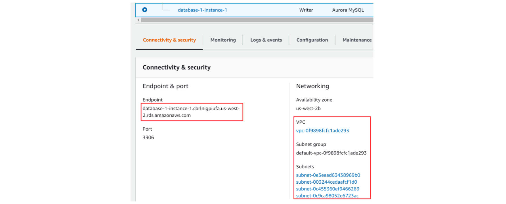
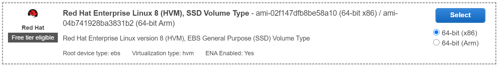
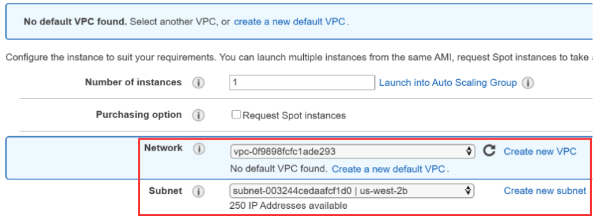
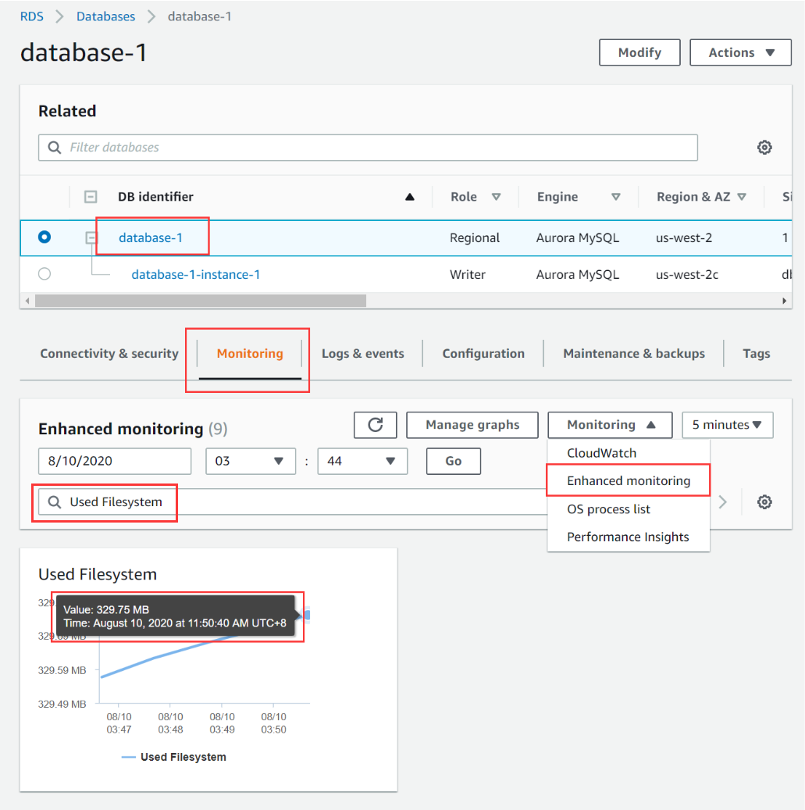
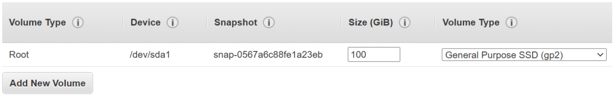
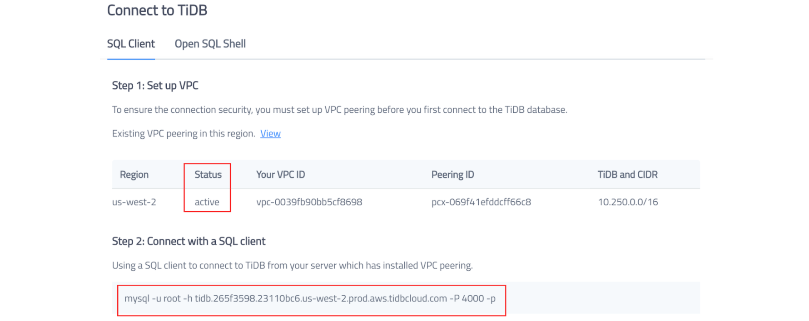

**Author:** [Yiwen Chen](https://github.com/handlerww)

**Transcreator:** [Caitin Chen](https://github.com/CaitinChen); **Editor:** Tom Dewan


[TiDB](https://docs.pingcap.com/tidb/stable/overview) is an open-source, distributed SQL database that supports [Hybrid Transactional/Analytical Processing](https://en.wikipedia.org/wiki/HTAP) (HTAP) workloads. TiDB Cloud is a fully-managed TiDB service delivered by [PingCAP](https://pingcap.com/) and is the easiest, most economical, and most resilient way to unlock the full power of TiDB in the cloud.

You can smoothly migrate data to TiDB from any MySQL-compatible database. In this article, we'll show you how to migrate your data from Amazon Aurora MySQL to [TiDB Cloud](https://pingcap.com/products/tidbcloud) using the open-source [Dumpling](https://docs.pingcap.com/tidb/stable/dumpling-overview) and [TiDB Lightning](https://docs.pingcap.com/tidb/stable/tidb-lightning-overview) tools. Dumpling _exports_ data from any MySQL-compatible database, and TiDB Lightning _imports_ it into TiDB.

To migrate data, do the following:

1. Make sure your environment meets the [migration prerequisites](#migration-prerequisites).
2. [Prepare your working environment](#prepare-the-working-environment-for-data-migration).
3. Create an Amazon's Elastic Compute Cloud (EC2) instance in which to run the migration tools.
4. Use Dumpling to export the data from Amazon Aurora.
5. Use TiDB to import the data to TiDB Cloud.

> **Note:**
>
> Because TiDB is highly compatible with MySQL databases, you can use any MySQL-native tool to perform the migration. For example, you can use the MySQL command-line client to import the output of `mysqldump` into TiDB; however, this approach performs considerably worse than the one we use in this article.

## Migration prerequisites

### Amazon Aurora MySQL database requirements

Confirm whether TiDB supports the collations of the tables you want to migrate. The default character set in TiDB is `utf8mb4`, which matches the default in MySQL 8.0 and above. TiDB differs from MySQL and defaults to using a binary collation. This binary collation uses a case-insensitive collation. Currently, TiDB supports the following character sets:

* `utf8`
* `utf8mb4`
* `ASCII`
* `latin1`
* `binary`

TiDB supports the following collations:

* `ascii_bin`
* `binary`
* `latin1_bin`
* `utf8mb4_general_bin`
* `utf8_general_bin`

You can learn more about [Character Sets and Collations](https://docs.pingcap.com/tidb/stable/character-set-and-collation) in the TiDB documentation. To verify which character set you're using, follow the steps in [Check the database character set settings](#check-the-database-collation-settings).

### Stop writing data while exporting data to the Aurora database

To keep data consistency, you must stop writing data to Aurora. This is because Amazon Aurora does not support `GLOBAL READ LOCK`. The easiest way is to avoid writing data while you are exporting it. For more details, see this [Amazon support article](https://aws.amazon.com/premiumsupport/knowledge-center/mysqldump-error-rds-mysql-mariadb/?nc1=h_ls).

### TiDB Cloud cluster requirements

When you use TiDB Cloud, we recommend that you use the T1.standard cluster type or above. Otherwise, the data import may fail.

### EC2 instance to run tools for migration

You will be running the migration tools in an EC2 instance that is in the same cloud region as Aurora and TiDB Cloud. Make sure the instance meets the following requirements:

* Network access
    * Launch the instance in the same Virtual Private Cloud (VPC) as your Amazon Aurora service.
    * Set up VPC peering between TiDB Cloud and the VPC of your EC2 instance. For details, refer to [Set Up VPC Peering Connections](https://docs.pingcap.com/tidbcloud/beta/set-up-vpc-peering-connections).
* Storage
    * Based on the size of your database, specify the Elastic Block Store (EBS) capacity. The backup files are temporarily stored on a storage volume. The free disk of the volume should be larger than the size of the database.
* Computing resources
    * In this article, we use a [t2.large](https://aws.amazon.com/ec2/instance-types/t2/) instance and a Red Hat® Enterprise Linux® (RHEL) image. You'll do all the operations described in this document on this AWS EC2 machine. If you need to migrate large quantities of data and you are concerned about performance, you may choose a better-performing EC2 instance.

## Prepare the working environment for data migration

### Ensure Amazon Aurora is accessible

From the same VPC as your Amazon Aurora instance, launch the EC2 instance. You will use the endpoint that Amazon Aurora provides. You can get the access information from the **Aurora MySQL Connectivity & security** page.



### Launch the EC2 instance

In this section, we'll prepare an EC2 instance to run the migration tools. You need to pay attention to two issues:

* The instance should be in the same VPC as your Amazon Aurora service. This helps you smoothly connect to Amazon Aurora.
* Ensure that the free disk space is larger than the size of your data.

If you are familiar with these operations, you can skip this section, and continue with "[Check the connectivity with the Amazon Aurora database](#check-the-connectivity-with-the-amazon-aurora-database)."

Based on the [Amazon User Guide for Linux Instances](https://docs.aws.amazon.com/AWSEC2/latest/UserGuide/EC2_GetStarted.html), the process to launch an instance includes these steps:

1. Open the [Amazon EC2 console](https://console.aws.amazon.com/ec2/). Choose **Launch Instances**.
2. Choose an Amazon Machine Image (AMI). In this procedure, we use the AMI named Red Hat Enterprise Linux 8 (HVM), SSD Volume Type.

    

3. On the **Choose an Instance Type** page, choose t2.large.

    

4. Configure the instance details. Based on the network details of your Amazon Aurora service, choose the network and subnet.

    

5. On the **Add storage** page, we need to set the size of the volume. The size of the storage should be larger than the size of your source database. The Amazon Aurora dashboard displays the amount of used space on the volume.

    

    Based on this information, specify the total size of your storage. If you do not have enough free space, the data export may fail.

    

6. Click **Review and Launch**.
7. On the **Review** page, click **Launch**.
8. On the **Select an existing key pair or create a new key pair** dialog box, choose **Create a new key pair** or **Choose an existing key pair** and click **Launch Instances**. If you choose **Create a new key pair**, click **Download Key Pair** and make sure that the key is accessible.

For more details on how to launch an EC2 instance, see [AWS EC2 Get Started Guide](https://docs.aws.amazon.com/AWSEC2/latest/UserGuide/EC2_GetStarted.html).

### Check the connectivity with the Amazon Aurora database

After you launch the instance, connect it to the Amazon Aurora database. To check the connectivity with Aurora, first install the MySQL client:



```shell
sudo yum install -y mysql
# Replace the endpoint with your Aurora database endpoint
mysql -h database-1-instance-1.cbrlnigpiufa.us-west-2.rds.amazonaws.com -u admin -p --ssl-mode=DISABLED
```

A MySQL terminal is displayed. In the output, the welcome message indicates that you are connected to the Amazon Aurora database.

```shell
[ec2-user@ip-172-30-1-86 ~]$ mysql -h database-1-instance-1.cbrlnigpiufa.us-west-2.rds.amazonaws.com -u admin -p --ssl-mode=DISABLED
Enter password:
Welcome to the MySQL monitor.  Commands end with ; or \g.
Your MySQL connection id is 24
Server version: 5.6.10 MySQL Community Server (GPL)

Copyright (c) 2000, 2019, Oracle and/or its affiliates. All rights reserved.

Oracle is a registered trademark of Oracle Corporation and/or its
affiliates. Other names may be trademarks of their respective
owners.

Type 'help;' or '\h' for help. Type '\c' to clear the current input statement.

mysql>
```

### Check the database collation settings

For your convenience, we need to verify the collation settings of the database. You can execute these commands in the MySQL terminal to your Amazon Aurora instance.



```sql
select * from ((select table_schema, table_name, column_name, collation_name from information_schema.columns where character_set_name is not null) union all (select table_schema, table_name, null, table_collation from information_schema.tables)) x where table_schema not in ('performance_schema', 'mysql', 'information_schema') and collation_name not in ('utf8_bin', 'utf8mb4_bin', 'ascii_bin', 'latin1_bin', 'binary', 'utf8_general_ci', 'utf8mb4_general_ci');
```

The result shows an `Empty set`, which means the database is suitable to migrate to TiDB.

```shell
Empty set (0.04 sec)
```

If TiDB doesn't support the collations that you're using, convert your collations to supported types. For more information on collation settings, see [Character Sets and Collations](https://docs.pingcap.com/tidb/stable/character-set-and-collation).

### Set up VPC peering for network access to TiDB Cloud

For security purposes, you need to add VPC peering to connect your network and TiDB Cloud. If you have not done this, see [Set Up VPC Peering Connections](https://docs.pingcap.com/tidbcloud/beta/set-up-vpc-peering-connections).

When you complete the steps above, VPC peering is activated. You can connect to the TiDB cluster with the information below.





```shell
mysql -h tidb.265f3598.23110bc6.us-west-2.prod.aws.tidbcloud.com -P 4000 -p
```

After you connect successfully, you can start the migration process.

## Migrate data from Amazon Aurora to TiDB Cloud

### Export data from the source database

The TiDB Toolkit package includes Dumpling and TiDB Lighting.

1. Download the TiDB Toolkit using the following commands.

    

    ```shell
    mkdir tidb-toolkit-latest-linux-amd64 && \
    wget -qO- https://download.pingcap.org/tidb-toolkit-latest-linux-amd64.tar.gz|tar -xzv -C tidb-toolkit-latest-linux-amd64 --strip-components 1
    ```

2. Use Dumpling to export the data from Amazon Aurora. Based on your environment, replace the content in angle brackets (`<>`), and then execute the following commands.

    

    ```shell
    export_username=<Aurora username>
    export_password=<Aurora password>
    export_endpoint=<the endpoint for Amazon Aurora MySQL>
    backup_dir=<backup directory>

    ./tidb-toolkit-latest-linux-amd64/bin/dumpling \
      -u "$export_username" \
      -p "$export_password" \
      -P 3306 \
      -h "$export_endpoint" \
      --filetype sql \
      --threads 8 \
      -o "$backup_dir" \
      -f "*.*" -f '!/^(mysql|INFORMATION_SCHEMA|PERFORMANCE_SCHEMA|METRICS_SCHEMA|INSPECTION_SCHEMA)$/.*' \
      --consistency="none" \
      -F 256MiB
    ```

### Import data into TiDB Cloud

To import data into TiDB Cloud, replace the content included in angle brackets based on your TiDB Cloud cluster settings, and execute the following commands. If the size of your data is too large, you could use `tmux` or `nohup` to keep the TiDB Lightning process up.

For security purposes, the TiKV backend isn't exposed to the customer. For now, we use TiDB Lightning's TiDB-backend mode to import data.



```shell
backup_dir=<backup directory>
tidb_endpoint=<endpoint of the cluster in TiDB Cloud>
tidb_username=<TiDB username>
tidb_password=<TiDB password>
tidb_port=<TiDB port>

./tidb-toolkit-latest-linux-amd64/bin/tidb-lightning --backend tidb -check-requirements=false \
-d=$backup_dir \
-server-mode=false \
-tidb-host="$tidb_endpoint" \
-tidb-port="$tidb_port" \
-tidb-user="$tidb_username" \
-tidb-password="$tidb_password"
```

> **Note:**
>
> If you manually interrupt TiDB Lightning, a checkpoint will be created to help to identify where to resume the restore process. If you encounter any problems that cannot be fixed automatically, refer to [TiDB Lightning Checkpoints](https://docs.pingcap.com/tidb/stable/tidb-lightning-checkpoints).

When the `tidb-lightning` process completes, The TiDB cluster on TiDB Cloud will have the same structure and data as the Aurora source cluster.

## Conclusion

In this article, we showed how to do a full-data migration from Amazon Aurora to TiDB Cloud using Dumpling and TiDB Lightning. After the migration, the data and structure is the same on both TiDB Cloud and in the Aurora source cluster. Full-data migration is especially useful if you want to verify TiDB Cloud's features using a copy of your Amazon Aurora data. We sincerely hope you found this article helpful.

And stay tuned. In a future article, we'll be discussing _incremental replication_.
