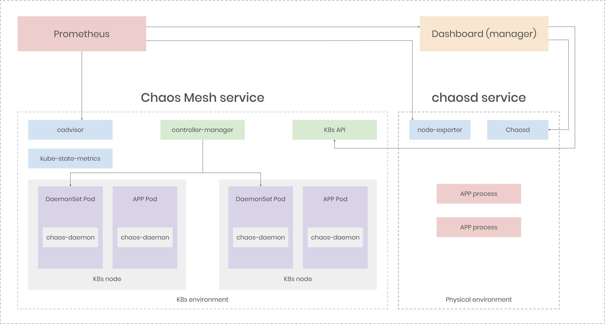

**Author:** [Xiang Wang](https://github.com/WangXiangUSTC) (Committer of Chaos Mesh, Engineer at PingCAP)

**Transcreator:** [Yajing Wang](https://github.com/anotherrachel); **Editor:** Tom Dewan


[Chaos Mesh®](https://github.com/chaos-mesh/chaos-mesh) is a cloud-native Chaos Engineering platform that orchestrates chaos in Kubernetes environments. With Chaos Mesh, you can simulate a variety of failures, and use Chaos Dashboard, a web UI, to manage chaos experiments directly. Since it was open-sourced, Chaos Mesh has been adopted by many companies to ensure their systems' resilience and robustness. But over the past year, we have frequently heard requests from the community asking how to run chaos experiments when the services are not deployed on Kubernetes.

## What is chaosd

To meet the growing needs of chaos testing on physical machines, we are excited to present an enhanced toolkit called chaosd. You might find the name familiar. That's because it evolved from `chaos-daemon`, a key component in Chaos Mesh. At TiDB Hackathon 2020, we [refactored chaosd to make it more than a command-line tool](https://en.pingcap.com/blog/chaos-mesh-remake-one-step-closer-toward-chaos-as-a-service#refactor-chaosd). Now with [chaosd v1.0.1](https://github.com/chaos-mesh/chaosd/releases/tag/v1.0.1), you can simulate specific errors that target physical machines, and then, undo the chaos experiments like nothing had happened.

## Benefits of chaosd

chaosd has the following advantages:

* **Easy-to-use**: You can easily create and manage chaos experiments with chaosd commands.

* **Various fault types**: You can simulate faults to be injected on physical machines at different levels, including process faults, network faults, Java Virtual Machine (JVM) application faults, stress scenarios, disk faults, and host faults.

* **Multiple work modes**: You can use chaosd as a command-line tool or as a service.

Without further ado, let's give it a try.

## How to use chaosd

In this section, I will walk you through how to inject a network fault with chaosd. Your Linux kernel version must be v2.17 or later.

### 1. Download and unzip chaosd

To download chaosd, run the following command:

```bash
curl -fsSL -o chaosd-v1.0.1-linux-amd64.tar.gz https://mirrors.chaos-mesh.org/chaosd-v1.0.1-linux-amd64.tar.gz
```

Unzip the file. It contains two file folders:

* `chaosd` contains the tool entry of chaosd.

* `tools` contains the tools needed to perform the chaos experiment, including [stress-ng](https://wiki.ubuntu.com/Kernel/Reference/stress-ng) (to simulate stress scenarios), [Byteman](https://github.com/chaos-mesh/byteman) (to simulate JVM application faults), and PortOccupyTool (to simulate network faults).

### 2. Create a chaos experiment

In this chaos experiment, the server will be unable to access [chaos-mesh.org](http://chaos-mesh.org).

Run the following command:

```bash
sudo ./chaosd attack network loss --percent 100 --hostname chaos-mesh.org --device ens33
```

Example output:

```bash 
Attack network successfully, uid: c55a84c5-c181-426b-ae31-99c8d4615dbe
```

In this simulation, the ens33 network interface card cannot send network packets to or receive packets from chaos-mesh.org. The reason why you have to use `sudo` commands is that the chaos experiment modifies network rules, which require root privileges.

Also, don't forget to save the `uid` of the chaos experiment. You'll be entering that later as part of the recovery process. 

### 3. Verify the results

Use the `ping` command to see if the server can access chaos-mesh.org:

```bash
ping chaos-mesh.org
PING chaos-mesh.org (185.199.109.153) 56(84) bytes of data. 
```

When you execute the command, it's very likely that the site won't respond. Press `CTRL`+`C` to stop the ping process. You should be able to see the statistics of the `ping` command: `100% packet loss`.

Example output:

```bash 
2 packets transmitted, 0 received, 100% packet loss, time 1021ms
```

### 4. Recover the experiment

To recover the experiment, run the following command:

```bash
sudo ./chaosd recover c55a84c5-c181-426b-ae31-99c8d4615dbe
```

Example output:

```bash
Recover c55a84c5-c181-426b-ae31-99c8d4615dbe successfully
```

In this step, you also need to use `sudo` commands because root privileges are required. When you finish recovering the experiment, try to ping chaos-mesh.org again to verify the connection.

## Next steps

### Support dashboard web

As you can see, chaosd is fairly easy to use. But we can make it easier—a dashboard web for chaosd is currently under extensive development.

We will continue to enhance its usability and implement more functionalities such as managing chaos experiments run with chaosd as well as those run with Chaos Mesh. This will provide a consistent and unified user experience for chaos testing on Kubernetes and physical machines. The architecture below is just a simple example:


<div class="caption-center"><a href="chaos-mesh-remake-one-step-closer-toward-chaos-as-a-service.md#developing-chaos-mesh-towards-caas" target="_blank">Chaos Mesh's optimized architecture</a></div>

### Add more fault injection types

Currently, chaosd provides six fault injection types. We plan to develop more types that have been supported by Chaos Mesh, including HTTPChaos and IOChaos.

If you are interested in helping us improve chaosd, you are welcome to [pick an issue](https://github.com/chaos-mesh/chaosd/labels/help%20wanted) and get started!

## Try it out!

If you are interested in using chaosd and want to explore more, check out the [documentation](https://chaos-mesh.org/docs/chaosd-overview). If you come across an issue when you run chaosd, or if you have a feature request, feel free to [create an issue](https://github.com/chaos-mesh/chaosd/issues). We would love to hear your voice!
