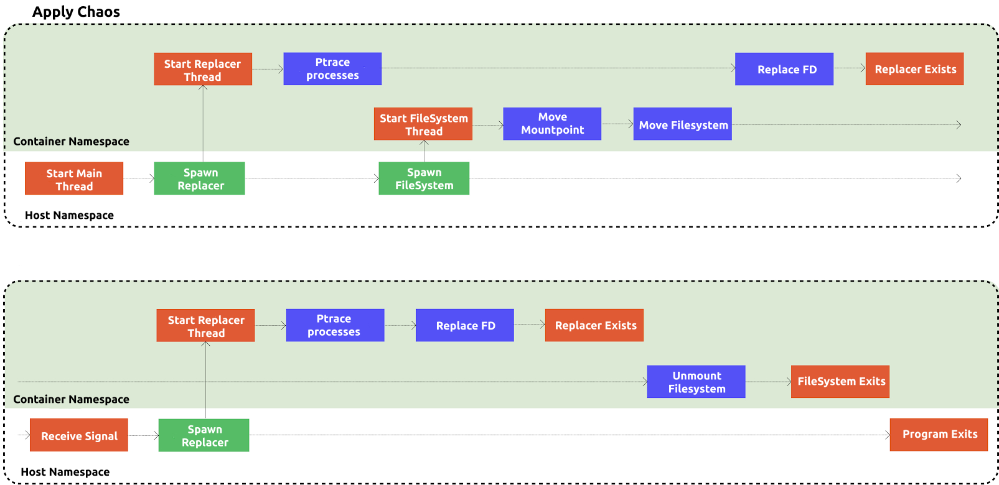

**Author:** Ke'ao Yang (Software Engineer at PingCAP)

**Transcreator:** [Tom Xiong](https://github.com/TomShawn); **Editor:** Tom Dewan

In a production environment, filesystem faults might occur due to various incidents such as disk failures and administrator errors. As a Chaos Engineering platform, [Chaos Mesh](https://pingcap.com/blog/chaos-mesh-your-chaos-engineering-solution-for-system-resiliency-on-kubernetes) has supported simulating I/O faults in a filesystem ever since its early versions. By simply adding an IOChaos CustomResourceDefinition (CRD), we can watch how the filesystem fails and returns errors.

However, before Chaos Mesh 1.0, this experiment was not easy and may have consumed a lot of resources. We needed to inject sidecar containers to the Pod through the mutating admission webhooks and rewrite the `ENTRYPOINT` command. Even if no fault was injected, the injected sidecar container caused a substantial amount of overhead.

Chaos Mesh 1.0 has changed all this. Now, we can use IOChaos to inject faults to a filesystem at runtime. This simplifies the process and greatly reduces system overhead. This blog post introduces how we implement the IOChaos experiment without using a sidecar.

## I/O fault injection

To simulate I/O faults at runtime, we need to inject faults into a filesystem after the program starts [system calls](https://man7.org/linux/man-pages/man2/syscall.2.html) (such as reads and writes) but before the call requests arrive at the target filesystem. We can do that in one of two ways:

+ Use Berkeley Packet Filter (BPF); however, it [cannot be used to inject delay](https://github.com/iovisor/bcc/issues/2336).
+ Add a filesystem layer called ChaosFS before the target filesystem. ChaosFS uses the target filesystem as the backend and receives requests from the operating system. The entire call link is **target program syscall** -> **Linux kernel** -> **ChaosFS** -> **target filesystem**. Because ChaosFS is customizable, we can inject delays and errors as we want. Therefore, ChaosFS is our choice.

But ChaosFS has several problems:

+ If ChaosFS reads and writes files in the target filesystem, we need to [mount](https://man7.org/linux/man-pages/man2/mount.2.html) ChaosFS to a different path than the target path specified in the Pod configuration. ChaosFS **cannot** be mounted to the path of the target directory.
+ We need to mount ChaosFS **before** the target program starts running. This is because the newly-mounted ChaosFS takes effect only on files that are newly opened by the program in the target filesystem.
+ We need to mount ChaosFS to the target containter's `mnt` namespace. For details, see [mount_namespaces(7) — Linux manual page](https://man7.org/linux/man-pages/man7/mount_namespaces.7.html).

Before Chaos Mesh 1.0, we used the [mutating admission webhook](https://kubernetes.io/docs/reference/access-authn-authz/extensible-admission-controllers/) to implement IOChaos. This technique addressed the three problems lists above and allowed us to:

+ Run scripts in the target container. This action changed the target directory of the ChaosFS's backend filesystem (for example, from `/mnt/a` to `/mnt/a_bak`) so that we could mount ChaosFS to the target path (`/mnt/a`).
+ Modify the command that starts the Pod. For example, we could modify the original command `/app` to `/waitfs.sh /app`.
+ The `waitfs.sh` script kept checking whether the filesystem was successfully mounted. If it was mounted, `/app` was started.
+ Add a new container in the Pod to run ChaosFS. This container needed to share a volume with the target container (for example, `/mnt`), and then we mounted this volume to the target directory (for example, `/mnt/a`). We also properly enabled [mount propagation](https://kubernetes.io/docs/concepts/storage/volumes/#mount-propagation) for this volume's mount to penetrate the share to host and then penetrate slave to the target.

These three approaches allowed us to inject I/O faults while the program was running. However, the injection was far from convenient:

+ We could only inject faults into a volume subdirectory, not into the entire volume. The workaround was to replace `mv` (rename) with `mount move` to move the mount point of the target volume.
+ We had to explicitly write commands in the Pod rather than implicitly use the image commands. Otherwise, the `/waitfs.sh` script could not properly start the program after the filesystem was mounted.
+ The corresponding container needed to have a proper configuration for mount propagation. Due to potential privacy and security issues, we **could not** modify the configuration via the mutating admission webhook.
+ The injection configuration was troublesome. Worse still, we had to create a new Pod after the configuration was able to inject faults.
+ We could not withdraw ChaosFS while the program was running. Even if no fault or error was injected, the performance was greatly affected.

## Inject I/O faults without the mutating admission webhook

What about cracking these tough nuts without the mutating admission webhook? Let's get back and think a bit about the reason why we used the mutating admission webhook to add a container in which ChaosFS runs. We do that to mount the filesystem to the target container.

In fact, there is another solution. Instead of adding containers to the Pod, we can first use the `setns` Linux system call to modify the namespace of the current process and then use the `mount` call to mount ChaosFS to the target container. Suppose that the filesystem to inject is `/mnt`. The new injection process is as follows:

1. Use `setns` for the current process to enter the mnt namespace of the target container.
2. Execute `mount --move` to move `/mnt` to `/mnt_bak`.
3. Mount ChaosFS to `/mnt` and use `/mnt_bak` as the backend.

After the process is finished, the target container will open, read, and write the files in `/mnt` through ChaosFS. In this way, delays or faults are injected much more easily. However, there are still two questions to answer:

+ How do you handle the files that are already opened by the target process?
+ How do you recover the process given that we cannot unmount the filesystem when files are opened?

### Dynamically replace file descriptors

**ptrace solves both of the two questions above.** We can use ptrace to replace the opened file descriptors (FD) at runtime and replace the current working directory (CWD) and mmap.

#### Use ptrace to allow a tracee to run a binary program

[ptrace](https://man7.org/linux/man-pages/man2/ptrace.2.html) is a powerful tool that makes the target process (tracee) to run any system call or binary program. For a tracee to run the program, ptrace modifies the RIP-pointed address to the target process and adds an `int3` instruction to trigger a breakpoint. When the binary program stops, we need to restore the registers and memory.

> **Note:**
>
> In the [x86_64 architecture](https://en.wikipedia.org/wiki/X86_assembly_language), the RIP register (also called an instruction pointer) always points to the memory address at which the next directive is run.

To load the program into the target process memory spaces:

1. Use ptrace to call mmap in the target program to allocate the needed memory.
2. Write the binary program to the newly allocated memory and make the RIP register point to it.
3. After the binary program stops, call munmap to clean up the memory section.

As a best practice, we often replace ptrace `POKE_TEXT` writes with `process_vm_writev` because if there is a huge amount of data to write, `process_vm_writev` performs more efficiently.

Using ptrace, we are able to make a process to replace its own FD. Now we only need a method to make that replacement happen. This method is the `dup2` system call.

  <a href="https://share.hsforms.com/1e2W03wLJQQKPd1d9rCbj_Q2npzm" onclick="trackViews('How to Simulate I/O Faults at Runtime', 'subscribe-blog-btn-middle')"><button>Subscribe to Blog</button></a>

#### Use `dup2` to replace file descriptor

The signature of the `dup2` function is `int dup2(int oldfd, int newfd);`. It is used to create a copy of the old FD (`oldfd`). This copy has an FD number of `newfd`. If `newfd` already corresponds to the FD of an opened file, the FD on the file that's already opened is automatically closed.

For example, the current process opens `/var/run/__chaosfs__test__/a` whose FD is `1`. To replace this opened file with `/var/run/test/a`, this process performs the following operations:

1. Uses the `fcntl` system call to get the `OFlags` (the parameter used by the `open` system call, such as `O_WRONLY`) of `/var/run/__chaosfs__test__/a`.
2. Uses the `Iseek` system call to get the current location of `seek`.
3. Uses the `open` system call to open `/var/run/test/a` using the same `OFlags`. Assume that the FD is `2`.
4. Uses `Iseek` to change the `seek` location of the newly opened FD `2`.
5. Uses `dup2(2, 1)` to replace the FD `1` of `/var/run/__chaosfs__test__/a` with the newly opened FD `2`.
6. Closes FD `2`.

After the process is finished, FD `1` of the current process points to `/var/run/test/a`. So that we can inject faults, any subsequent operations on the target file go through the [Filesystem in Userspace](https://en.wikipedia.org/wiki/Filesystem_in_Userspace) (FUSE). FUSE is a software interface for Unix and Unix-like computer operating systems that lets non-privileged users create their own file systems without editing kernel code.

#### Write a program to make the target process replace its own file descriptor

The combined functionality of ptrace and dup2 makes it possible for the tracer to make the tracee replace the opened FD by itself. Now, we need to write a binary program and make the target process run it:

> **Note:**
>
> In the implementation above, we assume that:
>
> + The threads of the target process are POSIX threads and share the opened files.
> + When the target process creates threads using the `clone` function, the `CLONE_FILES` parameter is passed.
>
> Therefore, Chaos Mesh only replaces the FD of the first thread in the thread group.

1. Write a piece of assembly code according to the two sections above and the usage of syscall directives. [Here](https://github.com/chaos-mesh/toda/blob/1d73871d8ab72b8d1eace55f5222b01957193531/src/replacer/fd_replacer.rs#L133) is an example of the assembly code.
2. Use an assembler to translate the code into a binary program. We use [dynasm-rs](https://github.com/CensoredUsername/dynasm-rs) as the assembler.
3. Use ptrace to make the target process run this program.

When the program runs, the FD is replaced at runtime.

### Overall fault injection process

The following diagram illustrates the overall I/O fault injection process:

 Fault injection process 

In this diagram, each horizontal line corresponds to a thread that runs in the direction of the arrows. The **Mount/Umount Filesystem** and **Replace FD** tasks are carefully arranged in sequence. Given the process above, this arrangement makes a lot of sense.

## What's next

I've discussed how we implement fault injection to simulate I/O faults at runtime (see [chaos-mesh/toda](https://github.com/chaos-mesh/toda)). However, the current implementation is far from perfect:

+ Generation numbers are not supported.
+ ioctl is not supported.
+ Chaos Mesh does not immediately determine whether a filesystem is successfully mounted. It does so only after one second.

If you are interested in Chaos Mesh and would like to help us improve it, you're welcome to join [our Slack channel](https://slack.cncf.io/) or submit your pull requests or issues to our [GitHub repository](https://github.com/chaos-mesh/chaos-mesh).

This is the first post in a series on Chaos Mesh implementation. If you want to see how other types of fault injection are implemented, stay tuned.
