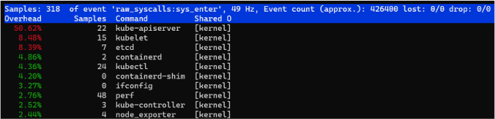
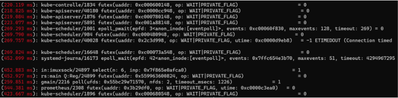
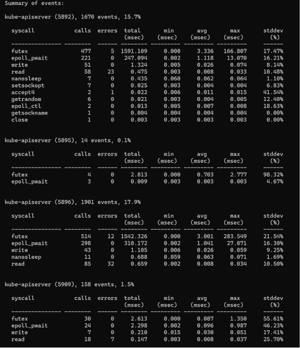
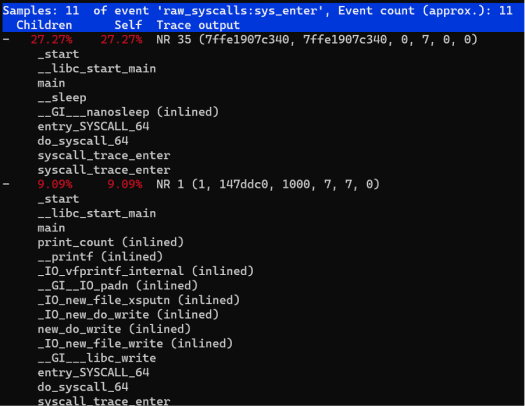
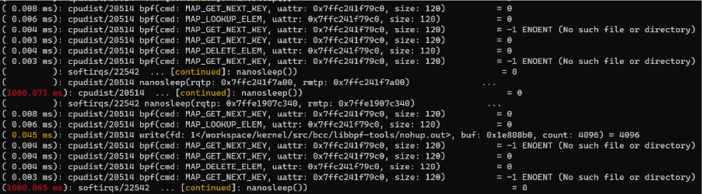
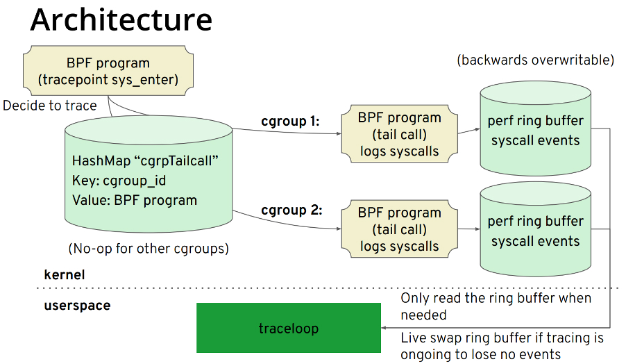
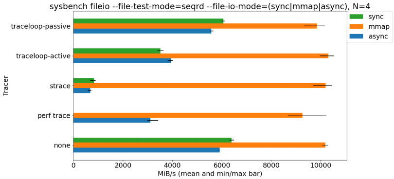

**Author:** [Wenbo Zhang](https://github.com/ethercflow) (Linux Kernel Engineer of the EE team at PingCAP)

**Transcreator:** [Tom Xiong](https://github.com/TomShawn); **Editor:** Tom Dewan


If you need to dynamically trace Linux process system calls, you might first consider strace. strace is simple to use and works well for issues such as "Why can't the software run on this machine?" However, if you're running a trace in a production environment, strace is NOT a good choice. It introduces a substantial amount of overhead. According to [a performance test](http://vger.kernel.org/~acme/perf/linuxdev-br-2018-perf-trace-eBPF/#/4/2) conducted by Arnaldo Carvalho de Melo, a senior software engineer at Red Hat, **the process traced using strace ran 173 times slower, which is disastrous for a production environment**.

So are there any tools that excel at tracing system calls in a production environment? The answer is YES. This blog post introduces perf and traceloop, two commonly used command-line tools, to help you trace system calls in a production environment.

## perf, a performance profiler for Linux

perf is a powerful Linux profiling tool, refined and upgraded by Linux kernel developers. In addition to common features such as analyzing Performance Monitoring Unit (PMU) hardware events and kernel events, perf has the following subcomponents:

+ sched: Analyzes scheduler actions and latencies.
+ timechart: Visualizes system behaviors based on the workload.
+ c2c: Detects the potential for false sharing. Red Hat once tested the c2c prototype on a number of Linux applications and found many cases of false sharing and cache lines on hotspots.
+ trace: Traces system calls with acceptable overheads. It performs only **1.36** times slower with workloads specified in the `dd` command.

Let's look at some common uses of perf.

+ To see which commands made the most system calls:

    

    ```shell
    perf top -F 49 -e raw_syscalls:sys_enter --sort comm,dso --show-nr-samples
    ```

    
    <div class="caption-center"> System call counts </div>

    From the output, you can see that the `kube-apiserver` command had the most system calls during sampling.

+ To see system calls that have latencies longer than a specific duration. In the following example, this duration is 200 milliseconds:

    

    ```shell
    perf trace --duration 200
    ```

    
    <div class="caption-center"> System calls longer than 200 ms </div>

    From the output, you can see the process names, process IDs (PIDs), the specific system calls that exceed 200 ms, and the returned values.

+ To see the processes that had system calls within a period of time and a summary of their overhead:

    

    ```shell
    perf trace -p $PID  -s
    ```

    
    <div class="caption-center"> System call overheads by process </div>

    From the output, you can see the times of each system call, the times of the errors, the total latency, the average latency, and so on.

+ To analyze the stack information of calls that have a high latency:

    

    ```shell
    perf trace record --call-graph dwarf -p $PID -- sleep 10
    ```

    
    <div class="caption-center"> Stack information of system calls with high latency </div>

+ To trace a group of tasks. For example, two BPF tools are running in the background. To see their system call information, you can add them to a `perf_event` cgroup and then execute `per trace`:

    

    ```shell
    mkdir /sys/fs/cgroup/perf_event/bpftools/
    echo 22542 >> /sys/fs/cgroup/perf_event/bpftools/tasks
    echo 20514 >> /sys/fs/cgroup/perf_event/bpftools/tasks
    perf trace -G bpftools -a -- sleep 10
    ```

    
    <div class="caption-center"> Trace a group of tasks </div>

Those are some of the most common uses of perf. If you'd like to know more (especially about perf-trace), see the [Linux manual page](https://man7.org/linux/man-pages/man1/perf-trace.1.html). From the manual pages, you will learn that perf-trace can filter tasks based on PIDs or thread IDs (TIDs), but that it has no convenient support for containers and the Kubernetes (K8s) environments. Don't worry. Next, we'll discuss a tool that can easily trace system calls in containers and in K8s environments that uses cgroup v2.

<div class="trackable-btns">
  <a href="https://share.hsforms.com/1e2W03wLJQQKPd1d9rCbj_Q2npzm" onclick="trackViews('How to Trace Linux System Calls in Production with Minimal Impact on Performance', 'subscribe-blog-btn-middle')"><button>Subscribe to Blog</button></a>
  </div>

## Traceloop, a performance profiler for cgroup v2 and K8s

Traceloop provides better support for tracing Linux system calls in the containers or K8s environments that use cgroup v2. You might be unfamiliar with traceloop but know BPF Compiler Collection (BCC) pretty well. (Its front-end is implemented using Python or C++.) In the IO Visor Project, BCC's parent project, there is another project named gobpf that provides Golang bindings for the BCC framework. Based on gobpf, traceloop is developed for environments of containers and K8s. The following illustration shows the traceloop architecture:


<div class="caption-center"> traceloop architecture </div>

We can further simplify this illustration into the following key procedures. Note that these procedures are implementation details, not operations to perform:

1. `bpf helper` gets the cgroup ID. Tasks are filtered based on the cgroup ID rather than on the PID and TID.
2. Each cgroup ID corresponds to a [bpf tail call](https://ebpf.io/what-is-ebpf/#tail--function-calls) that can call and execute another eBPF program and replace the execution context. Syscall events are written through a bpf tail call to a perf ring buffer with the same cgroup ID.
3. The user space reads the perf ring buffer based on this cgroup ID.

> **Note:**
>
> Currently, you can get the cgroup ID only by executing `bpf helper: bpf_get_current_cgroup_id`, and this ID is available only in cgroup v2. Therefore, before you use traceloop, make sure that [cgroup v2 is enabled](https://www.kernel.org/doc/html/latest/admin-guide/cgroup-v2.html#basic-operations) in your environment.

In the following demo (on the CentOS 8 4.18 kernel), when traceloop exits, the system call information is traced:



```shell
sudo -E ./traceloop cgroups --dump-on-exit /sys/fs/cgroup/system.slice/sshd.service
```


<div class="caption-center"> traceloop tracing system calls </div>

As the results show, the traceloop output is similar to that of strace or perf-trace except for the cgroup-based task filtering. Note that CentOS 8 mounts cgroup v2 directly on the `/sys/fs/cgroup` path instead of on `/sys/fs/cgroup/unified` as Ubuntu does. Therefore, before you use traceloop, you should run `mount -t cgroup2` to determine the mount information.

The team behind traceloop has integrated it with the Inspektor Gadget project, so you can run traceloop on the K8s platform using kubectl. See the demos in [Inspektor Gadget - How to use](https://github.com/kinvolk/inspektor-gadget#how-to-use) and, if you like, try it on your own.

## Benchmark with system calls traced

We conducted a sysbench test in which system calls were either traced using multiple tracers (traceloop, strace, and perf-trace) or not traced. The benchmark results are as follows:


<div class="caption-center"> Sysbench results with system calls traced and untraced </div>

As the benchmark shows, strace caused the biggest decrease in application performance. perf-trace caused a smaller decrease, and traceloop caused the smallest.

## Summary of Linux profilers

For issues such as "Why can't the software run on this machine," strace is still a powerful system call tracer in Linux. But to trace the latency of system calls, the BPF-based perf-trace is a better option. In containers or K8s environments that use cgroup v2, traceloop is the easiest to use.
