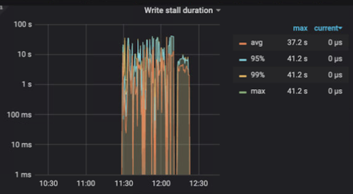
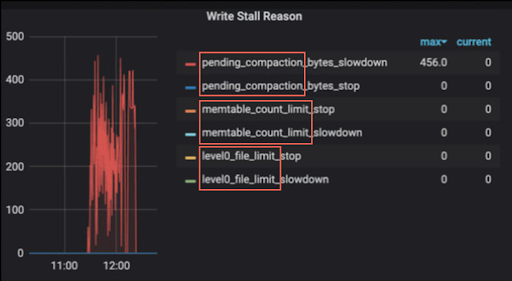
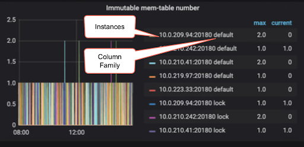
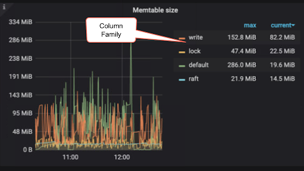
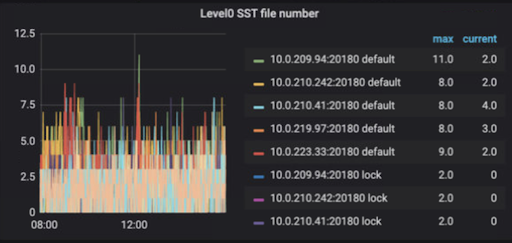
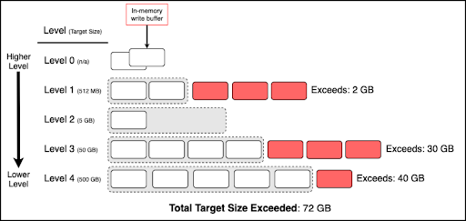
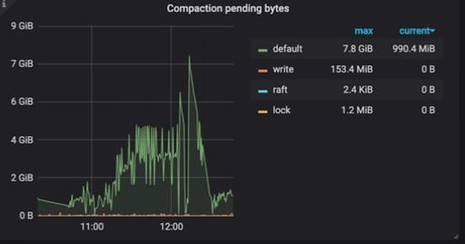

**Author:** Mike Barlow (Solutions Architect at PingCAP)

**Editors:** Jose Espinoza, Tina Yang, Tom Dewan

[TiDB](https://pingcap.com/products/tidb), an open-source, distributed NewSQL database, can experience write performance degradation for several reasons. This troubleshooting guide discusses write performance degradation related to the [RocksDB](https://docs.pingcap.com/tidb/stable/rocksdb-overview) built-in write stall feature. RocksDB is an open-source, mature, and high-performance key-value store. It is optimized for fast, low latency storage such as flash drives and high-speed disk drives.

We will also discuss how to resolve this issue in [TiKV](https://tikv.org/), a highly scalable, low latency, and easy to use key-value database that [uses RocksDB as its storage engine](https://pingcap.com/blog/rocksdb-in-tikv).

When RocksDB can't flush and compact data promptly, it uses a feature called "stalls" to try and slow the amount of data coming into the engine.  Write stalls include pausing all writes and limiting the number of writes.

From [GitHub](https://github.com/facebook/rocksdb/wiki/Write-Stalls):

> RocksDB has an extensive system to slow down writes when flush or compaction can't keep up with the incoming write rate. Without such a system, if users keep writing more than the hardware can handle, the database will:
>
> * Increase space amplification, which could lead to running out of disk space;
> * Increase read amplification, significantly degrading read performance.
>
> The idea is to slow down incoming writes to the speed that the database can handle. However, sometimes the database can be too sensitive to a temporary write burst, or underestimate what the hardware can handle, so that you may get unexpected slowness or query timeouts.

TiKV has two instances of RocksDB (RaftDB and KVdb). RaftDB has only one column family. KVDB has three column families (default, write, and lock).

## Write stall user experiences

Because TiKV depends on RocksDB, when the application or process does a large number of writes, TiDB response time (latency) can degrade significantly. This latency seems to affect all writes and not just writes to a specific table.

There are a couple of Grafana graphs that can help identify whether RocksDB's write stall is the cause and needs additional investigation.

We can use the following Grafana charts located in the section:

`[Cluster name] / TiKV-Details / [RocksDB - raft | RocksDB -kv]`

In the chart below, we see that write stalls spiked significantly at around 11:30. Before 11:30 and after 12:15 write stalls did not occur. A healthy system should not have write stalls.

Write stall duration

With this knowledge, we can dig deeper into write stalls.

RocksDB will trigger write stalls if there are too many:

* [Memtables](#too-many-memtables)
* [Level 0 SST (Sorted String Table) files](#too-many-level-0-sst-files)
* [Pending compaction bytes](#too-many-pending-compaction-bytes)

You can directly map these reasons to the **Write Stall Reason** diagram below.

Each of the metrics below is associated with slowdown or stop. Slowdown indicates that RocksDB has limited the number of writes specific to the metric. Stop indicates that RocksDB has stopped writes related to the metric.

Write stall reason

## Reasons why RocksDB triggers write stalls

### Too many memtables

If too many large memtables are created, there is a greater possibility of out-of-memory (OOM) exceptions; therefore, RocksDB will limit the number and size of memtables created.

For each column family (default, write, lock, and raft), RocksDB first writes the record in the write-ahead logging (WAL) log that's on disk. (This is not important for write stalls.) Then, it inserts the data into a memtable (write buffer). When the memtable reaches the `write-buffer-size` limit, the memtable becomes read-only and a new memtable is created to receive new write operations. The default `write-buffer-size` limit for CF (column families) write is 128 MB and for lock it is 32 MB. There is a maximum number of memtables that you can create; the default is 5. This is set by `max-write-buffer-number`. Once the limit is reached, RocksDB will not create more memtables and will stall all new write operations until the memtables count is reduced below the `max-write-buffer-number` limit.

There are background tasks (jobs) that are specifically responsible for flushing memtables to disk and compacting SST files. By default `max-background-jobs` is set to 8 or CPU cores to -1, whichever is smaller.

There can be many memtables. Remember TiDB has a minimum of one memtable for each column family (default, write, lock, and raft). As mentioned before, when the memtable reaches the `write-buffer-size` limit it becomes read-only and is flagged to be flushed to disk as an SST file. There are a limited number of tasks that flush memtables to disk, which can be identified with `max-background-flushes` limit. The default is 2 or max-background-jobs / 4, whichever is bigger.

> **NOTE:**
>
> Prior to TiKV v4.0.9, `max-background-flushes` is not available, and the number of background flush tasks is set to `max-background-jobs` / 4.

If the number of memtables reaches the `max-write-buffer-number` for a column family, RocksDB stalls all writes for that column family on that instance.

Configuration parameters:

* `[rocksdb|raftdb].[defaultcf|writecf|lockcf].write-buffer-size`

     The default 128 MB. If you increase this parameter, the possibility of an OOM also increases.

* `[rocksdb|raftdb].[defaultcf|writecf|lockcf]max-write-buffer-number`

    The default is 5. If you increase this parameter, the possibility of an OOM also increases

* `[rocksdb|raftdb].max-background-jobs`

    For TiDB 5.0, the default is 8.

* `[rocksdb|raftdb].max-background-flushes`

    The default value is set to 2 or `max_background_jobs` / 4, whichever is bigger.

Grafana graphs:

Immutable memtable number

Memtable size

### Too many level 0 SST files

The size and count of level 0 SST files can directly affect query read performance. Therefore, RocksDB will attempt to limit the number of level 0 SST files.

In general, SST files exist for each column family (default, write, lock, and raft). RocksDB level 0 SST files are different from other levels. Memtables are flushed to disk as level 0 SST files. The data in a level 0 SST file are arranged in the order of generation as the memtable, and data from the same regions can be spread across different files. Also, data with the same key can be in multiple SST files. Therefore, when a read occurs, each level 0 SST file must be read in order. The more level 0 SST files, the more likely query read performance will be impacted negatively. When there are too many files in level 0, write stalls are triggered.

> **NOTE:**
>
> It's normal for level 0 and level 1 SST files to not be compressed, which is in contrast to other levels that do compress SST files.

By default, when the count of level 0 SST files reaches 20, RocksDB will slow writes for the entire database. If the count of level 0 SST files reaches 36, RocksDB will stall writes for the entire database.

Compaction is triggered when the number of level 0 SST files for a column family reaches 4. However, compaction may not occur. Parallel compactions on different column families can occur simultaneously.

Configuration parameters:

* `[rocksdb|raftdb].[defaultcf|writecf|lockcf].level0-file-num-compaction-trigger`

    The default is 4.

* `[rocksdb|raftdb].[defaultcf|writecf|lockcf].level0-slowdown-writes-trigger`

    The default is 20.

* `[rocksdb|raftdb].[defaultcf|writecf|lockcf].level0-stop-writes-trigger`

    The default is 36.

Grafana graphs:

Level 0 SST file number

### Too many pending compaction bytes

A Log-Structured Merge-Tree (LSM) consists of multiple levels. Each level can include zero or more SST files. Level 0 is identified as a "higher level" and each incrementing level (level 1, level 2, etc.) is identified as a lower level. (See the diagram below.)

Since level 0 is treated differently than the lower levels, level 0 does not apply to pending compaction bytes, but it's included in the diagram below to provide a more complete picture of the levels.

RocksDB uses level compaction for levels 1 and lower. By default, level 1 has a target size compaction at 512 MB for write and default column families (CFs), and the lock CF has a default of 128 MB. Each lower level has a target size 10 times greater than the previous higher level.  For example, if the level 1 target size is 512 MB, the level 2 target size is 5 GB, the level 3 target Size is 50 GB, and so on.

When a level exceeds its target size, the excess is known as pending compaction bytes. Pending compaction bytes for levels 1 and lower are aggregated to calculate the total pending compaction bytes. Write stalls are triggered if the total pending compaction bytes exceeds the soft-pending-compaction-bytes-limit or hard-pending-compaction-bytes-limit.

For example, in the diagram below, the total pending compaction is 72 GB. If the soft-pending-compaction-bytes-limit is set to 64 GB (default), write stalls will be triggered.

Total pending compaction

Configuration parameters:

* `[rocksdb|raftdb].soft-pending-compaction-bytes-limit`

    The default is 64 GB.

* `[rocksdb|raftdb].hard-pending-compaction-bytes-limit`

    The default is 256 GB.

 Grafana graphs:

Compaction pending bytes

## Possible root causes

There are multiple reasons for RocksDB write stall. Without going deeply into each, the most common ones are:

* A hotspot
* The application workload has changes, and there are many more writes
* Infrastructure storage IOPs are not adequate
* The cascading effect of memtables being full, too many level 0 SST files, or pending compaction bytes too high
* Not enough compaction threads

## Conclusion

For systems that need very high write performance, RocksDB write stall can become an issue. We can only balance the write, read, and space configurations under specific scenarios. To resolve performance issues and to get the most out of TiDB, it's important to understand the different aspects of RocksDB and the available configuration options for tuning it.
