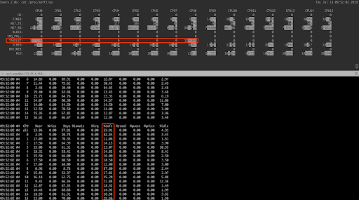

## Background

Although Intel x86-64 is still the most widely used architecture in the servers, [ARM](https://en.wikipedia.org/wiki/ARM_architecture) is attracting more and more attention, and many companies have already been migrating their products from x86-64 to ARM. At PingCAP, we would love to see [TiDB](https://en.wikipedia.org/wiki/TiDB) run on ARM and decided to test its performance on the AWS ARM platform.

[TiKV](http://www.tikv.org) is the distributed transactional Key-Value storage engine for TiDB. When we tested TiKV on the AWS ARM server, we optimized the network queue according to the [AWS official document](https://aws.amazon.com/cn/blogs/compute/optimizing-network-intensive-workloads-on-amazon-ec2-a1-instances/) and found that there were still two cores with a high usage rate of soft interrupts, which became a performance bottleneck. Further investigations revealed that they were two tasklet soft interrupts.

As we know, tasklets of the same type are always serialized and cannot run concurrently on multiple CPUs. This was consistent with the issue we encountered, so our initial guess was that the tasklet function was possibly implemented by the [ENA NIC driver](https://github.com/amzn/amzn-drivers). However, the network subsystem is very time sensitive, and two soft interrupts (NET_TX and NET_RX of softirq) are actually defined in the kernel. This was against the guess of using the tasklet in the NIC driver to handle network requests. What were the two tasklets doing? We decided to set up the environment again to find it out. This article aims to record our exploration into Linux kernel with the following sections:

- [System configuration](#system-configuration)
- [Reproduction](#reproduction)
- [Analysis](#analysis)
- [Conclusion](#conclusion)

## System configuration

### Operating System

Red Hat Enterprise Linux Server release 7.6 (Maipo)

### Kernel

4.14.0-115.2.2.el7a.aarch64

### NIC info

Ethernet controller: Amazon.com, Inc. Elastic Network Adapter (ENA)

Two RX/TX Channels, with 1024 ring size

## Reproduction

To reproduce the environment consistently, we did the following:

1. Set interrupt affinity and RPS.

    ```
    grep eth0 /proc/interrupts | awk '{print $1}' | tr -d :
    44
    45

    sudo sh -c "echo 0 > /proc/irq/44/smp_affinity_list"
    sudo sh -c "echo 8 > /proc/irq/45/smp_affinity_list"

    sudo sh -c 'echo fe > /sys/class/net/eth0/queues/rx-0/rps_cpus'
    sudo sh -c 'echo fe00 > /sys/class/net/eth0/queues/rx-1/rps_cpus'
    ```

2. Generate the workload using wrk + nginx.

3. Confirm successful reproduction by monitoring the CPU and interrupts.

    ```
    watch -d cat /proc/softirqs
    mpstat -P ALL 2
    ```


<div class="caption-center"> Reproducing the environment </div>

## Analysis

It is known that tasklet needs to evoke scheduling through tasklet_schedule. To get the runtime call chain of  `tasklet_schedule`, we intended to write a trace tool which, combined with the kernel code, should be able to help me find the definition of the tasklet function. Because the Linux we used was a 4.14 kernel, BCC (BPF Compiler Collection) seemed to be a fitting choice for the tool.

However, the BCC we installed could not run. Checked the kernel configuration file, we found that `CONFIG_BPF_SYSCALL` was not enabled. It was not clear whether the BPF (Berkeley Packet Filter) of this version of the kernel supported the Aarch64 platform. Therefore, for the time being we decided to write the kprobe kernel module directly to grab the `tasklet_schedule` function, so that we could see in which process tasklet was woken. The following is the trace log.

```
Jul 17 07:30:50 ip-172-31-4-116 kernel: CPU: 0 PID: 7 Comm: ksoftirqd/0 Kdump: loaded Tainted: G           OE  ------------   4.14.0-115.2.2.el7a.aarch64 #1
Jul 17 07:30:50 ip-172-31-4-116 kernel: Hardware name: Amazon EC2 a1.4xlarge/, BIOS 1.0 11/1/2018
Jul 17 07:30:50 ip-172-31-4-116 kernel: Call trace:
Jul 17 07:30:50 ip-172-31-4-116 kernel: [<ffff000008089d64>] dump_backtrace+0x0/0x23c
Jul 17 07:30:50 ip-172-31-4-116 kernel: [<ffff000008089fc4>] show_stack+0x24/0x2c
Jul 17 07:30:50 ip-172-31-4-116 kernel: [<ffff0000088148fc>] dump_stack+0x84/0xa8
Jul 17 07:30:50 ip-172-31-4-116 kernel: [<ffff000000cc00cc>] on___tasklet_schedule_ent+0x44/0x88 [debug_events]
Jul 17 07:30:50 ip-172-31-4-116 kernel: [<ffff0000087522c0>] tcp_wfree+0x15c/0x168
Jul 17 07:30:50 ip-172-31-4-116 kernel: [<ffff0000086cd3f0>] skb_release_head_state+0x6c/0xf0
Jul 17 07:30:50 ip-172-31-4-116 kernel: [<ffff0000086cd494>] skb_release_all+0x20/0x3c
Jul 17 07:30:50 ip-172-31-4-116 kernel: [<ffff0000086cdd50>] consume_skb+0x48/0xcc
Jul 17 07:30:50 ip-172-31-4-116 kernel: [<ffff0000008e4f2c>] ena_io_poll+0x54c/0x8f0 [ena]
Jul 17 07:30:50 ip-172-31-4-116 kernel: [<ffff0000086e6df0>] net_rx_action+0x314/0x470
Jul 17 07:30:50 ip-172-31-4-116 kernel: [<ffff000008081a7c>] __do_softirq+0x11c/0x2f0
Jul 17 07:30:50 ip-172-31-4-116 kernel: [<ffff0000080db074>] run_ksoftirqd+0x48/0x5c
Jul 17 07:30:50 ip-172-31-4-116 kernel: [<ffff0000080fbcf8>] smpboot_thread_fn+0x1b4/0x1c4
Jul 17 07:30:50 ip-172-31-4-116 kernel: [<ffff0000080f72e8>] kthread+0x10c/0x138
Jul 17 07:30:50 ip-172-31-4-116 kernel: [<ffff000008084ea4>] ret_from_fork+0x10/0x18
Jul 17 07:30:50 ip-172-31-4-116 kernel: comm: ksoftirqd/0, pid: 7, state: 0
Jul 17 07:30:50 ip-172-31-4-116 kernel: ctx: bh
```

As can be seen from the trace information, the `ksoftirqd` thread running in the lower half of the interrupt is processing the `NET_RX` soft interrupt, attempting to initiate the tasklet scheduling. Let's take a look at the NIC driver code (version 2.0.1k not found, so here we used version 2.0.2 instead).

```
static int ena_io_poll(struct napi_struct *napi, int budget)
{
        ... ...
        tx_work_done = ena_clean_tx_irq(tx_ring, tx_budget);
        rx_work_done = ena_clean_rx_irq(rx_ring, napi, budget);
        ... ...
}

static int ena_clean_tx_irq(struct ena_ring *tx_ring, u32 budget)
{
  ... ...
  dev_kfree_skb(skb);
  ... ...
}
```

It can be noted that the NIC driver responds to the transmit completion interrupt and the data reception interrupt by multiplexing `NET_RX`, while the context captured is in the lower half of the transmit completion interrupt. The NIC driver calls the `dev_kfree_skb` macro (`#define dev_kfree_skb(a) consume_skb(a)`) to release `sk_buffer` when performing post-transfer cleanup. Then it checks the TSQ_THROTTLED flag to determine where there is data waiting for the qdisc space when executing the `tcp_wfree` function. If there is any packet waiting, the sock object corresponding to the packet will be added to the TCP small queues (TSQ)[<sup>1</sup>](#reference) of the current CPU, as shown below:

```
struct tsq_tasklet {
  struct tasklet_struct tasklet;
  struct list_head head; /* queue of tcp sockets */
};
static DEFINE_PER_CPU(struct tsq_tasklet, tsq_tasklet);

struct tcp_sock *tp = tcp_sk(sk);
... ...
list_add(&tp->tsq_node, &tsq->head);
```

Then the TSQ tasklet is scheduled, and the data packets in the sock are sent in the context of the next soft interrupt. The corresponding kernel code is as follows:

```
/*
 * Write buffer destructor automatically called from kfree_skb.
 * We can't xmit new skbs from this context, as we might already
 * hold qdisc lock.
 */
void tcp_wfree(struct sk_buff *skb)
{
  struct sock *sk = skb->sk;
   struct tcp_sock *tp = tcp_sk(sk);

  if (test_and_clear_bit(TSQ_THROTTLED, &tp->tsq_flags) &&
      !test_and_set_bit(TSQ_QUEUED, &tp->tsq_flags)) {
        unsigned long flags;
        struct tsq_tasklet *tsq;

      /* Keep a ref on socket.
       * This last ref will be released in tcp_tasklet_func()
         */
      atomic_sub(skb->truesize - 1, &sk->sk_wmem_alloc);

      /* queue this socket to tasklet queue */
      local_irq_save(flags);
      tsq = &__get_cpu_var(tsq_tasklet);
      list_add(&tp->tsq_node, &tsq->head);
      tasklet_schedule(&tsq->tasklet);
      local_irq_restore(flags);
  } else {
      sock_wfree(skb);
 }
}
```

<div class="trackable-btns">
    <a href="/download" onclick="trackViews('TSQ becomes a performance bottleneck in AWS ARM environment', 'download-tidb-btn-middle')"><button>Download TiDB</button></a>
    <a href="https://share.hsforms.com/1e2W03wLJQQKPd1d9rCbj_Q2npzm" onclick="trackViews('TSQ becomes a performance bottleneck in AWS ARM environment', 'subscribe-blog-btn-middle')"><button>Subscribe to Blog</button></a>
</div>

Now we can view the `tsq_tasklet_func` definition:

```
/*
 * One tasklet per cpu tries to send more skbs.
 * We run in tasklet context but need to disable irqs when
 * transferring tsq->head because tcp_wfree() might
 * interrupt us (non NAPI drivers)
 */
static void tcp_tasklet_func(unsigned long data)
{
  struct tsq_tasklet *tsq = (struct tsq_tasklet *)data;
  LIST_HEAD(list);
  unsigned long flags;
  struct list_head *q, *n;
  struct tcp_sock *tp;
  struct sock *sk;

  local_irq_save(flags);
  list_splice_init(&tsq->head, &list);
  local_irq_restore(flags);

  list_for_each_safe(q, n, &list) {
      tp = list_entry(q, struct tcp_sock, tsq_node);
      list_del(&tp->tsq_node);

      sk = (struct sock *)tp;
      bh_lock_sock(sk);

      if (!sock_owned_by_user(sk)) {
          tcp_tsq_handler(sk);
      } else {
          /* defer the work to tcp_release_cb() */
          set_bit(TCP_TSQ_DEFERRED, &tp->tsq_flags);
      }
      bh_unlock_sock(sk);

      clear_bit(TSQ_QUEUED, &tp->tsq_flags);
      sk_free(sk);
  }
}
```

The core logic is:

```
if (!sock_owned_by_user(sk)) {
    tcp_tsq_handler(sk);
} else {
    /* defer the work to tcp_release_cb() */
    set_bit(TCP_TSQ_DEFERRED, &tp->tsq_flags);
}
```

Sock processing is delayed if the sock is held by another user process; when the sock is released,  `tcp_tsq_handler` is called to send data.

```
void tcp_release_cb(struct sock *sk)
{
    struct tcp_sock *tp = tcp_sk(sk);
    unsigned long flags, nflags;

    ... ...
    if (flags & (1UL << TCP_TSQ_DEFERRED))
        tcp_tsq_handler(sk);
    ... ...
}
```

Otherwise, `tcp_tsq_handler` is called directly to send the data.

```
static void tcp_tsq_handler(struct sock *sk)
{
     if ((1 << sk->sk_state) &
         (TCPF_ESTABLISHED | TCPF_FIN_WAIT1 | TCPF_CLOSING |
          TCPF_CLOSE_WAIT  | TCPF_LAST_ACK))
          tcp_write_xmit(sk, tcp_current_mss(sk), tcp_sk(sk)->nonagle,
                  0, GFP_ATOMIC);
}
```

We modified the trace module to trace `tcp_tasklet_func` to make sure it was actually awakened and running on CPU 0:

```
Jul 17 07:30:50 ip-172-31-4-116 kernel: CPU: 0 PID: 7 Comm: ksoftirqd/0 Kdump: loaded Tainted: G           OE  ------------   4.14.0-115.2.2.el7a.aarch64 #1
Jul 17 07:30:50 ip-172-31-4-116 kernel: Hardware name: Amazon EC2 a1.4xlarge/, BIOS 1.0 11/1/2018
Jul 17 07:30:50 ip-172-31-4-116 kernel: Call trace:
Jul 17 07:30:50 ip-172-31-4-116 kernel: [<ffff000008089d64>] dump_backtrace+0x0/0x23c
Jul 17 07:30:50 ip-172-31-4-116 kernel: [<ffff000008089fc4>] show_stack+0x24/0x2c
Jul 17 07:30:50 ip-172-31-4-116 kernel: [<ffff0000088148fc>] dump_stack+0x84/0xa8
Jul 17 07:30:50 ip-172-31-4-116 kernel: [<ffff000000cc0044>] on_tcp_tasklet_func_ent+0x44/0x88 [debug_events]
Jul 17 07:30:50 ip-172-31-4-116 kernel: [<ffff0000080db8d4>] tasklet_action+0x88/0x10c
Jul 17 07:30:50 ip-172-31-4-116 kernel: [<ffff000008081a7c>] __do_softirq+0x11c/0x2f0
Jul 17 07:30:50 ip-172-31-4-116 kernel: [<ffff0000080db074>] run_ksoftirqd+0x48/0x5c
Jul 17 07:30:50 ip-172-31-4-116 kernel: [<ffff0000080fbcf8>] smpboot_thread_fn+0x1b4/0x1c4
Jul 17 07:30:50 ip-172-31-4-116 kernel: [<ffff0000080f72e8>] kthread+0x10c/0x138
Jul 17 07:30:50 ip-172-31-4-116 kernel: [<ffff000008084ea4>] ret_from_fork+0x10/0x18
Jul 17 07:30:50 ip-172-31-4-116 kernel: comm: ksoftirqd/0, pid: 7, state: 0
Jul 17 07:30:50 ip-172-31-4-116 kernel: ctx: bh
```

To wrap up, here is a summary of the execution flow above:

```
Transmit completion IRQ handler  (IRQ ctx on CPU 0)
    → raise napi_shedule (SOFTIRQ ctx on CPU 0)
        → NET_RX (SOFTIRQ ctx on CPU 0)
            → ena_io_poll (driver in SOFTIRQ ctx on CPU 0)
                 → ena_clean_tx_irq (driver in SOFTIRQ ctx on CPU 0)
                     → dev_kfree_skb (in SOFTIRQ ctx on CPU 0)
                          → tcp_wfree (in SOFTIRQ ctx on CPU 0 DO TSQ flag CHECK)
                              → get TSQ tasklet from CPU 0 (per-cpu val)
                               → raise tsq tasklet (on CPU 0)
```

Next time CPU 0's SOTRIRQ scheduled:

```
    → run tsq_tasklet_func (on CPU 0)
```

ENA's NIC hardware queue only contains 2 hard interrupts, which means only two TSQ tasklets are allowed to work according to the above process. Therefore, when the network load is high, the corresponding CPU cores become performance bottlenecks.

## Conclusion

Based on the observations and analysis in the previous section, we can conclude that for a network card running on a Linux kernel that supports TSQs, if the number of hardware queues is much smaller than the number of CPU cores, the corresponding CPU is likely to become a bottleneck when network card interrupts occur.

## Reference

<a class="anchor" id="1" href=""></a>

- TCP small queues is a mechanism designed to fight bufferbloat. TCP Small Queues goal is to reduce number of TCP packets in `xmit` queues (qdisc & device queues), to reduce RTT and cwnd bias, part of the bufferbloat problem. See [TCP Small Queues](https://lwn.net/Articles/506237/).

- [tcp: auto corking](https://lwn.net/Articles/576263/)
