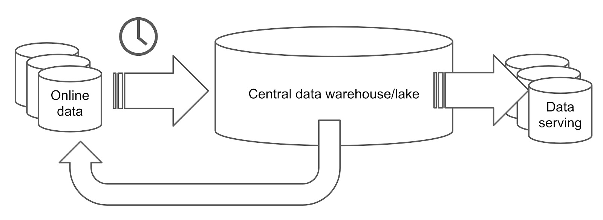
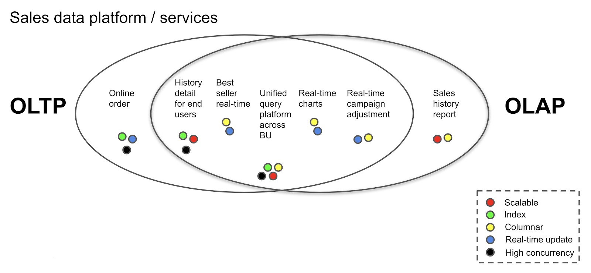
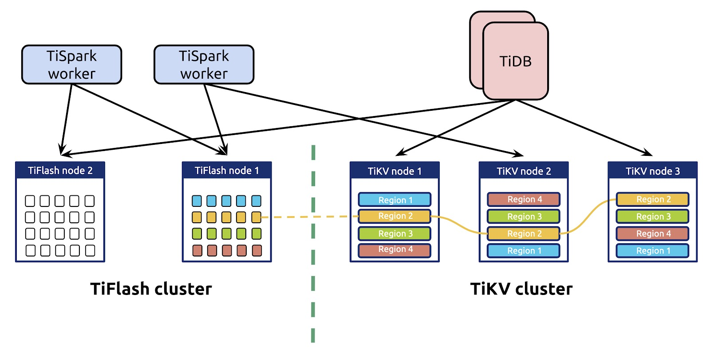
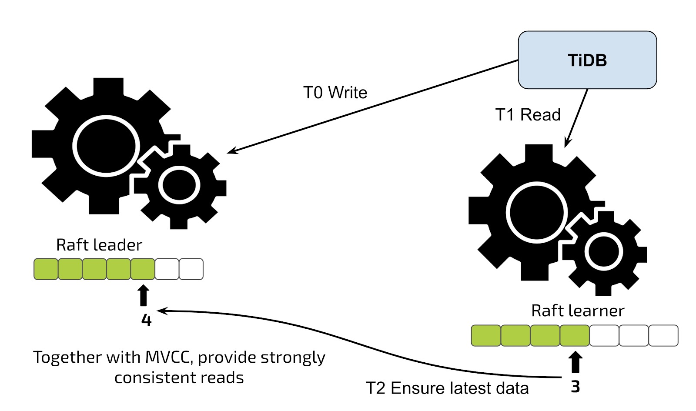
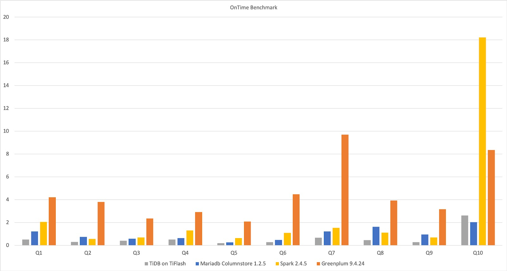
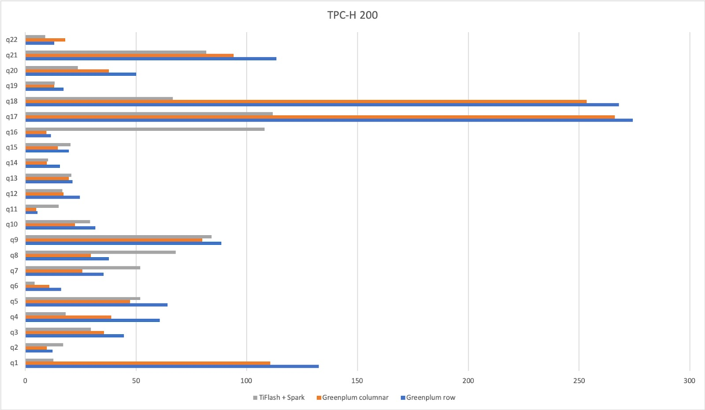
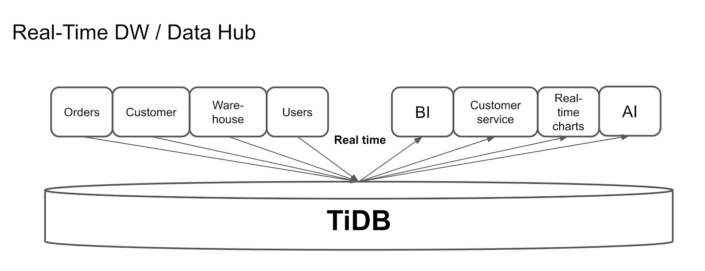
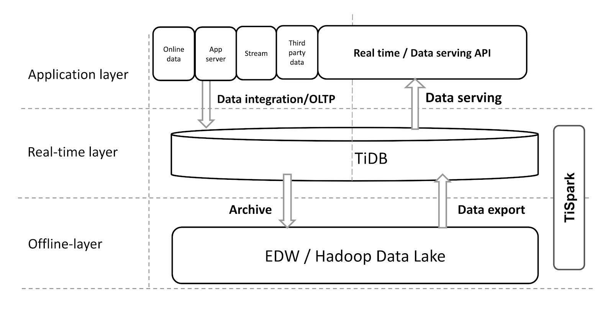

**Author:** [Shawn Ma](https://github.com/ilovesoup) (Tech Lead of the Realtime Analytics team at PingCAP)

**Transcreator:** [Ran Huang](https://github.com/ran-huang); **Editors:** [Caitin Chen](https://github.com/CaitinChen), Tom Dewan


_This article is based on a talk given by Shawn Ma at [TiDB DevCon 2020](https://pingcap.com/community/devcon2020/)._

[TiDB](https://github.com/pingcap/tidb) is an open-source, distributed, NewSQL database that supports [Hybrid Transactional/Analytical Processing (HTAP)](https://en.wikipedia.org/wiki/Hybrid_transactional/analytical_processing) workloads. In May 2020, [TiDB 4.0](https://pingcap.com/blog/tidb-4.0-ga-gearing-you-up-for-an-unpredictable-world-with-real-time-htap-database/) reached general availability, and it has since become a true HTAP database.

In this post, I'll share with you what HTAP is and how TiDB makes the most of the HTAP architecture.

## What is HTAP?

Traditionally, there are two types of databases: [Online Transactional Processing](https://en.wikipedia.org/wiki/Online_transaction_processing) (OLTP) databases and [Online Analytical Processing](https://en.wikipedia.org/wiki/Online_analytical_processing) (OLAP) databases. HTAP databases, on the other hand, are hybrid databases that process both workloads at the same time.

### Traditional data platform architectures

Generally speaking, OLTP databases use a row-based storage engine. They store the current data, update it in real time, and support high concurrency and strong consistency. Each request modifies no more than a few rows of data. OLAP databases, on the other hand, are more likely to be columnar databases. They process historical data in batch, which means the concurrency is not high and each request touches a large number of rows.

As you can see, OLTP and OLAP requests have different requirements, so they need different technologies. Because of that, OLTP and OLAP requests are often processed in isolated databases. Thus, a traditional data processing system may look like this:


<div class="caption-center"> A traditional data platform </div>

In the architecture above, the online data is stored in an online database, which processes the transactional workloads. The data is extracted from the online database at a regular interval -- say, once per day -- and it's loaded into an analytical processing database, such as a relational data warehouse or a Hadoop data lake. The data warehouse or data lake processes the extracted data, which is then exported as a report, and is either loaded to a data-serving database or sent back to the online database.

This process is long and complicated. The more procedures your data goes through, the higher latency you get.

### Why HTAP is important

Does your data platform have to be as complicated as the one described above? Of course not. An HTAP database helps you streamline the system and offers you real-time performance. Let me explain why.

HTAP describes **a database that handles both OLTP and OLAP workloads**. With an HTAP database, you don't have to perform transactions in one database and analytics in another; it lets you do both. By combining row store and column store, HTAP databases draw on the advantages of both and accomplish more than simply connecting the two formats.

But, why do you need an HTAP database? Your old data platform may be complicated and slow,  but it still keeps your applications running.

The answer lies in the fact that **the boundary between transactional and analytical workloads is blurring**:

- **OLAP use cases become transactional**. When we provide reports, we may also have to execute highly-concurrent short queries and conduct small-range queries on historical data.
- **OLTP use cases become analytical**. When transactions run, we may also need to perform large-scale analytics. We may need to give feedback to the online database to improve the online behavior, conduct real-time analytics on the application data, or make queries across different applications.

If you look at the case below, even the database in an ordinary sales platform must deal with a mixed and dynamic set of requirements. On the left are OLTP-like workloads, and on the right are OLAP-like workloads. In the area where the two ovals intersect, the workloads need both OLTP and OLAP capabilities; that is, HTAP capabilities. Each workload has various requirements for database features, such as scalability, fine-grained indexing, columnar storage, real-time updates, and high concurrency.


<div class="caption-center"> Even a simple sales platform can have mixed requirements </div>

To meet these requirements, an HTAP database must have both row store and column store. But simply putting them together is not how it works. We need to integrate them as an organic whole: let the column and row stores communicate with  each other freely, and also ensure the data is real time and consistent.

## How TiDB implements HTAP

From the beginning, TiDB was designed as an OLTP database. Now its largest single database has trillions of rows of data, and it can serve tens of millions queries per second (QPS) in production. But to our surprise, even before 4.0, some users already deployed TiDB as a well-functioning data hub or data warehouse. At that time, TiDB supported both OLTP and OLAP workloads.

Then, what's new in TiDB 4.0? Simply put, TiDB 4.0 provides an improved HTAP experience by introducing a real-time columnar storage engine, [TiFlash](https://docs.pingcap.com/tidb/stable/tiflash-overview). TiFlash is a columnar extension of [TiKV](https://docs.pingcap.com/tidb/dev/tikv-overview), the distributed, transactional key-value store. It asynchronously replicates data from TiKV according to the [Raft consensus algorithm](https://en.wikipedia.org/wiki/Raft_(computer_science)) and guarantees the snapshot isolation level of consistency by validating the Raft index and multi-version concurrency control (MVCC).

Now, as shown in the figure below, when you combine TiFlash with TiKV, TiDB has a scalable architecture of integrated row and column stores.


<div class="caption-center"> TiDB 4.0 HTAP architecture </div>

In this architecture:

* TiKV and TiFlash use separate storage nodes to ensure complete isolation.
* Data in the columnar replica is real time and consistent.
* There's no intermediate layer between TiKV and TiFlash, so data replication is fast and simple.
* It supports point get, small range scan and large batch scan with row store indexes and column store. The optimizer uses a cost model to choose between column store and row store according to the actual workload.

### Scalable and real-time updates

In TiDB's HTAP architecture, the row store and column store are scalable and updated in real time.

Just like TiKV, TiFlash implements the multi-Raft-group replica mechanism. The only difference is that TiFlash replicates data from row store to column store. The basic unit for replicating or storing data is called a [Region](https://docs.pingcap.com/tidb/stable/glossary#regionpeerraft-group).

Also, the data replication does not have an intermediate layer. In other data replication processes, data must pass through some distributed pipelines, such as Kafka or other message queue systems, which increase the latency. But in TiDB, the replication between TiKV and TiFlash is from peer to peer. There's no in-between layer, so the data is replicated in real time.

The HTAP architecture strikes a balance between replication and storage scalability. It uses the same replication and sharding mechanism as the previous OLTP architecture. Therefore, the scheduling policy still applies to the HTAP architecture, and the cluster can still horizontally scale out or scale in. What's more, you can scale the column store and row store separately to meet the needs of your application.

To enable TiFlash replication, you only need a single command:

```sql
# To create 2 columnar replicas for orders table
mysql> ALTER TABLE orders SET TIFLASH REPLICA 2;
```

### Asynchronous replication with real-time and consistent reads

In TiFlash, the data replication is asynchronous. This design has two advantages:

* Column store's replication won't block transactional processing.
* Even if the columnar replica is down, the row store still works.

Though the replication is asynchronous, the application always read the latest data because of the Raft consensus algorithm.


<div class="caption-center"> The Raft learner mechanism </div>

When the application reads data from the learner replica in TiFlash, the application sends a read validation to the Leader replica in TiKV and then receives information about the replication progress. If the progress does not finish, the latest data is not replicated to the learner replica, and the learner replica waits until it obtains the latest data. The whole wait duration is as small as tens to hundreds of milliseconds, unless the system reaches peak utilization.

<div class="trackable-btns">
  <a href="/download" onclick="trackViews('How We Build an HTAP Database That Simplifies Your Data Platform', 'download-tidb-btn-middle')"><button>Download TiDB</button></a>
  <a href="https://share.hsforms.com/1e2W03wLJQQKPd1d9rCbj_Q2npzm" onclick="trackViews('How We Build an HTAP Database That Simplifies Your Data Platform', 'subscribe-blog-btn-middle')"><button>Subscribe to Blog</button></a>
  </div>

### An optimizer for intelligent selection

Note that the column and row stores are not two independent systems, but one organic whole. How can the two stores coordinate? Well, the trick is in our optimizer.

When the optimizer selects a query execution plan, it treats the column store as a special index. Among all the indexes in the row store and the special column store index, the optimizer selects the fastest index through statistics and cost-based optimization (CBO). This way, both the column and row stores are taken into consideration. You don't have to decide on which storage engine to use in a complex query, because the optimizer makes the best decision for you.

However, if you intend to completely isolate the column store and row store, you can manually specify that the query uses one of the two storage engines.

The following results, taken from [ClickHouse](https://en.wikipedia.org/wiki/ClickHouse), show the on-time benchmarking of TiFlash, MariaDB, Spark, and Greenplum on a single, wide table. For the same 10 queries, the four databases have various execution times. As you can see, in this architecture, TiDB on TiFlash performs better than the others.


<div class="caption-center"> Benchmarking TiFlash, MariaDB, Spark, and Greenplum </div>

### Apache Spark works hand in hand with TiSpark

TiDB's HTAP architecture, with the help of TiSpark, can work seamlessly with Apache Spark. [TiSpark](https://docs.pingcap.com/tidb/stable/tispark-overview) is a thin computation layer built for running Spark on top of TiKV or TiFlash to respond to complex OLAP queries, such as providing AI computing and a toolbox for data science, as well as integrating with business intelligence (BI). By connecting with the Spark ecosystem, TiDB can provide services for these complex scenarios.

You can use TiSpark with a Hadoop data lake. In this scenario, TiDB is an excellent way to provide distributed computing for heavyweight, complex queries.

When we run a [TPC-H](http://www.tpc.org/tpch/) benchmark on TiSpark and  Greenplum, TiSpark + TiFlash hold Greenplum to a draw. Sometimes Greenplum is faster, and other times TiSpark + TiFlash is faster, as shown below.


<div class="caption-center"> Benchmarking TiSpark+TiFlash and Greenplum </div>

## Applying TiDB in HTAP scenarios

As we have mentioned, in HTAP scenarios, TiDB helps users build a simplified architecture that reduces maintenance complexity, provides real-time data for applications, and improves business agility.

### Real-time data warehousing

The following diagram shows a popular TiDB use case: real-time data warehousing. TiDB supports continuous updates, so it can easily sync data from other OLTP databases. In this architecture, TiDB collects data from multiple applications and aggregates their data in real time.


<div class="caption-center"> Use TiDB as a real-time data warehouse </div>

After gathering the data, TiDB can make real-time queries, such as providing reports and real-time charts, and, of course, feeding data to AI.

### One stop for transactional and analytical processing

Another way to apply TiDB in the HTAP scenario is to build a one-stop database for both transactional and analytical processing. Previously, users might treat MySQL as an online database and replicate data from MySQL to an analytical database or Hadoop in T+1 days. MySQL provides service for online applications, and BI tools connect to the analytical database or Hadoop to perform data analytics.


<div class="caption-center"> TiDB as a one-stop database for OLTP and OLAP </div>

But for such a scenario, you only need one TiDB cluster. The online application connects to TiDB's row store, and the BI server connects to the column store. This architecture not only reduces the complexity of your architecture, but also boosts overall performance.

### Integrating TiDB with your existing data warehouse

Some may say: But I already have a workable data warehousing system. I can't simply give them up and migrate everything to TiDB, can I?

Indeed, if you already use Hadoop or a data warehouse, the previous use cases might not apply to your system. But TiDB is so flexible and extensible that you can integrate it with your existing data warehousing system, like in the following diagram:


<div class="caption-center"> Integrating TiDB with your data warehouse </div>

The applications aggregate data into TiDB, which provides a real-time layer for real-time queries and external data serving. Through this real-time layer, TiSpark can send data to the offline Hadoop layer, where Hadoop models and cleans the data, and then exports the data back to TiDB so that TiDB can serve data more efficiently.

Generally, because Hadoop doesn't support high-speed, real-time queries, we can't expose its APIs directly to the external service. With TiDB, we give the existing system the power to serve data in real time.

## Conclusion

Within a couple of months of its GA release, TiDB 4.0 HTAP with the columnar engine has gained more than 20 production use cases. It helps users build their real-time reporting, fraud detection, CRM, data-mart, and real-time campaign monitoring. For more information, feel free to talk to us in the [TiDB Slack channel](https://slack.tidb.io/invite?team=tidb-community&channel=everyone&ref=pingcap-blog).

HTAP support is also available on [TiDB Cloud](https://pingcap.com/products/tidbcloud), the fully managed TiDB service. Apply now for a 2-week free trial [here](https://tidbcloud.com/signup).
