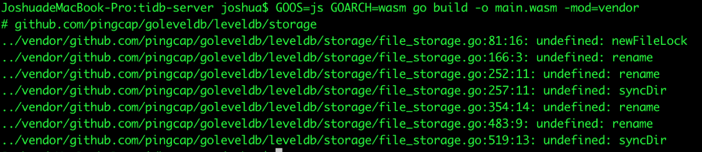
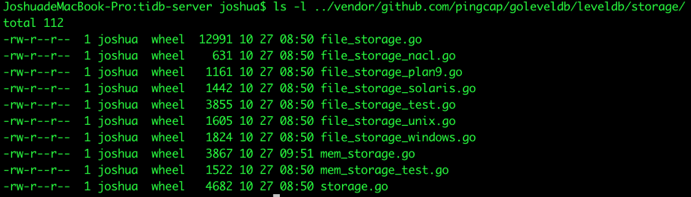
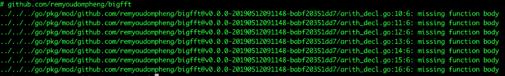
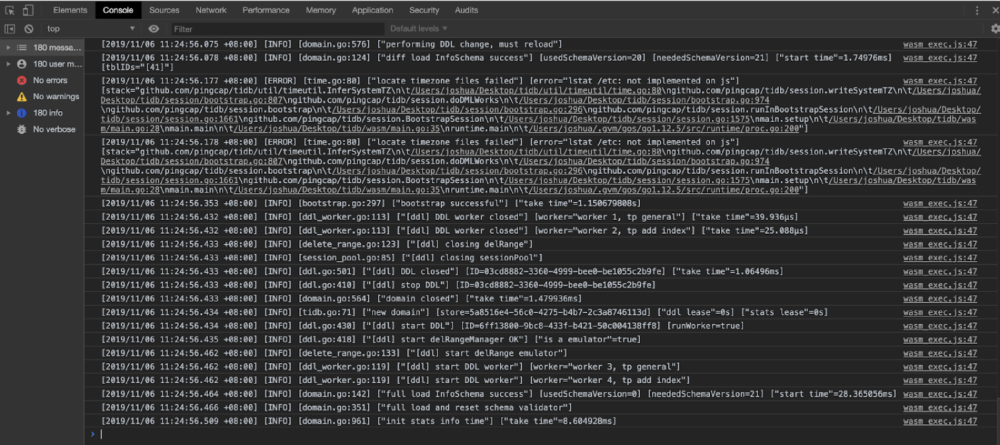
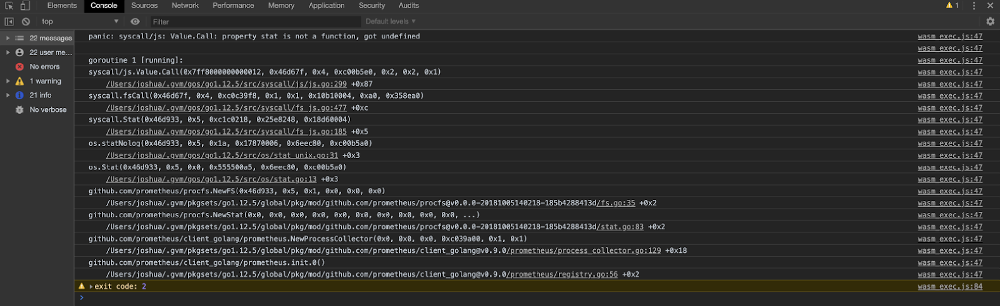
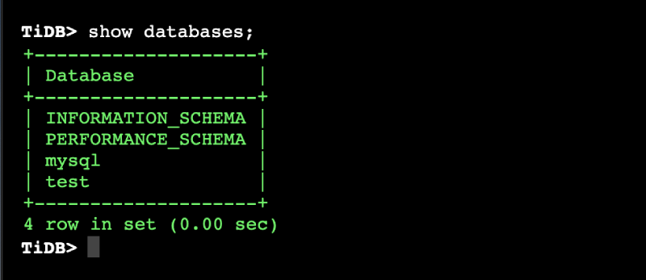
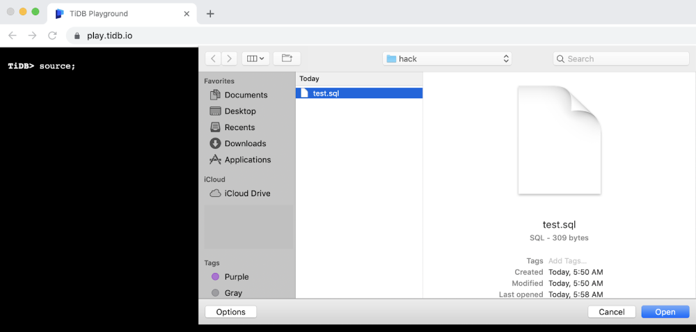
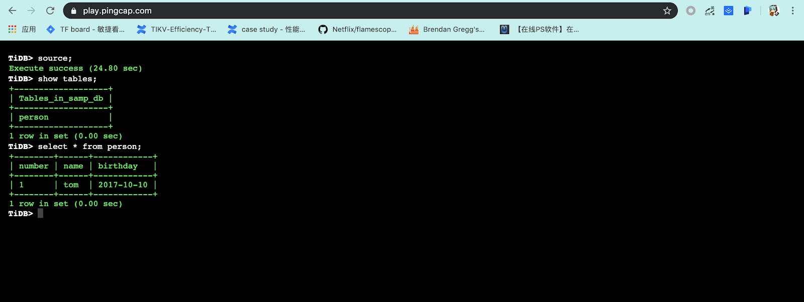

As Queeny Jin mentioned in her article, [TiDB in the Browser: Running a Golang Database on WebAssembly](https://pingcap.com/blog/tidb-in-the-browser-running-a-golang-database-on-webassembly/), we compiled TiDB into an in-browser database using WebAssembly (Wasm). We're very proud of this pilot project because it opens a door to an entirely new world for both Golang and Wasm:

* It is probably the first Golang database that's been compiled to Wasm. As "[Golang weekly (issue 287)](https://golangweekly.com/issues/287)" put it, "The author wonders if a database like TiDB written in Go can run in a web browser, what about other complex Go apps? Go's WebAssembly future is looking quite positive."

* Besides [SQLite](https://github.com/kripken/sql.js/), Wasm has one more database example that can run inside the browser. As [Database Weekly (issue 279)](https://dbweekly.com/issues/279) put it, "If a database like TiDB written in Go can run in the browser, what about other complex Go apps or other database systems?"

What's most exciting is that beginning database users now have an easy way to learn to write SQL statements or test new databases. They don't have to download an entire database and go through the complex setup and configuration process to be able to write SQL. They can simply point their browser to [https://tour.tidb.io/](https://tour.tidb.io/), wait a few seconds for the TiDB database to load, and then start to write SQL statements.

The time to experiment with SQL without pain has come. In fact, the community has started to hack on this project, and they've built a markdown-it plugin to run a TiDB Wasm instance on markdown. Now you can have an interactive playground to learn SQL in the browser: [https://github.com/imiskolee/tidb-wasm-markdown](https://github.com/imiskolee/tidb-wasm-markdown)

The source code for this project is in [PR: #13069 - support compiling tidb to wasm](https://github.com/pingcap/tidb/pull/13069). You are welcome to join us!

The rest of this blog will dive deep into how and why we built an in-browser database. By the end of the article, you'll know how to reproduce it yourself, create your own projects, and get inspired.

**TL;DR**

## _Want to make your own Golang apps run in a browser? Here's what we learned ..._

_We had a lot of fun—and learned a lot—from our little adventure at TiDB Hackathon 2019. If you want to make your own Golang applications run in a browser, here are some suggestions:_

* _As [WebAssembly Weekly - Issue #100](https://wasmweekly.news/issue-100/) mentioned, "WebAssembly support for Go applications is very much in its infancy." For example, Golang hasn't fully supported WASI, and goleveldb doesn't support Wasm/js. Be discreet before you go too deep, and clearly understand the use cases for your application._

* _Make sure your application doesn't have third-party platform-specific dependencies that can't be compiled to Wasm._

* _Browsers don't allow port listening and file operations, so you'll have to work around those limitations._

## Why an in-browser database?

The idea came to us when we were planning our TiDB Hackathon 2019. The goal of participating in the Hackathon was very simple: hack something cool together! (So cool that we name ourselves: Ti-Cool.) What could be cooler than an in-browser database?

## How we made it possible?

It's a hackathon, so we hack, of course. =)

Let's take a look at our goal again: building an in-browser TiDB database. Breaking it down, we got a few questions to answer:

1. Can TiDB be compiled to an in-browser application? If yes, how?
2. How can users input the SQL statements and get their results just from the browser?

Let's find out.

### Question #1: Can TiDB be compiled to an in-browser application? If yes, how?

**What we knew:** TiDB is written in Golang, and Go 1.11 added a port to WebAssembly.

**What we didn't know:** Does TiDB include any platform-specific libraries that can't be compiled to Wasm?

We started our adventure of compiling TiDB to Wasm by following [getting started with WebAssembly](https://github.com/golang/go/wiki/WebAssembly#getting-started). Here was our first setback:



Going through the goleveldb code and the storage package led to the heartbreaking fact that even though it had implementations for most platforms, it didn't have one for Wasm:



That's why we had the `undefined` error messages about `newFileLock`, `rename`, `syncDir`, etc.

As shown in the code below, we decided to add a `file_storage_js.go` file and leave those functions unimplemented:

```go
package storage

import (
  "os"
  "syscall"
)

func newFileLock(path string, readOnly bool) (fl fileLock, err error) {
  return nil, syscall.ENOTSUP
}

func setFileLock(f *os.File, readOnly, lock bool) error {
  return syscall.ENOTSUP
}

func rename(oldpath, newpath string) error {
  return syscall.ENOTSUP
}

func isErrInvalid(err error) bool {
  return false
}

func syncDir(name string) error {
  return syscall.ENOTSUP
}
```

We compiled the code again and got this:



Um... What does `missing function body` mean?

Diving deep into the code, we found that there were function declarations in the `arith_decl.go` file but the functions weren't implemented in the system-specific files.

This problem was similar to the one we had before, and we could solve it the same way, except there was a  problem: this code belonged to a third-party library and was not in our control. Besides, TiDB did not depend on the library directly—it depended on the `mathutil` library which depended on the `bigfft` library, and neither of these libraries was in our control. Two plans came to our minds:

* Plan 1. File pull requests to the `mathutil` and `bigfft` libraries so that they can support Wasm.

* Plan 2. Clone the `mathutil` and `bigfft` libraries, add the functions and leave them unimplemented, and change the TiDB dependency to our cloned libraries.

Plan 1 was quickly ruled out because we couldn't do it in time for the hackathon, not to mention we had no idea whether the maintainers of these two projects would approve our changes and merge them.

Plan 2 had its own problem because it meant we would probably detach ourselves from the upstreams.

Was there a third way? Could we make a special case where TiDB didn't depend on these two libraries when we compile the Wasm binary format, but when it came to the binary format for other platforms like Linux, it's business as usual?

With this goal in mind, we did some homework. We found that even though `mathutil` was called many times, only the following functions were used: `MinUint64`, `MaxUint64`, `MinInt32`, `MaxInt32`, etc. So we had an idea:

1. Create the `mathutil` directory, then the `mathutil_linux.go` and `mathutil_js.go` files.

2. In the `mathutil_linux.go` file, re-export to the third party libraries.

3. In the `mathutil_js.go` file, create these functions and leave them unimplemented, with no dependency on any third-party libraries.

4. Switch all the dependency on third-party libraries to the `mathutil` directory so that only the `mathutil` directory included the third-party package that didn't support Wasm.

In this way, the `mathutil` directory provided all the functions in the original `mathutil` package. In addition, when compiling TiDB for other platforms (Linux), it could still go to the `mathutil_linux.go` file which led to the third-party libraries; when compiling TiDB for Wasm, it could go to the `mathutil_js.go` file.

Compiling again:


Yay! We made it! The `main.wasm` is the compiled TiDB Wasm file we wanted, and it proves that TiDB could be compiled to an in-browser application.

Ok. Now we have a compiled TiDB Wasm. Let's run it, and see what comes out!

Theoretically, because we were using `os.Stdin` as the input and the `os.Stdout` as the output, and we hadn't done anything with DOM yet, the output should be blank. However, TiDB outputs its log to `os.Stdout`, we expect a log message that TiDB started successfully. Unfortunately, this was what we got:


What we could derive from the error message was that the runtime didn't implement `os.stat`. We determined that this was because Golang hasn't fully supported WASI yet. As shown in the following code, it merely mocked an `fs` in `wasm_exec.js`:

```js
global.fs = {
        writeSync(fd, buf) {
                ...
        },
        write(fd, buf, offset, length, position, callback) {
                ...
        },
        open(path, flags, mode, callback) {
                ...
        },
        ...
}
```

The mocked `fs` didn't implement the callbacks such as `stat`, `lstat`, `unlink`, `mkdir`. So we mocked these functions in the global `fs` object before the Wasm was started:

```js
function unimplemented(callback) {
    const err = new Error("not implemented");
    err.code = "ENOSYS";
    callback(err);
}
function unimplemented1(_1, callback) { unimplemented(callback); }
function unimplemented2(_1, _2, callback) { unimplemented(callback); }

fs.stat = unimplemented1;
fs.lstat = unimplemented1;
fs.unlink = unimplemented1;
fs.rmdir = unimplemented1;
fs.mkdir = unimplemented2;
go.run(result.instance);
```

<div class="trackable-btns">
    <a href="/download" onclick="trackViews('How We Compiled a Golang Database in the Browser Using WebAssembly', 'download-tidb-btn-middle')"><button>Download TiDB</button></a>
    <a href="https://share.hsforms.com/1e2W03wLJQQKPd1d9rCbj_Q2npzm" onclick="trackViews('How We Compiled a Golang Database in the Browser Using WebAssembly', 'subscribe-blog-btn-middle')"><button>Subscribe to Blog</button></a>
</div>

When we refreshed the page, the expected TiDB log was finally displayed:



Yay, we made it again!

At this point, we had cleared all the technical blockers. Now it was time to get inputs and outputs.

### Question # 2: How can users input the SQL statements and get their results from the browser?

We all know that browsers cannot let the web applications within them do dangerous things such as port listening and file operations. However, TiDB lets users start a client and connect to TiDB using MySQL statements ([mostly](https://pingcap.com/docs/stable/reference/mysql-compatibility/)), which means users need to listen on a certain port. We want our users to have a built-in TiDB client in the Wasm file together with the TiDB sever: When the browser loads the Wasm file, the client is launched immediately to allow users to input SQL statements and output the SQL results.

Here is what we did:

1. Reuse what's already in the TiDB test code. We looked through the test code in TiDB and [found the following](https://github.com/pingcap/tidb/search?q=MustQuery%28%22select+count%28*%29&unscoped_q=MustQuery%28%22select+count%28*%29):

    ```go
    result = tk.MustQuery("select count(*) from t group by d order by c")
    result.Check(testkit.Rows("3", "2", "2"))
    ```

2. Locate the `tk` function:

    ```go
    // Exec executes a sql statement.
    func (tk *TestKit) Exec(sql string, args ...interface{}) (sqlexec.RecordSet, error) {
        var err error
        if tk.Se == nil {
            tk.Se, err = session.CreateSession4Test(tk.store)
            tk.c.Assert(err, check.IsNil)
            id := atomic.AddUint64(&connectionID, 1)
            tk.Se.SetConnectionID(id)
        }
        ctx := context.Background()
        if len(args) == 0 {
            var rss []sqlexec.RecordSet
            rss, err = tk.Se.Execute(ctx, sql)
            if err == nil && len(rss) > 0 {
                return rss[0], nil
            }
            return nil, errors.Trace(err)
        }
        stmtID, _, _, err := tk.Se.PrepareStmt(sql)
        if err != nil {
            return nil, errors.Trace(err)
        }
        params := make([]types.Datum, len(args))
        for i := 0; i < len(params); i++ {
            params[i] = types.NewDatum(args[i])
        }
        rs, err := tk.Se.ExecutePreparedStmt(ctx, stmtID, params)
        if err != nil {
            return nil, errors.Trace(err)
        }
        err = tk.Se.DropPreparedStmt(stmtID)
        if err != nil {
            return nil, errors.Trace(err)
        }
        return rs, nil
    }
    ```

3. Write a read-eval-print-loop (REPL) to take inputs, execute them using the above `Exec` function, return the result to standard output, and loop the entire process.

### What about the terminal?

We now had an `Exec` function that could take SQL statements, output the result, and run in the browser. We also needed an SQL client to interact with the function. We considered the following options:

* Use Golang to manipulate dom to implement this client.
* Use Golang to expose the `Exec` function to the global, and find an existing SQL client/terminal in JavaScript(JS) to interact with the `Exec` function.

Our current team members have limited front-end knowledge, so we chose the second approach. We found the `jquery.console.js` library, which required only a callback from the SQL, and our `Exec` fit right in.

Here are the specific steps:

1. Exposed the `Exec` function globally to be called back by JS:

    ```go
    js.Global().Set("executeSQL", js.FuncOf(func(this js.Value, args []js.Value) interface{} {
        go func() {
        // Simplified code
            sql := args[0].String()
            args[1].Invoke(k.Exec(sql))
        }()
        return nil
    }))
    ```

    Result: We can run SQL from the browser console:

    

2. Built an SQL client using `jquery.console.js` and passed the `executeSQL` as callbacks:

    Result: Now you can run the Golang database the SQL directly in your browser!

    

### One more thing: taking in local files

Our users now have an in-browser database where they can write SQL directly. However, there's a small problem: they can only write one SQL statement at one time.

Imagine if a user wanted to test the compatibility between TiDB and MySQL. It would be a nightmare to run the statements one by one.

However, in TiDB we have features such as `load stats` and `load data` to read and load content from files into the databases, see [for more information](https://pingcap.com/docs/v3.0/reference/sql/statements/load-data/). But as we mentioned earlier, this was not possible for a browser.

To resolve this issue, we did the following:

1. Opened the browser's `upload` window so users could choose a file and upload it to TiDB:

    ```go
    js.Global().Get("upload").Invoke(js.FuncOf(func(this js.Value, args []js.Value) interface{} {
        go func() {
            fileContent := args[0].String()
            _, e := doSomething(fileContent)
            c <- e
        }()
        return nil
    }), js.FuncOf(func(this js.Value, args []js.Value) interface{} {
        go func() {
            c <- errors.New(args[0].String())
        }()
        return nil
    }))
    ```

2. Added a `source` command. Users can run the `source` command to upload a SQL file, and the TiDB Wasm executes the SQL statements in the file.

    For example, users could enter the `source` command. The browser displays a window for you to load an SQL file.

    

    If you load the `test.sql` file:

    ```sql
    CREATE DATABASE IF NOT EXISTS samp_db;

    USE samp_db;

    CREATE TABLE IF NOT EXISTS person (
        number INT(11),
        name VARCHAR(255),
        birthday DATE
    );

    CREATE INDEX person_num ON person (number);

    INSERT INTO person VALUES("1","tom","20170912");

    UPDATE person SET birthday='20171010' WHERE name='tom';
    ```

    And then show the database, you see the following results:

    

## What's next

Because of the limited time in Hackathon, TiDB Wasm could only serve as a pilot project. If you use TiDB Wasm, keep in mind these [caveats](https://pingcap.com/blog/tidb-in-the-browser-running-a-golang-database-on-webassembly/#what-are-the-limitations). We also have a lot more work to do, including the following:

* Persist data using IndexedDB, and implement a storage interface for IndexDB.

* Apply P2P technologies such as WebRTC to provide service to other browsers. We believe there will be more and more applications migrating to Wasm and many of them will need databases like TiDB Wasm.

* Make the Wasm files smaller. The current files are almost 80 MB and occupy too much memory. This is not friendly to browser. (Thanks a lot to [Syrus Akbary](https://github.com/syrusakbary) for compiling TiDB to WASI; it's a pity that it's too large to run on any runtime.)

* Publish TiDB to WAPM and run it in [WebAssembly shell](https://webassembly.sh/).

* And more...

You are welcome to join us and build this project together at [https://github.com/pingcap/tidb/projects/27](https://github.com/pingcap/tidb/projects/27) or contact us at [info@pingcap.com](mailto:info@pingcap.com).
