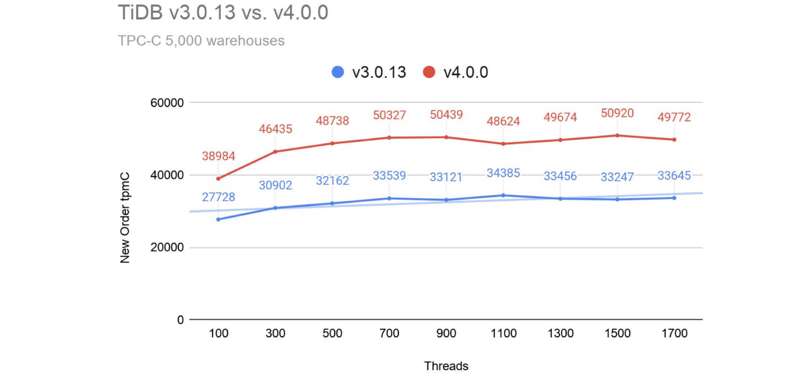
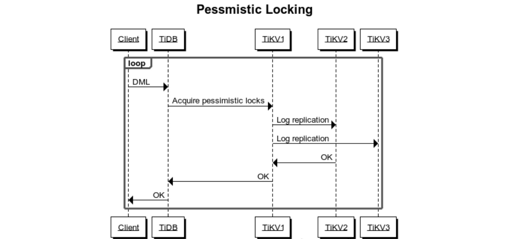
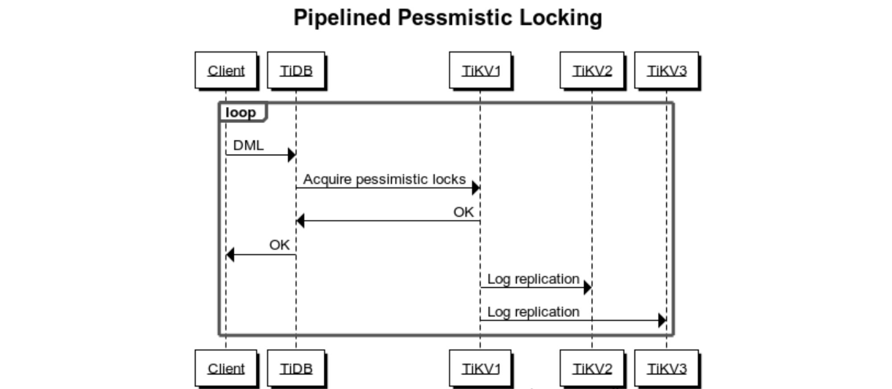
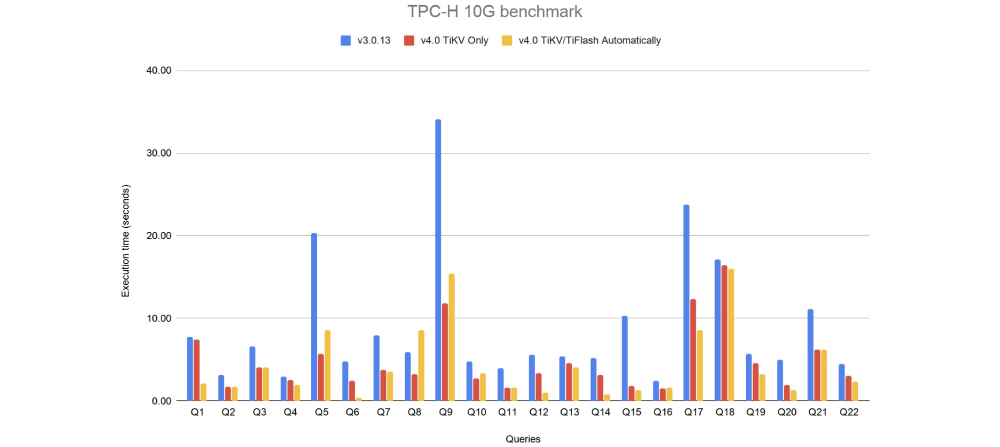
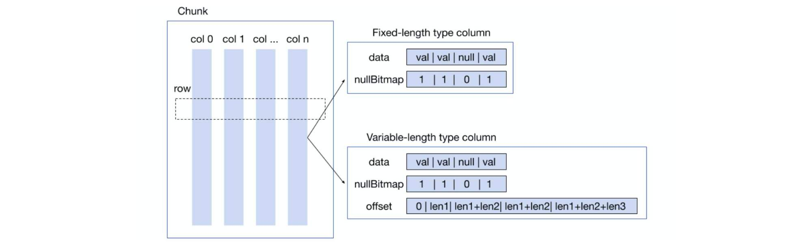
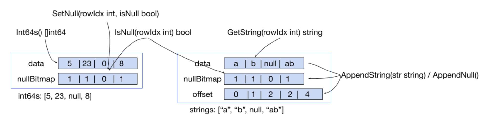
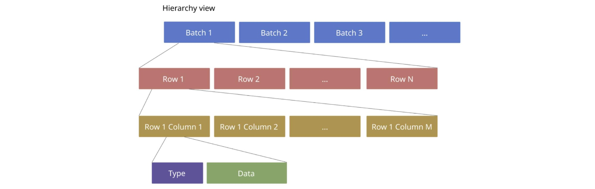
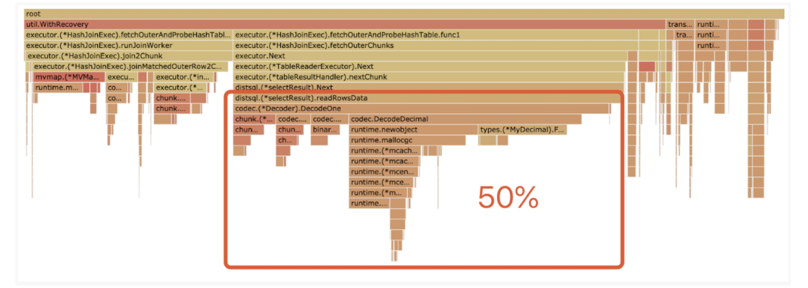
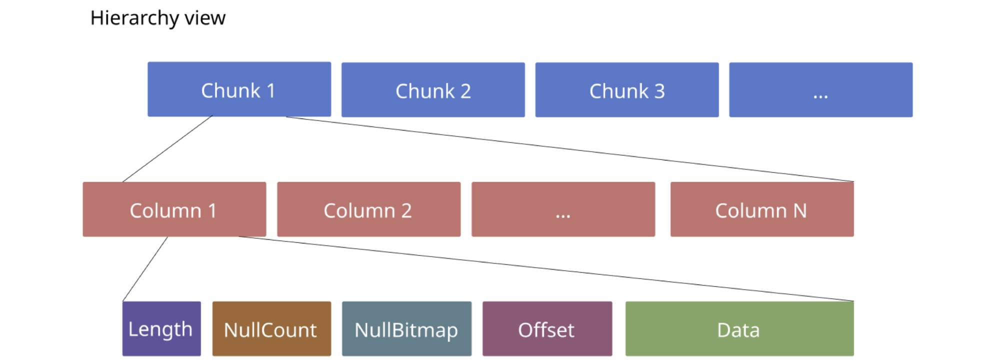
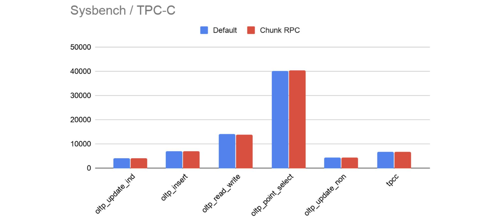

---
title: How We Improved TPC-C Performance by 50% and TPC-H Performance by 100%
author: [Wei Liu, Shenghui Wu]
date: 2020-06-05
summary: TiDB 4.0 release greatly outperforms TiDB 3.0. Our TPC-C benchmark improved by about 50% and our TPC-H benchmark improved by about 100%.
tags: ['Benchmark']
categories: ['Engineering']
image: /images/blog/tidb-performance.jpg
--- 

As our [previous post](https://pingcap.com/blog/tidb-4.0-preview-easier-to-use-production-ready-htap-database/) described, TiDB 4.0 is an easier-to-use, production-ready [Hybrid Transactional/Analytical Processing](https://en.wikipedia.org/wiki/Hybrid_transactional/analytical_processing) (HTAP) database. Our long-term mission is to build a high-performance distributed SQL database to help you solve your business growth pains in [Online Transactional Processing](https://en.wikipedia.org/wiki/Online_transaction_processing) (OLTP) and real-time analytical scenarios. 

[Transaction Processing Performance Council](http://www.tpc.org/) (TPC) benchmarks, which measure database system performance, are accepted gold standards in the industry. To test the performance of our upcoming TiDB 4.0 release, we used TPC-C specifications to measure its OLTP capabilities and TPC-H specifications to measure its Online Analytical Processing (OLAP) capabilities.

Our test results showed that, compared with version 3.0, **TiDB 4.0's TPC-C performance improved by about 50%, and TPC-H performance increased by about 100% on average over a set of 22 queries**.  

In this post, we'll show you how we significantly enhanced TiDB 4.0's TPC-C and TPC-H performance. 

## TPC-C performance improved by 50%

We ran a TPC-C test against the TiDB 4.0 general availability (GA) release and TiDB 3.0.13, and we found that the TiDB 4.0 performed about 50% better.

Hardware configurations:

<table>
  <tr>
   <td><strong>Component</strong>
   </td>
   <td><strong>Instances</strong>
   </td>
   <td><strong>vCPUs</strong>
   </td>
   <td><strong>RAM (GB)</strong>
   </td>
   <td><strong>Instance type</strong>
   </td>
  </tr>
  <tr>
   <td>TiKV
   </td>
   <td>3
   </td>
   <td>16
   </td>
   <td>122
   </td>
   <td>AWS i3.4xlarge
   </td>
  </tr>
  <tr>
   <td>TiDB
   </td>
   <td>3
   </td>
   <td>16
   </td>
   <td>32
   </td>
   <td>AWS c5.4xlarge
   </td>
  </tr>
  <tr>
   <td>Placement Driver (PD)
   </td>
   <td>3
   </td>
   <td>4
   </td>
   <td>16
   </td>
   <td>AWS m5.xlarge
   </td>
  </tr>
</table>

For configuration parameters and test steps, see [this document](https://pingcap.com/docs/stable/benchmark/v4.0-performance-benchmarking-with-tpcc/).

Here are the TPC-C test results: 

 TiDB 3.0.13 vs. 4.0 for TPC-C benchmarks (higher is better) 

We achieved this result because we optimized TiDB's pessimistic transactions, the Raft thread model, and RocksDB's write throughput.

### Optimizing pessimistic transactions

As our [previous post](https://pingcap.com/blog/pessimistic-locking-better-mysql-compatibility-fewer-rollbacks-under-high-load/) described, we've improved pessimistic locking's performance, stability, and compatibility with MySQL. Pessimistic locking becomes generally available in TiDB 4.0. In this section, we'll introduce how we reduce remote procedure calls (RPCs) and latency of client requests. 

#### Lock requests return the required data

In TiDB 3.0, when you execute an SQL statement like "UPDATE column1 =? WHERE id =?" in a pessimistic transaction, TiDB must write the pessimistic lock label in the row's lock column family and then query the row's data. In this process, there are two RPC interactions between TiDB and TiKV. 

But in 4.0, we merge these two operations into a single step. When TiKV performs the lock operation, it returns the data you require to TiDB. You can see the code [here](https://github.com/tikv/tikv/pull/6696).

#### Lock requests immediately return data to the client

When we analyzed the TPC-C client's execution time, we found that the client spent most of its time waiting for the pessimistic lock request to complete. In a TPC-C test, a transaction modified multiple rows, and each row required a pessimistic lock. Besides, TiKV replicated data among multiple replicas. Therefore, write request latency was much higher than read request latency. Because the client's execution latency was too high, it was difficult to further improve TiKV's resource utilization and the client's queries per second (QPS).

After analysis, we found that the pessimistic lock request was different from other write requests: the pessimistic lock request could fail. In the two-phase commit protocol's commit phase, if the pessimistic lock label that should exist was overwritten by another transaction or another transaction had written a newer version, this transaction rolled back.

Here is the locking process before optimization:

 Locking process before optimization 

Now, after we optimized TiKV's execution logic, if TiKV determines that there isn't a lock conflict, it doesn't wait for Raftstore to replicate logs to multiple replicas. Instead, it immediately returns data to the client and assumes that the lock is successfully applied. This greatly reduces the latency of client requests. You can see the code [here](https://github.com/tikv/tikv/pull/6984).

Here is the locking process after optimization:

 Locking process after optimization 

### Optimizing Raftstore's write model 

Before we discuss our optimization on the Raft thread model, let's give you a bit of background knowledge about Raftstore. Our [previous post](https://pingcap.com/blog/2016-11-09-Deep-Dive-into-TiKV/#raft) mentioned that the TiKV cluster implements the Raft consensus algorithm to ensure data consistency. In a Raft group, the leader replicates an entry to all followers to keep logs consistent. When the entry is replicated to the majority of peers in a Raft group, it means that it is successfully written to TiKV. As [another post](https://pingcap.com/blog/2017-08-15-multi-raft/#raftstore) described, TiKV aims to support 100 TB+ of data, but that's impossible for one Raft group to achieve. We need to use multiple Raft groups, which is Multi-raft. In TiKV, the implementation of Multi-raft is completed in **Raftstore**. You can find the code in the [raftstore/store](https://github.com/pingcap/tikv/tree/master/components/raftstore/src/store) directory.

In TiDB 3.0, when TiKV wrote data to Raftstore, it needed to successfully replicate logs to the majority of followers, write the committed index that was agreed upon by consensus to `raftdb`, and persist the data. Then, TiKV could start to apply the data to `kvdb` that was for your access (the apply operation). 

However, according to the [Raft paper](https://raft.github.io/raft.pdf), the committed index does not need to be persistent. As long as the log is agreed by the majority of replicas, this piece of data will not be lost. Therefore, in TiDB 4.0, we advance the apply operation before committed index persistence, so that the written data can be more quickly returned to TiDB. You can see the code [here](https://github.com/tikv/tikv/pull/6154).

### Optimizing RocksDB's write throughput

As TiKV's underlying key-value engine, RocksDB provides TiKV with snapshot-isolation-level reads and writes. When multiple threads are writing to RocksDB, to ensure linearizability of reads and writes, RocksDB must sort the write requests of multiple threads. After the sorting is completed, a single thread writes to the write-ahead log (WAL) to ensure that the data is not lost. Then, multiple threads write to `memtable` in parallel, and the global version number is updated so that you can read these requests. 

However, if a thread in RocksDB is executing the request of inserting to `memtable`, a new thread must wait for all write requests to complete before inserting data again. This greatly limits RocksDB's multi-thread throughput. Although RocksDB provides the unordered write feature, in which multiple threads don't need to queue or wait, this destroys snapshot isolation. It requires the upper-layer application to use other designs to guarantee program correctness. This increases application complexity. 

Inspired by the pipeline model in the paper [X-Engine: An Optimized Storage Engine for Large-scale E-commerce Transaction Processing](https://www.cs.utah.edu/~lifeifei/papers/sigmod-xengine.pdf), we split a writebatch that is written to `memtable` into multiple subtasks and put them in the task pool. If any thread that tries to write to RocksDB is blocked in a certain step, it can go to the task pool to execute tasks. This approach uses threads more efficiently, and idle threads can help the main thread share the write operation. For the code, see [pull request (PR) #7111 in tikv](https://github.com/tikv/tikv/pull/7111), [PR #131 in tikv/rocksdb](https://github.com/tikv/rocksdb/pull/131), and [PR #154 in tikv/rocksdb](https://github.com/tikv/rocksdb/pull/154).

## TPC-H performance improved by 100%

We ran TPC-H queries on TiDB 3.0.13 and TiDB 4.0 to compare their OLAP capabilities, and we found that **TiDB's query performance notably improved—about 100% on average**.

Because TiDB 4.0 introduces [TiFlash](https://pingcap.com/docs/stable/tiflash/tiflash-overview/) to strengthen TiDB's HTAP capabilities, our test objects were:

* TiDB 3.0.13 that only read data from TiKV
* TiDB 4.0 that only read data from TiKV
* TiDB 4.0 that automatically read data from TiKV or TiFlash through cost-based query optimization

Hardware configurations:

<table>
  <tr>
   <td><strong>Component</strong>
   </td>
   <td><strong>Instances</strong>
   </td>
   <td><strong>vCPUs</strong>
   </td>
   <td><strong>RAM (GB)</strong>
   </td>
   <td><strong>Instance type</strong>
   </td>
  </tr>
  <tr>
   <td>TiKV and TiFlash
   </td>
   <td>3
   </td>
   <td>16
   </td>
   <td>122
   </td>
   <td>AWS i3.4xlarge
   </td>
  </tr>
  <tr>
   <td>TiDB
   </td>
   <td>2
   </td>
   <td>16
   </td>
   <td>32
   </td>
   <td>AWS c5.4xlarge
   </td>
  </tr>
  <tr>
   <td>Placement Driver (PD)
   </td>
   <td>3
   </td>
   <td>4
   </td>
   <td>16
   </td>
   <td>AWS m5.xlarge
   </td>
  </tr>
</table>

For configuration parameters and test steps, see [this document](https://pingcap.com/docs/stable/benchmark/v4.0-performance-benchmarking-with-tpch/). 

Here are the TPC-H test results:

 TiDB 3.0.13 vs. 4.0 for TPC-H benchmarks (lower is better) 

The TPC-H test results presented in a table are as follows. From the statistics, we can see that nearly all test queries were faster in TiDB 4.0.

<table>
  <tr>
   <td rowspan="2" ><strong>Query</strong>
   </td>
   <td rowspan="2" ><strong>TiDB v3.0.13 (seconds)</strong>
   </td>
   <td rowspan="2" ><strong>v4.0 TiKV only (seconds)</strong>
   </td>
   <td rowspan="2" ><strong>v4.0 TiKV/TiFlash (seconds)</strong>
   </td>
   <td colspan="2" ><strong>v4.0 TiKV only vs. v3.0.13</strong>
   </td>
   <td colspan="2" ><strong>v4.0 TiKV/TiFlash vs. v3.0.13</strong>
   </td>
  </tr>
  <tr>
   <td><strong>Speedup (%)</strong>
   </td>
   <td><strong>Speedup (times)</strong>
   </td>
   <td><strong>Speedup (%)</strong>
   </td>
   <td><strong>Speedup (times)</strong>
   </td>
  </tr>
  <tr>
   <td>Q1
   </td>
   <td>7.78
   </td>
   <td>7.45
   </td>
   <td>2.09
   </td>
   <td>4.24
   </td>
   <td>1.0
   </td>
   <td>73.14
   </td>
   <td>3.7
   </td>
  </tr>
  <tr>
   <td>Q2
   </td>
   <td>3.15
   </td>
   <td>1.71
   </td>
   <td>1.71
   </td>
   <td>45.71
   </td>
   <td>1.8
   </td>
   <td>45.71
   </td>
   <td>1.8
   </td>
  </tr>
  <tr>
   <td>Q3
   </td>
   <td>6.61
   </td>
   <td>4.10
   </td>
   <td>4.05
   </td>
   <td>37.97
   </td>
   <td>1.6
   </td>
   <td>38.73
   </td>
   <td>1.6
   </td>
  </tr>
  <tr>
   <td>Q4
   </td>
   <td>2.98
   </td>
   <td>2.56
   </td>
   <td>1.87
   </td>
   <td>14.09
   </td>
   <td>1.2
   </td>
   <td>37.25
   </td>
   <td>1.6
   </td>
  </tr>
  <tr>
   <td>Q5
   </td>
   <td>20.35
   </td>
   <td>5.71
   </td>
   <td>8.53
   </td>
   <td>71.94
   </td>
   <td>3.6
   </td>
   <td>58.08
   </td>
   <td>2.4
   </td>
  </tr>
  <tr>
   <td>Q6
   </td>
   <td>4.75
   </td>
   <td>2.44
   </td>
   <td>0.39
   </td>
   <td>48.63
   </td>
   <td>1.9
   </td>
   <td>91.79
   </td>
   <td><strong>12.2</strong>
   </td>
  </tr>
  <tr>
   <td>Q7
   </td>
   <td>7.97
   </td>
   <td>3.72
   </td>
   <td>3.59
   </td>
   <td>53.32
   </td>
   <td>2.1
   </td>
   <td>54.96
   </td>
   <td>2.2
   </td>
  </tr>
  <tr>
   <td>Q8
   </td>
   <td>5.89
   </td>
   <td>3.22
   </td>
   <td>8.59
   </td>
   <td>45.33
   </td>
   <td>1.8
   </td>
   <td>-45.84
   </td>
   <td>0.7
   </td>
  </tr>
  <tr>
   <td>Q9
   </td>
   <td>34.08
   </td>
   <td>11.87
   </td>
   <td>15.41
   </td>
   <td>65.17
   </td>
   <td>2.9
   </td>
   <td>54.78
   </td>
   <td>2.2
   </td>
  </tr>
  <tr>
   <td>Q10
   </td>
   <td>4.83
   </td>
   <td>2.75
   </td>
   <td>3.35
   </td>
   <td>43.06
   </td>
   <td>1.8
   </td>
   <td>30.64
   </td>
   <td>1.4
   </td>
  </tr>
  <tr>
   <td>Q11
   </td>
   <td>3.98
   </td>
   <td>1.60
   </td>
   <td>1.59
   </td>
   <td>59.80
   </td>
   <td>2.5
   </td>
   <td>60.05
   </td>
   <td>2.5
   </td>
  </tr>
  <tr>
   <td>Q12
   </td>
   <td>5.63
   </td>
   <td>3.40
   </td>
   <td>1.03
   </td>
   <td>39.61
   </td>
   <td>1.7
   </td>
   <td>81.71
   </td>
   <td><strong>5.5</strong>
   </td>
  </tr>
  <tr>
   <td>Q13
   </td>
   <td>5.41
   </td>
   <td>4.56
   </td>
   <td>4.02
   </td>
   <td>15.71
   </td>
   <td>1.2
   </td>
   <td>25.69
   </td>
   <td>1.3
   </td>
  </tr>
  <tr>
   <td>Q14
   </td>
   <td>5.19
   </td>
   <td>3.10
   </td>
   <td>0.78
   </td>
   <td>40.27
   </td>
   <td>1.7
   </td>
   <td>84.97
   </td>
   <td><strong>6.7</strong>
   </td>
  </tr>
  <tr>
   <td>Q15
   </td>
   <td>10.25
   </td>
   <td>1.82
   </td>
   <td>1.26
   </td>
   <td>82.24
   </td>
   <td><strong>5.6</strong>
   </td>
   <td>87.71
   </td>
   <td><strong>8.1</strong>
   </td>
  </tr>
  <tr>
   <td>Q16
   </td>
   <td>2.46
   </td>
   <td>1.51
   </td>
   <td>1.58
   </td>
   <td>38.62
   </td>
   <td>1.6
   </td>
   <td>35.77
   </td>
   <td>1.6
   </td>
  </tr>
  <tr>
   <td>Q17
   </td>
   <td>23.76
   </td>
   <td>12.38
   </td>
   <td>8.52
   </td>
   <td>47.90
   </td>
   <td>1.9
   </td>
   <td>64.14
   </td>
   <td>2.8
   </td>
  </tr>
  <tr>
   <td>Q18
   </td>
   <td>17.14
   </td>
   <td>16.38
   </td>
   <td>16.06
   </td>
   <td>4.43
   </td>
   <td>1.0
   </td>
   <td>6.30
   </td>
   <td>1.1
   </td>
  </tr>
  <tr>
   <td>Q19
   </td>
   <td>5.70
   </td>
   <td>4.59
   </td>
   <td>3.20
   </td>
   <td>19.47
   </td>
   <td>1.2
   </td>
   <td>43.86
   </td>
   <td>1.8
   </td>
  </tr>
  <tr>
   <td>Q20
   </td>
   <td>4.98
   </td>
   <td>1.89
   </td>
   <td>1.29
   </td>
   <td>62.05
   </td>
   <td>2.6
   </td>
   <td>74.10
   </td>
   <td>3.9
   </td>
  </tr>
  <tr>
   <td>Q21
   </td>
   <td>11.12
   </td>
   <td>6.23
   </td>
   <td>6.26
   </td>
   <td>43.97
   </td>
   <td>1.8
   </td>
   <td>43.71
   </td>
   <td>1.8
   </td>
  </tr>
  <tr>
   <td>Q22
   </td>
   <td>4.49
   </td>
   <td>3.05
   </td>
   <td>2.31
   </td>
   <td>32.07
   </td>
   <td>1.5
   </td>
   <td>48.55
   </td>
   <td>1.9
   </td>
  </tr>
  <tr>
   <td><strong>SUM</strong>
   </td>
   <td><strong>198.50</strong>
   </td>
   <td><strong>106.04</strong>
   </td>
   <td><strong>97.48</strong>
   </td>
   <td><strong>46.58</strong>
   </td>
   <td><strong>1.9</strong>
   </td>
   <td><strong>50.89</strong>
   </td>
   <td><strong>2.0</strong>
   </td>
  </tr>
</table>

TiDB 4.0's query performance achieves noteworthy improvement because we introduce Chunk RPC to 4.0. Before TiKV sends data to TiDB, it organizes the data in columns. When TiDB receives the data, it can directly execute SQL statements without decoding. This avoids excessive encoding and decoding overheads when TiDB aggregates the data TiKV sends and thus significantly improves query execution performance. 

### TiDB's Chunk structure

As [our previous](https://pingcap.com/blog/10x-performance-improvement-for-expression-evaluation-made-possible-by-vectorized-execution/#what-does-our-vector-processing-interface-look-like-why) post described, at the end of 2017, we introduced the concept of a "Chunk." A Chunk is composed of multiple columns.

There are two types of columns:

* Fixed-length columns, in which the data has a specified length that cannot be changed.
* Variable-length columns, in which the data length can change.

 TiDB's Chunk structure 

Regardless of the column type, data in columns are contiguously stored in memory in the `Column.data` field (which is an array). If the data length varies, `Column.offset` records the data offset. If the data is with fixed length, no offset is recorded.

The following figure illustrates the new vector access interface for Chunks:

 New vector access interface 

* For fixed-length data, such as int64 numbers, the Golang `unsafe` package directly converts `Column.data` to `[]int64` in `Int64s() []int64`, and returns the result. The user who wants to read or modify `Column.data` can directly manipulate the array. This is the most efficient way to access fixed-length data.
* For variable-length data, such as a string, we can use only `GetString(rowIdx int) string` to obtain the data in the corresponding row, and only append data to update it.  Randomly modifying an element in the variable-length data column involves moving all the subsequent data. This creates a heavy overhead. To improve the overall performance, this operation is not implemented in `Column`.

### Why Chunk RPC?

In version 3.0 and earlier, TiDB reads data from TiKV in the following default encoding format:

 The old encoding format 

This encoding format is simple, but unfriendly to decoding:

* Under the existing execution framework, decoding each record requires multiple function calls. When the data size is large, the overhead of function calls is high.
* Decoding some types of data requires a lot of calculations. For example, decoding variable integers is more complicated than decoding integers. When decoding decimals, we need to calculate a lot of information like precision to restore the entire structure. This consumes more CPU resources while memory usage and network transmissions are only slightly reduced.
* In the decoding process, we need to construct a large number of objects and allocate a large amount of memory resources.

After TiDB received the data TiKV sent, it performed a large number of decoding operations to convert the data from the row format to the columnar Chunk format. Then, the data could be used for calculation. In OLAP scenarios where a lot of complex types of data such as Decimal and JSON were read, CPU overhead was high. In this case, data decoding might become a bottleneck for an SQL statement execution. 

For example, here is a flame graph:

 High CPU overhead 

We found that the CPU runtime during data decoding accounted for 50% of the total CPU runtime. If we could reduce or even eliminate this CPU consumption, we could improve the SQL statement execution efficiency. 

Therefore, we decided to introduce a more efficient encoding and decoding format for the Chunk structure. The use of this encoding format for data transmission is called Chunk RPC.

### Chunk RPC in TiDB 4.0

TiDB 4.0 uses the following encoding format:

 The new encoding format 

This encoding format is similar to TiDB Chunk's calculation structure. This format eliminates the overhead of converting from row data to column data. This format is also friendly to decoding:

* A function call can decode a column of data. This greatly reduces the function call overhead.
* When TiKV encodes data of DECIMAL, TIME, JSON, and other types, it retains its structure. When TiDB decodes data, it obtains complete data objects without having to  do extra calculations.
* Because this format is similar to Chunk, we can point the pointer inside Go Slice to `byte[]`, which is for decoding. Then, we can reuse the memory. This saves memory space and significantly reduces decoding overhead.

### Chunk RPC does not impact OLTP capabilities

Note that Chunk RPC does not affect TiDB's performance in OLTP scenarios.

We ran Sysbench and TPC-C benchmarks against the default decoding format and Chunk RPC to compare their throughput. The results showed that their queries per second (QPS) were almost the same:

 Default encoding vs. Chunk RPC 

Therefore, using the Chunk encoding format for data transmission does not impact TiDB's OLTP capabilities.

## Conclusion

In this post, we discussed how TiDB improves its transaction processing and query analytics capabilities from 3.0 to 4.0. If you're interested, you can join our [community on Slack](https://slack.tidb.io/invite?team=tidb-community&channel=everyone&ref=pingcap-blog) and send us your feedback.
