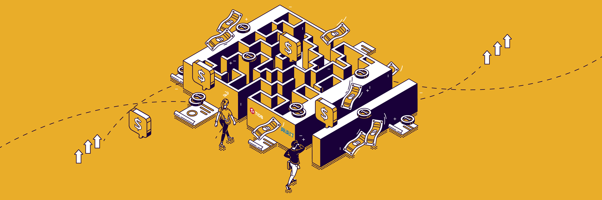

**Industry:** Mobile Payment

**Author:** Yu Liu (Senior Architect, China Telecom Bestpay)

[China Telecom Bestpay](https://www.crunchbase.com/organization/orange-finance) is a mobile payment and Internet finance subsidiary of [China Telecom Corp](https://www.chinatelecomglobal.com/). Bestpay supports more than 8 million offline merchant stores and 170 e-business platforms in China, with the commitment to provide a "safe, convenient, and trendy" payment solution. In 2019, Bestpay had 50 million monthly active users, 230 million transactions per month, and 1.75 trillion transactions per year.

I am a senior architect at Bestpay. My colleagues and I must constantly improve the efficiency of our software to keep pace with our company's rapid growth and to respond to fierce market competition. One area in which we have made great strides is our database. After careful investigation, we migrated to [TiDB](https://docs.pingcap.com/tidb/stable), a **MySQL-compatible**, **open-source**, **distributed SQL database**, which boosted the overall performance of Bestpay's application system by 3–5 times.

In this blog post, I will introduce the outcomes we achieved with TiDB, the difficulties we overcame, how we migrated to TiDB step-by-step, and why we put our faith in TiDB.

## Outcomes

*"Adopting TiDB has transformed our system. Not only does it help us meet regulatory specifications, it greatly improves the processing capabilities and efficiency of our financial department. It also reduces the complexity of the technical team's work." Bestpay Technical Infrastructure Team*

Currently, Bestpay's application layer and core platform layer both use TiDB to provide services. Here are some major outcomes we achieved after migrating to TiDB:

* Risk control supervision
    * Batch processing performance has improved by more than 3 times.
    * The anti-money laundering system's processing efficiency has increased by 5 times.

* Payment reconciliation

    **The performance of the reconciliation platform has increased by 2 times**. For example:

    * To reconcile UnionPay cardless payments, the original MySQL solution took 3–5 minutes. Now, TiDB only takes 1–2 minutes.
    * To reconcile WeChat Pay payments, the original MySQL solution took 3 minutes. Now, TiDB only takes about 1 minute.

* Personal billing

    The user experience and activity have both improved. TiDB solves the issues caused by the previous MySQL sharding solution, including the following:

    * **Database capacity:** Now, a single table in TiDB has nearly 10 billion rows. Previously with MyCAT, a single table could have a maximum of 100 million rows, and a large table had to be split each month.
    * **Data storage duration:** With TiDB's horizontal scalability, data can be stored for 3–5 years or even longer. When we used MySQL, data could only be stored for half a year.
    * **Query efficiency:** Queries per second (QPS) increased by 50%, and the latency decreased by 20%–30%.

Now you've got a basic idea of where we stand. However, achieving excellence has never been smooth sailing. We hope that learning about our difficulties and how we overcame them will inspire you in your own work.

## Difficulties

To follow government regulations, the calculation for suspicious patterns and risk rating must be completed the day after the payment is made. This requirement poses a challenge to the processing time of our system.

Previously, a batch processing task would take 7–8 hours, and the overall task would last for 15 hours or more each day. As the data volume surges, our application system has a greater risk of missing the performance target.

We must quickly optimize the database to meet the 2003 SQL standard as well as achieve the following performance requirements :

| Task | Required completion time |
|---|---|
|Join multiple tables, and query less than 10 million rows in the result set.| <= 5 seconds|
|Load data files in batches.|<= 30 minutes  (Example: 20 GB of data total)|
|Delete 500,000 rows from hundreds of millions of rows.|<= 10 seconds|
|Delete 20 million rows from 300 million rows.|<= 10 seconds|
|Update 1 million rows among 300 million rows.|<= 5 minutes|

In addition to excellent performance, we want our database to scale so it can **support future business growth with great functionality, scalability, stability, and availability**.

## Migration strategy

After in-depth discussions with the TiDB team, we developed the following three-step migration strategy:

* Evaluate our application scenarios to put forward a concrete database migration method.
* Pilot the method on a smaller scale.
* Go further to the core platforms.

### Modeling

After comprehensive tests and evaluation, we decided that new projects using relational databases will choose from three solutions—an internal relational database service (RDS), Sharding-Sphere (S-S), and TiDB. We built an evaluation model that defines guidelines for when to use each solution:

| Solution | Capacity | QPS      | Big tables | Sharding     | HTAP support | Topology                            |
| -------- | -------- | -------- | ---------- | ------------ | ------------ | ----------------------------------- |
| RDS      | < 3 TB   | < 20,000 | < 10       | N/A          | No           | One source, one replica             |
| S-S      | 3–10 TB  | > 20,000 | < 20       | By date/hash | No           | Multiple sources, multiple replicas |
| TiDB     | > 3 TB   | > 20,000 | >= 20      | N/A          | Yes          | Elastically scaling                 |

The model is based on several dimensions—capacity threshold, performance threshold (QPS), the number of large tables, sharding rules, HTAP capabilities, and topology.

**TiDB is preferred** when:

* The amount of data is greater than 3 TB.
* QPS is expected to exceed 20,000.
* There are more than 20 large tables.
* Sharding rules are difficult to define.
* Both transactional and analytical queries are processed.

### Piloting

The Bestpay application client includes a personal billing system. It allows users to manage, query, classify, and display statistics on their transactions.

According to the evaluation model, the personal billing system falls into the TiDB category, so we used it as the pilot project.

We then formulated the application database migration principles:

* Simultaneously write the application data into the old database and the new database running in parallel, and gradually switch traffic to the new one.
* Data must not be lost or wrong.
* After verification, sensitive services need to be quickly switched to the new database.
* During the migration, traffic can be switched to the old database at any time.
* Some sharded and partitioned tables need to be merged.

Following the principles, we used TiDB's [data migration tools](https://docs.pingcap.com/tidb/stable/migration-overview) to perform the migration task in a short time.

### Empowering

After the pilot's success, we continued our quest and chose TiDB to empower two of our core systems—the reconciliation platform system and anti-money laundering system.

The reconciliation platform system involves multiple large tables, each of which exceeds 1 billion rows. The total data volume exceeds 8 TB. The application logic is relatively complex, and the data concurrency is moderate.

After the migration, the core payment system receives the user transactions and sends them as files to a file analysis program. The program saves the analysis results to the TiDB database. The reconciliation platform reads data from TiDB to complete the reconciliation process and to provide querying services to the web interface.

For the anti-money laundering system, the amount and types of monitoring data have increased rapidly. After the migration, the data is replicated from the original Oracle database to TiDB through the Oracle GoldenGate (OGG) for MySQL client; other data on the big data platform are directly replicated from Hive to TiDB using the big data publishing feature.

## Why we chose TiDB

*"The TiDB team understands our core business, and we're impressed with their ability to design and improve a distributed database architecture." Bestpay Technical Infrastructure Team*

For payment service providers, risk control is top priority. On top of this, we must adapt to business development and evolving application scenarios, and plan for the future. This mindset drives us to adopt a scalable, flexible architectural design and pursue higher data processing efficiency.

After the many difficulties we conquered together with the TiDB team, there is no doubt that they are worthy of our trust!

## What's next

Bestpay will migrate more large-scale and fast-growing core systems to TiDB. These core system databases have hundreds of millions of rows, and a single database stores more than 10 TB of data. The core business must have minimal or zero downtime, which places higher demands on the database.

But we believe in TiDB's capabilities, and we have the confidence and motivation to do this well.
