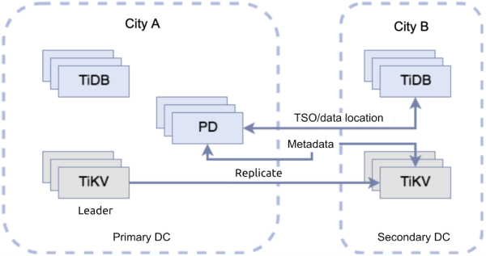
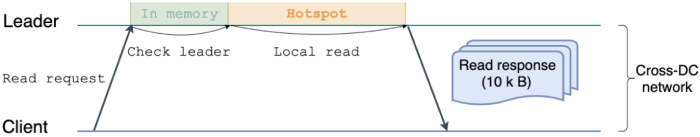
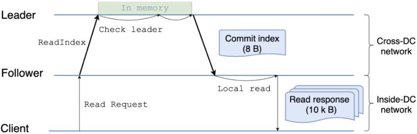
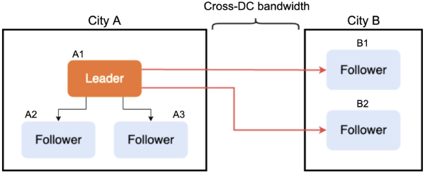
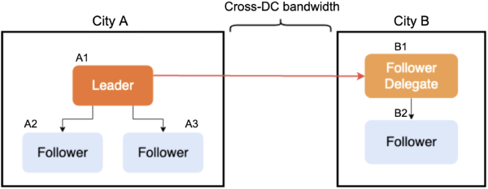
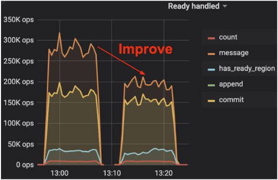
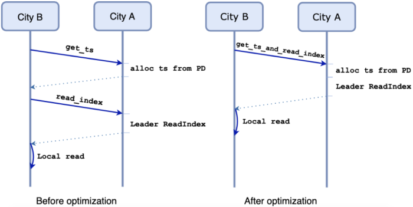
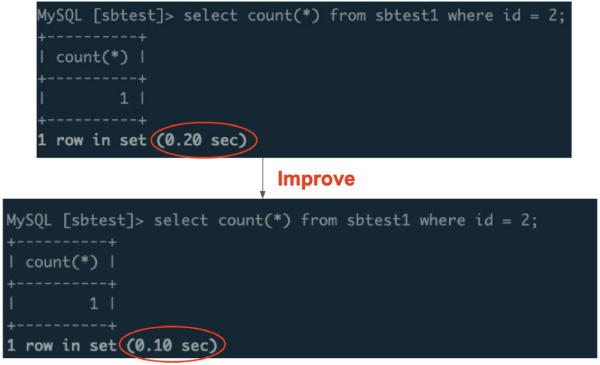
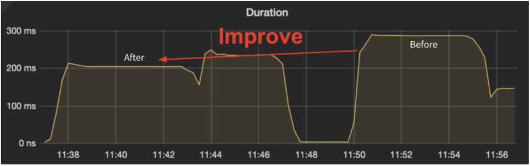
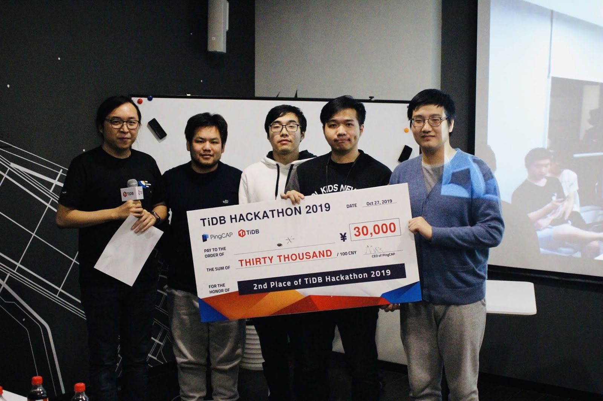

In data-critical industries like the financial industry, data storage and access need a **high availability architecture**. Within this architecture, if a server goes down, the system can still provide services. But if a natural disaster like an earthquake occurs, there might be a network partition or, even worse, all the servers in the data center (DC) could fail. In this case, to guarantee system availability, we need a **remote disaster recovery architecture**. What's more, it's better to keep a long distance between data centers, so that a disaster in one region won't make a huge impact on another.

However, this architecture has two limitations:

* **High read latency**. Generally, the cross-region network round trip time (RTT) is dozens or even hundreds of milliseconds (ms).
* Cross-region network facilities involve **high hardware costs**. Besides, the service capability for existing facilities is not strong enough. Therefore, **the performance for distributed databases is not high**. Building or leasing a private network across regions is expensive, and the bandwidth is limited. In a multi-region active-active architecture, replicating data among multiple regions can cause a bottleneck. 

At [PingCAP](https://pingcap.com/en/)'s [TiDB Hackathon 2019](https://pingcap.com/blog/insert-into-tidb-hackathon-2019-values-hack-fun-tidb-ecosystem/), we had fun hacking a project to mitigate these issues. We used the [Raft algorithm](https://raft.github.io/) to mitigate [TiDB](https://en.wikipedia.org/wiki/TiDB) multi-region latency, and we were able to optimize the following:

* **The read latency for multi-region SQL queries dropped by 50%.**
* **The number of cross-region messages decreased by 50%. This means the network traffic was reduced by half.**

In this post, we'll introduce how we reduced the read latency and network traffic by half for a multi-region architecture. If you have similar problems, we hope this post will help you.

## A sample multi-region architecture

Before we explain the technical implementation, let's assume a sample multi-region architecture as follows:

 Primary and secondary data centers 

In the figure, the two dotted boxes indicate two DCs. 

The box on the left is the primary DC in City A. This DC deploys the following:

* Some [TiDB servers](https://pingcap.com/docs/stable/architecture/#tidb-server) (the SQL layer for the cluster)
* The majority of [TiKV servers](https://pingcap.com/docs/stable/architecture/#tikv-server) (the underlying storage engine for [TiDB](https://pingcap.com/docs/stable/overview/))
* The [Placement Driver (PD) servers](https://pingcap.com/docs/stable/architecture/#placement-driver-server) (the managing component of the entire cluster)
* The [leader](https://pingcap.com/docs/v3.1/glossary/#leaderfollowerlearner) replica for a Raft range

The box on the right is the secondary DC in City B. The remaining TiKV servers and TiDB servers are in this DC. Users can read data from either DC, but only write data to the primary one, City A. 

Write requests can only be proposed to TiDB servers in the primary DC and then sent to TiKV servers in the primary DC. These new updates are replicated to other TiKV servers in the secondary DC with the Raft protocol. If you are familiar with this protocol, it's easy to realize that if there are N TiKV servers in the secondary DC, one data update is sent to the secondary DC N times. This approach results in high network traffic.

Then, let's consider reads. Inside TiDB, a typical process for reading data from City B is as follows:

1. A TiDB server in City B sends a request to a PD server in City A to obtain timestamp Oracle (TSO) information. It gets the transaction start ID, `start_ts`.

    This step takes one round-trip time (RTT).

2. As shown in the figure below, the TiDB server in City B sends multiple parallel read requests to the TiKV leader in City A for each range involved in this process. 

    This step also takes one RTT.

 Read request processing 

We can see that TiKV [followers](https://pingcap.com/docs/v3.1/glossary/#leaderfollowerlearner) in City B are not involved in this process. 

This implementation has two issues:

* Multi-region network bandwidth is highly occupied.
* The read latency (two RTTs) is high.

Now let's see what we can do to alleviate these problems.

## How to reduce multi-region network traffic

[TiDB 3.1 Beta](https://pingcap.com/docs/v3.1/releases/3.1.0-beta/) introduced a new open source feature, [Follower Read](https://pingcap.com/docs/v3.1/reference/performance/follower-read/), to  reduce multi-region network bandwidth. In addition, our project introduced Follower Replication and successfully decreased multi-region network traffic by half.

### Reducing multi-region network traffic with Follower Read

As [our previous post](https://pingcap.com/blog/doubling-system-read-throughput-with-only-26-lines-of-code/) discussed, Follower Read lets any follower replica in a Region serve a read request under the premise of [strongly consistent reads](https://pingcap.com/docs/v3.1/reference/performance/follower-read/#strongly-consistent-reads). This feature reduces the load on the leader and improves the throughput of the TiDB cluster. 

When Follower Read is disabled, the TiKV leader needs to handle each read request. After the feature is enabled, the TiKV leader only needs to handle a `read_index` request instead of the whole read request. Generally, a `read_index` request only involves location information interaction without data exchange, so it's lightweight. Therefore, the load stress on the TiKV leader is remarkably reduced. 

The optimization is effective, as shown in the following figure:

 Read request processing with Follower Read enabled 

    <a href="/download" onclick="trackViews('How We Reduced Multi-region Read Latency and Network Traffic by 50%', 'download-tidb-btn-middle')"><button>Download TiDB</button></a>
    <a href="https://share.hsforms.com/1e2W03wLJQQKPd1d9rCbj_Q2npzm" onclick="trackViews('How We Reduced Multi-region Read Latency and Network Traffic by 50%', 'subscribe-blog-btn-middle')"><button>Subscribe to Blog</button></a>

### Reducing multi-region network traffic with Follower Replication

Our [previous post](https://pingcap.com/blog/2016-11-09-Deep-Dive-into-TiKV/#raft) mentioned that the TiKV cluster implements the Raft protocol to ensure data consistency. In a Raft group, the leader replicates an entry to all followers to keep logs consistent. When the entry is replicated to the majority of peers in a Raft group, it means that it is successfully written to TiKV. 

But a problem might occur: sometimes TiKV servers are deployed worldwide in different DCs, so cross-DC network costs and latencies are high. Because there is only one leader, messages are frequently transmitted between DCs.

For example, we need five replicas to ensure data availability in the production environment to tolerate two replicas failing. Let's name the three replicas in City A as A1, A2, and A3, and replicas in City B as B1 and B2. 

**Note:** Because we must ensure data integrity when a data center fails, in a real production environment, A1, A2, and A3 in City A shouldn't be deployed in one data center. However, here we only care about network transmissions between different cities, so let's ignore these details.

In the Raft group formed by these replicas, A1 in City A is the leader. A1 needs to broadcast an entry to B1 and B2 in City B. This broadcast involves at least two cross-DC (cross-region) network transmissions, as shown in the following figure:

 Message broadcasting 

For this issue, we introduced the [Follower Replication](https://github.com/tikv/raft-rs/pull/249/) feature that aimed to minimize multi-region network transmissions. 

To implement Follower Replication, the leader should know about all Raft peers and their DCs. 

Here, we introduce a new concept: Group. Each Raft peer has a corresponding Group ID. Peers with the same Group ID are in the same DC. The leader knows the Group ID of each Raft peer. When the leader broadcasts a message, it chooses a peer as a follower delegate in a Group and sends the information Group members need to the delegate. Then, the delegate replicates data to the other members in the Group, as shown in the following figure:

 Message broadcasting with a follower delegate 

After we introduced Follower Replication, messages sent by the leader dropped by half. This dramatically decreases the multi-region bandwidth stress and reduces the overhead for the leader to send network messages. 

 Messages dropped by half 

Actually, the Follower Replication implementation is complicated. We'll describe it in detail in a future post.

We've drafted a [request for comments (RFC) document](https://github.com/tikv/rfcs/pull/33) to optimize the Raft protocol and filed a [pull request (PR)](https://github.com/tikv/raft-rs/pull/249/) to [raft-rs](https://github.com/tikv/raft-rs). We have also [contributed](https://github.com/etcd-io/etcd/issues/11357) to [etcd](https://github.com/etcd-io/etcd), the raft-rs upstream project.

## How to reduce multi-region read latency

As we mentioned above, when Follower Read is enabled, we can substantially reduce multi-region network traffic. But in our sample architecture, TiDB still needs two RTTs across regions. The high latency is caused by the engineering implementation: TiDB obtains a TSO from PD (one RTT) and reads the index (another RTT). 

To reduce the high read latency, we add a proxy service in City A, which can handle `get_ts_and_read_index` requests: 

 Before and after optimizing Follower Read 

With the optimization, the multi-region read request latency drops from two RTTs to one RTT. It's because the client in City B sends one `get_ts_and_read_index` request to a proxy in City A, instead of sending the `read_index` request after receiving the `get_ts` response. Although the proxy in City A still needs to allocate the timestamp and get `ReadIndex` one by one, one RTT is saved.

We simulated a cross-region network environment with a 100 ms network latency. After we optimized Follower Read, the read latency was reduced from 200 ms to 100 ms.

 Reducing the read latency by half 

We simulated another high-latency network environment and tested the read latency for prepared statements. The execution implicitly contained a cross-region network interaction operation. Therefore, as the following figure shows, the read latency dropped from 300 ms to 200 ms.

 Benchmark in a simulated high-latency network environment 

When no atomic clock is available, to guarantee linearizability, one request is required to obtain the TSO. Considering this fact, one RTT is the optimal result for the current architecture.

## Evaluation for this project

 2nd place winners at TiDB Hackathon 2019 

Our project won 2nd place at TiDB Hackathon 2019 and received positive comments: 

"We're glad to see that the multi-region reads and writes optimization project lets TiDB boost its multi-region architecture capabilities."

"With the joint cooperation of community contributors, I believe that TiDB will deliver a Google Spanner-grade user experience for customers in the future."

-- Xiaoguang Sun (Backend Search Manager at [Zhihu](https://en.wikipedia.org/wiki/Zhihu))

"Generally, we recommend that users deploy TiDB components in three DCs with five replicas within the same city or in two cities. Among the three DCs, one has a single replica and each of the others has two replicas. The network lease cost is the main investment for this architecture. In a stress test, we found that the network bandwidth was fully occupied under extreme stress." 

"This Hackathon project notably reduced the network bandwidth across DCs and cut TiDB customers' expenses."

-- Tianshuang Qin (Senior Technical Support Director at PingCAP)

## Further thoughts

The optimizations discussed above are not final implementations. In addition to these problems, we have more issues to resolve or optimize in the multi-region architecture. For example:

* **Reducing the latency for interactive read transactions to one RTT**

    After we optimized Follower Read, we reduced the latency of a _non-interactive _read transaction from two RTTs to one RTT. However, in an interactive read transaction, the ranges involved aren't known until the  transaction starts. Also, we can't predict the `read_index` for each range involved in a read request. Therefore, we can only handle the first read request and `get_tso` in parallel. Thus, N+1 RTTs is reduced to N RTT(s), where N is the number of read statements for interactive transactions. 

    We can also reduce the latency for read transaction to one RTT if we do the following:

    * Find the relationship between the timestamp and the committed index.
    * Regularly maintain the safe timestamp. Transactions with a timestamp less than the safe timestamp have been committed or aborted.

* **Implementing cross-DC scalability**

    In common scenarios for cross-DC read requests, we don't need the most up-to-date data. What we should figure out is what syntax we must provide so read requests in this scenario can read data locally with zero RTT. Thus, reading data will no longer rely on the primary DC, and we can achieve database horizontal scalability across data centers in different regions.

The scalability achieved via hardware is limited. Only by continuously optimizing software can we get the highest performance under the given hardware conditions.

Currently, [our project](https://github.com/pingcap/community/issues/86) is in the incubation stage. After we put our project into operation, we hope that TiDB's multi-region network latency and bandwidth can be remarkably optimized.
