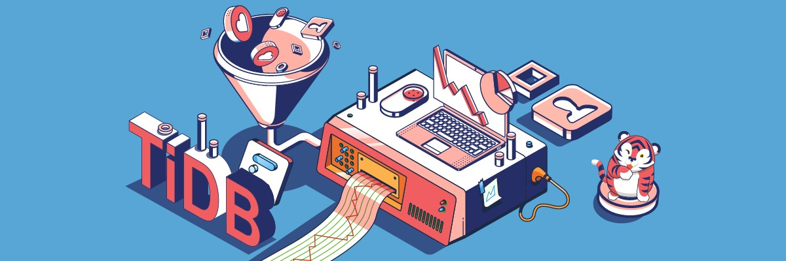
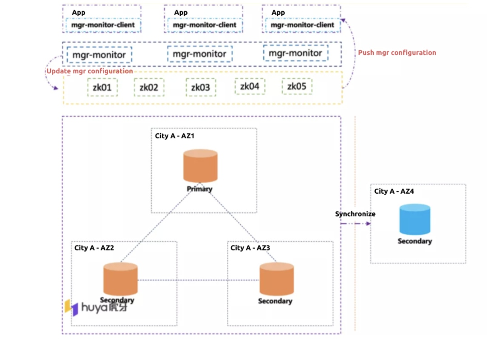

**Industry:** Live Streaming

**Author:** Hualiang Huang (Head of the Database Team & Architect at Huya Live)

**Transcreator:** [Caitin Chen](https://github.com/anotherrachel); **Editor:** Tom Dewan

[Huya Live](https://en.wikipedia.org/wiki/Huya_Live), China's Twitch, is one of the largest live streaming platforms in China. It mainly focuses on video game live streaming, covering 3,800 games. In addition, it offers a wide range of other live broadcasts, including traditional sports, cooking, music, beauty, outdoor, and reality shows. It has 178 million+ monthly active users. It operates globally as Nimo TV, with 30 million+ monthly active users.

At Huya Live, we use MySQL as our main database. **As our business grew, our storage capacity became a bottleneck. We tried sharding, but it had many drawbacks.** In Online Transactional Processing (OLTP) scenarios, **our live broadcasts had high latency, and our database maintenance cost was high**.

To solve these problems, we chose [TiDB](https://docs.pingcap.com/tidb/stable), an open-source, high-performance, distributed SQL database. Now, we use TiDB in real-time Online Analytical Processing (OLAP), database sharding, and big data offline scenarios. **It helps us achieve database scalability, high availability, and strong consistency with low costs.** In our big data offline application, our **queries are 6x faster**. In our near real-time OLAP application, our **query performance improved by more than 2x.**

In this post, I'll share our database challenges, why we chose TiDB to solve our pain points, how we use it, and our future plans. I hope our experience can inspire you if you ever need to select a database.

## Our pain points

### Difficult to scale out storage capacity

We had many instances with 1 TB+ of data in order processing, private messaging, video-on-demand, payment, and other applications. This caused the data scalability issue. To solve this problem, we tried MySQL sharding based on applications. But this solution was not ideal, because:

* It was intrusive to the applications.
* As our data continuously grew, we had to reshard databases.
* We had high application refactoring and maintenance costs. 

Based on certain rules, we could archive our data. But this was only suitable for some specific application scenarios.

### Undesirable performance of live streaming

In OLTP scenarios, our live broadcasts had high latency. We hoped that:

* We could reduce latency.
* Our applications could respond more efficiently.
* When traffic surged, our databases could quickly scale out to improve our data read and write capabilities.

We also wanted an integrated Hybrid Transactional/Analytical Processing (HTAP) architecture that could meet the OLAP application requirements.

### High costs

After we separated reads and writes for MySQL-based applications, we faced the data consistency issue. We could use proxy middleware to solve it, but this did not work well.

To achieve 99.9% availability, we deployed a cluster across multiple availability zones (AZs) in one city and deployed a cluster in multiple regions for disaster recovery. But our data storage cost doubled.

In addition, our data processing pipeline for offline applications was long. Therefore, the overall maintenance cost was high, and the infrastructure was complicated.

## Our database requirements

* **Horizontal scalability**

    The database should scale out and scale in easily according to our needs so that we didn't need to worry about our storage capacity.

* **High availability**

    The database system should be 99.99% available.

* **Low costs**

    We hoped to continuously reduce database costs while maintaining database stability.

* **High performance**

    We had two requirements for database performance:

    * For broadcast OLTP applications, the database should have better performance in high-concurrency scenarios such as game finals and season matches.
    * For OLAP applications, the database should more efficiently meet the needs of complex queries and real-time applications. That is, we required high-performance OLTP applications. Traditional big data architectures had trouble meeting the performance requirements of real-time data warehouses and other OLAP applications on the database.

* **Strong consistency**

    We wanted strong consistency for financial applications such as payment. We also hoped to achieve strong consistency for remote disaster tolerance.

## Why we chose TiDB, a NewSQL database

### What is TiDB?

TiDB is an open-source, distributed SQL database that supports HTAP workloads. It is MySQL compatible and features horizontal scalability, strong consistency, and high availability. You can learn more about TiDB's architecture [here](https://docs.pingcap.com/tidb/stable/tidb-architecture).

### TiDB's strengths

We chose TiDB because:

* **It's mature**.

    Since TiDB 1.0 was released in 2017, it has constantly evolved. Its current version, 5.0, is a mature database, and it's increasingly complete. 

* **It's highly compatible with MySQL**.

    We used MySQL to store data. TiDB is highly compatible with the MySQL protocol. Therefore, the migration cost is low, and we spent minimal time refactoring our applications.

* **It's elastic.**

    TiDB's distributed architecture supports scaling in or out with a single command. This process has no impact on the application. TiDB is transparent to the application.

* **It has low costs**.

    In real-world cases, TiDB turns on high compression and uses three copies of the data by default. Compared to MySQL with dual copies, TiDB often has lower storage cost.

    In addition, TiDB has a rich ecosystem, and it's easy to operate and maintain. It supports one-command scaling in or out, automatic high availability, and online data definition language (DDL). It has low usage costs in most scenarios.

* **It guarantees strong consistency**.

    TiDB uses Multi-Raft to ensure strong consistency. Data is strongly consistent across AZs in one city and in different cities for disaster tolerance.

* **It has high performance**.

    TiDB's storage engine uses a log-structured merge-tree (LSM tree). It converts all random writes into sequential writes to meet high-performance OLTP scenarios. What's more, [TiSpark](https://docs.pingcap.com/tidb/stable/tispark-overview) + [TiFlash](https://docs.pingcap.com/tidb/stable/tiflash-overview) + Massively Parallel Processing (MPP) is suitable for real-time, high-performance OLAP scenarios.

## How we use TiDB

### Migrating from MySQL shards to TiDB

In August 2019, to scale our databases and quickly respond to complicated queries for OLAP applications, we started to use TiDB 3.0 in some non-mission-critical applications.

Previously, we sharded our databases based on the day, kept data according to a certain strategy, and deleted historical data regularly. We also needed to analyze data in some OLAP scenarios. We had two issues:

* Offline data's storage cost was high.
* Data freshness of our offline analysis was not high, and query performance was not ideal.

After we introduced TiDB:

* The storage cost was reduced.
* We replicated data from MySQL to TiDB. TiDB is running in our OLTP applications. It also stores a data copy in TiFlash. This meets the needs of real-time queries.

TiDB brings us these advantages:

* **It reduces the application complexity caused by MySQL sharding.**
* **We can implement a hybrid application scenario of OLTP and OLAP on a single cluster.** This is more convenient than before.

### TiDB in our big data offline application

After we enjoyed TiDB's benefits in non-mission-critical applications, we deployed TiDB in our mission-critical application: a big data platform.

Before we switched to TiDB, some of our scenarios (like an Oracle extract, transform, load) had tables with 100 million+ rows of data. When a huge table joined six or seven tables, we got millions of rows of data returned, and the execution time for some queries was more than one minute.

Our MySQL queries took an average of 14 seconds. After we migrated from MySQL to TiDB, the average query time dropped to two seconds. **Queries were six times faster.**

### TiDB in our nearly real-time OLAP application

Our live broadcast and video application had these issues:

* A high read-write ratio
* Low read performance
* Hard to scale

Previously, we deployed MySQL in a one-primary, multiple-secondary framework. Then, we migrated to the TiDB + TiFlash architecture.

We compared the performance of the original MySQL architecture and the current TiDB architecture in nine scenarios. As shown in the following table, we calculated performance in two ways:

* Formula 1: (MySQL P95 execution time - TiDB execution time) / MySQL P95 execution time * 100%
* Formula 2: (MySQL P95 execution time - TiDB execution time) / TiDB execution time * 100%

<table>
  <tr>
   <td>
<strong>SQL query type</strong>
   </td>
   <td><strong>Query sample</strong>
   </td>
   <td><strong>MySQL avg. execution time (s)</strong>
   </td>
   <td><strong>MySQL P95 execution time (s)</strong>
   </td>
   <td><strong>TiDB execution time (s)</strong>
   </td>
   <td><strong>Performance increase (%) using Formula 1</strong>
   </td>
   <td><strong>Performance increase times using Formula 2</strong>
   </td>
  </tr>
  <tr>
   <td>Slow query of the primary database
   </td>
   <td>SQL 1
   </td>
   <td>3
   </td>
   <td>8
   </td>
   <td>1.6
   </td>
   <td>80.0
   </td>
   <td>4.0
   </td>
  </tr>
  <tr>
   <td>Slow query of the primary database
   </td>
   <td>SQL 2
   </td>
   <td>3
   </td>
   <td>4
   </td>
   <td>1.0
   </td>
   <td>75.0
   </td>
   <td>3.0
   </td>
  </tr>
  <tr>
   <td>Slow query of the primary database
   </td>
   <td>SQL 3
   </td>
   <td>2
   </td>
   <td>2
   </td>
   <td>1.7
   </td>
   <td>15.0
   </td>
   <td>0.2
   </td>
  </tr>
  <tr>
   <td>Slow query of the secondary database 2
   </td>
   <td>SQL 4
   </td>
   <td>576
   </td>
   <td>622
   </td>
   <td>30
   </td>
   <td>95.2
   </td>
   <td>19.7
   </td>
  </tr>
  <tr>
   <td>Slow query of the secondary database 2
   </td>
   <td>SQL 5
   </td>
   <td>149
   </td>
   <td>685
   </td>
   <td>10
   </td>
   <td>98.5
   </td>
   <td>67.5
   </td>
  </tr>
  <tr>
   <td>Slow query of the secondary database 2
   </td>
   <td>SQL 6
   </td>
   <td>83
   </td>
   <td>124
   </td>
   <td>32
   </td>
   <td>74.2
   </td>
   <td>2.9
   </td>
  </tr>
  <tr>
   <td>Slow query of the secondary database 2
   </td>
   <td>SQL 7
   </td>
   <td>19
   </td>
   <td>37
   </td>
   <td>2.0
   </td>
   <td>94.6
   </td>
   <td>17.5
   </td>
  </tr>
  <tr>
   <td>Slow query of the secondary database 1
   </td>
   <td>SQL 8
   </td>
   <td>3
   </td>
   <td>5
   </td>
   <td>12.0
   </td>
   <td>-140.0
   </td>
   <td>-0.6
   </td>
  </tr>
  <tr>
   <td>Slow query of the secondary database 1
   </td>
   <td>SQL 9
   </td>
   <td>8
   </td>
   <td>12
   </td>
   <td>1.0
   </td>
   <td>91.7
   </td>
   <td>11.0
   </td>
  </tr>
</table>

After we switched to TiDB + TiFlash, **we implemented data scalability, and our overall queries were more than two times faster.**

    <a href="/download" onclick="trackViews('How We Scale Out Databases and Get Big Data Queries 6x Faster with a MySQL Alternative', 'download-tidb-btn-middle')"><button>Download TiDB</button></a>
    <a href="/contact-us" onclick="trackViews('How We Scale Out Databases and Get Big Data Queries 6x Faster with a MySQL Alternative', 'contact-us-middle')"><button>Request a Demo</button></a>

### Replacing MySQL Group Replication (MGR) with TiDB

MGR lets users create a server group for fault-tolerant replication. Data write conflicts of multiple nodes caused a large number of transaction rollbacks. Large transactions per second (TPS) and delay jitters occurred. Therefore, MGR was suitable for scenarios with few writes and high read loads.

Each node had limited data processing capability. A single node's capability was limited by the server node's computing resources and hardware cost. We could not continue to increase its data storage and processing capability. Therefore, after the data size reached a certain scale, we needed a distributed database cluster.

We need strong consistency for the live streaming and rewarding application. Our application architecture deploys three clusters in the same city to replicate data and achieve remote disaster tolerance. We connect the MGR cluster to the application and push the MGR cluster configuration to the Apache ZooKeeper (ZK) cluster. We have a detection program for the application that monitors activities every five seconds to determine whether the ZK cluster configuration has changed. Meanwhile, we have a push configuration. When MGR is actively switched, ZK actively pushes it to the client. This leads to high application access cost.

Although MGR can solve the strong consistency issue to a certain extent, we now use a single-node write method. This is because multi-node write may cause data errors due to DDL and data manipulation language (DML) conflicts.

What's worse, our MGR cluster also faced the data scalability issue. We thought we needed to shard the database. This affected data merge statistics. MGR requires low network latency. Network latency or network jitters may cause MGR to frequently switch and the cluster performance to decrease. Therefore, we don't deploy the MGR cluster in different places.

 The MGR cluster at Huya Live 

In addition, because MGR does not control flow well, it often jitters in large transactions. The MGR has a remotely deployed architecture with multiple data copies, and data cannot be compressed. The deployment cost is high.

TiDB 5.0 optimizes its cross-data center deployment feature. We're trying to port the MGR solution to TiDB. When we do, we'll be able to:

* **Achieve database scalability.**
* **Control the flow better.** For example, we can place restrictions on transactions, and we can split large transactions for the application.
* **Control the flow in the server.**

## Our future plans

Now, we're using TiDB in real-time OLAP, database sharding, and big data offline scenarios. In the future, we hope that:

* TiDB can continuously reduce our database cost while maintaining database stability.
* We can run TiDB in more applications, such as our OLTP applications. We can use TiDB to replace our existing data warehouse products, such as Greenplum and ClickHouse®.
* To reduce operation, maintenance, and application costs, we can unify our OLTP and OLAP technologies and our multiple types of database products.
* We'll evolve our architecture. We're studying TiDB 5.0's new features, including the MPP architecture, the performance improvement, cross-AZ disaster recovery, and the application of strong consistency scenarios like finance.
* We can try TiDB containerization at low cost.

## Our dream distributed database for live broadcast

For live broadcasts, we hope to have a distributed database with these characteristics:

### Low cost

* TiDB uses the Raft protocol to replicate data among multiple data copies. We hope the [PingCAP](https://pingcap.com/) team reduces the cost of data nodes. This is because many application scenarios at Huya Live do not have high requirements for data consistency, but we have high requirements for data availability. This can reduce the database deployment cost.
* The data stream of the database should automatically separate cold data and hot data. Hot data should be in memory and cold data on the hard disk. In the future, if our application is deployed on the cloud, storage cost can be lower.
* We hope TiDB and TiFlash can be independent of each other. For example, some pure OLAP applications can directly run on TiFlash, without TiDB. This can reduce the overall cost.
* TiDB can support the containerization of mainstream public clouds.

### High performance

In the future, we hope that TiDB can allow users to independently choose the level of data consistency. For example, in non-strong consistency application scenarios, users can choose weak consistency to improve performance.

### Rapid elasticity

Live broadcasts, such as events or anchor birthday events, may have some unexpected traffic. We hope that the database can rapidly scale out. For example, for read-only replicas, TiDB can quickly replicate multiple replicas to support the rapid rise of read traffic.

In addition, we hope data can migrate quickly and the write capacity can quickly scale out.

If you want to know more details about our story or have any questions, you're welcome to join the [TiDB community on Slack](https://slack.tidb.io/invite?team=tidb-community&channel=everyone&ref=pingcap-blog) and send us your feedback.
