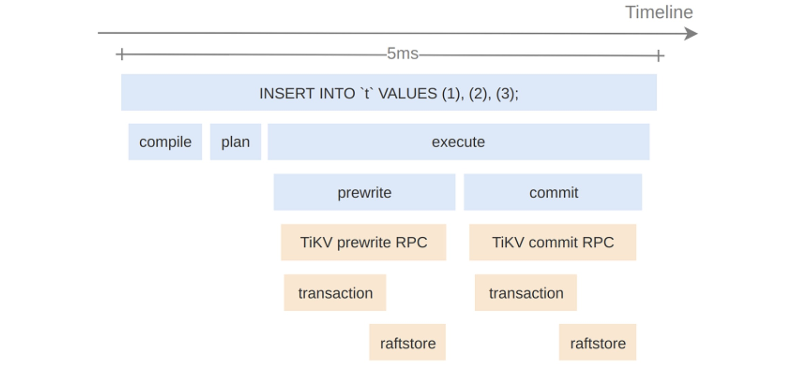
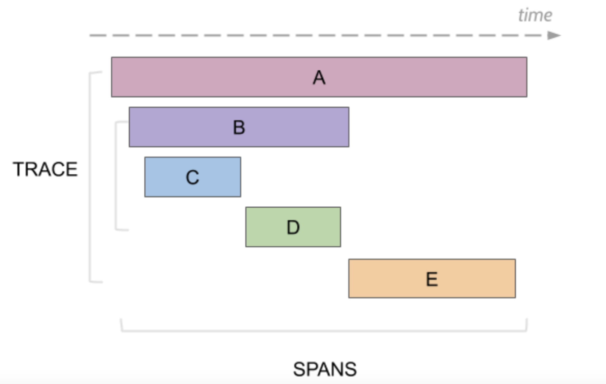
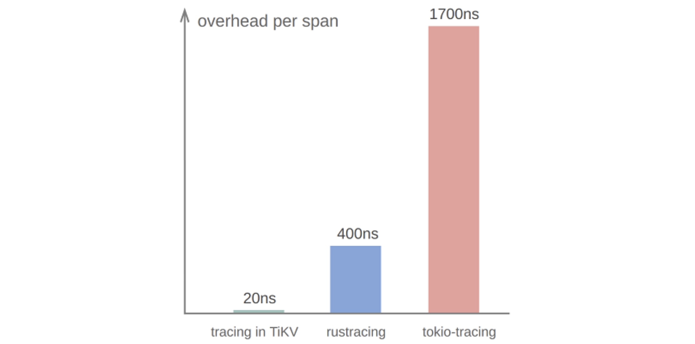
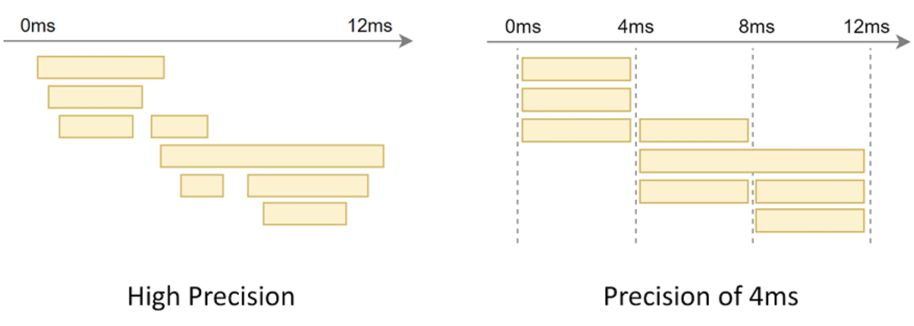
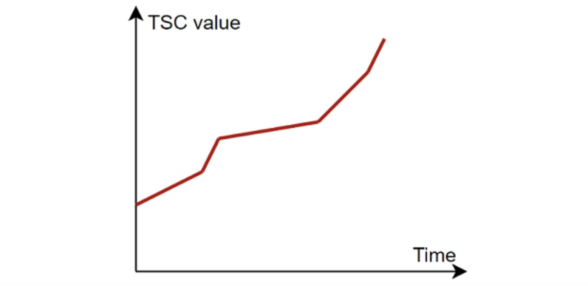
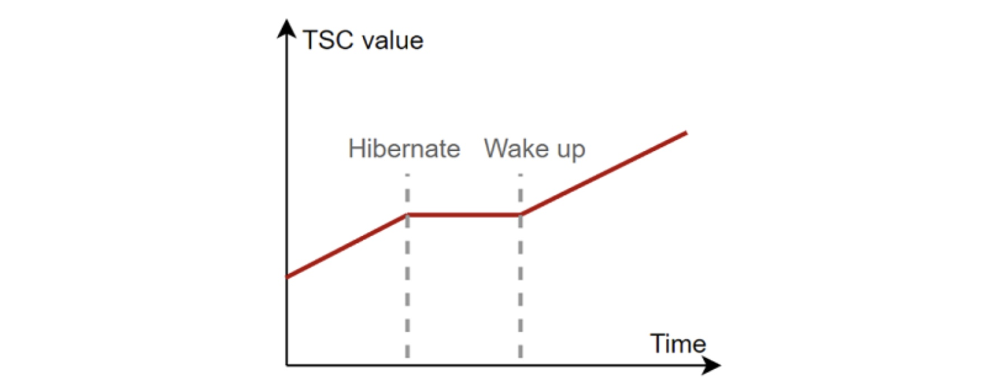
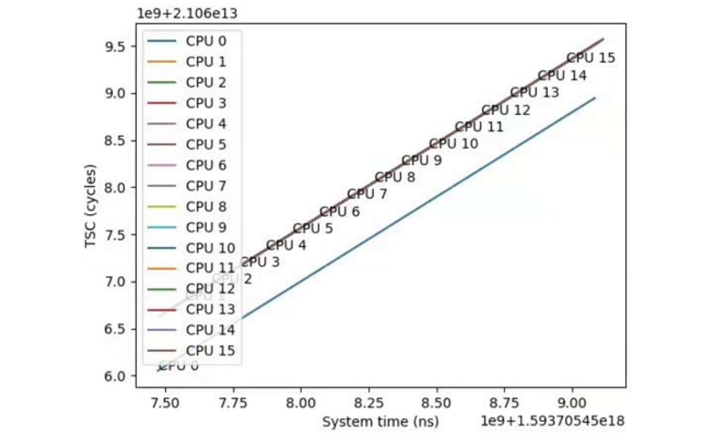
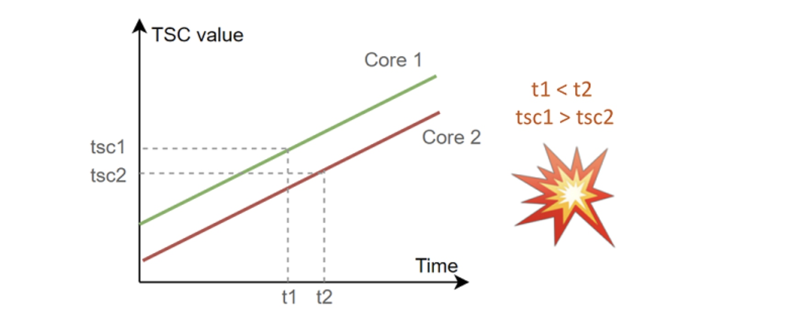
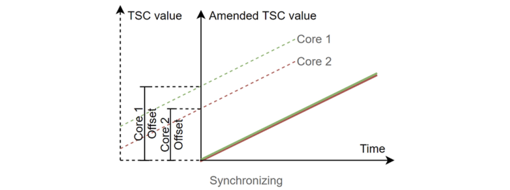
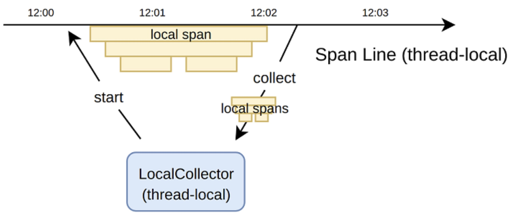

**Author:** [Zhenchi Zhong](https://github.com/zhongzc) (Software Engineer at PingCAP)

**Transcreator:** [Caitin Chen](https://github.com/CaitinChen); **Editor:** Tom Dewan


[TiKV](https://tikv.org/) is a distributed key-value database. It has higher performance requirements than a regular application, so tracing tools must have minimal impact. This article describes **how we achieved tracing all requests' time consumption in TiKV with less than 5% performance impact**.

## Background knowledge

Logs, metrics, and traces are the three pillars of system observability. The following figure shows their relationship:


<div class="caption-center"> Logs, metrics, and traces </div>

* Logs record discrete error and status information.
* Metrics record and present aggregatable data.
* Traces are a series of events for a single request.

TiKV has a complete log and metric system, but lacks traces. Therefore, when we troubleshoot TiKV and TiKV's SQL layer, [TiDB](https://docs.pingcap.com/tidb/stable), we may encounter these issues:

* **There is no correlation between observation data.** To trace and diagnose the system, you must understand all the operations in a request and their corresponding metrics. Few people have such comprehensive knowledge.
* **It's difficult to trace request jitters.** Monitoring metrics such as AVG, P99, and MAX don't reflect requests' performance jitter when request payloads are mixed together.
**Tracing solves the two problems.** Now, I'll share in detail how we implemented high-performance tracing in TiKV. It is still an experimental feature in TiKV, and, to open it, you need a specific code branch. If you're interested, follow [Introduce tracing framework (#8981)](https://github.com/tikv/tikv/pull/8981) on GitHub.

## Basic concepts

Tracing shows the execution path of a request in the system. For example, the following figure is a trace of an SQL statement's execution process from TiDB to TiKV:


<div class="caption-center"> Tracing an SQL statement's execution </div>

From this figure, we can learn the following information about the `INSERT INTO t VALUES (1), (2), (3);` statement:

* When TiDB processes this request, it performs three steps: compiling, planning, and executing.
* When TiDB executes this statement, it calls TiKV's Prewrite remote procedure call (RPC) and Commit RPC.
* The request takes 5 ms.

In the figure, a box represents an event called a "span." Each span contains:

* An event name
* Start and end timestamps

Spans are hierarchical, forming a parent-child relationship or a sequence relationship, as shown in the [figure](https://www.jaegertracing.io/docs/1.23/architecture/) below:


<div class="caption-center"> Spans </div>

## Implementation

In this article, unless otherwise specified, we used the following test platform:

* CPU: Intel Core i7-8700
* Linux distros: Ubuntu 20.04
* Linux kernel: 5.4
* Memory: 32 GB
* Disk: NVM Express<sup>®</sup> (NVMe) SSD

TiKV is written in Rust. The Rust community has several off-the-shelf tracing libraries, for example, [tokio-tracing](https://github.com/tokio-rs/tracing),[ rustracing](https://github.com/sile/rustracing), and[ open-telemetry](https://github.com/open-telemetry/opentelemetry-rust). They all follow the OpenTracing specification, but **their performance is not ideal**. We discovered that TiKV's performance can be reduced by more than 50% when introducing these libraries.

TiKV's **tracing implementation impacts performance by less than 5% by tracing and collecting spans efficiently, which only takes 20 ns**.


<div class="caption-center"> Overhead per span </div>

Now let's see how it works.

### Time measurements

Time is measured frequently in tracing. Each span needs two timestamps: the event's start and end time. Therefore, timing performance is critical.

Generally, to measure time for tracing, the measurement must ensure:

* The timestamp monotonically increases
* High performance
* High precision

#### `std::Instant`

Rust offers two structures in `std` to measure time:

* `std::SystemTime::now()`

    It obtains the current system time. The downside is that the obtained timestamp is not monotonic, for example, when a user manually changes the clock, or there is a NTP service.

* `std::Instant::now()`

    It obtains monotonically increasing timestamps with nanosecond precision. Most Rust tracing libraries use it, but its performance is not ideal: it takes 50 ns to obtain timestamps twice. This is one of the reasons why most Rust tracing libraries do not trace efficiently.

#### Coarse time

If you need efficient time measurement, coarse time is usually a good choice. Coarse time can be obtained by passing `CLOCK_MONOTONIC_COARSE` to the `clock_gettime` system call in Linux. The Rust community provides the [`coarsetime`](https://docs.rs/coarsetime/0.1.18/coarsetime/) crate to read coarse time easily:



```
coarsetime::Instant::now()
```

Coarse time is so fast that it takes only 10 ns to obtain two timestamps. Its precision is low though, depending on Linux's configuration. The default precision is 4 ms.

**In most cases, coarse time can be the first choice**, as:

* It's out of the box in the Linux system and easy to obtain.
* For most applications, the 4 ms precision is acceptable.

However, in TiKV's tracing scenarios, low-precision time measurement can lead to confusing results as shown below:


<div class="caption-center"> High precision vs. low precision for time measurement </div>

To support tracing at microseconds or even nanoseconds precision while keeping performance, we use **Time Stamp Counter (TSC)**.

#### TSC

The TSC register has existed in modern x86 architecture CPUs since the Pentium processor introduced in 2003. It records the number of CPU clock cycles since reset. When the CPU clock rate is constant, it can be used for high-precision timing.

**The TSC meets the requirements of monotonic increase, high precision, and high performance at the same time.** In our test environment, it only takes 15 ns to fetch TSC twice. 

The TSC register cannot be used directly. When it's used as a time source, it has several problems that affect the accuracy, as listed below.

##### TSC increment rate

TSC increment rate is determined by the CPU frequency. **Modern CPUs may dynamically adjust its frequency**, for example, to save energy. As a result, **the TSC increment rate is not constant**:


<div class="caption-center"> TSC increment rate </div>

In addition, **some CPUs do not increase the TSC in sleep mode**:


<div class="caption-center"> TSC doesn't increment when the CPU sleeps </div>

Some modern x86 architecture CPUs provide features to ensure the TSC increments at a constant rate. In Linux, you can use CPU flags in `/proc/cpuinfo` to check whether the TSC increment rate is constant:

* `constant_tsc`: the TSC increments at the processor's nominal frequency instead of instantaneous frequency.
* `nonstop_tsc`: the TSC increments even when the CPU is in sleep state.

##### TSC synchronization

Even if TSC is constant, it cannot be used to measure time. In the x86 architecture, **TSC registers are not guaranteed to be synchronized among all CPU cores**. The following figure shows the measured TSC on a laptop produced in 2020 equipped with the latest x64 CPU at that time. As we can see, among the 16 cores, CPU 0's TSC value has an offset.


<div class="caption-center"> TSC values for 16 CPU cores </div>

Recall that in tracing, each span needs two timestamps, representing the start and end of the event. Due to the thread scheduling, the reads of the two timestamps may happen on different CPU cores. As a result, the delta of the two TSC values can produce incorrect elapsed time **when the TSC is not synchronized between cores.**

For example:

1. At t1, the thread is running on Core 1 and reads tsc1.
2. The operating system schedules the thread from Core 1 to Core 2.
3. At t2, the thread is running on Core 2 and reads tsc2.


<div class="caption-center"> An example of TSC value calculation for multiple cores </div>

In the example above, the elapsed TSC (tsc2 - tsc1) is even negative!

To solve this problem, **TiKV synchronizes the TSC value of each core by calculating TSC offsets:**

1. TiKV arbitrarily takes two TSC values at two physical times on each core.
2. The physical time is used as the x-axis, and the TSC values are used as the y-axis. They can be used to form a line. 
3. The TSC offset of each core is the gap of the line at y-axis, as shown in the following figure:


<div class="caption-center"> TSC value offset </div>

When the TSC offset is calculated, the **process of obtaining the TSC values must not be on the same core**. In Linux, you can use `sched_setaffinity` to set the thread's affinity to make the thread run on a certain core:



```
fn set_affinity(cpuid: usize) -> Result&lt;(), Error> {

  use libc::{cpu_set_t, sched_setaffinity, CPU_SET};

  use std::mem::{size_of, zeroed};

  let mut set = unsafe { zeroed::&lt;cpu_set_t>() };

  unsafe { CPU_SET(cpuid, &mut set) };

  // Set the current thread's core affinity.

  if unsafe {

      sched_setaffinity(

          0, // Defaults to current thread

          size_of::&lt;cpu_set_t>(),

          &set as *const _,

      )

  } != 0

  {

      Err(std::io::Error::last_os_error().into())

  } else {

      Ok(())

  }

}
```

Now, we know the TSC offset of each CPU core. Next, we need to find out which CPU core we're working on. This can be obtained by **using the RDTSCP command**, which helps us atomically get the TSC value and CPU ID at the same time.

The Rust code is as follows:



```
#[cfg(any(target_arch = "x86", target_arch = "x86_64"))]

fn tsc_with_cpuid() -> (u64, usize) {

  #[cfg(target_arch = "x86")]

  use core::arch::x86::__rdtscp;

  #[cfg(target_arch = "x86_64")]

  use core::arch::x86_64::__rdtscp;

  let mut aux = std::mem::MaybeUninit::&lt;u32>::uninit();

  let tsc = unsafe { __rdtscp(aux.as_mut_ptr()) };

  let aux = unsafe { aux.assume_init() };

  // IA32_TSC_AUX are encoded by Linux kernel as follow format:

  //

  // 31       12 11      0

  // [ node id ][ cpu id ]

  (tsc, (aux & 0xfff) as usize)

}
```

The high-precision time measurement has been extracted into a Rust library named [minstant](https://github.com/zhongzc/minstant.git), which can be reused for similar requirements.

### Span collection

Spans may be generated on each thread and finally be collected and aggregated into a trace. Therefore, we need a cross-thread span collection mechanism. **Span collection is a common performance bottleneck of tracing libraries**.

Common methods to perform thread-safe span collection are:

* `Arc<Mutex<Vec<Span>>>`
* `std::sync::mpsc::Receiver<Span>`
* `crossbeam::channel::Receiver<Span>`

Among these methods, `crossbeam::channel` is the best choice. It takes about 40 ns to send and collect a span. This is not the end. To improve performance, TiKV uses a different method than the above three to collect spans: 

1. For the same thread, TiKV only collects spans on the local thread without any resource contention.
2. A batch of spans are collected and sent to the global collector.

#### Local span

TiKV maintains a thread-local structure `LocalSpanLine` for each thread. It generates and stores `LocalSpan`. Another thread-local structure `LocalCollector` drives `LocalSpanLine` and collects `LocalSpan`. The following figure shows the relationship between these three.


<div class="caption-center"> LocalSpanLine in TiKV </div>

Because `LocalSpan`, `LocalSpanLine`, and `LocalCollector` are all thread-local, they don't introduce contentions and **don't harm caches**. As a result, the performance is extremely high: it only takes 4 ns to push a span into a local vector, as simple as a `Vec::push`.

In addition, when constructing the span hierarchy, thread-local variables can be used to implement the **implicit context** mechanism: **users don't need to modify the function signature to pass the tracing context**, which greatly reduces the intrusion of existing code.

Now, let's take a closer look at the implementation details of `LocalSpan` creation and collection.

`LocalSpanLine` maintains a container, `SpanQueue`, to load the ongoing or completed `LocalSpan`s. "Ongoing" means that the start time of the event indicated by `LocalSpan` is known, but the end time is not. The `LocalSpan`s are stored in the `Vec` structure inside `SpanQueue`.

In addition, as mentioned above, we use implicit context to construct the parent-child dependency between `LocalSpan`s. This process relies on the `next_parent_id` variable that is maintained by `SpanQueue`.

Next, we will use some examples to describe the process in detail.

Suppose we have a foo event. It occurs at 09:00 and lasts until 09:03:



```
09:00  foo +

09:01      |

09:02      |

09:03      +
```

`SpanQueue`'s initial state is empty, and `next_parent_id` is `root`. When foo occurs at 09:00, `SpanQueue` performs the following:

1. Adds a new record and fills in the event name `foo`, start time `09:00`, and end time `empty`.
2. Assigns `next_parent_id`'s value to foo's parent. 
3. Updates `next_parent_id` to `foo`.
4. Returns the index value `0` to receive the notification of the event end and backfill the end time.

<table>
  <tr>
   <td>
Index
   </td>
   <td>Event
   </td>
   <td>Start time
   </td>
   <td>End time
   </td>
   <td>Parent
   </td>
   <td>next_parent_id
   </td>
  </tr>
  <tr>
   <td>0
   </td>
   <td>foo
   </td>
   <td>09:00
   </td>
   <td>&lt;N/A>
   </td>
   <td>root
   </td>
   <td>foo
   </td>
  </tr>
</table>

At the end of foo (at 09:03), the user submits the index and informs `SpanQueue` that the event is over. `SpanQueue` starts backfilling. It:

1. Indexes to the record where the foo event is located by the submitted index.
2. Backfills the end time as `09:03`.
3. Updates `next_parent_id` to the record's parent.

<table>
  <tr>
   <td>
Index
   </td>
   <td>Event
   </td>
   <td>Start time
   </td>
   <td>End time
   </td>
   <td>Parent
   </td>
   <td>next_parent_id
   </td>
  </tr>
  <tr>
   <td>0
   </td>
   <td>foo
   </td>
   <td>09:00
   </td>
   <td>09:03
   </td>
   <td>root
   </td>
   <td>root
   </td>
  </tr>
</table>

The above example describes a single event's recording process. It's simple and effective. In fact, recording multiple events is only a repetition of the above process. For example, in the following process, the foo event contains two sub-events: bar and baz.



```
09:00  foo +

09:01      | bar +

09:02      |     |

09:03      |     +

09:04      |

09:05      | baz +

09:06      |     |

09:07      |     +

09:08      +
```

As mentioned above, in addition to recording the start and end time of each event, `SpanQueue` also needs to record the parent-child dependency between each event. In the following example, when foo occurs, `SpanQueue`'s storage content is the same as above. When bar occurs, `SpanQueue` sets the bar's parent to `next_parent_id`'s current value (foo) and and updates `next_parent_id` to bar:

<table>
  <tr>
   <td>Index
   </td>
   <td>Event
   </td>
   <td>Start time
   </td>
   <td>End time
   </td>
   <td>Parent
   </td>
   <td>next_parent_id
   </td>
  </tr>
  <tr>
   <td>0
   </td>
   <td>foo
   </td>
   <td>09:00
   </td>
   <td>&lt;N/A>
   </td>
   <td>root
   </td>
   <td rowspan="2" >bar
   </td>
  </tr>
  <tr>
   <td>1
   </td>
   <td>bar
   </td>
   <td>09:01
   </td>
   <td>&lt;N/A>
   </td>
   <td>foo
   </td>
  </tr>
</table>

When bar is over, it updates bar's end time and the `next_parent_id` variable based on the backfilling steps mentioned above:

<table>
  <tr>
   <td>Index
   </td>
   <td>Event
   </td>
   <td>Start time
   </td>
   <td>End time
   </td>
   <td>Parent
   </td>
   <td>next_parent_id
   </td>
  </tr>
  <tr>
   <td>0
   </td>
   <td>foo
   </td>
   <td>09:00
   </td>
   <td>&lt;N/A>
   </td>
   <td>root
   </td>
   <td rowspan="2" >foo
   </td>
  </tr>
  <tr>
   <td>1
   </td>
   <td>bar
   </td>
   <td>09:01
   </td>
   <td>09:03
   </td>
   <td>foo
   </td>
  </tr>
</table>

Finally, by repeating the above steps, `SpanQueue` records the information of these three events in an efficient way:

<table>
  <tr>
   <td>Index
   </td>
   <td>Event
   </td>
   <td>Start time
   </td>
   <td>End time
   </td>
   <td>Parent
   </td>
   <td>next_parent_id
   </td>
  </tr>
  <tr>
   <td>0
   </td>
   <td>foo
   </td>
   <td>09:00
   </td>
   <td>09:08
   </td>
   <td>root
   </td>
   <td rowspan="3" >root
   </td>
  </tr>
  <tr>
   <td>1
   </td>
   <td>bar
   </td>
   <td>09:01
   </td>
   <td>09:03
   </td>
   <td>foo
   </td>
  </tr>
  <tr>
   <td>2
   </td>
   <td>baz
   </td>
   <td>09:05
   </td>
   <td>09:07
   </td>
   <td>foo
   </td>
  </tr>
</table>

We can connect these records in series to form the following trace tree structure:


<div class="caption-center"> Trace tree structure </div>

#### Normal span

Although the recording of `LocalSpan` is efficient, it's not flexible enough due to its thread-local implementation. For example, in an asynchronous scenario, the generation and termination of some spans occur in different threads, and the thread-local implementation doesn't work any longer.

For these problems, TiKV retains the thread-safe span recording method described at the beginning of the article: `crossbeam::channel` collects a single span at a time. This is called a `NormalSpan`.

From an implementation point of view, `NormalSpan` information is not recorded in the thread-local container, but is maintained by the corresponding variables to facilitate cross-thread movement. The parent-child relationship between `NormalSpan`s is no longer implicitly constructed by the thread local. You need to specify it manually.

However, `NormalSpan` and `LocalSpan` are not completely isolated. TiKV connects them through the following interactive methods. A set of `LocalSpan`s collected from `LocalCollector` **can be mounted on `NormalSpan` as a subtree,** as shown in the following figure. The number of mounts is unlimited. By allowing many-to-many mounting methods, TiKV supports tracing batch scenarios to a certain extent. Most tracing libraries in the community do not offer this.


<div class="caption-center"> LocalSpans can be mounted on NormalSpan </div>

The above implementation forms **the fast and slow paths of span collection.** They work together to complete the recording of a request's execution path information:

* `LocalSpan` cannot span threads but records efficiently. Collecting `LocalSpan`s in batches and then mounting them to ordinary spans means very low overhead.
* The recording of ordinary span is slow, but it can be passed across threads and is more flexible to use.

## How to use the high-performance tracing library

We extracted TiKV's high-performance tracing logic into an independent library [minitrace-rust](https://github.com/tikv/minitrace-rust). To use it, the general steps are:

1. When the request arrives, create the corresponding root span.
2. When the request is on the execution path, record the event occurrence.
3. When the request is complete, collect all spans generated on the execution path.

### Create and collect a root span

Usually, we can create a root span at the beginning of a request:



```
for req in listener.incoming() {

  let (root_span, collector) = Span::root("http request");

  let guard = root_span.enter();

  my_request_handler(req);

}
```

By using the "guard," the span can be ended automatically when the scope exits. In addition to returning the root span, `Span::root(event)` also returns a collector. The collector has a one-to-one correspondence with the root span. When the request is completed, we can call the collector's collect method to collect all spans generated on the execution path. 



```
let (root_span, collector) = Span::root("http request");

let guard = root_span.enter();

handle_http_request(req);

drop((guard, root_span));

let spans = collector.collect();
```

### Event record

We recommend that you use the trace and the `trace_async` macro provided by minitrace-rust for function-level event recording. This method records the following execution information for a single function:

* The call occurring time
* The call return time
* The direct or indirect caller's reference
* The reference of the sub-function called directly or indirectly

The following example traces two synchronous functions, foo and bar, by adding `trace(event)` as the attribute of these two functions. We can record the function's execution information:



```
#[trace("foo")]

fn foo() -> u32 {

  bar();

  42

}

#[trace("bar")]

fn bar() { }
```

The final recorded information includes the two functions' start and end times and the function call relationship: foo calls bar.


<div class="caption-center"> foo calls bar </div>

To record asynchronous functions, the steps are slightly different:

1. Replace trace with `trace_async` as follows:

    

    ```
    #[trace_async("foo async")]

    async fn foo_aysnc() -> u32 {

      bar_async().await;

      42

    }

    #[trace_async("bar async")]

    async fn bar_async() {

      yield_now().await;

    }
    ```

2. Bind the future to a span. Wrap the task with the future adapter `in_span` provided by minitrace-rust. 

    In the Rust asynchronous context, a task refers to the future spawned to an executor, also known as the root future. For example, the following `foo_async` is a task:

    

    ```
    executor::spawn(

      foo_async()

    );
    ```

    Suppose you want to trace a task like `foo_async` and bind it to a span created by `Span::from_local_parent(event)`. The application code is as follows:

    

    ```
    executor::spawn(

      foo_async().in_span(Span::from_local_parent("Task: foo_async"))

    );
    ```

The following figure shows the result of the trace:


<div class="caption-center"> Trace the foo_async task </div>

## Conclusion

TiKV is a distributed key-value database. Adding an observation feature to TiKV can be difficult, because it has higher performance requirements than an ordinary application. In addition to tracing, TiKV and its upper SQL database TiDB also have other challenging observational requirements. [PingCAP](https://pingcap.com/)'s Insight team focuses on solving such observation problems and implementing features. If you're interested, join the Slack channel [#sig-diagnosis](https://slack.tidb.io/invite?team=tidb-community&channel=sig-diagnosis&ref=tracing) for discussions!
