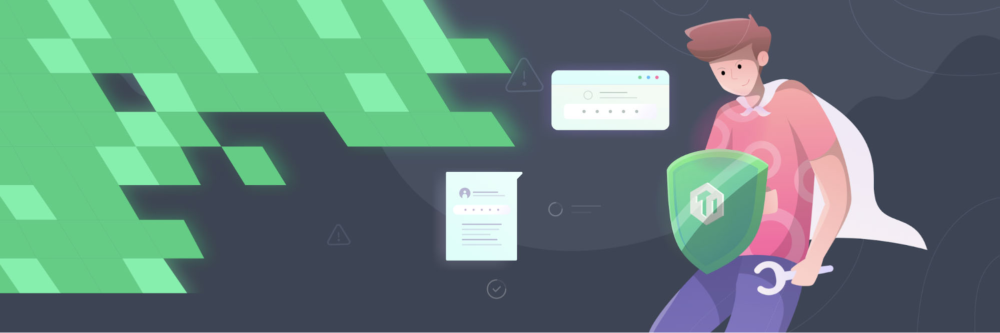
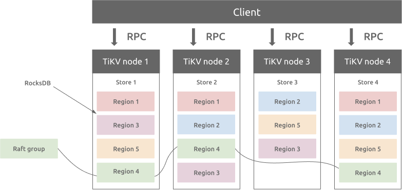
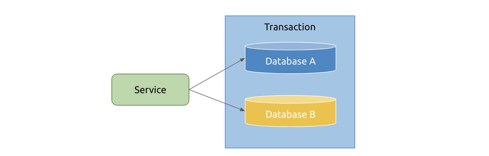
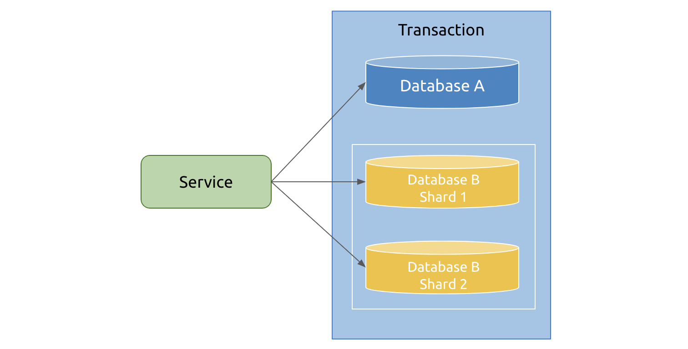
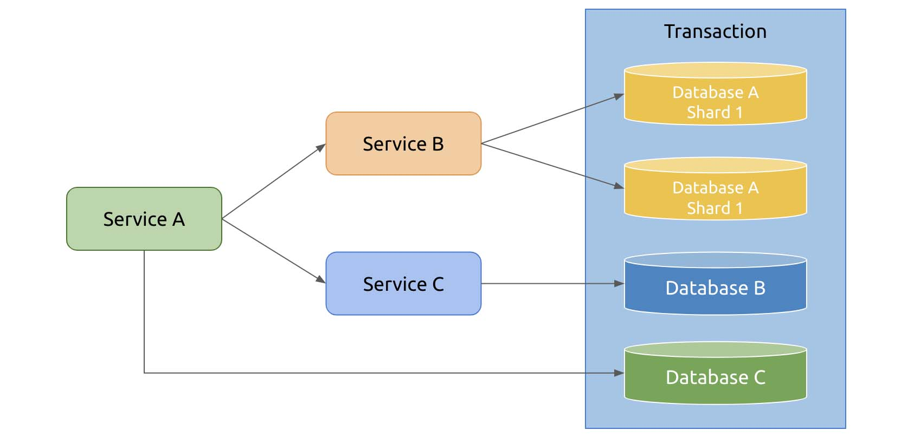
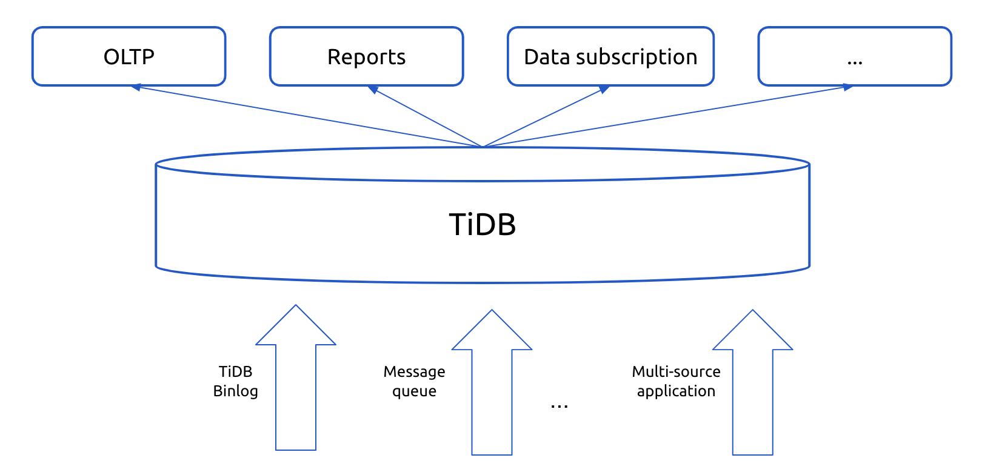

**Industry**: E-commerce

**Author:** Xiao Huang, Senior DBA at Meituan, Leader of TiDB User Group in Beijing

_This article is based on a talk given by Xiao Huang at a TiDB User Group event._

[Meituan](https://www.crunchbase.com/organization/meituan) is a world leading online-to-offline (O2O) local life service platform, connecting more than 240 million consumers and five million local merchants through a comprehensive array of e-commerce services and products. **To support our highly concurrent online services, we need a distributed database that can handle large volumes of data**.

As more and more distributed databases enter the market, choosing the right one for our applications is not easy. After thoughtful consideration, we chose [TiDB](https://docs.pingcap.com/tidb/stable/), a distributed, scale-out MySQL alternative database.

In this post, I'll share the considerations we had in database selection and introduce how we use TiDB at Meituan to solve our pain points.

## What to consider when selecting a database

One of the biggest challenges our business faces is the extreme high concurrency of online services. To meet this requirement, we focus on four major aspects: stability, performance, cost, and security.

### Stability

Users may accept an online service being slightly slow, but they would never tolerate frequent downtime. Stability, therefore, is our first priority. In this aspect, the database should:

* Be able to support a multi-active architecture with high availability
* Provide easy-to-use monitoring and alert services
* Perform a rolling upgrade gracefully with no impact on the application
* Have few problems in data migration and data validation
* Be efficient in elastic scaling

### Performance

We want to improve our user experience as much as we can. As long as the system is stable, the faster the system, the better the user experience. So the database must be highly efficient and support:

* Low latency.
* Pessimistic transactions. If we are going to migrate from MySQL to a new database, we hope to retain the transaction usage.
* High Queries per Second (QPS). If we have a special sale tonight that triples our traffic, can the database handle that surge? Should the database fail, does it go down completely or activate a performance protection mechanism?
* Massive data processing. If the database does not support this, we have to communicate with the application team in advance to alter the system design and plan whether to manually shard the data and determine the number of shards to create.

### Cost

After stability and performance, the next consideration is the cost.

First, the cost of application. The database should be easily connected to the application, so we can minimize the burden on the application team. Ideally, this process should require little communication or training.

Second, the cost of CPU, memory, and disks. We once researched a scale-up database that required the machine to have 384 GB of memory. A high configuration machine like that would exponentially increase our hardware cost.

Third, the network bandwidth. Some networks connecting remote data centers are charged according to the bandwidth.

### Security

To prevent data breach and data loss, the database should have the following three features:

* Data auditing. We would like to know who accessed a specific piece of data and how they operated on it.
* Data recovery. No matter what anomaly happens, we should be able to recover the data from backup.
* Database privileges. The database privilege management should be fine-grained. For example, the user ID, phone number, and password should not be accessible to DBAs or application developers. In such cases, we need to grant table-level, or even field-level privileges.

Therefore, we want a database that is stable, efficient, and secure, with low cost. We also hope it's an open source database so that we can get community support when a problem occurs and potentially contribute to the community ourselves.

After comparing the distributed databases on the market, including Amazon Aurora, Spanner, and CockroachDB, we chose [TiDB](https://docs.pingcap.com/tidb/stable), an open source, MySQL-compatible database that provides horizontal scalability and ACID-compliant transactions.

## How we use TiDB at Meituan

Currently, Meituan has over 1,700 TiDB nodes and several hundred clusters. The largest cluster has more than 40 nodes, and **the largest table stores over 100 billion records**. **The number of queries each day exceeds 10 billion**, with the peak QPS in a single cluster beyond 100 K.

We use TiDB mostly for three scenarios: horizontal scaling, financial-grade data consistency, and data hub.

### Horizontal scaling

We choose distributed databases because they can scale out and in easily, without manual sharding. Our business often meets sudden ups and downs. As the traffic surges, if we don't create more shards, latency will rise. When MySQL was still our main database, DBAs had to work with the application team to manually shard the database, which was time consuming and troublesome. After the traffic goes down, merging the shards using Data Transformation Services (DTS) and validating data are also daunting tasks.

The major cause of the sharding issues is that computation and storage are not separated. To solve this problem, we need a database that separates the computing layer from the storage layer, so we can scale the storage capacity and the computing resources by different amounts as needed. That's where TiDB comes in.

TiDB has a multi-layered architecture. It has three major components: [TiDB](https://docs.pingcap.com/tidb/dev/tidb-architecture#tidb-server) for computing, [Placement Driver](https://docs.pingcap.com/tidb/dev/tidb-architecture#placement-driver-pd-server) (PD) for storing metadata and providing timestamp, and [TiKV](https://docs.pingcap.com/tidb/dev/tidb-architecture#tikv-server) for distributed storage. In this architecture, storage and computing is separate so that each layer can scale independently to handle the fluctuating traffic, without affecting other components.

 TiDB architecture 

### Financial services

Financial services have different, if not more stringent, requirements on the database system. At Meituan, the database must support transactions with strong consistency.

Let's first look at a nagging problem we met in MySQL. MySQL 5.7 implements [lossless semi-sync replication](https://dev.mysql.com/doc/refman/5.7/en/replication-semisync.html). In this implementation, MySQL first writes the transaction to the binary logs, which are then sent to a replica. After the replica returns an acknowledgement (ACK), the source database completes the transaction in the storage engine (InnoDB). In other words, the binary logs are already sent to a replica before the application knows the commit is completed. If the source database crashes at this moment and the transaction is committed in the replica, a risk occurs.

Moreover, lossless semi-sync replication doesn't solve data inconsistency. Even if we set the semi-sync timeout to an infinite value, data is not strongly consistent. For example, if the network goes down between the source database and replicas, no replica would be able to receive the ACK.

To resolve this issue, MySQL later introduced [MySQL Group Replication](https://dev.mysql.com/doc/refman/8.0/en/group-replication-background.html) (MGR), but its scalability is poor. A group can have at most nine members. In addition, MGR is sensitive to network jitter. A few seconds of network jitter can cause the cluster to change the primary. In addition, MGR's [multi-primary mode](https://dev.mysql.com/doc/refman/8.0/en/group-replication-multi-primary-mode.html) has so many bugs that the MySQL community mostly uses the single-primary mode to avoid transaction conflict.

MySQL's semi-sync doesn't solve the consistency problem, but TiDB's Multi-Raft protocol does. In the storage layer, data is divided into Regions (a 96 MB range of data), each having multiple replicas to make up a Raft group. Each Raft group has a Leader that processes read and write requests. When a Leader crashes, other replicas in the group elect a new Leader. Even if a single node crashes, the Raft Group doesn't lose any data.

 TiDB's Multi-Raft protocol 

Next, I'll introduce how we use distributed transactions at Meituan for different financial scenarios.

#### Cross-database transactions

When we perform cross-database data updates, we need cross-database transactions to guarantee data consistency. Take our food delivery order service as an example. Because the customer data and the restaurant data are stored in different databases, when the customer places an order, we need to update both databases. TiDB's cross-database transactions are helpful in this scenario.

 Cross-database transactions 

#### Cross-shard transactions

In the money transferring service, the data of the sender and the receiver are likely to be located on different shards. When the sender transfers $100 to the receiver, if the transaction succeeds for one shard but fails for another, then money is debited from one account but not credited to another. Therefore, we need atomic transactions to guarantee data consistency.

 Cross-shard transactions 

#### SOA

Another use scenario is service-oriented architecture (SOA). In a microservice architecture, we need distributed transactions to keep data consistent across different services.

 SOA architecture 

If we don't have distributed transactions, keeping data consistent across different services is complicated. Without distributed transactions, a single operation might need to be written into different modules, resulting in multiple writes. In food delivery, when the customer-side cluster goes down but the restaurant-side cluster survives, a validating service detects that an order only exists in the restaurant database but not in the customer database. Next, the order data can be added to the customer database. But such validate-and-add logic adds complexity to the application.

Also, for account services, distributed transactions are essential because:

* The account balance can't be minus.
* In the case of a power or network outage, it's hard to maintain data consistency.
* Data corruption might be disastrous. When multiple clusters are corrupted, it's difficult to recover data.

Thankfully, TiDB solves these difficulties with its distributed transaction model.

#### Solution: the Percolator distributed transaction model

Percolator is a system built by Google for incremental processing on a large data set. Inspired by Percolator, the [TiDB transaction model](https://docs.pingcap.com/tidb/stable/transaction-overview) is an optimized two-phase commit protocol, which supports [pessimistic transactions](https://docs.pingcap.com/tidb/stable/pessimistic-transaction). With TiDB's distributed transaction model, our R&D engineers are relieved of the complicated logic of sharding and validating and can focus on their own development.

If you plan to use TiDB's transaction model, we have two general tips:

* Consolidate small transactions. Distributed transactions need lots of network communication, and lots of small transactions might cause high network latency and thus affect performance.
* Split up large transactions. A large transaction often takes a long time and updates multiple keys. Because other read requests need to wait for the large transaction to commit, the read latency might rise.

### Data hub

We also use TiDB for the data hub. For massive data, the data usage gradually becomes diverse. Some data that used to be processed by OLAP databases or data warehouses now needs to be stored in TiDB and the results fetched in real time.

In a hotel booking application, we need to fetch lots of data to calculate if the hotel room pricing is competitive. The results must be given in real time, but the calculation can't affect the online service. However, if the data is stored in one database, the analytical engine continuously reads massive data from the database, which might cause OLTP transactions to respond slowly.

To address this problem, we use [TiDB Binlog](https://docs.pingcap.com/tidb/stable/tidb-binlog-overview/) to replicate data to another TiDB cluster. Because TiDB's bottom storage engine, RocksDB, uses the log-structured merge-tree ([LSM-tree](https://en.wikipedia.org/wiki/Log-structured_merge-tree)) structure, which is highly efficient for write operations, we can quickly sync data to a TiDB replica. In this replica, we can perform massive calculations and frequent queries, generate reports, and even build a search engine.

We have many related data scattered across different systems. If we extract these data and pool them together into a single data hub, we can apply it to different services, such as operations reporting and data subscription.

 TiDB for the data hub 

### Other scenarios

We may also consider TiDB for the following scenarios:

* Separate hot and cold data. As the company grows, the accumulated online historical data can be dumped into TiDB clusters to reduce costs.
* Store logs and monitoring data. As TiDB's storage layer uses the LSM-tree data structure, which is efficient for write operations, it can scale infinitely to hold all the data for analytical purposes.
* Online Data Definition Language (DDL) schema change. MySQL has many restrictions on changing table schema. We used to use tools like pt-osc or gh-ost to perform the schema change, but the changes might lower online performance or take too long. TiDB can perform online DDL operations within seconds, which solves a pain point for us.
* Migrate from HBase/Elasticsearch (ES). Some of our services used HBase or ES, but these databases were frustrating to use, so we migrated the services to TiDB.
* HTAP is a growing need. With the rise of 5G and IoT, data volumes are growing exponentially. Our fast-paced business may have both OLTP and OLAP requirements, which brings up the need for an HTAP database. With HTAP, we can quickly generate big data analytics, reducing operating and marketing costs.

## Summary

At Meituan, TiDB has helped us build better applications and save costs. So far, we have integrated TiDB into only a small part of our system, but we look forward to exploring more scenarios to tap into its full potential.
