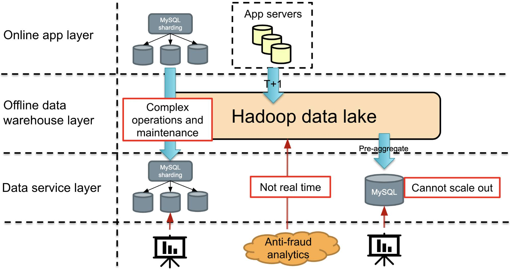
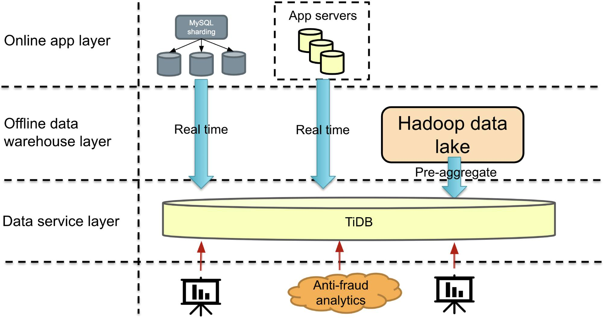
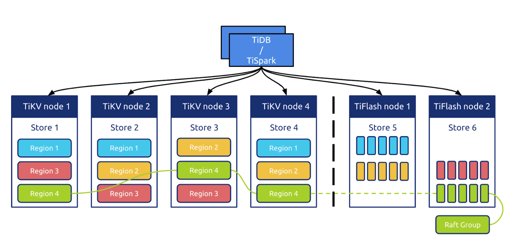

**Industry:** E-commerce

**Author:** Yihao Zhang (Senior Development Engineer at Xiaohongshu)

[Xiaohongshu](https://en.wikipedia.org/wiki/Xiaohongshu) is a popular social media and e-commerce platform in China. Maybe you know us by our other name: RED or Little Red Book. The Xiaohongshu app allows users to post and share product reviews, travel blogs, and lifestyle stories via short videos and photos. By July 2019, we had over 300 million registered users.

Our business is growing quickly, and our application receives more than 100 million rows of data every day. We looked for a database that supports both **transactional and analytical queries**, **real-time data analytics**, and **horizontal scalability**. We found that [TiDB](https://docs.pingcap.com/tidb/stable/overview), an open-source, distributed SQL database that supports [Hybrid Transactional/Analytical Processing](https://en.wikipedia.org/wiki/HTAP) (HTAP) workloads, was a good solution.

In this post, I'll describe why we chose TiDB and how TiDB's real-time HTAP capabilities help us manage our data in some scenarios.

## Our requirements for the database

Like many companies, our business is data-driven. When we were looking for a database, we wanted one that had:

* **Support for both transactional processing and analytical queries**. Sometimes we may need to perform a short Online Transactional Processing (OLTP) query in the database and do a large number of writes. Other times, we may want to gather statistics from a variety of sources, perform aggregation analytics, and present a summary of our findings. TiDB's HTAP architecture meets our need for diversity and is a good fit for us.
* **Real-time analytics**. Many data analytics engines can calculate quickly, but they don't support real-time analytics. TiDB provides real-time analytics.
* **Horizontal scalability**. As I mentioned, our Xiaohongshu app receives more than 100 million rows of data per day. A single-node cluster might quickly reach its storage capacity and be unable to provide services. We need excellent scalability. TiDB is based on the Raft consensus algorithm and is easy to scale. TiDB fits our needs in this area very well.

TiDB met each of our requirements, and it was the clear choice for our new database.

## How we're using TiDB

At Xiaohongshu, we're using TiDB in multiple scenarios, including:

* Report analysis
* During a large promotion, providing real-time data to a large display screen
* Logistics warehousing
* Data warehouse applications
* An e-commerce data hub
* Content security review

To give you an idea of the kinds of problems TiDB solves for us, I have selected three typical application scenarios:

* **Data report.** Our business analysts use the data report to review key metrics such as weekly trends, sales data, and user growth. The report also documents data on a quarter-over-quarter or year-over-year basis.
* **Querying the online sharded database in real time.** As I mentioned earlier, an enormous amount of data flows into our application. We must be able to query extremely large tables. For example, MySQL cannot save a table with 30 billion rows. In this case, we sharded our database. We hope that we can find a way to query sharded data and that the query or analytics will not affect the online application.
* **Anti-fraud data analytics.** The Xiaohongshu e-commerce platform regularly issues coupons, which online scalpers try to use fraudulently. We hope we can quickly identify online fraud so we can block the coupons from being used.

## What our applications were like before TiDB

The figure below shows our infrastructure before we used TiDB. In terms of application logic, from top to bottom, we had the online application layer, the offline data warehouse layer, and the data service layer.

 The application architecture before we used TiDB 

Let's review our three application scenarios in a non-TiDB world.

### Data reporting

For data reports, we used the Hadoop data warehouse to do some pre-aggregation of the data, and then aggregated the high-dimensional data and put it in MySQL for query. For data reports, the data in Hadoop was pre-aggregated in [T+1](https://www.investopedia.com/terms/t/tplus1.asp) mode through Hive and put into MySQL every day. Then, we built some business intelligence (BI) systems to graphically display the report queries, so our analysts could see their customized reports.

What's wrong with this approach? With the rapid growth of our business, the types of reports became more diverse. The scalability of MySQL was also a challenging issue. If we kept adding MySQL nodes, it would eventually become difficult to manage them all. If you've operated and maintained a database, you know that this can be quite cumbersome.

### Querying the online sharded database in real time

Let's look at the online sharded MySQL database in the primary-secondary architecture. We need to perform data queries on it without affecting the online application, so we can only check the secondary database. This secondary database is, of course, a sharded database.

A series of questions arise here. First, we still have operation and maintenance issues:

* How do we manage so many nodes in the sharded MySQL database?
* How do we scale out the database?
* Do we need to reshard the shards?
* How do we ensure data consistency?
* How do we scale in the database?
* How do we manage metadata?

This is the complexity of operation and maintenance.

In addition, if I want to run a transaction on a sharded MySQL database, can I use a sharding middleware? If I want to do a `JOIN`, or even a `GROUP BY` aggregate query, is it possible with a sharding middleware? It may be possible, but it will not be simple, so we must find a solution that can easily do complex, distributed queries.

### Anti-fraud analytics

In the anti-fraud data analytics scenario, we want to reduce latency between data ingestion and processing. Before TiDB, we wrote data to the backend data warehouse in T+1 mode. The time to insights didn't meet our requirement. Fraud can happen very quickly. It's important to see the details of the issued coupon in seconds, so that we can take measures immediately.

## TiDB HTAP improved data service capabilities

To try and solve the challenges mentioned above, we introduced the [TiDB 3.0 HTAP](https://docs.pingcap.com/tidb/v3.0/key-features#minimize-etl-with-htap) solution into our application architecture. As shown in the figure below, the data service layer with TiDB can provide all the data services our applications need.

 The application architecture after we used TiDB 

Let's see how TiDB improved our data service capabilities in the three application scenarios mentioned above.

### Data reports

In the data report scenario, TiDB replaces MySQL, which solves the complicated problem of scaling out MySQL as our business grows. We were able to migrate seamlessly because TiDB is highly compatible with the MySQL protocol—an excellent decision by the TiDB team. Because [TiDB is MySQL-compatible](https://docs.pingcap.com/tidb/stable/mysql-compatibility#compatibility-with-mysql), the frontend BI tools team didn't have to develop a TiDB driver; they could use the MySQL driver directly. As for horizontal scalability, this is what TiDB is best at. We can add a node directly, and the data will be automatically rebalanced, which is very convenient.

### Querying the sharded database in real time

As our application data quickly grew, a standalone MySQL database couldn't store very much data, so we sharded the data into 10,000 tables. But a single TiDB cluster can store the large amounts of data we have.

We replicated MySQL data to TiDB via the binlog in real time with replication latency less than one second and merged the sharded tables to a large table in TiDB.

Finally, we see only one large table in TiDB. No more shards. We use MySQL as the primary database and TiDB as the secondary database. We can query TiDB without affecting MySQL. In addition, TiDB also supports ACID transactions, `JOIN` operations, and aggregate functions.

### Anti-fraud data analytics

After we applied TiDB in our applications, we changed the T+1 mode for writes to writing with SQL statements in Apache Flink in real time. The tracked events are generated quickly, and their peak queries per second (QPS) can reach 30,000 or 40,000. A single table may receive about 500 million rows of data per day. If we save data for 10 days, the data in a single table will probably reach 5 billion rows. After writing the data, we mainly perform ad hoc queries. If an analyst wants to see how the coupons are used and to understand the distribution within minutes, we directly bypass the Hadoop data warehouse and do real-time queries in TiDB.

## TiFlash improved analytical query performance

[TiKV](https://docs.pingcap.com/tidb/stable/tikv-overview#tikv-overview) is TiDB's row-based storage engine. Compared with TiDB 3.0, TiDB 4.0 has improved its analytical query performance by introducing a columnar storage engine, [TiFlash](https://docs.pingcap.com/tidb/stable/tiflash-overview#tiflash-overview).

 TiDB HTAP architecture with TiFlash 

### Understanding TiFlash

[TiFlash](https://docs.pingcap.com/tidb/v4.0/tiflash-overview) is an extended analytical engine and columnar store for TiDB. A TiDB database that incorporates TiFlash lets users perform real-time HTAP analytics.

TiFlash has great design points:

* **Strong consistency in real time.** TiDB replicates updated data to TiFlash in real time to ensure that TiFlash processes the latest (not just fresh) data.
* **Automatic storage selection.** TiDB intelligently determines whether to select row storage or column storage to cope with various query scenarios without manual intervention.
* **Flexibility and workload isolation.** Both row and column stores scale separately.

We also tested TiFlash, taking the logistics scenario as an example. We evaluated 393 production queries and found:

* For aggregate queries like `GROUP BY` and `SUM`, compared with TiKV, TiFlash's query performance improved from about three to ten times, and the average execution time was reduced by about 68%.
* For non-aggregate queries, compared with TiKV, TiFlash's average execution time was reduced by about 4%. Almost all non-aggregate queries hit the TiKV index and did not use the TiFlash column storage.

TiDB 4.0 also introduces [pessimistic locking](https://docs.pingcap.com/tidb/stable/pessimistic-transaction#behaviors). In logistics scenarios, many tables require a `JOIN`, but that's expensive. To avoid performing a `JOIN`, we'll combine these tables into a large, wide table in advance. For example, if I combine three tables into one large, wide table, three streams will update this table at the same time, and they might update the same row. TiDB 3.0 uses an optimistic concurrency control mechanism, which will cause transaction conflicts. TiDB 4.0 has pessimistic locking, which effectively solves this problem.

### An added bonus: a responsive development team

We have an excellent relationship with [PingCAP](https://pingcap.com/)'s TiFlash team, and we often suggest new requirements. For example, an earlier version of TiFlash did not support `DISTINCT COUNT`. The development team understood our need for optimization, and soon after our request, TiFlash supported `DISTINCT COUNT`.

## TiFlash versus Clickhouse

You may be more familiar with the ClickHouse column storage engine, so let's compare it with TiFlash. Although ClickHouse has faster computing performance than TiFlash, we chose TiFlash because ClickHouse has some issues. For example:

* ClickHouse's cluster model is more complicated to operate and maintain.
* ClickHouse does not support data updates.

Many of our applications have transactions and need frequent updates. However, ClickHouse doesn't support updates. If we change the operations to `APPEND` or `INSERT`, the application team must make a lot of changes, like deduplicating the data. Because many scenarios require frequent updates, we chose TiFlash.

## Conclusion

As our business quickly develops, more than 100 million rows of data flood into our application every day. We adopted TiDB, because it is a one-stop data warehouse for both **OLTP and OLAP workloads**, it supports **real-time data analytics**, and it's **easy to scale out**. Since 2017, we've used TiDB in our production environment.

If you'd like to learn more about our experience with TiDB, you can join the [TiDB community on Slack](https://slack.tidb.io/invite?team=tidb-community&channel=everyone&ref=pingcap-blog). Now HTAP is supported in [TiDB Cloud](https://pingcap.com/products/tidbcloud), the fully managed database service provided by PingCAP. You can apply for a two-week free trial [here](https://pingcap.com/products/tidbcloud/trial/).
