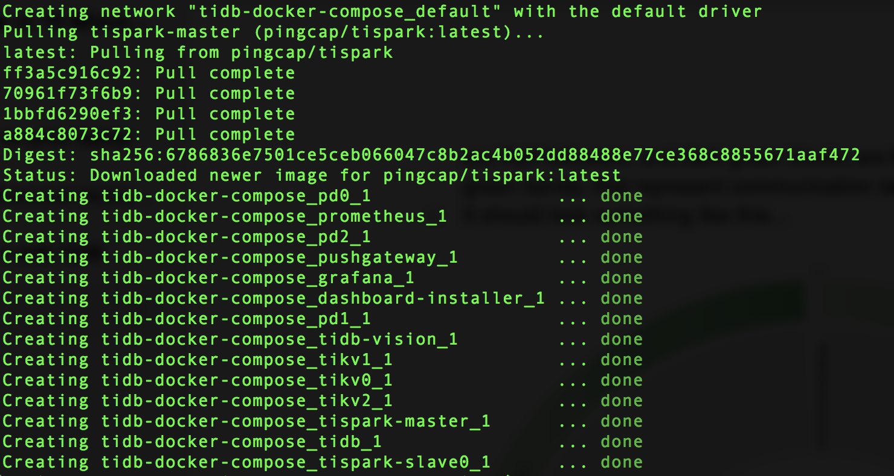
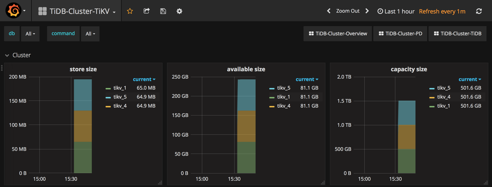
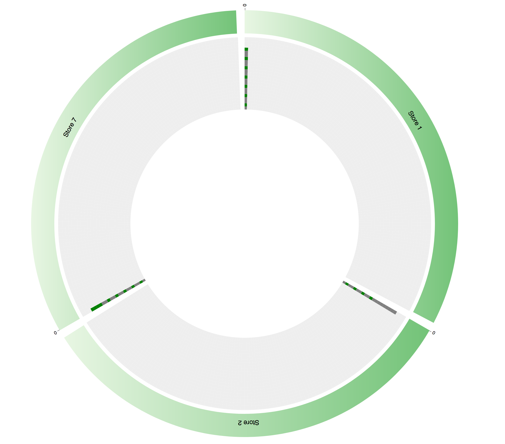
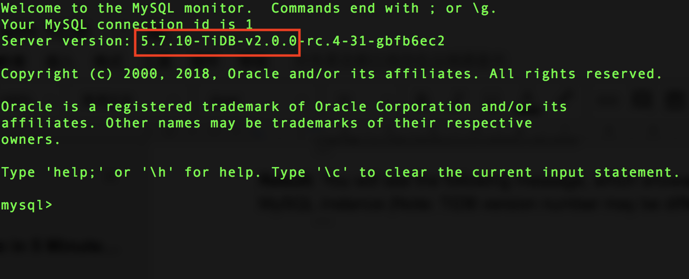
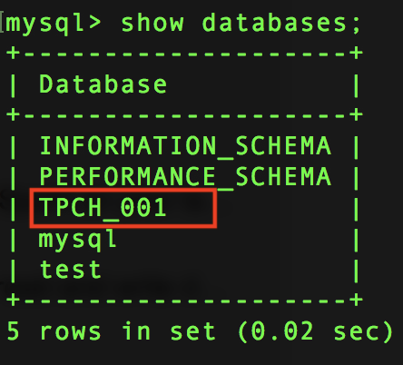
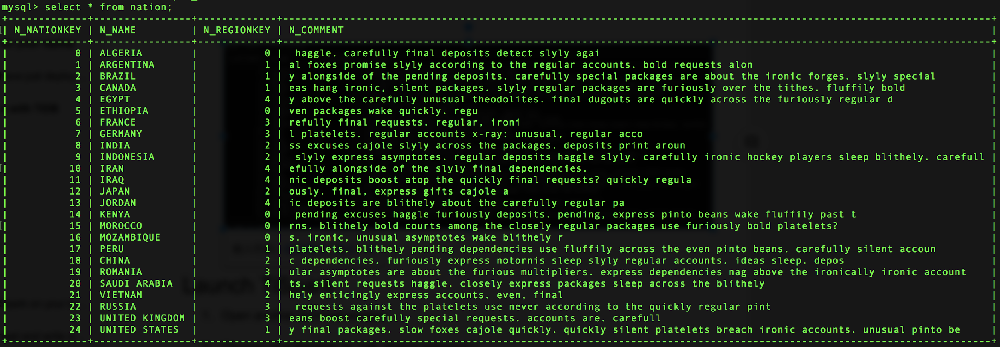
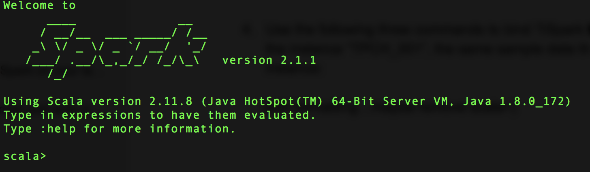
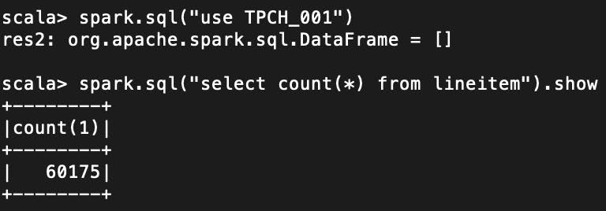
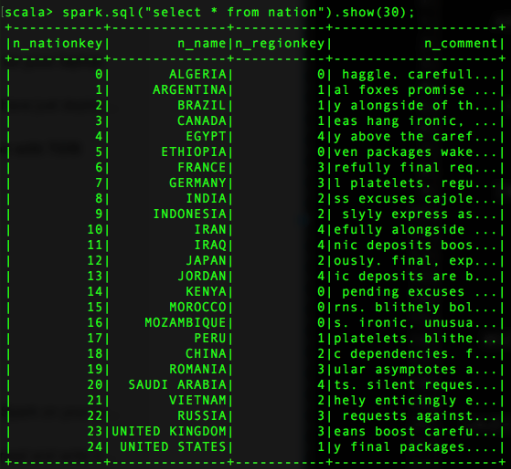
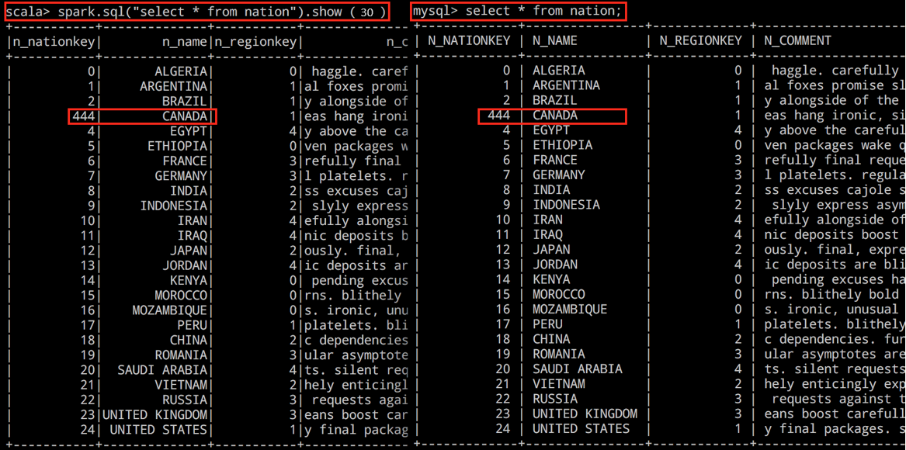

[TiDB](http://bit.ly/tidb_repo_publication) is an open-source distributed Hybrid Transactional and Analytical Processing (HTAP) database built by PingCAP, powering companies to do real-time data analytics on live transactional data in the same data warehouse -- no more ETL, no more T+1, no more delays. More than 200 companies are now using TiDB in production. Its 2.0 version was launched in late April 2018 (read about it in [this blog post](http://bit.ly/tidb_2_0)).

In this 5-minute tutorial, we will show you how to spin up a standard TiDB cluster using Docker Compose on your local computer, so you can get a taste of its hybrid power, before using it for work or your own project in production. A standard TiDB cluster includes TiDB (MySQL compatible stateless SQL layer), [TiKV](http://bit.ly/tikv_repo_publication) (a distributed transactional key-value store where the data is stored), and [TiSpark](https://github.com/pingcap/tispark) (an Apache Spark plug-in that powers complex analytical queries within the TiDB ecosystem). 

> NOTE: This guide is for Mac users; we will release a guide for Linux and Windows users soon!

Ready? Let’s get started!

# Setting Up:

Before we start deploying TiDB, we’ll need a few things first: `Brew`, `wget`, Docker, and MySQL. If you don’t have them installed already, here are the instructions to get them.

1. To install `Brew`, go [here](https://brew.sh/) .

2. To install `wget`, use the command below in your Terminal: 

    ```bash
    brew install wget --with-libressl

    ```

3. Install Docker: [https://www.docker.com/community-edition](https://www.docker.com/community-edition).

4. Install MySQL: [https://dev.mysql.com/downloads/mysql/](https://dev.mysql.com/downloads/mysql/).

# Spin up a TiDB cluster

Assuming you’ve installed Docker on your laptop without a hitch, let’s deploy TiDB.

1. Clone TiDB Docker Compose onto your laptop:

	```bash
	git clone https://github.com/pingcap/tidb-docker-compose
	```

2. Change your directory to `tidb-docker-compose`:

    ```bash
    cd tidb-docker-compose
    ```

3. Deploy TiDB on your laptop:

    ```bash
	docker-compose up -d

    ```

You can see messages in your terminal launching the default components of a TiDB cluster: 1 TiDB instance, 3 TiKV instances, 3 Placement Driver (PD) instances, Prometheus, Grafana, 2 TiSpark instances (one master, one slave), and a TiDB-Vision instance. 

Your terminal will show something like this:



**Congratulations! You have just deployed a TiDB cluster on your laptop!**

To check if your deployment is successful:

* Go to: [http://localhost:3000](http://localhost:3000) to launch Grafana with default user/password: admin/admin.

    * Go to `Home` and click on the pull down menu to see dashboards of different TiDB components: TiDB, TiKV, PD, entire cluster.

    * You will see a dashboard full of panels and stats on your current TiDB cluster. Feel free to play around in Grafana, e.g. `TiDB-Cluster-TiKV`, or `TiDB-Cluster-PD`.



<center> *Grafana display of TiKV metrics* </center>

* Now go to TiDB-vision at [http://localhost:8010](http://localhost:8010) (TiDB-vision is a cluster visualization tool we built in-house to see data transfer and load-balancing inside your cluster).

    * You can see a ring of 3 [TiKV](http://bit.ly/tikv_repo_publication) nodes. TiKV applies the Raft consensus protocol to provide strong consistency and high availability. Light grey blocks are empty spaces, dark grey blocks are Raft followers, and dark green blocks are Raft leaders. If you see flashing green bands, that represent communications between TiKV nodes.

    * It looks something like this:



<center> *TiDB-vision* </center>

# Test TiDB Compatibility with MySQL

As we mentioned, TiDB is MySQL compatible, which you can essentially use TiDB as MySQL slaves with instant horizontal scalability. That’s how many innovative tech companies, like [Mobike](https://www.pingcap.com/blog/Use-Case-TiDB-in-Mobike/), use TiDB.

To test out this MySQL compatibility:

1. Keep the `tidb-docker-compose` running, and launch a new Terminal tab or window.

2. Add MySQL to the path (if you haven’t already):

	```bash
	export PATH=${PATH}:/usr/local/mysql/bin

	```

3. Launch a MySQL client that connects to TiDB:

	```sql
	mysql -h 127.0.0.1 -P 4000  -u root
	```

**Result:** You will see the following message, which shows that TiDB is indeed connected to your MySQL instance:
> Note: TiDB version number may be different.

```bash
Server version: 5.7.10-TiDB-v2.0.0-rc.4-31
```


<center> *The Compatibility of TiDB with MySQL* </center>


# Let’s get some data!

Now we will grab some sample data that we can play around with.

1. Open a new Terminal tab or window and download the `tispark-sample-data.tar.gz` file.

	```bash
	wget http://download.pingcap.org/tispark-sample-data.tar.gz
	```

2. Unzip the sample file:

	```bash
	tar zxvf tispark-sample-data.tar.gz
	```

3. Change your directory to `tispark-sample-data`:

	```bash
	cd tispark-sample-data
	```

4. Inject the sample test data from sample data folder to MySQL:
	
	```sql
	mysql --local-infile=1 -u root -h 127.0.0.1 -P 4000 < dss.ddl 
	```
	This will take a few seconds.

5. Go back to your MySQL client window or tab, and see what’s in there: 

	```sql
	show databases;
	```

	**Result:** You can see the `TPCH_001` database on the list. That’s the sample data we just ported over.

	

	Now let’s go into `TPCH_001`:

	```sql
	use tpch_001;
	show tables;
	```

	**Result:** You can see all the tables in `TPCH_001`, like `NATION`, `ORDERS`, etc.

6. Let’s see what’s in the `NATION` table:

    ```sql
    select * from NATION;
    ```

**Result:** You’ll see a list of countries with some keys and comments. 



# Launch TiSpark

Now let’s launch TiSpark, the last missing piece of our hybrid database puzzle.

1. In the same window where you downloaded TiSpark sample data (or open a new tab), go back to the `tidb-docker-compose` directory.

2. Launch Spark within TiDB with the following command:

	```bash
	docker-compose exec tispark-master  /opt/spark-2.1.1-bin-hadoop2.7/bin/spark-shell

	```
	
	This will take a few minutes.
	
	**Result:** Now you can Spark!
	
	          

3. Use the following three commands, one by one, to bind TiSpark to this Spark instance and map to the database `TPCH_001`, the same sample data that’s available in our MySQL instance:

	```bash
	import org.apache.spark.sql.TiContext
	val ti = new TiContext(spark)
	ti.tidbMapDatabase("TPCH_001")
	```

	It looks something like this:

	

4. Now, let’s see what’s in the `NATION` table (should be the same as what we saw on our MySQL client):

	```sql
	spark.sql("select * from nation").show(30);
	```
	
	**Result:**
	
	
	
# Let’s get hybrid!

Now, let’s go back to the MySQL tab or window, make some changes to our tables, and see if the changes show up on the TiSpark side.

1. In MySQL client, try this UPDATE:

	```sql
	update nation set n_nationkey=444 where n_name="CANADA";
	select * from nation;
	```

2. Then see if the update worked:

	```sql
	select * from nation;
	```

3. Now go to the TiSpark Terminal window, see if you see the same update made:

	```sql
	spark.sql("select * from nation").show(30);
	```
	
	**Result:** The `UPDATE` you made on the MySQL side shows up immediately in TiSpark!
	
	

You can see that both the MySQL and TiSpark clients return the same results -- fresh data for you to do analytics on right away. Voila!

# Summary

With this simple deployment of TiDB on your local machine, you now have a functioning hybrid transactional and analytical processing (HTAP) database. You can continue to make changes to the data in your MySQL client (simulating transactional workloads) and analyze the data with those changes in TiSpark (simulating real-time analytics).

Of course, launching TiDB on your local machine is purely for experimental purposes. If you are interested in trying out TiDB for your production environment, send us a note: [info@pingcap.com](mailto:info@pingcap.com) or reach out on [our website](https://www.pingcap.com/en/). We’d be happy to help you!
