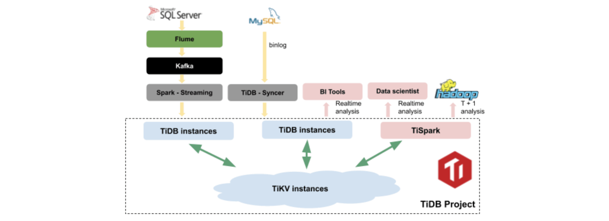

**Industry:** E-Commerce

**Author:** Ruixing Luo (Senior Big Data Engineer)

[Yiguo.com](https://www.crunchbase.com/organization/shanghai-yiguo-electron-business) is a fresh produce e-commerce platform, serving close to 5 million users and more than 1,000 enterprise customers. We have long devoted ourselves to providing fresh food for ordinary consumers and gained increasing popularity since our founding in 2005. With a rapidly growing user base and data, we need a highly performant, horizontally scalable realtime database system that can support both [Online Transaction Processing (OLTP)](https://en.wikipedia.org/wiki/Online_transaction_processing) and [Online Analytical Processing (OLAP)](https://en.wikipedia.org/wiki/Online_analytical_processing) workloads, in order to make timely and accurate decisions to improve the quality of service to our users.

Combining [TiDB](https://github.com/pingcap/tidb) and [TiSpark](https://github.com/pingcap/tispark), we got exactly that--a horizontally scalable, strongly consistent, and highly available data processing platform that supports both OLTP and OLAP workloads on quickly growing datasets in near real-time. By adopting TiDB and TiSpark, our applications now have a new competitive edge to deliver better services faster than ever before.

## Our pain points

Previously, our data analysis system was built on top of the Hadoop ecosystem and SQL Server. We ran a near real-time system on SQL Server in the very beginning, implemented by our developers through writing and maintaining corresponding stored procedures. Because the data size was not that large, SQL Server was enough to meet our demand. As our business and user base grows, the amount of data has also grown to a point beyond what SQL Server could handle, to provide timely and accurate decision making. Our existing system became a bottleneck, and we had to look for a new solution.

Our requirements for a new system are:

* Meet both OLAP and basic OLTP requirements;
* Integrate seamlessly with our existing applications, so data migration overhead is low and learning curve isn't steep;
* Interface well with our existing Hadoop-based system.

## Our evaluation process

Based on our requirements, we evaluated three options -- Greenplum, Apache Kudu, and TiDB/TiSpark. We decided to go with TiDB/TiSpark because of the following reasons:

* **[Greenplum](http://greenplum.org/)** is an [MPP (Massively Parallel Processing)](https://en.wikipedia.org/wiki/Massively_parallel) platform based on PostgreSQL. It is usually used in offline analysis scenarios where the number of concurrent transactions is not very high. However, for OLTP scenarios, our preliminary test showed that it had poor concurrent write performance compared to TiDB.
* **[Apache Kudu](https://kudu.apache.org/)** is a columnar storage manager developed for the Hadoop platform that is widely adopted for real-time analytics. However, secondary indexes, which are not supported by Kudu, are very important for us to efficiently access data with attributes other than the primary key.
* As a Hybrid Transactional/Analytical Processing (HTAP) database, **TiDB** eliminates the necessity to constantly move data between different databases and warehouses to support either transactional or analytical workloads. Thus, it enables real-time business analysis based on live transactional data instead of after-the-fact analysis, and instantly transforms raw data into insights for timely decision-making.
* **TiSpark** takes advantages of both the Apache Spark platform and TiDB to provide HTAP capabilities,serving as a one-stop solution for online transactions and analysis.
* The **TiDB/TiSpark** open source community is thriving, which boosted our confidence in the future health and strength of this solution when making our decision.

## Moving forward with TiDB and TiSpark

TiDB is an open source distributed HTAP database, inspired by Google [Spanner](https://static.googleusercontent.com/media/research.google.com/en//archive/spanner-osdi2012.pdf)/[F1](https://static.googleusercontent.com/media/research.google.com/en//pubs/archive/41344.pdf). It has the following core features:

* Compatibility with the MySQL protocol;
* Horizontal scalability;
* Distributed ACID transactions across multiple data centers;
* Strong consistency guarantees;
* Automatic failover and high availability.

TiSpark is a thin layer built for running Apache Spark on top of TiDB/[TiKV](https://github.com/pingcap/tikv) to accelerate complex OLAP queries. It takes the performance boost of Spark and marries it with the rest of the TiDB cluster components to deliver a one-stop solution for both online transactions and analysis.

TiDB also has a wealth of other tools in its ecosystem, such as the Ansible scripts for quick deployment, Syncer for seamless migration from MySQL, Wormhole for migrating heterogeneous data, and TiDB Binlog, a tool to collect binlog files.

## Implementation overview

In mid-October 2017, after careful design and rigorous testing, we migrated our real-time analysis system to TiDB/TiSpark in production.

The architecture of our new system is as follows:

 TiDB/TiSpark real-time data warehouse platform 

This platform works in the following way:

1. The data for transactions in the existing SQL Servers is ingested to TiDB through Flume, Kafka, and Spark Streaming in real time, while the data from MySQL is written to TiDB via binlog and TiDB Syncer, a data synchronization tool which can read data from MySQL in real-time.

2. Inside the TiDB project, we have several components:
    1. The TiDB cluster consists of **stateless TiDB instances** and serves as a stateless SQL layer that processes users' SQL queries, accesses data in the storage layer, and returns corresponding results. In our case, the TiDB cluster is used to power our Business Intelligence tools for real-time analysis computing on datasets with several million rows, and the analysis tasks execute every 5-10 minutes.
    2. The TiKV cluster, composed of **TiKV instances**, is the distributed transactional Key-Value storage where the data resides. Regardless of whether the data comes from SQL Server or MySQL, it is stored in TiKV eventually. It uses the [Raft](https://raft.github.io/) protocol for replication to ensure data consistency and disaster recovery.
    3. **TiSpark** sits right on top of TiKV to support both our data scientists for real-time analysis or for offline daily analysis in the existing Hadoop system.

In the architecture, TiDB/TiSpark serves as a hybrid database that provides the following benefits:

1. A real-time data warehouse. The upstream OLTP data write in real time using TiDB, and the downstream OLAP applications perform real-time analysis using TiDB/TiSpark. This enables our data scientists to make quicker decisions based on more current and transactionally consistent data.

2. A single data warehouse that accelerates `T+1` (this means dumping data per day to the analytical system, where `T` refers to the Transaction date, and `+1` refers to `1` day after the Transaction date) asynchronous and [ETL (Extract, Transform and Load](https://en.wikipedia.org/wiki/Extract,_transform,_load)) processing.
    1. The data for `T+1` analysis can be extracted directly from TiDB using TiSpark, which is much faster than using Datax and Sqoop to read data from a traditional relational database.
    2. Before TiDB/TiSpark, we had to maintain separate data warehouses, and the ETL process was time-consuming. Now, the ETL process becomes simple. The extraction tool just needs to support TiDB, instead of multiple data sources, which greatly facilitates the business applications and reduces cost of maintenance.

3. The compatibility of TiDB with MySQL has significantly reduced the migration cost. The transactional data from MySQL can flow to TiDB via Syncer (a tool in the TiDB ecosystem). In addition, we can reuse many of the exiting tools from the MySQL community without making too many changes to the existing applications.

4. The auto-failover and high availability features of TiDB help to guarantee the stability and availability of the entire system.

5. The design of TiDB enables even and dynamically balanced data distribution. We can use TiDB as a backup database for hot data, or directly migrate hot data to TiDB in the future.

## Results

We used TiSpark for complex data analysis on the entire dataset of Singles' Day, China's largest online shopping day. We saw up to 4x performance improvement using TiSpark compared to SQL Server. For example, we have one complex SQL query that joins 12 tables together with several tables having over 1 million rows. This query took only 8 minutes to run on TiSpark whereas it would have taken more than 30 minutes on SQL Server.

The success of our TiDB/TiSpark based real-time data warehouse platform gives us confidence that more of our services will migrate to TiDB in the future. This unified and real-time hybrid database enables us to harness the power of data and focus on creating values for our users.

## Lesson learned

Our migration to TiDB/TiSpark was not without challenges. Here are some lessons learned:

1. It is highly recommended to use TiDB Ansible for deployment, upgrade and operations. In the test environment, we manually deployed TiDB using the binary package. It was easy, but the upgrade became troublesome after TiDB released its 1.0 version in October 2017. After consulting the TiDB support team, we re-deployed the 1.0 version using the TiDB Ansible scripts and the upgrade became much easier. Meanwhile, TiDB's Ansible scripts install Prometheus and Grafana monitoring components by default. TiDB provides a lot of excellent Grafana templates, which made monitoring and configuration much simpler.

2. To achieve the best performance, using machines with SSDs are highly recommended. Initially, we were using mechanical hard disks in our cluster. Later on, we realized the latency caused by the unstable write workload significantly impacted the performance. We contacted the TiDB support team and confirmed that the TiDB architecture is mainly designed for the storage performance of SSD, so we changed the hard disks to SSD/NVMe, and the write performance significantly improved.

3. For complex queries with more than millions of rows, the performance of TiSpark is much better than TiDB. In the very beginning, we were merely using TiDB for complex queries, but the performance of some complex scripts did not show any advantage over SQL Server. After tuning some parameters for parallel computing such as `tidb_distsql_scan_concurrency`, `tidb_index_serial_scan_concurrency`, and `tidb_index_join_batch_size`, the analytical tasks that used to take 15 minutes took only half that time. But this still could not fully meet our needs. So we turned to TiSpark which turns out to be a perfect match for our scenario.

4. The online scheduling of the cluster cannot work together with offline scheduling. Each time the ETL script initiates some Spark parameters, it's quite time-consuming. We plan to use Spark Streaming as a scheduling tool in the future. Spark Streaming records the timestamp after each execution and only needs to monitor the timestamp changes, avoiding the time consumed by multiple initializations. With Spark monitoring, we can also clearly see the delay and some other states of the task.

## Conclusion

TiDB and TiSpark together provide a scalable solution for both OLTP and OLAP workloads. TiDB and TiSpark have been adopted by many companies and proved to work well in many application scenarios. Moreover, TiDB and TiSpark reduces operation overhead and maintenance cost for our engineering team. The TiDB project has tremendous potential, and we hope it gains more adoption globally and serve as a critical piece of every company's infrastructure.

*This post was originally published on [Datanami](https://www.datanami.com/2018/02/22/hybrid-database-capturing-perishable-insights-yiguo/).*
