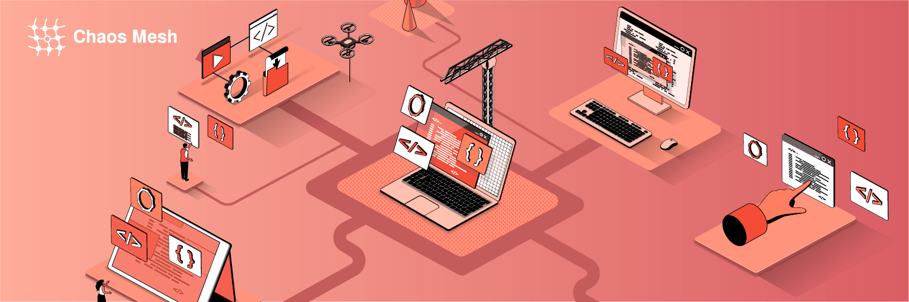
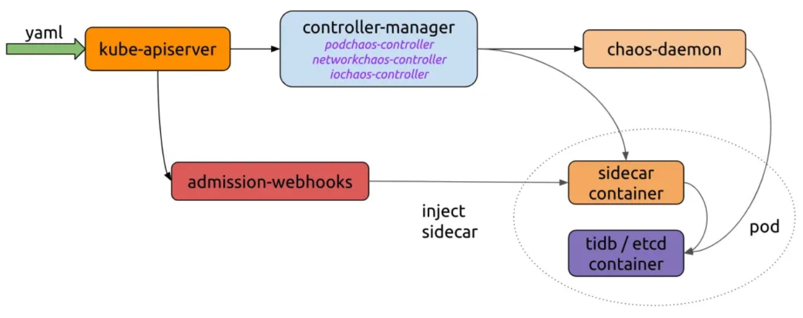
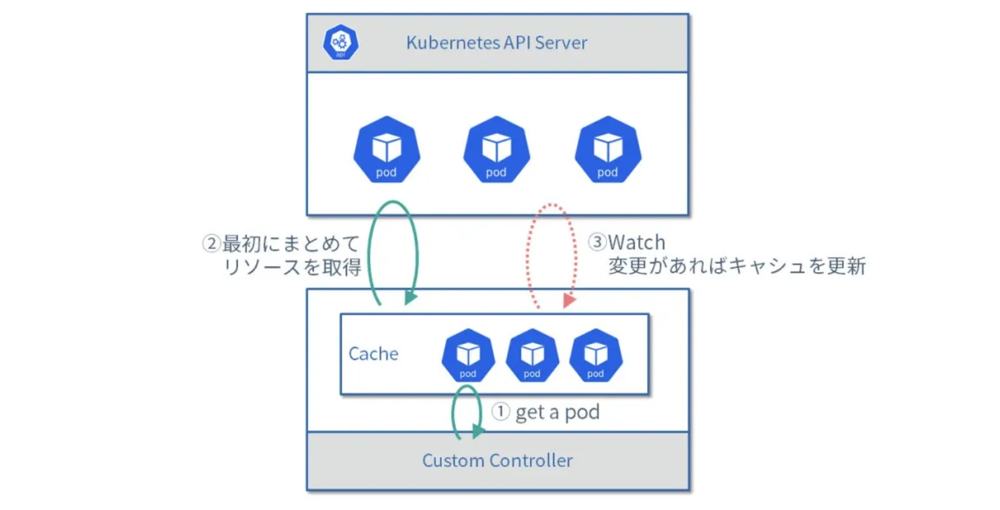
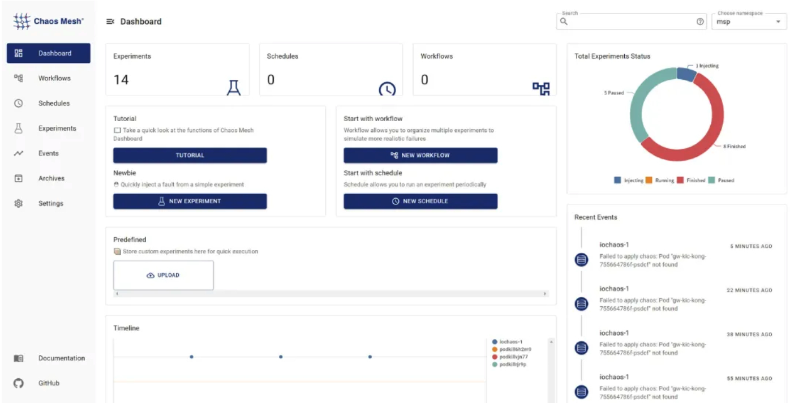

**Author:** [Mayo Cream](https://github.com/mayocream) (Kubernetes Member, CNCF Security TAG Member, OSS Contributor)

**Transcreator:** [Caitin Chen](https://github.com/CaitinChen); **Editor:** Tom Dewan



[Chaos Mesh](https://chaos-mesh.org/docs/) is an open-source, cloud-native Chaos Engineering platform built on Kubernetes (K8s) custom resource definitions (CRDs). Chaos Mesh can simulate various types of faults and has an enormous capability to orchestrate fault scenarios. You can use Chaos Mesh to conveniently simulate various abnormalities that might occur in development, testing, and production environments and find potential problems in the system. 

In this article, I'll explore the practice of Chaos Engineering in Kubernetes clusters, discuss important Chaos Mesh features through analysis of its source code, and explain how to develop Chaos Mesh's control plane with code examples. 

If you're not familiar with Chaos Mesh, please review the [Chaos Mesh documentation](https://chaos-mesh.org/docs/#architecture-overview) to get a basic knowledge of Chaos Mesh's architecture.

For the test code in this article, see the [mayocream/chaos-mesh-controlpanel-demo](https://github.com/mayocream/chaos-mesh-controlpanel-demo) repository on GitHub.

## How Chaos Mesh creates chaos

Chaos Mesh is a Swiss army knife for implementing Chaos Engineering on Kubernetes. This section introduces how it works.

### Privileged mode

Chaos Mesh runs privileged containers in Kubernetes to create failures. Chaos Daemon's Pod runs as `DaemonSet` and adds additional [capabilities](https://kubernetes.io/docs/concepts/policy/pod-security-policy/#capabilities) to the Pod's container runtime via the Pod's security context.

```yaml
apiVersion: apps/v1
kind: DaemonSet
spec:
  template:
    metadata: ...
    spec:
      containers:
        - name: chaos-daemon
          securityContext:
            {{- if .Values.chaosDaemon.privileged }}
            privileged: true
            capabilities:
              add:
                - SYS_PTRACE
            {{- else }}
            capabilities:
              add:
                - SYS_PTRACE
                - NET_ADMIN
                - MKNOD
                - SYS_CHROOT
                - SYS_ADMIN
                - KILL
                # CAP_IPC_LOCK is used to lock memory
                - IPC_LOCK
            {{- end }}
```

The Linux capabilities grant containers privileges to create and access the `/dev/fuse` Filesystem in Userspace (FUSE) pipe. FUSE is the Linux userspace filesystem interface. It lets non-privileged users create their own file systems without editing the kernel code.

According to [pull request #1109](https://github.com/chaos-mesh/chaos-mesh/pull/1109) on GitHub, the `DaemonSet` program uses cgo to call the Linux `makedev` function to create a FUSE pipe.

```go
// #include <sys/sysmacros.h>
// #include <sys/types.h>
// // makedev is a macro, so a wrapper is needed
// dev_t Makedev(unsigned int maj, unsigned int min) {
//   return makedev(maj, min);
// }
// EnsureFuseDev ensures /dev/fuse exists. If not, it will create one
func EnsureFuseDev() {
    if _, err := os.Open("/dev/fuse"); os.IsNotExist(err) {
        // 10, 229 according to https://www.kernel.org/doc/Documentation/admin-guide/devices.txt
        fuse := C.Makedev(10, 229)
        syscall.Mknod("/dev/fuse", 0o666|syscall.S_IFCHR, int(fuse))
    }
}
```

In [pull request #1453](https://github.com/chaos-mesh/chaos-mesh/pull/1453), Chaos Daemon enables privileged mode by default; that is, it sets `privileged: true` in the container's `SecurityContext`.

### Killing Pods

`PodKill`, `PodFailure`, and `ContainerKill` belong to the `PodChaos` category. `PodKill` randomly kills a Pod. It calls the API server to send the kill command.

```go
import (
    "context"
    v1 "k8s.io/api/core/v1"
    "sigs.k8s.io/controller-runtime/pkg/client"
)
type Impl struct {
    client.Client
}
func (impl *Impl) Apply(ctx context.Context, index int, records []*v1alpha1.Record, obj v1alpha1.InnerObject) (v1alpha1.Phase, error) {
    ...
    err = impl.Get(ctx, namespacedName, &pod)
    if err != nil {
        // TODO: handle this error
        return v1alpha1.NotInjected, err
    }
    err = impl.Delete(ctx, &pod, &client.DeleteOptions{
        GracePeriodSeconds: &podchaos.Spec.GracePeriod, // PeriodSeconds has to be set specifically
    })
    ...
    return v1alpha1.Injected, nil
}
```

The `GracePeriodSeconds` parameter lets Kubernetes [forcibly terminate a Pod](https://kubernetes.io/docs/concepts/workloads/pods/pod-lifecycle/#pod-termination-forced). For example, if you need to delete a Pod immediately, use the `kubectl delete pod --grace-period=0 --force` command.

`PodFailure` patches the Pod object resource to replace the image in the Pod with a wrong one. Chaos only modifies the `image` fields of `containers` and `initContainers`. This is because most of the metadata about a Pod is immutable. For more details, see [Pod update and replacement](https://kubernetes.io/docs/concepts/workloads/pods/#pod-update-and-replacement).

```go
func (impl *Impl) Apply(ctx context.Context, index int, records []*v1alpha1.Record, obj v1alpha1.InnerObject) (v1alpha1.Phase, error) {
    ...
    pod := origin.DeepCopy()
    for index := range pod.Spec.Containers {
        originImage := pod.Spec.Containers[index].Image
        name := pod.Spec.Containers[index].Name
        key := annotation.GenKeyForImage(podchaos, name, false)
        if pod.Annotations == nil {
            pod.Annotations = make(map[string]string)
        }
        // If the annotation is already existed, we could skip the reconcile for this container
        if _, ok := pod.Annotations[key]; ok {
            continue
        }
        pod.Annotations[key] = originImage
        pod.Spec.Containers[index].Image = config.ControllerCfg.PodFailurePauseImage
    }
    for index := range pod.Spec.InitContainers {
        originImage := pod.Spec.InitContainers[index].Image
        name := pod.Spec.InitContainers[index].Name
        key := annotation.GenKeyForImage(podchaos, name, true)
        if pod.Annotations == nil {
            pod.Annotations = make(map[string]string)
        }
        // If the annotation is already existed, we could skip the reconcile for this container
        if _, ok := pod.Annotations[key]; ok {
            continue
        }
        pod.Annotations[key] = originImage
        pod.Spec.InitContainers[index].Image = config.ControllerCfg.PodFailurePauseImage
    }
    err = impl.Patch(ctx, pod, client.MergeFrom(&origin))
    if err != nil {
        // TODO: handle this error
        return v1alpha1.NotInjected, err
    }
    return v1alpha1.Injected, nil
}
```

The default container image that causes failures is `gcr.io/google-containers/pause:latest`.

`PodKill` and `PodFailure` control the Pod lifecycle through the Kubernetes API server. But `ContainerKill` does this through Chaos Daemon that runs on the cluster node. `ContainerKill` uses Chaos Controller Manager to run the client to initiate gRPC calls to Chaos Daemon.

```go
func (b *ChaosDaemonClientBuilder) Build(ctx context.Context, pod *v1.Pod) (chaosdaemonclient.ChaosDaemonClientInterface, error) {
    ...
    daemonIP, err := b.FindDaemonIP(ctx, pod)
    if err != nil {
        return nil, err
    }
    builder := grpcUtils.Builder(daemonIP, config.ControllerCfg.ChaosDaemonPort).WithDefaultTimeout()
    if config.ControllerCfg.TLSConfig.ChaosMeshCACert != "" {
        builder.TLSFromFile(config.ControllerCfg.TLSConfig.ChaosMeshCACert, config.ControllerCfg.TLSConfig.ChaosDaemonClientCert, config.ControllerCfg.TLSConfig.ChaosDaemonClientKey)
    } else {
        builder.Insecure()
    }
    cc, err := builder.Build()
    if err != nil {
        return nil, err
    }
    return chaosdaemonclient.New(cc), nil
}
```

When Chaos Controller Manager sends commands to Chaos Daemon, it creates a corresponding client based on the Pod information. For example, to control a Pod on a node, it creates a client by getting the `ClusterIP` of the node where the Pod is located. If the Transport Layer Security (TLS) certificate configuration exists, Controller Manager adds the TLS certificate for the client.

When Chaos Daemon starts, if it has a TLS certificate it attaches the certificate to enable gRPCS. The TLS configuration option `RequireAndVerifyClientCert` indicates whether to enable mutual TLS (mTLS) authentication.

```go
func newGRPCServer(containerRuntime string, reg prometheus.Registerer, tlsConf tlsConfig) (*grpc.Server, error) {
    ...
    if tlsConf != (tlsConfig{}) {
        caCert, err := ioutil.ReadFile(tlsConf.CaCert)
        if err != nil {
            return nil, err
        }
        caCertPool := x509.NewCertPool()
        caCertPool.AppendCertsFromPEM(caCert)
        serverCert, err := tls.LoadX509KeyPair(tlsConf.Cert, tlsConf.Key)
        if err != nil {
            return nil, err
        }
        creds := credentials.NewTLS(&tls.Config{
            Certificates: []tls.Certificate{serverCert},
            ClientCAs:    caCertPool,
            ClientAuth:   tls.RequireAndVerifyClientCert,
        })
        grpcOpts = append(grpcOpts, grpc.Creds(creds))
    }
    s := grpc.NewServer(grpcOpts...)
    grpcMetrics.InitializeMetrics(s)
    pb.RegisterChaosDaemonServer(s, ds)
    reflection.Register(s)
    return s, nil
}
```

Chaos Daemon provides the following gRPC interfaces to call:

```go
// ChaosDaemonClient is the client API for ChaosDaemon service.
//
// For semantics around ctx use and closing/ending streaming RPCs, please refer to https://godoc.org/google.golang.org/grpc#ClientConn.NewStream.
type ChaosDaemonClient interface {
    SetTcs(ctx context.Context, in *TcsRequest, opts ...grpc.CallOption) (*empty.Empty, error)
    FlushIPSets(ctx context.Context, in *IPSetsRequest, opts ...grpc.CallOption) (*empty.Empty, error)
    SetIptablesChains(ctx context.Context, in *IptablesChainsRequest, opts ...grpc.CallOption) (*empty.Empty, error)
    SetTimeOffset(ctx context.Context, in *TimeRequest, opts ...grpc.CallOption) (*empty.Empty, error)
    RecoverTimeOffset(ctx context.Context, in *TimeRequest, opts ...grpc.CallOption) (*empty.Empty, error)
    ContainerKill(ctx context.Context, in *ContainerRequest, opts ...grpc.CallOption) (*empty.Empty, error)
    ContainerGetPid(ctx context.Context, in *ContainerRequest, opts ...grpc.CallOption) (*ContainerResponse, error)
    ExecStressors(ctx context.Context, in *ExecStressRequest, opts ...grpc.CallOption) (*ExecStressResponse, error)
    CancelStressors(ctx context.Context, in *CancelStressRequest, opts ...grpc.CallOption) (*empty.Empty, error)
    ApplyIOChaos(ctx context.Context, in *ApplyIOChaosRequest, opts ...grpc.CallOption) (*ApplyIOChaosResponse, error)
    ApplyHttpChaos(ctx context.Context, in *ApplyHttpChaosRequest, opts ...grpc.CallOption) (*ApplyHttpChaosResponse, error)
    SetDNSServer(ctx context.Context, in *SetDNSServerRequest, opts ...grpc.CallOption) (*empty.Empty, error)
}
```

### Network failure injection

From [pull request #41](https://github.com/chaos-mesh/chaos-mesh/pull/41), we know that Chaos Mesh injects network failures this way: it calls `pbClient.SetNetem` to encapsulate parameters into a request and send the request to the Chaos Daemon on the node for processing.

The network failure injection code is shown below as it appeared in 2019. As the project developed, the functions were distributed among several files.

```go
func (r *Reconciler) applyPod(ctx context.Context, pod *v1.Pod, networkchaos *v1alpha1.NetworkChaos) error {
    ...
    pbClient := pb.NewChaosDaemonClient(c)
    containerId := pod.Status.ContainerStatuses[0].ContainerID
    netem, err := spec.ToNetem()
    if err != nil {
        return err
    }
    _, err = pbClient.SetNetem(ctx, &pb.NetemRequest{
        ContainerId: containerId,
        Netem:       netem,
    })
    return err
}
```

In the `pkg/chaosdaemon` package, we can see how Chaos Daemon processes requests.

```go
func (s *Server) SetNetem(ctx context.Context, in *pb.NetemRequest) (*empty.Empty, error) {
    log.Info("Set netem", "Request", in)
    pid, err := s.crClient.GetPidFromContainerID(ctx, in.ContainerId)
    if err != nil {
        return nil, status.Errorf(codes.Internal, "get pid from containerID error: %v", err)
    }
    if err := Apply(in.Netem, pid); err != nil {
        return nil, status.Errorf(codes.Internal, "netem apply error: %v", err)
    }
    return &empty.Empty{}, nil
}
// Apply applies a netem on eth0 in pid related namespace
func Apply(netem *pb.Netem, pid uint32) error {
    log.Info("Apply netem on PID", "pid", pid)
    ns, err := netns.GetFromPath(GenNetnsPath(pid))
    if err != nil {
        log.Error(err, "failed to find network namespace", "pid", pid)
        return errors.Trace(err)
    }
    defer ns.Close()
    handle, err := netlink.NewHandleAt(ns)
    if err != nil {
        log.Error(err, "failed to get handle at network namespace", "network namespace", ns)
        return err
    }
    link, err := handle.LinkByName("eth0") // TODO: check whether interface name is eth0
    if err != nil {
        log.Error(err, "failed to find eth0 interface")
        return errors.Trace(err)
    }
    netemQdisc := netlink.NewNetem(netlink.QdiscAttrs{
        LinkIndex: link.Attrs().Index,
        Handle:    netlink.MakeHandle(1, 0),
        Parent:    netlink.HANDLE_ROOT,
    }, ToNetlinkNetemAttrs(netem))
    if err = handle.QdiscAdd(netemQdisc); err != nil {
        if !strings.Contains(err.Error(), "file exists") {
            log.Error(err, "failed to add Qdisc")
            return errors.Trace(err)
        }
    }
    return nil
}
```

Finally, the [`vishvananda/netlink` library](https://github.com/vishvananda/netlink) operates the Linux network interface to complete the job.

From here, `NetworkChaos` manipulates the Linux host network to create chaos. It includes tools such as iptables and ipset.

In Chaos Daemon's Dockerfile, you can see the Linux tool chain that it depends on:

```dockerfile
RUN apt-get update && \ 
    apt-get install -y tzdata iptables ipset stress-ng iproute2 fuse util-linux procps curl && \
    rm -rf /var/lib/apt/lists/*
```

### Stress test

Chaos Daemon also implements `StressChaos`. After the Controller Manager calculates the rules, it sends the task to the specific `Daemon`. The assembled parameters are shown below. They are combined into command execution parameters and appended to the `stress-ng` command for execution.

```go
// Normalize the stressors to comply with stress-ng
func (in *Stressors) Normalize() (string, error) {
    stressors := ""
    if in.MemoryStressor != nil && in.MemoryStressor.Workers != 0 {
        stressors += fmt.Sprintf(" --vm %d --vm-keep", in.MemoryStressor.Workers)
        if len(in.MemoryStressor.Size) != 0 {
            if in.MemoryStressor.Size[len(in.MemoryStressor.Size)-1] != '%' {
                size, err := units.FromHumanSize(string(in.MemoryStressor.Size))
                if err != nil {
                    return "", err
                }
                stressors += fmt.Sprintf(" --vm-bytes %d", size)
            } else {
                stressors += fmt.Sprintf(" --vm-bytes %s",
                    in.MemoryStressor.Size)
            }
        }
        if in.MemoryStressor.Options != nil {
            for _, v := range in.MemoryStressor.Options {
                stressors += fmt.Sprintf(" %v ", v)
            }
        }
    }
    if in.CPUStressor != nil && in.CPUStressor.Workers != 0 {
        stressors += fmt.Sprintf(" --cpu %d", in.CPUStressor.Workers)
        if in.CPUStressor.Load != nil {
            stressors += fmt.Sprintf(" --cpu-load %d",
                *in.CPUStressor.Load)
        }
        if in.CPUStressor.Options != nil {
            for _, v := range in.CPUStressor.Options {
                stressors += fmt.Sprintf(" %v ", v)
            }
        }
    }
    return stressors, nil
}
```

The Chaos Daemon server side processes the function's execution command to call the official Go package `os/exec`. For details, see the [`pkg/chaosdaemon/stress_server_linux.go`](https://github.com/chaos-mesh/chaos-mesh/blob/98af3a0e7832a4971d6b133a32069539d982ef0a/pkg/chaosdaemon/stress_server_linux.go#L33) file. There is also a file with the same name that ends with darwin. `*_darwin` files prevent possible errors when the program is running on macOS.

The code uses the [`shirou/gopsutil`](https://github.com/shirou/gopsutil) package to obtain the PID process status and reads the stdout and stderr standard outputs. I've seen this processing mode in [`hashicorp/go-plugin`](https://github.com/hashicorp/go-plugin), and go-plugin does this better.

### I/O fault injection

[Pull request #826](https://github.com/chaos-mesh/chaos-mesh/pull/826) introduces a new implementation of IOChaos, without the use of sidecar injection. It uses Chaos Daemon to directly manipulate the Linux namespace through the underlying commands of the [runc](https://github.com/opencontainers/runc) container and runs the [chaos-mesh/toda](https://github.com/chaos-mesh/toda) FUSE program developed by Rust to inject container I/O chaos. The [JSON-RPC 2.0](https://pkg.go.dev/github.com/ethereum/go-ethereum/rpc) protocol is used to communicate between toda and the control plane.

The new IOChaos implementation doesn't modify the Pod resources. When you define the IOChaos chaos experiment, for each Pod filtered by the selector field, a corresponding PodIOChaos resource is created. PodIoChaos' [owner reference](https://kubernetes.io/docs/concepts/overview/working-with-objects/owners-dependents/) is the Pod. At the same time, a set of [finalizers](https://kubernetes.io/docs/concepts/overview/working-with-objects/finalizers/) is added to PodIoChaos to release PodIoChaos resources before PodIoChaos is deleted.

```go
// Apply implements the reconciler.InnerReconciler.Apply
func (r *Reconciler) Apply(ctx context.Context, req ctrl.Request, chaos v1alpha1.InnerObject) error {
    iochaos, ok := chaos.(*v1alpha1.IoChaos)
    if !ok {
        err := errors.New("chaos is not IoChaos")
        r.Log.Error(err, "chaos is not IoChaos", "chaos", chaos)
        return err
    }
    source := iochaos.Namespace + "/" + iochaos.Name
    m := podiochaosmanager.New(source, r.Log, r.Client)
    pods, err := utils.SelectAndFilterPods(ctx, r.Client, r.Reader, &iochaos.Spec)
    if err != nil {
        r.Log.Error(err, "failed to select and filter pods")
        return err
    }
    r.Log.Info("applying iochaos", "iochaos", iochaos)
    for _, pod := range pods {
        t := m.WithInit(types.NamespacedName{
            Name:      pod.Name,
            Namespace: pod.Namespace,
        })
        // TODO: support chaos on multiple volume
        t.SetVolumePath(iochaos.Spec.VolumePath)
        t.Append(v1alpha1.IoChaosAction{
            Type: iochaos.Spec.Action,
            Filter: v1alpha1.Filter{
                Path:    iochaos.Spec.Path,
                Percent: iochaos.Spec.Percent,
                Methods: iochaos.Spec.Methods,
            },
            Faults: []v1alpha1.IoFault{
                {
                    Errno:  iochaos.Spec.Errno,
                    Weight: 1,
                },
            },
            Latency:          iochaos.Spec.Delay,
            AttrOverrideSpec: iochaos.Spec.Attr,
            Source:           m.Source,
        })
        key, err := cache.MetaNamespaceKeyFunc(&pod)
        if err != nil {
            return err
        }
        iochaos.Finalizers = utils.InsertFinalizer(iochaos.Finalizers, key)
    }
    r.Log.Info("commiting updates of podiochaos")
    err = m.Commit(ctx)
    if err != nil {
        r.Log.Error(err, "fail to commit")
        return err
    }
    r.Event(iochaos, v1.EventTypeNormal, utils.EventChaosInjected, "")
    return nil
}
```

<div class="trackable-btns">
  <a href="https://share.hsforms.com/1e2W03wLJQQKPd1d9rCbj_Q2npzm" onclick="trackViews('Implementing Chaos Engineering in K8s: Chaos Mesh Principle Analysis and Control Plane Development', 'subscribe-blog-btn-middle')"><button>Subscribe to Blog</button></a>
  </div>

In the controller of the PodIoChaos resource, Controller Manager encapsulates the resource into parameters and calls the Chaos Daemon interface to process the parameters.

```go
// Apply flushes io configuration on pod
func (h *Handler) Apply(ctx context.Context, chaos *v1alpha1.PodIoChaos) error {
    h.Log.Info("updating io chaos", "pod", chaos.Namespace+"/"+chaos.Name, "spec", chaos.Spec)
    ...
    res, err := pbClient.ApplyIoChaos(ctx, &pb.ApplyIoChaosRequest{
        Actions:     input,
        Volume:      chaos.Spec.VolumeMountPath,
        ContainerId: containerID,
        Instance:  chaos.Spec.Pid,
        StartTime: chaos.Spec.StartTime,
    })
    if err != nil {
        return err
    }
    chaos.Spec.Pid = res.Instance
    chaos.Spec.StartTime = res.StartTime
    chaos.OwnerReferences = []metav1.OwnerReference{
        {
            APIVersion: pod.APIVersion,
            Kind:       pod.Kind,
            Name:       pod.Name,
            UID:        pod.UID,
        },
    }
    return nil
}
```

The `pkg/chaosdaemon/iochaos_server.go` file processes IOChaos. ​​In this file, a FUSE program needs to be injected into the container. As discussed in issue [#2305](https://github.com/chaos-mesh/chaos-mesh/issues/2305) on GitHub, the `/usr/local/bin/nsexec -l- p /proc/119186/ns/pid -m /proc/119186/ns/mnt - /usr/local/bin/toda --path /tmp --verbose info` command is executed to run the toda program under the same namespace as the Pod.

```go
func (s *DaemonServer) ApplyIOChaos(ctx context.Context, in *pb.ApplyIOChaosRequest) (*pb.ApplyIOChaosResponse, error) {
    ...
    pid, err := s.crClient.GetPidFromContainerID(ctx, in.ContainerId)
    if err != nil {
        log.Error(err, "error while getting PID")
        return nil, err
    }
    args := fmt.Sprintf("--path %s --verbose info", in.Volume)
    log.Info("executing", "cmd", todaBin+" "+args)
    processBuilder := bpm.DefaultProcessBuilder(todaBin, strings.Split(args, " ")...).
        EnableLocalMnt().
        SetIdentifier(in.ContainerId)
    if in.EnterNS {
        processBuilder = processBuilder.SetNS(pid, bpm.MountNS).SetNS(pid, bpm.PidNS)
    }
    ...
    // Calls JSON RPC
    client, err := jrpc.DialIO(ctx, receiver, caller)
    if err != nil {
        return nil, err
    }
    cmd := processBuilder.Build()
    procState, err := s.backgroundProcessManager.StartProcess(cmd)
    if err != nil {
        return nil, err
    }
    ...
}
```

The following code sample builds the running commands. These commands are the underlying namespace isolation implementation of runc:

```go
// GetNsPath returns corresponding namespace path
func GetNsPath(pid uint32, typ NsType) string {
    return fmt.Sprintf("%s/%d/ns/%s", DefaultProcPrefix, pid, string(typ))
}
// SetNS sets the namespace of the process
func (b *ProcessBuilder) SetNS(pid uint32, typ NsType) *ProcessBuilder {
    return b.SetNSOpt([]nsOption{{
        Typ:  typ,
        Path: GetNsPath(pid, typ),
    }})
}
// Build builds the process
func (b *ProcessBuilder) Build() *ManagedProcess {
    args := b.args
    cmd := b.cmd
    if len(b.nsOptions) > 0 {
        args = append([]string{"--", cmd}, args...)
        for _, option := range b.nsOptions {
            args = append([]string{"-" + nsArgMap[option.Typ], option.Path}, args...)
        }
        if b.localMnt {
            args = append([]string{"-l"}, args...)
        }
        cmd = nsexecPath
    }
    ...
}
```

## Control plane

Chaos Mesh is an open-source chaos engineering system under the Apache 2.0 protocol. As discussed above, it has rich capabilities and a good ecosystem. The maintenance team developed the [`chaos-mesh/toda`](https://github.com/chaos-mesh/toda) FUSE based on the chaos system, the [`chaos-mesh/k8s_dns_chaos`](https://github.com/chaos-mesh/k8s_dns_chaos) CoreDNS chaos plug-in, and Berkeley Packet Filter (BPF)-based kernel error injection [`chaos-mesh/bpfki`](https://github.com/chaos-mesh/bpfki).

Now, I'll describe the server side code required to build an end-user-oriented chaos engineering platform. This implementation is only an example—not necessarily the best example. If you want to see the development practice on a real world platform, you can refer to Chaos Mesh's [Dashboard](https://github.com/chaos-mesh/chaos-mesh/tree/master/pkg/dashboard). It uses the [`uber-go/fx`](https://github.com/uber-go/fx) dependency injection framework and the controller runtime's manager mode.

### Key Chaos Mesh features

As shown in the Chaos Mesh workflow below, we need to implement a server that sends YAML to the Kubernetes API. Chaos Controller Manager implements complex rule verification and rule delivery to Chaos Daemon. If you want to use Chaos Mesh with your own platform, you only need to connect to the process of creating CRD resources.


<div class="caption-center"> Chaos Mesh's basic workflow </div>

Let's take a look at the example on the Chaos Mesh website:

```go
import (
    "context"
    "github.com/pingcap/chaos-mesh/api/v1alpha1"
    "sigs.k8s.io/controller-runtime/pkg/client"
)
func main() {
    ...
    delay := &chaosv1alpha1.NetworkChaos{
        Spec: chaosv1alpha1.NetworkChaosSpec{...},
    }
    k8sClient := client.New(conf, client.Options{ Scheme: scheme.Scheme })
    k8sClient.Create(context.TODO(), delay)
    k8sClient.Delete(context.TODO(), delay)
}
```

Chaos Mesh provides APIs corresponding to all CRDs. We use the [controller-runtime](https://github.com/kubernetes-sigs/controller-runtime) developed by Kubernetes [API Machinery SIG](https://github.com/kubernetes/community/tree/master/sig-api-machinery) to simplify the interaction with the Kubernetes API.

### Inject chaos

Suppose we want to create a `PodKill` resource by calling a program. After the resource is sent to the Kubernetes API server, it passes Chaos Controller Manager's [validating admission controller](https://kubernetes.io/docs/reference/access-authn-authz/admission-controllers/) to verify data. When we create a chaos experiment, if the admission controller fails to verify the input data, it returns an error to the client. For specific parameters, you can read [Create experiments using YAML configuration files](https://chaos-mesh.org/docs/simulate-pod-chaos-on-kubernetes/#create-experiments-using-yaml-configuration-files).

`NewClient` creates a Kubernetes API client. You can refer to this example:

```go
package main
import (
    "context"
    "controlpanel"
    "log"
    "github.com/chaos-mesh/chaos-mesh/api/v1alpha1"
    "github.com/pkg/errors"
    metav1 "k8s.io/apimachinery/pkg/apis/meta/v1"
)
func applyPodKill(name, namespace string, labels map[string]string) error {
    cli, err := controlpanel.NewClient()
    if err != nil {
        return errors.Wrap(err, "create client")
    }
    cr := &v1alpha1.PodChaos{
        ObjectMeta: metav1.ObjectMeta{
            GenerateName: name,
            Namespace:    namespace,
        },
        Spec: v1alpha1.PodChaosSpec{
            Action: v1alpha1.PodKillAction,
            ContainerSelector: v1alpha1.ContainerSelector{
                PodSelector: v1alpha1.PodSelector{
                    Mode: v1alpha1.OnePodMode,
                    Selector: v1alpha1.PodSelectorSpec{
                        Namespaces:     []string{namespace},
                        LabelSelectors: labels,
                    },
                },
            },
        },
    }
    if err := cli.Create(context.Background(), cr); err != nil {
        return errors.Wrap(err, "create podkill")
    }
    return nil
}
```

The log output of the running program is:

```bash
I1021 00:51:55.225502   23781 request.go:665] Waited for 1.033116256s due to client-side throttling, not priority and fairness, request: GET:https://***
2021/10/21 00:51:56 apply podkill
```

Use kubectl to check the status of the `PodKill` resource:

```bash
$ k describe podchaos.chaos-mesh.org -n dev podkillvjn77
Name:         podkillvjn77
Namespace:    dev
Labels:       <none>
Annotations:  <none>
API Version:  chaos-mesh.org/v1alpha1
Kind:         PodChaos
Metadata:
  Creation Timestamp:  2021-10-20T16:51:56Z
  Finalizers:
    chaos-mesh/records
  Generate Name:     podkill
  Generation:        7
  Resource Version:  938921488
  Self Link:         /apis/chaos-mesh.org/v1alpha1/namespaces/dev/podchaos/podkillvjn77
  UID:               afbb40b3-ade8-48ba-89db-04918d89fd0b
Spec:
  Action:        pod-kill
  Grace Period:  0
  Mode:          one
  Selector:
    Label Selectors:
      app:  nginx
    Namespaces:
      dev
Status:
  Conditions:
    Reason:  
    Status:  False
    Type:    Paused
    Reason:  
    Status:  True
    Type:    Selected
    Reason:  
    Status:  True
    Type:    AllInjected
    Reason:  
    Status:  False
    Type:    AllRecovered
  Experiment:
    Container Records:
      Id:            dev/nginx
      Phase:         Injected
      Selector Key:  .
    Desired Phase:   Run
Events:
  Type    Reason           Age    From          Message
  ----    ------           ----   ----          -------
  Normal  FinalizerInited  6m35s  finalizer     Finalizer has been inited
  Normal  Updated          6m35s  finalizer     Successfully update finalizer of resource
  Normal  Updated          6m35s  records       Successfully update records of resource
  Normal  Updated          6m35s  desiredphase  Successfully update desiredPhase of resource
  Normal  Applied          6m35s  records       Successfully apply chaos for dev/nginx
  Normal  Updated          6m35s  records       Successfully update records of resource
```

The control plane also needs to query and acquire Chaos resources, so that platform users can view all chaos experiments' implementation status and manage them. To achieve this, we can call the `REST` API to send the `Get` or `List` request. But in practice, we need to pay attention to the details. At our company, we've noticed that each time the controller requests the full amount of resource data, the load of the Kubernetes API server increases.

I recommend that you read the [How to use the controller-runtime client](https://zoetrope.github.io/kubebuilder-training/controller-runtime/client.html) (in Japanese) controller runtime tutorial. If you don't understand Japanese, you can still learn a lot from the tutorial by reading the source code. It covers many details. For example, by default, the controller runtime reads kubeconfig, flags, environment variables, and the service account automatically mounted in the Pod from multiple locations. [Pull request #21](https://github.com/armosec/kubescape/pull/21) for [`armosec/kubescape`](https://github.com/armosec/kubescape) uses this feature. This tutorial also includes common operations, such as how to paginate, update, and overwrite objects. I haven't seen any English tutorials that are so detailed.

Here are examples of `Get` and `List` requests:

```go
package controlpanel
import (
    "context"
    "github.com/chaos-mesh/chaos-mesh/api/v1alpha1"
    "github.com/pkg/errors"
    "sigs.k8s.io/controller-runtime/pkg/client"
)
func GetPodChaos(name, namespace string) (*v1alpha1.PodChaos, error) {
    cli := mgr.GetClient()
    item := new(v1alpha1.PodChaos)
    if err := cli.Get(context.Background(), client.ObjectKey{Name: name, Namespace: namespace}, item); err != nil {
        return nil, errors.Wrap(err, "get cr")
    }
    return item, nil
}
func ListPodChaos(namespace string, labels map[string]string) ([]v1alpha1.PodChaos, error) {
    cli := mgr.GetClient()
    list := new(v1alpha1.PodChaosList)
    if err := cli.List(context.Background(), list, client.InNamespace(namespace), client.MatchingLabels(labels)); err != nil {
        return nil, err
    }
    return list.Items, nil
}
```

This example uses the manager. This mode prevents the cache mechanism from repetitively fetching large amounts of data. The following [figure](https://zoetrope.github.io/kubebuilder-training/controller-runtime/client.html) shows the workflow:

1. Get the Pod.

2. Get the `List` request's full data for the first time.

3. Update the cache when the watch data changes.


<div class="caption-center"> List request </div>

### Orchestrate chaos

The container runtime interface (CRI) container runtime provides strong underlying isolation capabilities that can support the stable operation of the container. But for more complex and scalable scenarios, container orchestration is required. Chaos Mesh also provides [`Schedule`](https://chaos-mesh.org/docs/define-scheduling-rules/) and [`Workflow`](https://chaos-mesh.org/docs/create-chaos-mesh-workflow/) features. Based on the set `Cron` time, `Schedule` can trigger faults regularly and at intervals. `Workflow` can schedule multiple fault tests like Argo Workflows.

Chaos Controller Manager does most of the work for us. The control plane mainly manages these YAML resources. You only need to consider the features you want to provide to end users.

### Platform features

The following figure shows Chaos Mesh Dashboard. We need to consider what features the platform should provide to end users.


<div class="caption-center"> Chaos Mesh Dashboard </div>

From the Dashboard, we know that the platform may have these features:

* Chaos injection
* Pod crash
* Network failure
* Load test
* I/O failure
* Event tracking
* Associated alarm
* Timing telemetry

If you are interested in Chaos Mesh and would like to improve it, join its [Slack channel](https://slack.cncf.io/) (#project-chaos-mesh) or submit your pull requests or issues to its [GitHub repository](https://github.com/chaos-mesh/chaos-mesh).
