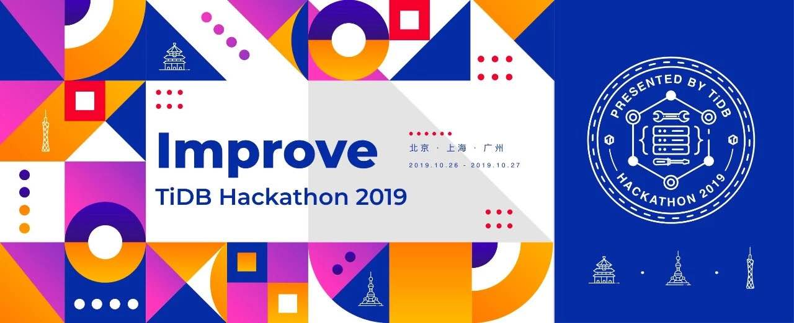
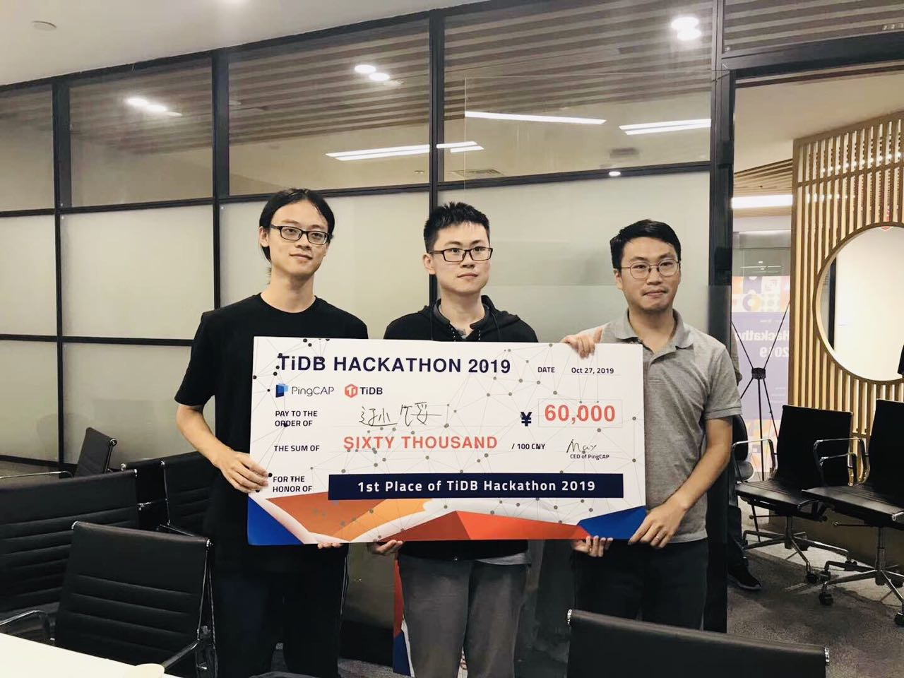
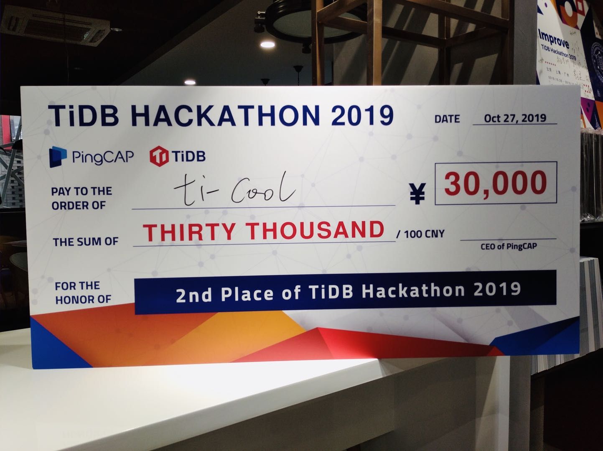
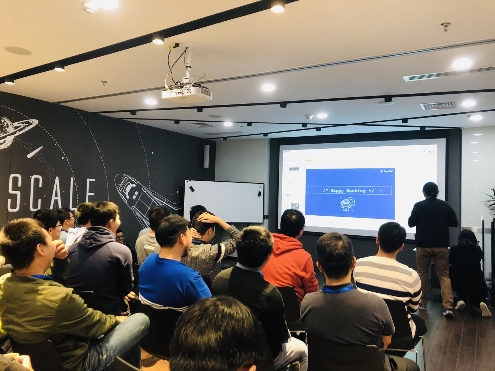
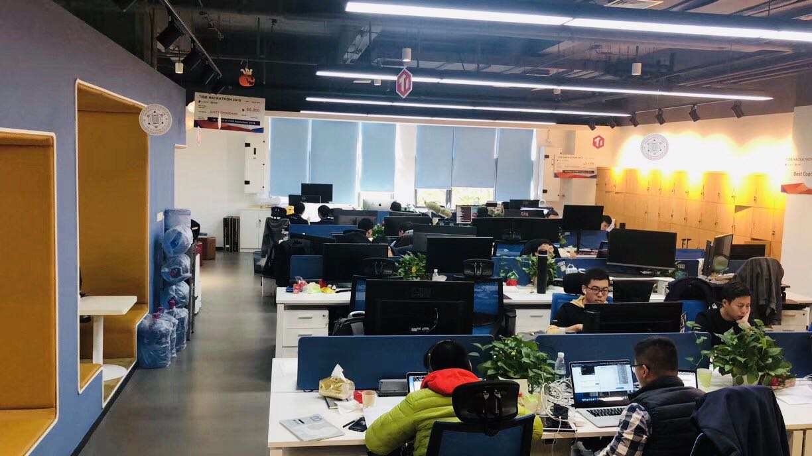
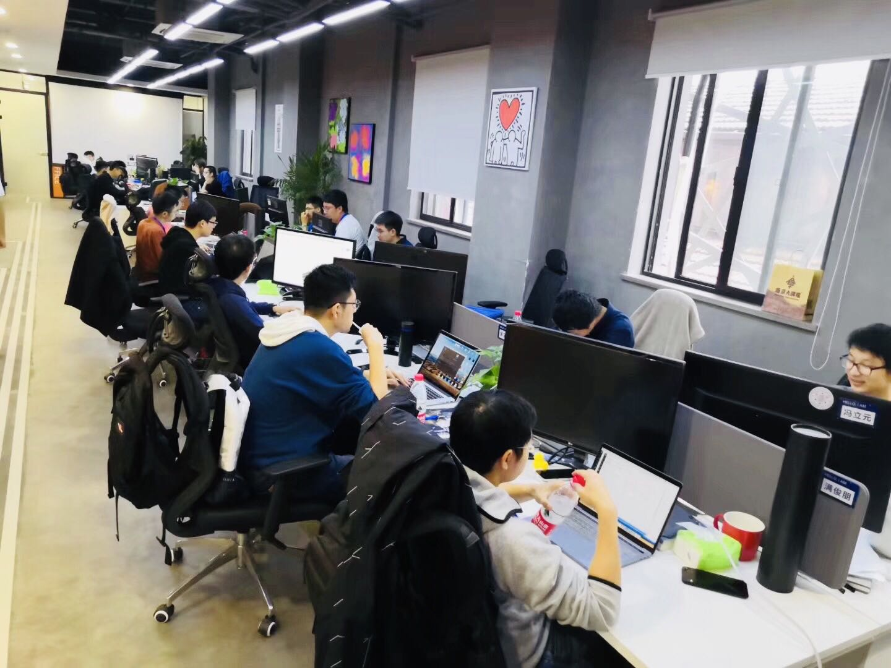
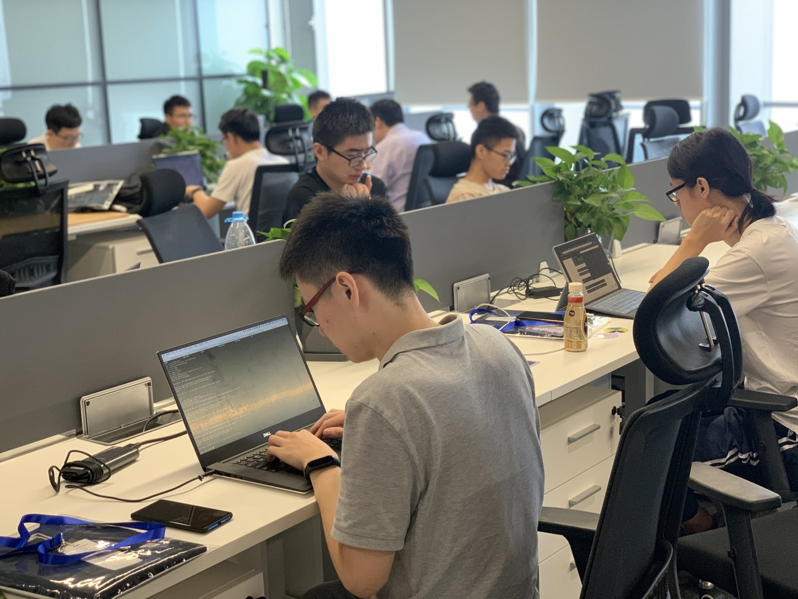
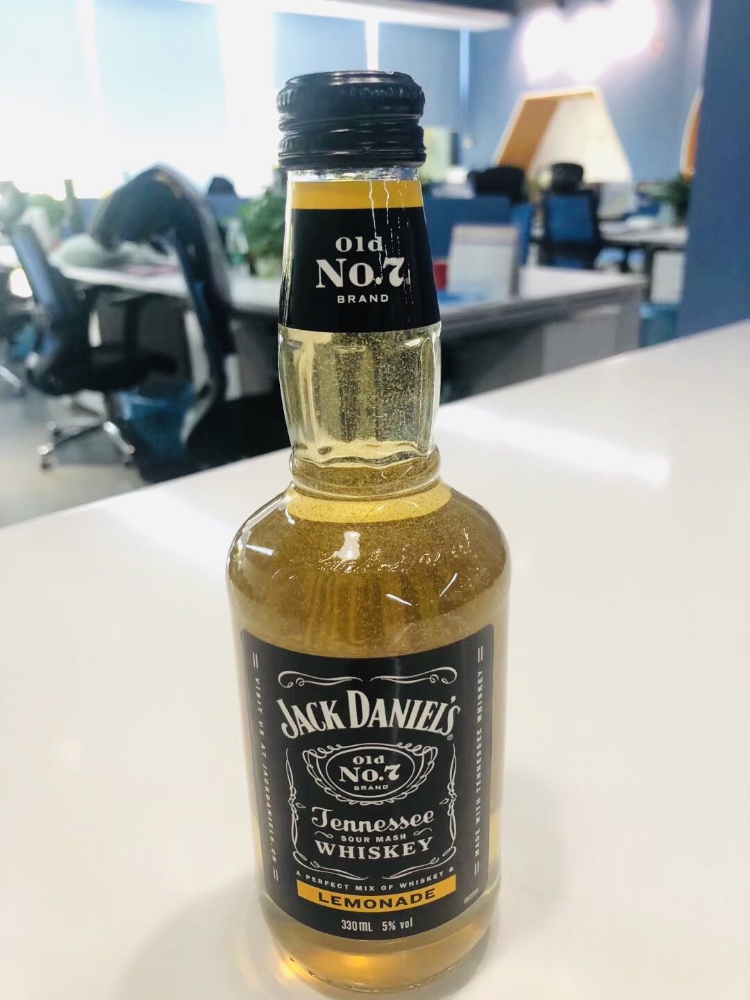
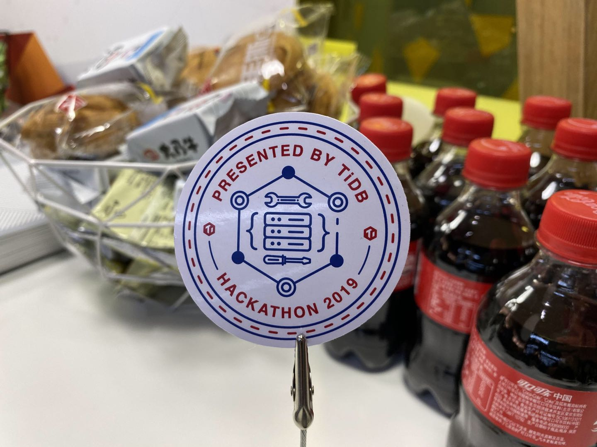
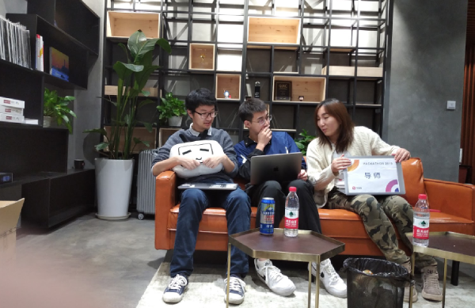

---
title: INSERT INTO tidb.hackathon_2019 VALUES ("Hack", "Fun", "TiDB Ecosystem")
date: 2019-10-30
summary: This post introduces the top 3 winners at TiDB Hackathon 2019 and the cozy and friendly environment of this meeting. 
tags: ['TiDB', 'Open Source Community']
categories: ['Open Source Community']
--- 

The weekend of Oct. 26 and 27 saw a bunch of hackers and geeks gather in three PingCAP offices in Beijing, Shanghai, and Guangzhou. They were summoned by TiDB Hackathon 2019 and the fun of hacking!

During the two days of hacking, we were amazed to see 39 awesome projects from 39 teams. Great new ideas sparkled in the TiDB universe, and it was hard to decide which team would win the trophy. 

Our PingCAP customers will benefit from all this hacking because the theme of this year’s event was "Improve." Some participants worked to improve TiDB’s performance, usability or functionality. Other hackers focused on improving the efficiency of TiDB Ecosystem tools. 

We were glad to see the participants contribute their ideas not only from the perspective of database developers but also to put themselves in the shoes of users. Demos rocked, and the audience continued to "WOW" through each presentation. 

So without further ado, here are the top 3 winners!

## Top 3 winners

 *1st place of TiDB Hackathon 2019* 

**Project:** Unified Thread Pool

**Comment:** There are following issues in [TiKV](https://tikv.org/)could use some improvements:

* TiKV (TiDB’s storage engine) has too many thread pools. If you switch among threads too frequently, performance declines.
* Big queries impact small queries.

A successful solution would minimize the number of thread pools and also ensure that if a thread pool schedules big and small queries, the small queries perform well. In this project, our hackers created a self-adaptive unified thread pool in TiKV to process read requests. This approach greatly improved TiKV/TiDB's performance, and, predictably reduced the impact of big queries on small queries. One of their team members, Yilin, was inspired by [Multilevel feedback queue](https://en.wikipedia.org/wiki/Multilevel_feedback_queue) and took advantage of Rust [`juliex`](https://github.com/withoutboats/juliex) crate to create their own thread pool. Along with his classmates, they came out with Thread Pool Protocol, and we’re amazed by the actual testing results: the performance of Sysbench `POINT SELECT` is greatly improved by 60% while QPS remains stable! 

This project won the praise of all the judges, and we are looking forward to the actual realization of this project.

[Slides](https://cdn2.hubspot.net/hubfs/4466002/Unified%20Thread%20Pool.pdf) are here!

**GitHub links:**	

* [https://github.com/sticnarf/adaptive-thread-pool](https://github.com/sticnarf/adaptive-thread-pool) 
* [https://github.com/sticnarf/tikv/tree/hackathon](https://github.com/sticnarf/tikv/tree/hackathon) 
* [https://github.com/sticnarf/tidb/tree/hackathon](https://github.com/sticnarf/tidb/tree/hackathon)
* [https://github.com/waynexia/texn](https://github.com/waynexia/texn) 
* [https://github.com/sticnarf/kvproto/tree/hackathon](https://github.com/sticnarf/kvproto/tree/hackathon) 

 *2nd place of TiDB Hackathon 2019* 

**Project:** tidb-wasm: Run TiDB Inside Your Browser (and everywhere)

**Comments:** User experience matters. This project leverages [WebAssembly](https://en.wikipedia.org/wiki/WebAssembly) (wasm) technology and lets users run TiDB in their browser. We’ve been interested in WebAssembly since it appeared, and this project inspires us to make a TiDB playground and embed it on our official website. So in the future, if you’re interested in learning more about TiDB (or even MySQL), you can get on your browser and get your hands dirty. 

[Slides](https://cdn2.hubspot.net/hubfs/4466002/tidb-wasm.pdf) are here!

**GitHub link:** [https://github.com/lucklove/tidb-wasm](https://github.com/lucklove/tidb-wasm) 

 *2nd place of TiDB Hackathon 2019* 

**Project:** Using Raft to mitigate TiDB Cross-DC latency

**Comments:** This promising project aims to mitigate the latency issue in cross datacenter (DC) replication (three DCs across two cities). The solution is implemented on the Raft layer. 

Highlights of this project include the following: 

* Follower Replication, `raft sub-group` is introduced so that all nodes are classified into groups according to the location of the datacenter. In the remote city, there is a Follower Delegate node among the Followers. The Leader node only communicates with this Delegate node, which replicates the data to other Follower nodes in its cluster. 

* [Follower Read](https://github.com/tikv/tikv/pull/5051): To improve the performance of cross-region Follower Read, the TiDB server concurrently dispatches the TimeStamp Oracle (TSO) requests to the Placement Driver (PD) server and the ReadIndex request to the Follower node and greatly reduces round-trip time. This project is so promising that we are very likely to merge it soon. 

[Slides](https://cdn2.hubspot.net/hubfs/4466002/Solution%20for%20Cross%20Datacenter%20Replication.pdf) are here!

**GitHub links:**

* [https://github.com/TennyZhuang/kvproto](https://github.com/TennyZhuang/kvproto)
* [https://github.com/TennyZhuang/tidb](https://github.com/TennyZhuang/tidb) 
* [https://github.com/TennyZhuang/tikv](https://github.com/TennyZhuang/tikv) 
* [https://github.com/TennyZhuang/pd](https://github.com/TennyZhuang/pd) 

## Hack, Beer, Network

On Day 1, hackers from all over China gathered in TiDB "distributed" offices. The day kicked off with a warm welcome from Ed Huang, our Co-founder and CTO, who shared his own hackathon experience and offered some advice for hackathon newbies. 

 *Happy Hacking starts!* 

At 10:00 a.m, 2019 TiDB Hackathon officially launched! Happy Hacking, folks!

 *Hacking in Beijing* 

 *Hacking in Shanghai* 

 *And hacking in Guangzhou, too!* 

Hackathon is more than a coding competition. It’s a great opportunity for you to meet more like-minded friends in a free and cozy environment. And we definitely followed the hackathon tradition: pizza, beer, and swag!

 *Pizza and crayfish* 

 *This bottle helps solve coding bottlenecks* 

 *TiDB Hackathon 2019 swag* 

To accelerate participants’ performance, we had mentors standing by field questions and provide inspiration. What a great way to share technical knowledge!

 *A mentor sharing technical knowledge* 

## What’s next

Stay tuned to this blog, because our winning teams are going to share more details of their excellent project. If you’re interested in one of the projects, you’re warmly welcomed to join in our open-source community. [Slack](https://pingcap.com/tidbslack)channel is always open for you to contact our engineers. Want to contribute your ideas to the next Hackathon? Feel free to shoot a DM to our [Twitter](https://twitter.com/PingCAP). 

See you next year!
