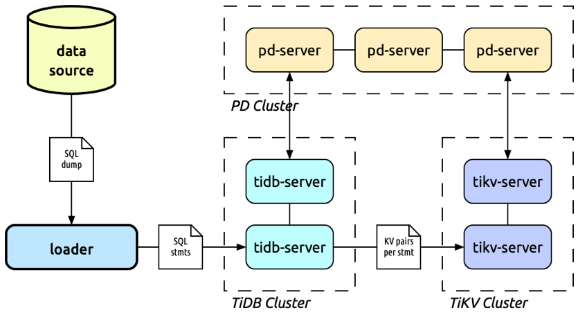
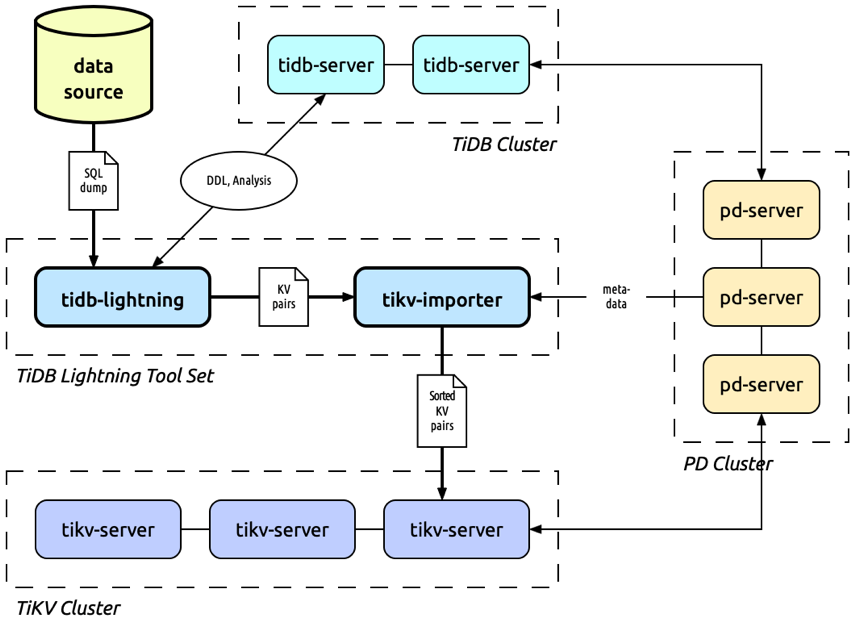
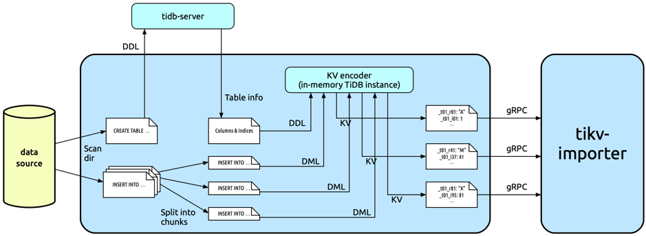
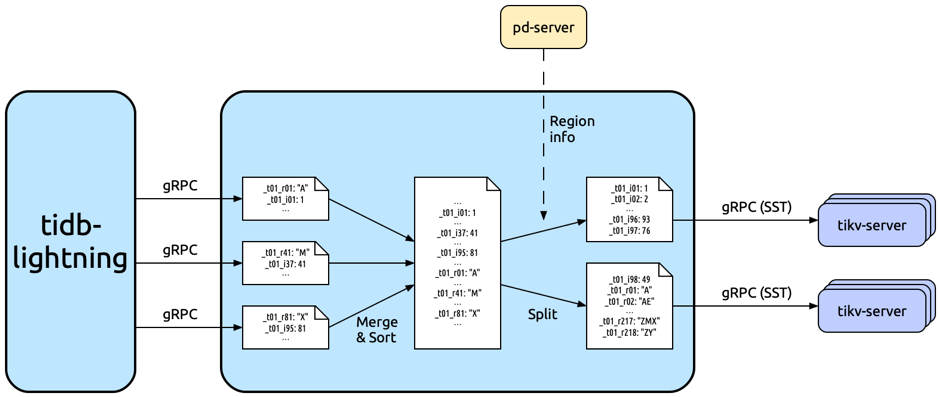
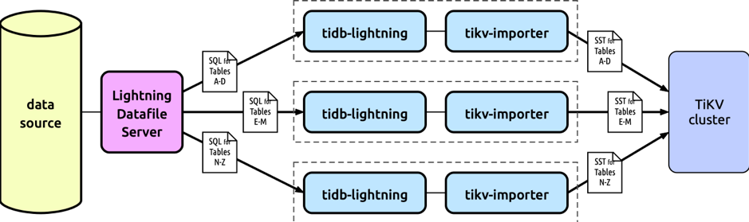

[TiDB Lightning](https://github.com/pingcap/tidb-lightning) is an open source TiDB ecosystem tool that supports high speed full-import of a large SQL dump into a TiDB cluster. It is much faster than the traditional "execute each SQL statement" way of importing, at least tripling the import speed to about 250 GB per hour.

TiDB Lightning is designed for quickly importing a large MySQL dump into a new TiDB cluster by using just a few spare machines. This is commonly used to bootstrap TiDB from a pre-existing production MySQL database, in order to evaluate TiDB with real-world data, or directly migrate the production workload into TiDB.

## Design

TiDB has provided a "[Loader](https://pingcap.com/docs/tools/loader/)" tool since early 2017. Loader itself is a fairly optimized full-import tool, using multi-threaded execution, error retry, checkpoints and adjustment of some TiDB-specific system variables for further speed-up.



However, the heart of the process is still the same — run each INSERT statement in the SQL dump one-by-one. Our goal is to initialize an empty TiDB cluster, and loading data this way is fundamentally inefficient. The issue of importing through the SQL layer is having too much protection. As the import happens online, the TiDB cluster needs to guarantee many invariants throughout the process:

- To guarantee ACID, we need to wrap the INSERTs in transactions.
- To guarantee balance and data redundancy, TiKV needs to continuously split and move ("schedule") Regions among servers as the database grows.

These are what makes TiDB robust, but they are simply unnecessary in our use case.

Furthermore, when we process the data in parallel, they are often not sorted. The ranges of new data will overlap with the existing ranges. TiKV requires the stored data to be always sorted, and high amount of random insertion in the middle would cause additional data movement (known as "compaction"), which would also slow down the insertion process.

TiKV stores data as KV pairs on RocksDB, and RocksDB stores the persistent data as a series of "SST" files. Instead of using SQL, we could perform the import by parsing the SQL statements offline into KV pairs, and generate the sorted SST files and push ("[ingest](https://github.com/facebook/rocksdb/wiki/Creating-and-Ingesting-SST-files)") them into the corresponding RocksDB directly. The batch processing allows us to skip the cost of ACID and online sorting, and thus gain better performance.

## Architecture



TiDB Lightning consists of two components: **tidb-lightning** ("Lightning") and **tikv-importer** ("Importer"). Lightning is responsible for converting SQL into KV pairs, and Importer is responsible for sorting KV pairs and scheduling them into the TiKV servers.

While it is possible to combine these into a single program like Loader, we chose to split it into two components for two reasons:

1. Importer works closely with TiKV, while Lightning works closely with TiDB. Each component of the Toolset uses some part of the latter as libraries. This causes a linguistic mismatch between the two parts as TiKV is written in Rust and TiDB is written in Go. It is much easier to develop them as independent programs instead, and let the KV pairs be transmitted via gRPC.
2. Having separate Lightning and Importer also gives more flexibility in horizontal scaling, for example, allowing multiple Lightning instances to stream to the same Importer.

Below we'll go through the internals of each component.

### Lightning



Currently, Lightning only supports loading SQL dump created by Mydumper. Unlike mysqldump, Mydumper distributes the content of each table into individual files, which help us to process the database in parallel without parsing the entire dump first.

First, Lightning scans the SQL dump, and classifies them into schema files (involving CREATE TABLE statements) and data files (involving INSERT statements). The schema files are executed directly on the target TiDB server to initialize the skeleton of the database. Lightning then processes each table in parallel.

Here we focus on a single table. Each of the data files has a regular pattern like:

```
INSERT INTO `tbl` VALUES (1, 2, 3), (4, 5, 6), (7, 8, 9);
INSERT INTO `tbl` VALUES (10, 11, 12), (13, 14, 15), (16, 17, 18);
INSERT INTO `tbl` VALUES (19, 20, 21), (22, 23, 24), (25, 26, 27);
```

Lightning preliminarily parses the data files and assigns row numbers to each row. The row numbers are needed to uniquely identify each row when the table has no primary key. It also splits the data files into similar-sized "chunks" (256 MiB by default). Chunks are processed in parallel, so a huge table could still be imported quickly. As an example, we split the above data file into 5 chunks of ≥20 bytes each.

```
INSERT INTO `tbl` VALUES (1, 2, 3), (4, 5, 6), (7, 8, 9);
INSERT INTO `tbl` VALUES (10, 11, 12), (13, 14, 15), (16, 17, 18);
INSERT INTO `tbl` VALUES (19, 20, 21), (22, 23, 24), (25, 26, 27);
```

Inside Lightning, each table would be associated with a KV encoder, which is in fact a TiDB instance using an in-memory storage ("mocktikv"). Thus after executing an INSERT statement, the KV encoder would record the result into a memory buffer (containing the data itself and also the indices), which Lightning can read out as the resulting KV pairs. In this way, we could easily convert the SQL statement into KV pairs using the same rules as TiDB itself.

After KV pairs are obtained, they will be passed to Importer.

<div class="trackable-btns">
    <a href="/download" onclick="trackViews('TiDB Tools (II): Introducing TiDB Lightning', 'download-tidb-btn-middle')"><button>Download TiDB</button></a>
    <a href="https://share.hsforms.com/1e2W03wLJQQKPd1d9rCbj_Q2npzm" onclick="trackViews('TiDB Tools (II): Introducing TiDB Lightning', 'subscribe-blog-btn-middle')"><button>Subscribe to Blog</button></a>
</div>

### Importer



Since Lightning processes chunks in parallel, the KV pairs received by Importer are essentially out of order. Thus the primary work of Importer is to sort them. This would require a storage space as large as the table itself, which we call an "engine file". Every table is associated with one engine file.

Instead of reinventing the wheel, we implement the engine using RocksDB again — an engine file is equivalent to a local RocksDB instance optimized for bulk-write. Here "sorting" is simply done by writing the KV pairs into the engine file, which in the end automatically gets us the merged and sorted SST file.

This SST file contains data and indices of a single table, and is typically much larger than a TiKV Region. Thus, Importer will need to pre-split it into Regions of appropriate sizes (96 MiB by default) and then query the Placement Driver (PD) for the addresses of TiKV servers to schedule these split Regions into different nodes.

Finally, Importer uploads the Regions of SST into the TiKV nodes. The TiKV leader then sends an "Ingest" command to import the SST file into the Raft group and conclude the import of this Region.

### Checking

With huge amount of data to operate on, we need to automatically ensure the integrity of data to prevent silent errors. After all Regions are imported, Lightning will compare the checksum of the data before delivering to Importer, and the checksum of the data after importing into the TiKV cluster. If they are the same, we can say that all data are intact.

The checksum of a table is computed by hashing its KV pairs. Since the KV pairs are distributed into multiple TiKV servers, we need a hash function which is associative. Also, before delivering KV pairs to Importer, they are not completely sorted, so the hash function should also be order-independent (i.e. commutative). This means we cannot simply SHA-256 the entire SST file for instance.

In TiDB, we implement the checksum by computing the CRC64 of each KV pair, and then XOR all values together. In addition to the XOR of CRC64, we also compute the number of KV pairs and total size of KV pairs (both are commutative and associative) to further reduce the rate of raising conflicts. In the future, we may include more contemporary hash algorithms if performance allows.

## What's Ahead

This article shows us that TiDB Lightning improves the import speed by skipping some complicated, time-consuming operations and thus makes it suitable for initializing a big database. Our team still has many items on our roadmap to make TiDB Lightning better.

### Speed improvement

Currently, TiDB Lightning feeds the entire INSERT INTO statement into the KV encoder unmodified. So even though we have avoided the cost of distributed SQL, we still need to use TiDB's parser for generic SQL, go through the query planner, and other steps before populating the in-memory KV store. We could instead create a specialized parser, and expose lower-level APIs to TiDB Lightning to shorten the path of SQL-to-KV conversion.

### Parallel import



The capacity that a single machine can provide is limited, so to increase capacity, we need horizontal scaling, i.e. adding more machines. As explained before, the TiDB Lightning can be naturally parallelized, by distributing different tables to different nodes. However, the current implementation can only read from the filesystem, so setting this up is pretty messy (requires mounting a network drive and manually allocating tables to different nodes). Thus, we plan to allow TiDB Lightning to interact with the network file storage API (e.g. S3 API), and create a utility to automatically split the database for multiple TiDB Lightning instances to simplify deployment.

### Online import

When the TiDB Lightning is importing data, it will put the cluster in a mode exclusive for the write access from TiDB Lightning. This is fine for now, because the main application of TiDB Lightning is to initialize an empty TiDB database before production. But we do like to support more scenarios (e.g. restoring a backup or storing large-scale OLAP computation results), which requires keeping the cluster online. Thus, one direction we'll pursue is how to minimize the impact of TiDB Lightning on the cluster.
