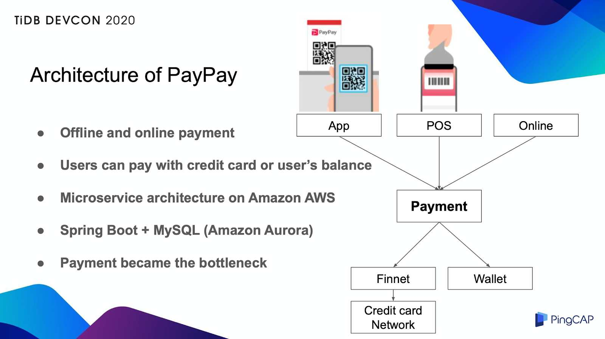
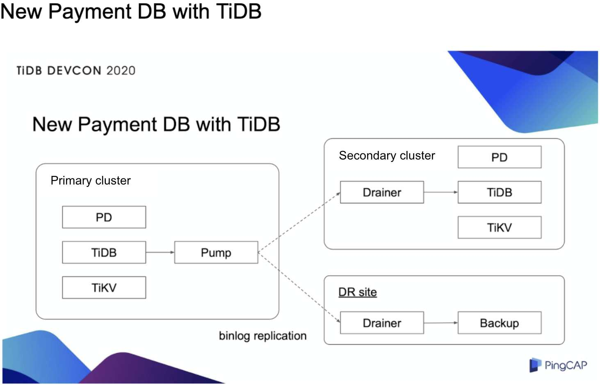
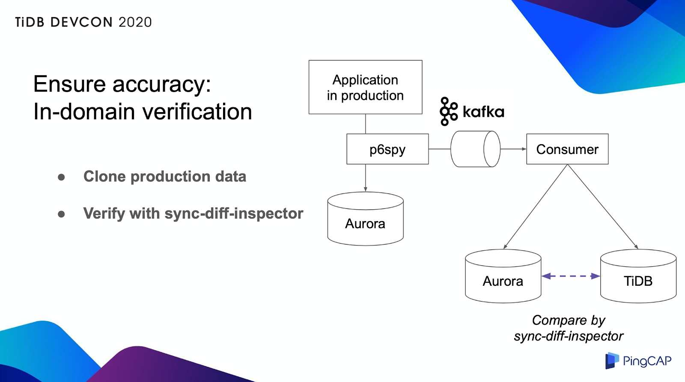
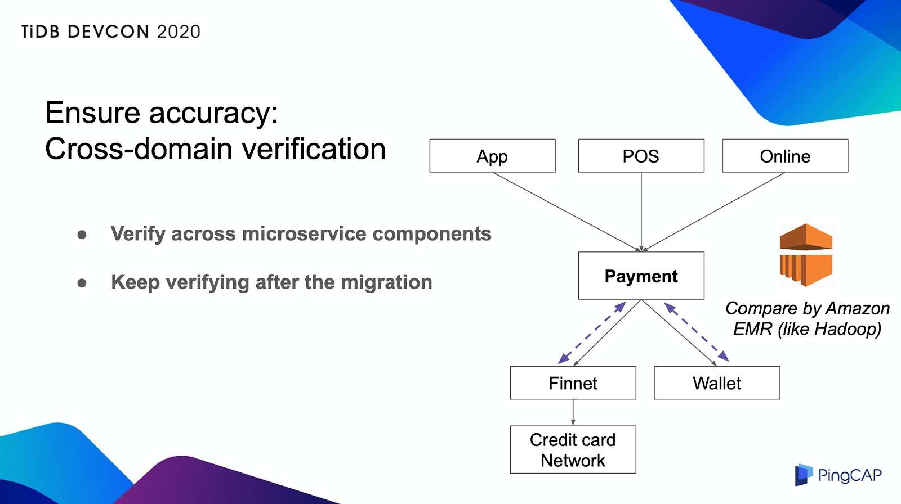
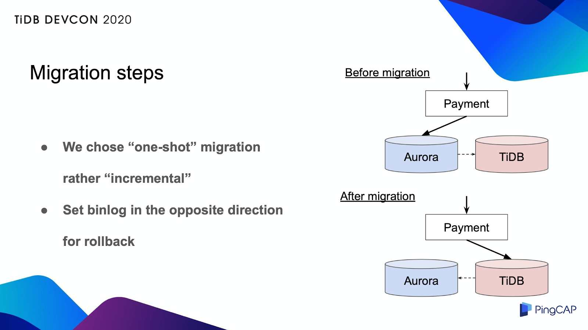

**Industry:** Mobile Payment

**Author:** Munenori Hirakawa (Senior Manager, PayPay Product Tech Division)

*This article is based on a talk given by Munenori Hirakawa at [TiDB DevCon 2020](https://pingcap.com/community/devcon2020/). See the [video](https://www.youtube.com/watch?v=vCXrEZ-gf_M) and [slides](https://www.slideshare.net/PingCAP-TiDB/tidb-at-paypay).*

[PayPay](https://www.crunchbase.com/organization/paypay#section-overview) was established in October 2018 as a joint venture Softbank Group, Yahoo Japan, and the Indian mobile payment company Paytm. It is the number one mobile payment company in Japan. Japan is still mainly a cash-based society, but after large-scale marketing activities and government policy support for a cashless society, our business is rapidly expanding. Currently, there are about 100 million people in Japan, of which 30 million users and 2 million merchants are using PayPay, and our recent transaction volume has reached 1 billion.

Last year, as our business grew extremely fast, our most mission-critical database, the Payment database (which manages our payment transactions), had a write-heavy workload and became a bottleneck. After a careful investigation, we decided to migrate from Amazon Aurora to TiDB, an open-source, distributed [Hybrid Transactional/Analytical Processing](https://en.wikipedia.org/wiki/HTAP) (HTAP) database. **Thanks to TiDB's horizontal scalability, we no longer have to worry about our database capacity**.

Below I will share why we migrated from Amazon Aurora to TiDB and the practical experience of migration.

## Our pain point: limited database capacity

PayPay can be used for online and offline payments. We support multiple payment methods. PayPay uses Amazon AWS as the infrastructure, and a microserver architecture is built on top of it.

 PayPay's architecture 

We have about 80 components, and almost all components use Java, Spring Boot, and Amazon Aurora as the database architecture. All payment transactions are transmitted to the Payment component for management. When a payment transaction occurs, the transaction data is written to the Payment database, and the status of the transaction is updated accordingly. Therefore, the Payment database has a write-heavy workload. Coupled with the growing business volume, the Payment database has become a bottleneck. So we decided to migrate to a more scalable database.

## Why choose TiDB?

[TiDB](https://docs.pingcap.com/tidb/stable/overview) is an open-source, cloud-native, distributed SQL database built by [PingCAP](https://pingcap.com/) and its open-source community. There are several reasons for choosing TiDB as our new database:

* TiDB is **compatible with MySQL** and requires almost no application code changes. Since TiDB is a distributed architecture, we must pay attention to the auto-increment behavior for the ID, but such modifications are rare.
* TiDB can **scale horizontally** and can easily cope with future data growth. In addition, the TiDB cluster is composed of multiple instances and can be highly available. PayPay's cloud-native architecture also fits well with TiDB.
* Because developers **don't have to do sharding** at the application level, we can keep the application simple. When the database becomes a bottleneck, we usually use the user ID as the sharding key to do sharding and store the data separately in multiple databases. However, in this approach the application needs to handle the sharding logic, and the application becomes more complicated. If we use TiDB, we eliminate this problem.
* **Many companies have already used TiDB in production environments**. TiDB has rich experience—especially in the financial field—which makes us more confident in this new technology. This is also the most convincing point for decision-makers.

In addition, we also compared Amazon Aurora and TiDB.

The advantage of Aurora is that:

* It uses a write primary endpoint and a read-only secondary endpoint by default. The replication latency between the primary and secondary is very small. Even if a slow query occurs on the secondary, it will not affect the write performance on the primary. Proper use of these two endpoints can effectively ensure stability.
* Aurora is an AWS managed service with low management costs.

However, **when Aurora encounters many write requests, binlog replication becomes a bottleneck**. During the commit process, Aurora waits for the replication destination to return an acknowledgement (ACK), so when the number of replications increases, the commit latency also increases. For disaster recovery, we needed replication, so this problem was getting worse. When we did a proof of concept for TiDB, we did not encounter this problem. TiDB can easily handle three times more transactions than Aurora. To be fair, I want to emphasize that Aurora is a good database. But it wasn't just because of our binlog replication requirements.

Taken together, these are the reasons we decided to migrate to TiDB.

## Our new Payment database with TiDB

 The new Payment database with TiDB 

A TiDB cluster consists of [TiDB](https://docs.pingcap.com/tidb/stable/tidb-architecture#tidb-server), [TiKV](https://docs.pingcap.com/tidb/stable/tidb-architecture#tikv-server), and [Placement Driver](https://docs.pingcap.com/tidb/stable/tidb-architecture#placement-driver-pd-server) (PD), and each component has multiple instances. In addition, we set PingCAP's [Pump](https://github.com/pingcap/tidb-binlog/tree/master/pump) and [Drainer](https://github.com/pingcap/tidb-binlog/tree/master/drainer) components to replicate binlog to the secondary cluster and disaster recovery site. Multiple instances are located in separate data centers. Therefore, now they are highly fault tolerant.

## Migration practice

It took us a month to verify and discuss whether to migrate to TiDB. In the next two months, we did a detailed verification.

### Data integrity testing

The first test is data integrity. We have confirmed that TiDB will work as expected after integrating with our application. To ensure this, we introduced two types of verification: in-domain verification and cross-domain verification.

#### In-domain verification

 In-domain verification 

Of course, we conducted the tests in the test environment. But we wanted to confirm the behavior with the actual production data, so we cloned the actual production traffic to another Aurora and TiDB to see if the data was exactly the same. We introduced a framework called p6spy here.

P6spy captures the data sent through the JDBC connection and publishes it to the Kafka message queue. The consumer application executes database operations sent by Kafka messages on Aurora and TiDB. Then, we used the sync-diff-inspector provided by TiDB to compare the two sets of data. As a result, we confirmed that the data in the two databases are exactly the same. The advantage of this method is that the test can be completed without any additional load on the production database.

#### Cross-domain verification

Since our system is a microservice, we've also added a consistency check between the Payment database and other adjacent components. We used Amazon Elastic MapReduce (EMR), a Hadoop-like architecture, as shown in the following figure:

 Cross-domain verification 

We extract data from each database every few minutes, give it to EMR, and continuously check the consistency of these components. This check is carried out before and after the migration, and we hope that this system can also detect unknown problems even after the migration.

### Performance and availability testing

We already have the ability to handle high transactions per second (TPS) that Aurora cannot handle, so we tuned the application to improve performance, such as increasing the size of the connection pool and deleting unnecessary indexes. **TiDB can easily handle three times more TPS than Aurora, with the latency of payment transactions less than one second**.

For failure case testing, we simulated more than 30 scenarios, such as instance failure, cluster failure, and availability zone down. We confirmed indicators such as recovery point objective (RPO) and recovery time objective (RTO). Thanks to binlog replication, we could reduce the RPO to near zero, but due to the amount of data, the RTO is still high. To avoid large-scale failures in the future, we need to shorten the recovery time.

### Migration process

To reduce risks in the actual migration, we considered using incremental methods to gradually increase traffic. If it was a read-only database, we could easily control the traffic. But for a write database, the implementation can be very complicated. Therefore, we chose a one-shot approach.

 Migration steps 

This method is very simple, but if something goes wrong, it's risky because it will impact all users. Therefore, it's important to be able to roll back immediately. We performed binlog replication for initial data migration, but during the migration process, we set the replication to the opposite direction. Now we use Aurora as a backup, so that even if something goes wrong, we can roll it back immediately.

Similarly, before the migration, we had multiple rehearsals. The actual migration was completed within about two hours, including verification time, without any problems, and service downtime was minimized.

It has been three months since the migration, and so far we have achieved the expected performance. In the past three months, there have been no incidents. TiDB is amazing and very reliable. In addition, I would also like to thank PingCAP for their support. They've provided a lot of help, and we've come to trust them and TiDB. Taking this opportunity, I would like to express my gratitude again.

## Future plans

We selected TiDB 2.x because it is a mission-critical database and a very mature release. Later this year, we will upgrade to 3.x or higher. We can expect many benefits such as more efficient use of TiKV [Regions](https://docs.pingcap.com/tidb/dev/glossary#regionpeerraft-group) and improved backup features. If necessary, we also want to migrate other databases besides Payment. Finally, we hope to contribute to the TiDB community by sharing our knowledge and experience.

We hope TiDB will become better and better in the future.
