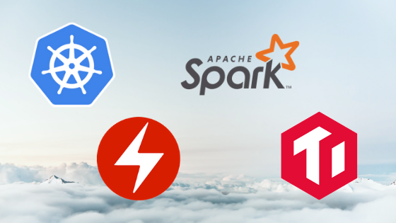

Many technology stacks have emerged over the years that made software developers' lives easier and more productive -- better development efficiency, clearer software choices. The most notably among them is the [LAMP](https://en.wikipedia.org/wiki/LAMP_(software_bundle)) stack (Linux, Apache HTTP server, MySQL, PHP), which helped countless developers turn their big ideas into big companies, none bigger perhaps than [Mark Zuckerberg creating Facebook](https://www.infoq.com/presentations/Facebook-Software-Stack). More recently, popular web development patterns that leverage Javascript, like the [MEAN](https://en.wikipedia.org/wiki/MEAN_(software_bundle)#cite_note-MongoDBMEANstack-2) stack (MongoDB, Express.js, Angular, Node.js) and its close cousins, MERN (swap Angular for React) and MEVN (swap Angujar for Vue.js), have shrunk idea-to-market time dramatically.

However, as cloud computing becomes the default way to consume infrastructure resources, just getting an app up and running is no longer enough for the next wave of innovation -- not only does an idea need to reach market quickly, it needs to be architected **for scale** from the get go to handle rapid growth and ideally without vendor lock-in of any sort.

To meet this demand, a new infrastructure pattern is emerging called the KOST stack ([Kubernetes](https://en.wikipedia.org/wiki/Kubernetes), [Operator](https://coreos.com/blog/introducing-operator-framework), [Spark](https://en.wikipedia.org/wiki/Apache_Spark), [TiDB](https://en.wikipedia.org/wiki/TiDB)). This set of open-source technologies and framework provides a pattern that let's a developer consume cloud computing resources of any mix (public, private or hybrid) with a relational database management system that can performantly handle a hybrid of transactional and analytical processing workloads, so called [HTAP](https://en.wikipedia.org/wiki/Hybrid_transactional/analytical_processing_(HTAP)). The native integration between these technologies makes spinning up a "KOST cluster" doable during any weekend hackathon -- whether you are part of a legacy IT department looking to be "cloud-native" or a single developer looking to launch the "next big thing".

## Components

### Kubernetes

Kubernetes is a set of open-source container orchestration APIs that has become the defacto toolset for deploying, running, and managing containerized workloads. Since being open-sourced by Google in 2014, its evolution, popularity, and rate of adoption have increased at a breathtaking pace -- some even label it [the Operating System of the cloud](https://www.infoworld.com/article/3322120/sorry-linux-kubernetes-is-now-the-os-that-matters.html). Redmonk co-founder and analyst Stephen O'Grady said [it most succinctly](https://redmonk.com/sogrady/2018/11/07/vmware-heptio/), "...it's Kubernetes's world and we're all just living in it..."

While other container orchestration layers do exist (e.g. [Docker Swarm](https://en.wikipedia.org/wiki/Docker_(software)), [Apache Mesos](https://en.wikipedia.org/wiki/Apache_Mesos), [OpenStack](https://en.wikipedia.org/wiki/OpenStack)), the cloud computing world has coalesced around Kubernetes. As a case in point, all major public cloud platforms offer their own managed Kubernetes engines ([EKS](https://aws.amazon.com/eks/) in AWS, [AKS](https://azure.microsoft.com/en-us/services/kubernetes-service/) in Azure, [GKE](https://cloud.google.com/kubernetes-engine/) in GCP, [ACK](https://www.alibabacloud.com/product/kubernetes) in Alibaba Cloud), along with a large array of vendors providing managed Kubernetes solutions either on-premises or across different clouds -- [OpenShift](https://www.redhat.com/en/technologies/cloud-computing/openshift), [VMware PKS](https://cloud.vmware.com/vmware-enterprise-pks), [Rancher](https://rancher.com/), [Giant Swarm](https://giantswarm.io/), to name just a few.

Kubernetes is the common denominator of all cloud computing workloads and the foundation for enabling a private cloud or a multi-cloud architecture, which is especially appealing for large enterprises who either don't want to be locked-in to one public cloud vendor, or must manage their own cloud infrastructure for security, compliance, or data governance reasons.

### Operator

An [Operator](https://coreos.com/operators/) is a method of packaging, deploying, and managing a Kubernetes application. It is designed for running *stateful* workloads easier to manage and operate, which is a relative weakness of vanilla Kubernetes (most Kuberentes production workloads to date are *stateless*). The Operator pattern was pioneered by CoreOS, championed and fostered by Red Hat after [its acquisition of CoreOS](https://www.redhat.com/en/about/press-releases/red-hat-acquire-coreos-expanding-its-kubernetes-and-containers-leadership), and has gained popularity [among different database technologies](https://thenewstack.io/databases-operators-bring-stateful-workloads-to-kubernetes/) looking for ways to deliver its solution in a so-called "cloud-native" way, which has become somewhat synonymous with "Kubernetes-native". Both Spark and TiDB have their own Operator implementation that are open-sourced for this very reason. Percona, a leading enterprise support, services, and consulting provider for open-source databases, also [announced two operators](https://www.percona.com/about-percona/newsroom/press-releases/percona-cloud-native-autonomous-database-initiative) for its XtraDB Cluster and MongoDB offering respectively.

It's a critical layer in the KOST stack, because running a HTAP database stack in the cloud requires careful management of the state of data, to ensure that data is both strongly consistent and made available for analysis in near real-time. Additionally, there are other routine but important operational tasks that must happen, like horizontal scaling for capacity, backup, and recovery, during the course of running a database. All these tasks can be encoded and semi-automated within an Operator. It's essentially an [encoded extension of your SRE team](https://coreos.com/blog/introducing-operators.html).

### Spark

[Apache Spark](https://en.wikipedia.org/wiki/Apache_Spark), first created at UC Berkeley's AMPLab in 2009, is a widely used distributed cluster computing framework that excels in big data analytics -- classic online analytical processing (OLAP) workloads. It has since evolved, with components that support data streaming with Spark Streaming, querying structured and semi-structured data with Spark SQL, and conducting Machine Learning with Spark MLlib.

Spark has [its own](https://github.com/GoogleCloudPlatform/spark-on-k8s-operator) Operator, and can interface with a variety of distributed storage systems to aggregate data, including [Alluxio](https://en.wikipedia.org/wiki/Alluxio), [HDFS](https://en.wikipedia.org/wiki/Apache_Hadoop#Hadoop_distributed_file_system), [Cassandra](https://en.wikipedia.org/wiki/Apache_Cassandra), [AWS S3](https://en.wikipedia.org/wiki/Amazon_S3), [OpenStack Swift](https://en.wikipedia.org/wiki/OpenStack#Object_Storage_(Swift)), and [TiKV](https://tikv.org/), which is a distributed transactional key-value store and also a Cloud Native Computing Foundation (CNCF) member project.

### TiDB

While Spark provides a strong analytical engine, [TiDB](https://en.wikipedia.org/wiki/TiDB) completes in the transaction side of the puzzle to make HTAP a reality in the cloud. TiDB is an open-source [NewSQL](https://en.wikipedia.org/wiki/NewSQL) database solution that speaks the MySQL protocol and guarantees strong data consistency. The project has [significant traction](https://pingcap.com/docs/adopters/) in China, where it first started, by taking advantage of the [massive scale](https://softwareengineeringdaily.com/2019/02/26/china-scale-the-new-sandbox-to-battle-test-innovative-technology/) of the country's Internet economy to battle-test itself. TiDB is also experiencing strong growth in Southeast Asia and India, as well as traction in Europe and North America, noted recently by the industry analyst firm, [451 Research](https://cdn2.hubspot.net/hubfs/4466002/451_Research_PingCAP_Report_08MAY2019.pdf).

TiDB has its own Operator implementation, called [TiDB Operator](https://github.com/pingcap/tidb-operator), and works natively with TiKV to provide a relational MySQL-like database that scales horizontally without giving up transactional consistency. (TiDB and TiKV were both initially created and maintained by the commercial company, [PingCAP](https://pingcap.com/), before TiKV became a member project of CNCF. There is also an open-source Spark plug-in called [TiSpark](https://github.com/pingcap/tispark) that's maintained by PingCAP.)

## Cloud-Native HTAP in the Wild

Traditionally, transactions and analytics are run on two different databases (often designed to be well-suited for one or the other), and often managed by two different teams, even residing in two different buildings if you are a large enough enterprise. The architecture is monolithic (as opposed to microservices-based), difficult to scale horizontally, and data is only made available for analysis by managing a separate [ETL (Extract, Transform and Load)](https://en.wikipedia.org/wiki/Extract,_transform,_load) pipeline that runs once or a few times a day, likely done by a third team.

While this legacy way can still work in certain industries, highly competitive verticals like retail/eCommerce is adopting the cloud-native HTAP way with the KOST stack, in order to deliver features like "smart pricing", better inventory management, fraud detection, and new experiences like "[buy online, pickup in store](https://www.kohls.com/feature/buy-online-pick-up-in-store.jsp)". All these innovative approaches to shopping require a flexible digital infrastructure, as enabled by the KOST stack, that can scale quickly, operate easily, and enforce consistency of data while making it available to be aggregated and analyzed without requiring an ETL pipeline.

The KOST stack is by no means static, because each component is open-sourced, extendable, and integrates well with other software when the right use case beckons. Quite often, there's a Redis-based cache layered on top to add more speed and performance gain. An open-source service mesh layer, like [Istio](https://istio.io/), [Kong](https://en.wikipedia.org/wiki/Kong_Inc.), or [Linkerd](https://linkerd.io/), also tends to sit on top of KOST to manage a set of microservices to power your applications.

Because KOST is made up of only open-source software, it's entirely free to use if your team is willing to operate it -- allowing large enterprises to evolve digitally while sunsetting the expensive licenses of proprietary alternatives. If DIY isn't your style, each component has at least one commercial vendor ready to support it.

While stack patterns may sometimes inadvertently pick technology winners, irking certain vendors who have vested interests in the popularity of specific software, developers generally [don't mind](https://softwareengineeringdaily.com/2019/04/26/cloud-with-eric-brewer/). As the [new Kingmakers](https://www.amazon.com/New-Kingmakers-Developers-Conquered-World-ebook/dp/B0097E4MEU) of technology choices, developers are becoming increasingly sophisticated in filtering out vendor hype in favor of open-source technologies that have a vibrant community, play well with other software, and solve real technical pain points. Just like how LAMP lighted the way for the first wave of web development and MEAN/MERN/MEVN pushed the boundary of mobile development, KOST will ease the pain of using cloud computing to scale your database operation with real-time data insights -- empowering developers and entrepreneurs to do what they do best: build.

*This article was first published on [The New Stack](https://thenewstack.io/the-kost-stack-an-open-source-cloud-native-hybrid-database-stack/).*
