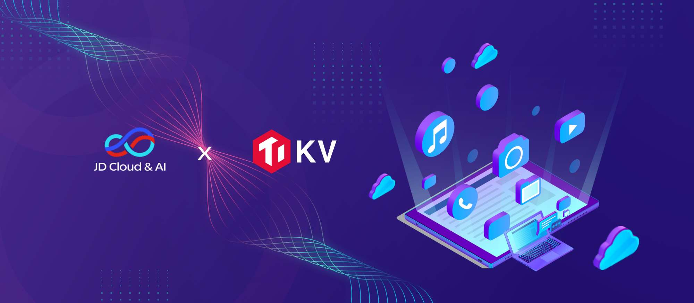
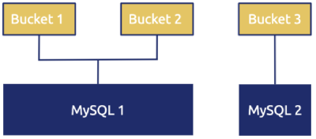
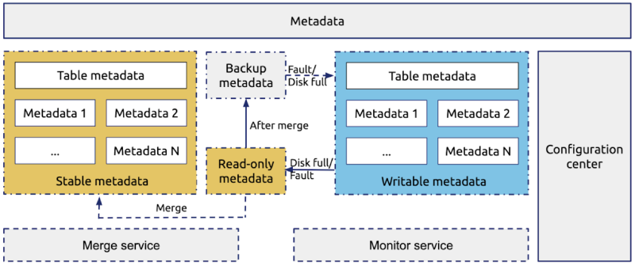
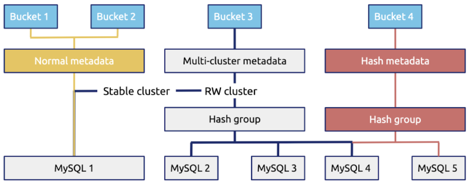
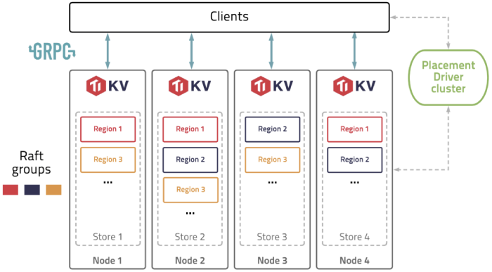
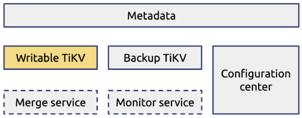
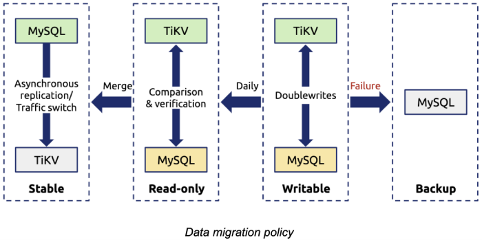

**Industry:** Cloud Computing

**Author:** Can Cui (Infrastructure Specialist at JD Cloud & AI)

[JD Cloud & AI](https://www.jdcloud.com/en/) is a smart technology provider under JD Group and is built upon JD Group's business expertise and technological accumulations in areas such as artificial intelligence, big data, cloud computing and the internet of things. It has established a technology ecosystem that delivers unmatched customer value through comprehensive services spanning from foundational platform building to business consultation and planning, business platform construction and operations and maintenance, and is driven by industry leading products that enable smart and digital enterprises and governments through solutions across a wide variety of scenarios.

Our [Object Storage Service](https://www.jdcloud.com/en/products/object-storage-service) (OSS) provides cloud storage services of high availability, low cost, and strong security for enterprises and individual developers. Previously, we used MySQL to store OSS metadata. But as the metadata grew rapidly, standalone MySQL couldn't meet our storage requirements. In the future, we expect to hit 100 billion or even 1 trillion rows. We faced severe challenges in storing unprecedented amounts of data that kept soaring.

In this post, I'll deep dive into how [TiKV](https://tikv.org/), an open-source distributed transactional key-value database, empowered us to manage huge amounts of OSS metadata with a simple and horizontally scalable architecture. I'll introduce why we chose TiKV, how we're using it, and some thoughts about future plans.

## Our pain points

JD Cloud & AI's OSS provides a full range of products including file upload, storage, download, distribution, and online processing. We aim to offer a safe, stable, massive, and convenient object storage service for users.

In this section, I'll elaborate on challenges we encountered in storing OSS metadata and our exploration to redesign the metadata storage system.

### Challenges caused by rapid data growth

As shown in the figure below, we previously used MySQL to store OSS metadata (such as image size). Metadata was grouped in buckets, which are similar to namespaces.

 Original OSS metadata storage system based on MySQL 

Many similar systems use such a design. But facing business growth with metadata booming, we were plagued by the following challenges:

* **The number of objects in a single bucket was expected to become huge**.

    We anticipated that the number of objects in a single bucket would grow large, and thought hash-based sharding and scan merge could resolve this problem.

* **The number of objects in a single bucket _unexpectedly_ increased rapidly**.

    In the early days, we had a small number of metadata. We might need only four buckets to store them. But as our business developed, the metadata surged at an unanticipated rate, so we needed to redivide the metadata into 400 buckets.

    In this case, we had to rehash and rebalance data. However, the data rehashing process was very complicated and troublesome.

* **The storage capacity of our previous metadata storage system was limited, and this system couldn't scale horizontally.**

    We hoped our metadata storage database could scale infinitely; for example, to hold 100 billion or even 1 trillion rows of data. But this wasn't the case.

### Our exploration

To conquer the difficulties mentioned above, we redesigned our metadata storage system as shown in the following figure:

 Redesigning the OSS metadata storage system 

The core technique of this solution was making the most data static, because static data was easy to store, migrate, and split. Every day, we made the data written on the previous day static, and merged the static data into the historical data.

However, as the following diagram reveals, this solution had two problems:

* Data distribution was complex, so it was hard to manage.

* Data scheduling was inflexible, which made system maintenance more difficult.

 Complexity of the metadata storage system 

Therefore, we began to look for a new solution: a **globally ordered key-value** store with **great storage capacity** and **elastic scalability**. Finally, we found TiKV, and it turns out it's a perfect match for storing enormous amounts of data.

## What is TiKV

TiKV is a distributed transactional key-value (KV) database originally created by [PingCAP](https://pingcap.com) to complement [TiDB](https://en.wikipedia.org/wiki/TiDB), an open-source MySQL-compatible NewSQL [Hybrid Transactional/Analytical Processing](https://en.wikipedia.org/wiki/Hybrid_transactional/analytical_processing_(HTAP)) (HTAP) database.

As an incubating project of [Cloud Native Computing Foundation](https://en.wikipedia.org/wiki/Linux_Foundation#Cloud_Native_Computing_Foundation) (CNCF), TiKV is intended to fill the role of a unifying distributed storage layer. TiKV excels at working with large amounts of data by supporting petabyte-scale deployments spanning trillions of rows.

TiKV complements other CNCF project technologies like [etcd](https://etcd.io/), which is useful for low-volume metadata storage, and you can extend it by using [stateless query layers](https://tikv.org/docs/3.0/reference/query-layers) that speak other protocols.

### The TiKV architecture

The overall architecture of TiKV is illustrated in the figure below:

 TiKV architecture 

TiKV connect to clients. To understand how TiKV works, you need to understand some basic terms:

* Store: A store refers to a tikv-server instance, which serves as a storage node in the cluster. There are one or more stores within each disk.

* Region: A Region is the basic unit of data movement and is replicated by the [Raft protocol](https://raft.github.io/). Within each store, there are many Regions. Each Region is replicated to several nodes.

* Raft group: A Raft group consists of the replicas of the same Region on different nodes.

* Placement Driver (PD): PD schedules the load balancing of the data among different TiKV nodes.

### TiKV's features

TiKV has the following [features](https://tikv.org/docs/3.0/concepts/features/):

* [Geo-replication](https://tikv.org/docs/3.0/concepts/architecture)
* [Horizontal scalability](https://tikv.org/docs/3.0/concepts/architecture)
* [Consistent distributed transactions](https://tikv.org/docs/3.0/concepts/architecture)
* [Coprocessor support](https://tikv.org/docs/3.0/concepts/architecture)
* [Automatic sharding](https://tikv.org/docs/3.0/concepts/architecture)
* [Region balancing](https://tikv.org/docs/3.0/concepts/architecture)
* [Dynamic membership](https://tikv.org/docs/3.0/concepts/architecture)
* [Rolling online updates](https://tikv.org/docs/3.0/concepts/architecture)
* [An extensive metric suite](https://tikv.org/docs/3.0/concepts/architecture)
* [Flexible APIs](https://tikv.org/docs/3.0/concepts/architecture)

    <a href="/download" onclick="trackViews('How We Achieved 40 K QPS and 20+ Billion Rows of Data in a Single Scale-out Cluster', 'download-tidb-btn-middle')"><button>Download TiDB</button></a>
    <a href="https://share.hsforms.com/1e2W03wLJQQKPd1d9rCbj_Q2npzm" onclick="trackViews('How We Achieved 40 K QPS and 20+ Billion Rows of Data in a Single Scale-out Cluster', 'subscribe-blog-btn-middle')"><button>Subscribe to Blog</button></a>

## Why we chose TiKV

After we investigated many database products, we chose TiKV because it has the following advantages:

* TiKV supports a globally-ordered key-value store, and it is easy to horizontally scale. This fulfills the requirements for metadata storage of our OSS.

* Through rigorous tests, TiKV demonstrates excellent performance that meets the demands of our application.

* TiKV boasts an active community, with complete [documentation](https://tikv.org/docs/3.0/concepts/overview/) and ecosystem [tools](https://tikv.org/docs/3.0/reference/tools/introduction/).

* TiKV is a CNCF [incubation-level hosted project](https://www.cncf.io/blog/2019/05/21/toc-votes-to-move-tikv-into-cncf-incubator/). It iterates rapidly with features under fast development.

* Compared with [TiDB server](https://pingcap.com/docs/v3.0/architecture/#tidb-server)'s code, TiKV's code is simpler. We can further develop TiKV based on our needs.

Besides the advantages above, TiKV also passed our tests, including:

* **The feature test.** We tested whether TiKV's main features satisfied the requirements of our application.

* **The performance test.** We tested whether [queries per second](https://en.wikipedia.org/wiki/Queries_per_second) (QPS), and the average, 90th percentile, and 99th percentile query latencies were ideal.

* **The fault injection test.** Engineers specializing in data storage tend to focus more on system behavior in abnormal conditions rather than on performance status. In addition, distributed storage is more complex than standalone storage. Thus, we simulated various machine, disk, and network faults. We even randomly combined these faults and triggered abnormalities in the system to test the system behavior.

* **The staging environment test.** Before we deployed TiKV to production on a large scale, we ran TiKV on some production applications that were less important. Then, we collected some issues and problems that could be optimized.

The test results showed that TiKV met our requirements for system performance and security. Then, we applied TiKV in our OSS metadata storage system, as shown in the following figure:

 OSS metadata storage system based on TiKV 

## Migrating data from MySQL to TiKV

Many TiDB users have migrated data from MySQL to TiDB, but far fewer have migrated data to TiKV. We gained firsthand experience in data migration from MySQL to TiKV.

This section covers how we migrated data from MySQL to TiKV, including our migration policy, the traffic switch process, and how we verified data.

### The data migration policy

The following figure shows our data migration policy:

 Data migration policy 

The key points of this policy are as follows:

* To guarantee data security, we enabled the doublewrite buffer for all the production data.

* We set the existing data read-only and migrated this data to TiKV. During the migrating process, the incremental data was directly written to TiKV.

* Every day, we set the incremental data generated on the previous day to be static, and compared this data in TiKV to that in MySQL for data verification. If a doublewrite failed, we would use the data in MySQL.

### Traffic switching

The whole traffic switch process consisted of three steps:

**1. Switched the existing traffic to TiKV, and verified reads.**

To switch existing traffic, we made the existing data static to simplify data migration, data comparison, and rollback processes.

**2. Switched the incremental traffic to TiKV, and verified reads and writes.**

To switch incremental traffic, we performed doublewrites of incremental data to TiKV and MySQL. When an abnormality occurred, we rolled back our application to MySQL. This would not affect the online application.

**3. Took MySQL offline after verifying data in TiKV.**

TiKV exhibited outstanding results in the test environment. Therefore, we used TiKV as the primary database during the doublewrite process.

### Data verification

During data verification, the most challenging problem was verifying incremental data, as incremental data was changing daily. Thus, we decided to doublewrite data to TiKV and MySQL, made incremental data static each day, and verified data in TiKV against that in MySQL to check whether data in TiKV was reliable (no data loss or inconsistency).

However, in this case, we might run across a problem: writing data to TiKV succeeded, but writing to MySQL failed. The two writes were executed in different transactions, so they were not necessarily both successful or unsuccessful, especially when reads and writes were frequent. Under this circumstance, we would check the operational records of the application layer to determine whether the issue was caused by TiKV or the application layer.

## The application status

Currently, TiKV serves as the primary database for our OSS metadata storage application. We plan to take MySQL offline at the end of 2019.

The current application status is as follows:

* We've deployed more than **10 TiKV clusters**.

* In the production environment, a single cluster's **QPS reaches 40,000** (half reads and half writes) at peak time.

* The data volume of the largest cluster hits **20+ billion rows**, and this cluster contains  **500,000+ Regions**.

* The latency is about **10 milliseconds**.

We are now testing TiKV 3.0, and expect to deploy it to the production environment in the fourth quarter of 2019.

## What's next

Thanks to the horizontal scalability of TiKV, we can deal with an enormous amount of OSS metadata in a storage architecture that is simpler than before.

In the future, we'll optimize TiKV in the following ways:

* **Implement disaster recovery at the TiKV layer.** Currently, we perform disaster recovery at the application layer. Later, we'll implement disaster recovery at the TiKV layer. We also expect subsequent versions of TiKV will support this feature.

* **Optimize the cluster hardware resources.** Because object metadata storage is a storage-intensive application, we want to reduce hardware costs. For example, we hope we can use larger disks (8 TB or 10 TB) or cheaper disks. We'll work together with PingCAP engineers to optimize hardware resources.

* **Optimize the Region scheduling mechanism.** Currently, TiKV's scheduling mechanism is complicated. This is troublesome for storage-intensive applications that have a huge amount of data. We'll optimize the Region scheduling process so that when data upsurges we don't need to migrate data to another machine.

*This post was first published on the [CNCF website](https://www.cncf.io/blog/2019/11/26/case-study-tikv-in-jd-cloud/).*