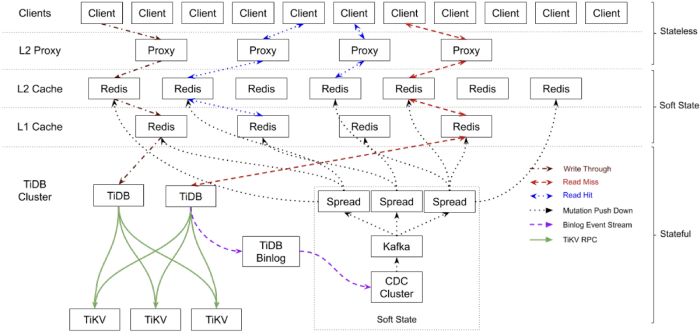
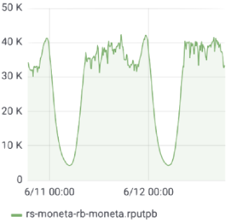
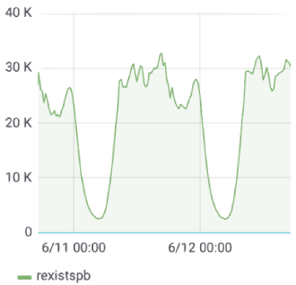
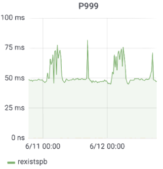
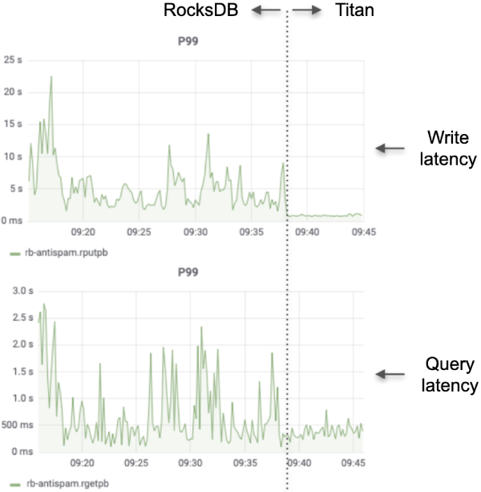

**Industry:** Knowledge Sharing

**Author:** Xiaoguang Sun (Backend Search Manager at Zhihu, TiKV Project Maintainer)

[Zhihu](https://en.wikipedia.org/wiki/Zhihu), which means "Do you know?" in classical Chinese, is the Quora of China: a question-and-answer website where all kinds of questions are created, answered, edited, and organized by the community of its users. As [China's biggest knowledge sharing platform](https://walkthechat.com/zhihu-chinas-largest-qa-platform-content-marketers-dream/), we currently have 220 million registered users, and 30 million questions with more than 130 million answers on the site. In August 2018, we announced that we had raised [$270 million in series E funding](https://technode.com/2018/08/08/zhihu-series-e-funding/).

As our business boomed, the data size of our applications grew out of hand. About 1.3 trillion rows of data were stored in our Moneta application (which stores posts users have already read). With approximately 100 billion rows of data accruing each month and growing, this number will reach 3 trillion in two years. We faced severe challenges in scaling our backend system while maintaining good user experience.

In this post, I'll dive deep into how we managed to keep milliseconds of query response time over such a large amount of data and how TiDB, an open source MySQL-compatible NewSQL Hybrid Transactional/Analytical Processing ([HTAP](https://en.wikipedia.org/wiki/Hybrid_transactional/analytical_processing_(HTAP))) database, empowered us to get real-time insights into our data. I'll introduce why we chose TiDB, how we are using it, what we learned and best practice and some thoughts about the future.

## Our pain points

This section covers the architecture for our Moneta application, and the solution we tried to build an ideal architecture, and reveals that **database scalability** is our major pain point.

### System architecture requirements

Zhihu's Post Feed service is a crucial system through which users are exposed to content posted on the site. **The Moneta application** in the backend stores the posts users have read, and filters out these posts in the post stream of Zhihu's Recommendations page.

The Moneta application has the following characteristics:

* **Requires high availability for data**. Post Feed is the first screen to appear, and it plays an important role in driving user traffic to Zhihu.
* **Handles immense write data**. For example, more than 40 thousand records are written per second at peak time, and the number of records grows by nearly 3 billion records every day.
* **Stores historical data for a long time**. Currently, about 1.3 trillion records are stored in the system. With approximately 100 billion records accruing each month and growing, historical data will reach 3 trillion records in about two years.
* **Tackles high-throughput queries**. At peak time, the system processes queries that are performed on 12 million posts on average per second.
* **Limits the response time for queries to 90 ms or less**. This occurs even for a long-tail query which takes the longest time to execute.
* **Tolerates false positives**. This means that the system can recall many interesting posts for users, even when some posts have been filtered out by mistake.

Considering the facts above, we need an application architecture with the following features:

* **High availability**. It's a bad user experience to find lots of already-read posts when a user opens Zhihu's Recommendations page.
* **Excellent system performance**. Our application has high throughput and strict requirements for response time.
* **Easy to scale out**. As our business develops and our application evolves, we hope our system can easily scale out.

### Exploration

To build an ideal architecture with the features above, we incorporated three key components in our previous architecture:

* Proxy. This forwards users' requests to available nodes, and ensures the high availability of the system.
* Cache. This temporarily deals with requests in memory, so we don't always need to process requests in the database. This improves system performance.
* Storage. Before using TiDB, we managed our business data on standalone MySQL. As data volume surged, the standalone MySQL system wasn't enough. Then we adopted the solution of MySQL sharding and Master High Availability Manager ([MHA](https://github.com/yoshinorim/mha4mysql-manager)), but this solution was undesirable when 100 billion new records flooded into our database each month.

### Shortcomings of MySQL sharding and MHA

MySQL sharding and MHA is not a good solution, because both MySQL sharding and MHA have their shortcomings.

#### Shortcomings of MySQL sharding

* The application code becomes complicated and difficult to maintain.
* It is troublesome to change the existing sharding key.
* Upgrading the application logic affects application usability.

#### Shortcomings of MHA

* We need to implement the virtual IP (VIP) configuration by writing a script or utilizing a third-party tool.
* MHA only monitors the primary database.
* To configure MHA, we need to configure passwordless Secure Shell ([SSH](https://en.wikipedia.org/wiki/Secure_Shell)). This may lead to potential security risks.
* MHA doesn't provide the read load balancing feature for the secondary server.
* MHA can only monitor whether the primary server (instead of the secondary primary) is available.

Database scalability was still the weak point of the overall system until we found TiDB and migrated data from MySQL to TiDB.

## What is TiDB?

The TiDB platform is a collection of components that when used together become a NewSQL database with HTAP capabilities.

 TiDB platform architecture 

Inside the TiDB platform, the main components are as follows:

* **[TiDB server](https://github.com/pingcap/tidb)** is a stateless SQL layer that processes users' SQL queries, accesses data in the storage layer, and returns the corresponding results to the application. It is MySQL-compatible and sits on top of TiKV.
* **[TiKV server](https://github.com/pingcap/tikv)** is the distributed transactional key-value storage layer where the data persists. It uses the [Raft](https://raft.github.io/) consensus protocol for replication to ensure strong data consistency and high availability.
* **[TiSpark](https://github.com/pingcap/tispark)** cluster also sits on top of TiKV. It is an Apache Spark plugin that works with the TiDB platform to support complex Online Analytical Processing (OLAP) queries for business intelligence (BI) analysts and data scientists.
* **[Placement Driver (PD) server](https://github.com/pingcap/pd)** is a metadata cluster powered by [etcd](https://github.com/etcd-io/etcd) that manages and schedules TiKV.

Beyond these main components, TiDB also has an ecosystem of tools, such as [Ansible scripts](https://github.com/pingcap/tidb-ansible) for quick deployment, [Syncer](https://pingcap.com/docs/tools/syncer/) and [TiDB Data Migration](https://github.com/pingcap/dm) for seamless migration from MySQL, and [TiDB Binlog](https://github.com/pingcap/tidb-binlog), for collecting the logical changes made to a TiDB cluster and providing incremental backup and replication to the downstream (TiDB, Kafka, or MySQL).

### TiDB's key features

[TiDB's key features](https://pingcap.com/docs/v3.0/key-features/) include the following:

* Horizontal scalability
* MySQL-compatible syntax
* Distributed transactions with strong consistency
* Cloud-native architecture
* Minimal extract, transform, load ([ETL](https://en.wikipedia.org/wiki/Extract,_transform,_load)) with HTAP
* Fault tolerance and recovery with Raft
* Online schema changes

    <a href="/download" onclick="trackViews('Lesson Learned from Queries over 1.3 Trillion Rows of Data Within Milliseconds of Response Time at Zhihu.com', 'download-tidb-btn-middle')"><button>Download TiDB</button></a>
    <a href="https://share.hsforms.com/1e2W03wLJQQKPd1d9rCbj_Q2npzm" onclick="trackViews('Lesson Learned from Queries over 1.3 Trillion Rows of Data Within Milliseconds of Response Time at Zhihu.com', 'subscribe-blog-btn-middle')"><button>Subscribe to Blog</button></a>

## How we use TiDB

In this section, I'll show you how TiDB functions in Moneta's architecture and its performance metrics for the Moneta application.

### TiDB in our architecture

We deployed TiDB in our system, and the overall architecture of the Moneta application became:

* The top layer: stateless and scalable client APIs and proxies. These components are easy to scale out.
* The middle layer: soft-state components, and layered Redis caches as the main part. When services break down, these components can self-recover services via restoring data saved in the TiDB cluster.
* The bottom layer: the TiDB cluster stores all the stateful data. Its components are highly available, and if a node crashes, it can self-recover its service.

 TiDB architecture in Zhihu's Moneta application 

In this system, all the components are self-recoverable, and the entire system has a global failure monitoring mechanism. We then use [Kubernetes](https://en.wikipedia.org/wiki/Kubernetes) to orchestrate the entire system to guarantee high availability of the service as a whole.

### TiDB's performance metrics

Since we've applied TiDB in the production environment, our system is highly-available and easy to scale, and system performance has remarkably improved.

As an example, take a set of performance metrics for the Moneta application in June, 2019:

* **40,000 rows of data were written per second at peak time**.

 Data written per second at peak time 

* **30,000 queries and 12 million posts were examined per second at peak time**.

 Queries examined per second at peak time 

* **The 99th percentile response time was about 25 ms, and the 999th percentile response time was about 50 ms**. In fact, the average response time is far less than these figures, even for long-tail queries that demand a stable response time.

 The 99th percentile response time 

 The 999th percentile response time 

## What we learned

Our migration to TiDB wasn't without a hitch. Here we'd like to share some lessons learned.

### Importing data faster

We used [TiDB Data Migration](https://github.com/pingcap/dm) (DM) to collect MySQL incremental binlog files and then used [TiDB Lightning](https://github.com/pingcap/tidb-lightning) to fast import the data to the TiDB cluster.

To our surprise, it only took four days to import these 1.1 trillion records to TiDB. If we logically wrote the data into the system, it might have taken a month or more. We could have imported the data even faster if we had more hardware resources.

### Reducing query latency

After we finished the migration, we tested a small amount of read traffic. When the Moneta application first went online, we found that the query latency didn't meet our requirement. To solve the latency issue, we worked with the PingCAP engineers to tune system performance.

During this process, we accumulated precious experience:

* Some queries are sensitive to query latency and some are not. We deployed a separate TiDB database to process latency-sensitive queries. (Other queries that are not latency-sensitive are processed in a different TiDB database.) This way, large queries and latency-sensitive queries are processed in different databases, and the execution of the former won't affect the latter.

* For queries that didn't have an ideal execution plan, we wrote SQL hints to help the execution engine select an optimal execution plan.

* We used low-precision timestamp Oracle ([TSO](https://github.com/pingcap/tso)) and prepared statements to reduce network round-trips.

### Evaluating resources

Before we tried TiDB, we didn't analyze how many hardware resources we would need to support the same amount of data we had on the MySQL side. To reduce maintenance costs, we deployed MySQL in the single primary — single secondary topology. In contrast, the [Raft](https://raft.github.io/) protocol implemented in TiDB requires at least three replicas. Therefore, we needed more hardware resources to support our business data in TiDB, and we needed to prepare machine resources in advance.

Once our data center was set up properly, we could quickly complete our evaluation of TiDB.

## Expectations for TiDB 3.0

At Zhihu, the anti-spam and Moneta applications are architected the same way. We tried [Titan](https://github.com/pingcap/titan) and [Table Partition](https://github.com/pingcap/tidb/pull/9936) in the release candidate versions of TiDB 3.0 ([TiDB 3.0.0-rc.1](https://pingcap.com/docs/v3.0/releases/3.0.0-rc.1/) and [TiDB 3.0.0-rc.2](https://pingcap.com/docs/v3.0/releases/3.0.0-rc.2/)) in our anti-spam application for in-production data. As a result, we found that these two features were _incredibly awesome_.

**Titan reduced latency**

The anti-spam application has always been tormented with high latency of both queries and writes.

We heard that TiDB 3.0 would introduce Titan, a key-value storage engine, to reduce write amplification in [RocksDB](https://en.wikipedia.org/wiki/RocksDB) (the underlying storage engine in TiKV) when using large values.

To give this feature a try, we enabled Titan after TiDB 3.0.0-rc.2 was released. The following figure shows the latency for writes and queries respectively, compared to that of RocksDB and Titan:

 Latency for writes and queries 

The statistics show that after we enabled Titan, both write and query latencies dropped sharply. It was really astonishing! When we saw the statistics, we couldn't believe our eyes.

**Table Partition improved query performance**

We have also used TiDB 3.0's Table Partition feature in the anti-spam application. Using this feature, we can divide a table into multiple partitions by time. When a query comes, it is performed on a partition that covers the target time range. This has drastically improved our query performance.

Let's consider what may happen if we implement [TiDB 3.0](https://pingcap.com/docs/v3.0/releases/3.0-ga/) in both Moneta and anti-spam applications in the future.

### TiDB 3.0 in the Moneta application

TiDB 3.0 has outstanding features, such as Batch Message in gRPC, multi-thread Raftstore, SQL plan management, and TiFlash. We believe these will add lustre to the Moneta application.

#### Batch Message in gRPC and multi-thread Raftstore

Moneta's write throughput is more than 40 thousand transactions per second (TPS). This number isn't small. It's stirring news that TiDB 3.0 can send and receive Raft messages in batch, and it can process Region Raft logic in multiple threads. We believe these features will noticeably improve our system's concurrency capacity.

#### SQL plan management

As mentioned above, we had written quite a few SQL hints to make the query optimizer select an optimal execution plan. TiDB 3.0 adds an SQL plan management feature that binds queries to specific execution plans directly within the TiDB server. With this feature, we don't need to modify query text to inject a hint.

#### TiFlash

At [TiDB DevCon 2019](https://pingcap.com/blog/tidb-3.0-beta-stability-at-scale/), I first heard about TiFlash, an extended analytical engine for TiDB. It uses the column-oriented storage technique to achieve a high data compression rate, and it applies the extended Raft consensus algorithm in data replication to ensure data security.

Because we have massive data with high write throughput, we can't afford to use ETL every day to replicate data to [Hadoop](https://en.wikipedia.org/wiki/Apache_Hadoop) for analysis. But with TiFlash, we're optimistic that we can easily analyze our tremendous data volume.

### TiDB 3.0 in the anti-spam application

In contrast to the Moneta application's enormous historical data size, the anti-spam application has much higher write throughput. However, it only queries the data stored in the last 48 hours. In this application, data increases by 8 billion records and 1.5 TB every day.

Because TiDB 3.0 can send and receive Raft messages in batch, and it can process Region Raft logic in multiple threads, we can manage the application with fewer nodes. Previously, we used seven physical nodes, but now we only need five. These features boost performance even when we use commodity hardware.

## What's next

TiDB is a **MySQL-compatible** database, so we can use it just as we used MySQL. Owing to TiDB's **horizontal scalability**, now we can freely scale our database even when we have more than one trillion records to cope with. Besides, TiDB's **high availability** and **excellent performance** have also strengthened our system.

Up to now, we've used quite a few open-source software in our applications. We also learned a lot about handling our system problems with TiDB. We decided to participate in developing open source tools, and participate in the long term growth of the community. Based on our joint efforts with PingCAP, TiDB will become more powerful and robust.
