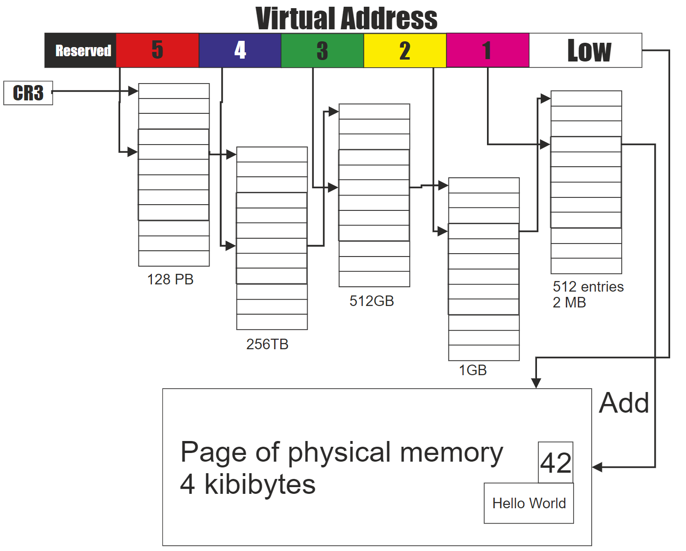
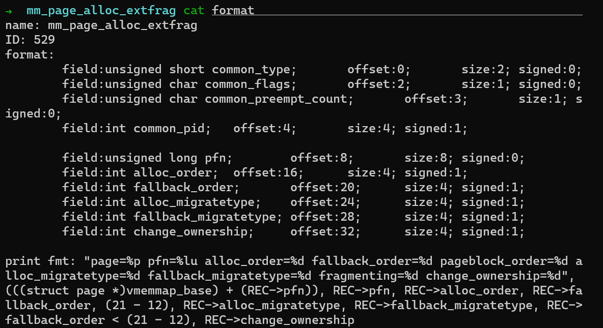

**Author:** Wenbo Zhang (Linux Kernel Engineer of the EE team at PingCAP)

**Transcreator:** [Coco Yi](https://github.com/yikeke); **Editor:** Tom Dewan


(External) memory fragmentation is a long-standing Linux kernel programming issue. As the system runs, it assigns various tasks to memory pages. Over time, memory gets fragmented, and eventually, a busy system that is up for a long time may have only a few contiguous physical pages.

Because the Linux kernel supports virtual memory management, physical memory fragmentation is often not an issue. With page tables, unless large pages are used, physically scattered memory is still contiguous in the virtual address space.

However, it becomes very difficult to allocate contiguous physical memory from the kernel linear mapping area. For example, it is challenging to allocate structure objects through the block allocator—a common and frequent operation in the kernel mode—or operate on a Direct Memory Access (DMA) buffer that does not support the scatter and gather modes. Such operations might cause frequent direct memory reclamation or compaction, resulting in large fluctuations in system performance, or allocation failure. In slow memory allocation paths, different operations are performed according to the page allocation flag.

If the kernel programming no longer relies on the high-order physical memory allocation in the linear address space, the memory fragmentation issue will be solved. However, for a huge project like the Linux kernel, it isn't practical to make such changes.

Since Linux 2.x, the open source community has tried several methods to alleviate the memory fragmentation issue, including many effective, but unusual patches. Some merged patches have been controversial, such as the memory compaction mechanism. At the [LSFMM 2014](https://lwn.net/Articles/591998/) conference, many developers complained that memory compaction was not very efficient and that bugs were not easy to reproduce. But the community did not abandon the feature and continued to optimize it in subsequent versions.

Mel Gorman is the most persistent contributor in this field. He has submitted two sets of important patches. The first set was merged in Linux 2.6.24 and iterated over 28 versions before the community accepted it. The second set was merged in Linux 5.0 and successfully reduced memory fragmentation events by 94% on one- or two-socket machines.

In this post, I'll introduce some common extensions to the [buddy allocator](https://en.wikipedia.org/wiki/Buddy_memory_allocation) that helps prevent memory fragmentation in the Linux 3.10 kernel, the principle of memory compaction, how to view the fragmentation index, and how to quantify the latency overheads caused by memory compaction.

## A brief history of defragmentation

Before I start, I want to recommend some good reads. The following articles show you all the efforts of improving high-level memory allocation during Linux kernel development.

<table>
  <tr>
   <td>Publish date
   </td>
   <td>Articles on LWN.net
   </td>
  </tr>
  <tr>
   <td>2004-09-08
   </td>
   <td><a href="https://lwn.net/Articles/101230/">Kswapd and high-order allocations</a>
   </td>
  </tr>
  <tr>
   <td>2004-05-10
   </td>
   <td><a href="https://lwn.net/Articles/105021/">Active memory defragmentation</a>
   </td>
  </tr>
  <tr>
   <td>2005-02-01
   </td>
   <td><a href="https://lwn.net/Articles/121618/">Yet another approach to memory fragmentation</a>
   </td>
  </tr>
  <tr>
   <td>2005-11-02
   </td>
   <td><a href="https://lwn.net/Articles/158211/">Fragmentation avoidance</a>
   </td>
  </tr>
  <tr>
   <td>2005-11-08
   </td>
   <td><a href="https://lwn.net/Articles/159110/">More on fragmentation avoidance</a>
   </td>
  </tr>
  <tr>
   <td>2006-11-28
   </td>
   <td><a href="https://lwn.net/Articles/211505/">Avoiding - and fixing - memory fragmentation</a>
   </td>
  </tr>
  <tr>
   <td>2010-01-06
   </td>
   <td><a href="https://lwn.net/Articles/368869/">Memory compaction</a>
   </td>
  </tr>
  <tr>
   <td>2014-03-26
   </td>
   <td><a href="https://lwn.net/Articles/591998/">Memory compaction issues</a>
   </td>
  </tr>
  <tr>
   <td>2015-07-14
   </td>
   <td><a href="https://lwn.net/Articles/650917/">Making kernel pages movable</a>
   </td>
  </tr>
  <tr>
   <td>2016-04-23
   </td>
   <td><a href="https://lwn.net/Articles/684611/">CMA and compaction</a>
   </td>
  </tr>
  <tr>
   <td>2016-05-10
   </td>
   <td><a href="https://lwn.net/Articles/686801/">Make direct compaction more deterministic</a>
   </td>
  </tr>
  <tr>
   <td>2017-03-21
   </td>
   <td><a href="https://lwn.net/Articles/717656/">Proactive compaction</a>
   </td>
  </tr>
  <tr>
   <td>2018-10-31
   </td>
   <td><a href="https://lwn.net/Articles/770235/">Fragmentation avoidance improvements</a>
   </td>
  </tr>
  <tr>
   <td>2020-04-21
   </td>
   <td><a href="https://lwn.net/Articles/817905/">Proactive compaction for the kernel</a>
   </td>
  </tr>
</table>

<div class="trackable-btns">
  <a href="https://share.hsforms.com/1e2W03wLJQQKPd1d9rCbj_Q2npzm" onclick="trackViews('Linux Kernel vs. Memory Fragmentation (Part I)', 'subscribe-blog-btn-middle')"><button>Subscribe to Blog</button></a>
  </div>

Now, let's get started.

## Linux buddy memory allocator

Linux uses the [buddy algorithm](https://en.wikipedia.org/wiki/Buddy_memory_allocation) as a page allocator, which is simple and efficient. Linux has made some extensions to the classic algorithm:

* Partitions' buddy allocator
* Per-CPU pageset
* Group by migration types

The Linux kernel uses node, zone, and page to describe physical memory. The partitions' buddy allocator focuses on a certain zone on a certain node.

Before the 4.8 version, the Linux kernel implemented the page recycling strategy based on zone, because the early design was mainly for 32-bit processors, and there was a lot of high memory. However, the page aging speed of different zones on the same node was inconsistent, which caused many problems.

Over a long period, the community has added a lot of tricky patches, but the problem has remained. With more 64-bit processors and large memory models being used in recent years, Mel Groman migrated the page recycling strategy from zone to node and solved this problem. If you use Berkeley Packet Filter (BPF) authoring tools to observe recycling operations, you need to know this.

The per-CPU pageset optimizes single page allocation, which reduces lock contention between processors. It has nothing to do with defragmentation.

Grouping by migration types is the defragmentation method I'll introduce in detail.

## Group by migration types

First, you need to understand the memory address space layout. Each processor architecture has a definition. For example, the definition of x86_64 is in [mm.txt](https://www.kernel.org/doc/Documentation/x86/x86_64/mm.txt).

Because the virtual address and physical address are not linearly mapped, accessing the virtual address space through the page table (such as the heap memory requirement of the user space) does not require contiguous physical memory. Take the [Intel 5-level page table](https://en.wikipedia.org/wiki/Intel_5-level_paging) in the following figure as an example. The virtual address is divided from low to high:

* Low: Page offset
* Level 1: Direct page table index
* Level 2: Page middle directory index
* Level 3: Page upper directory index
* Level 4: Page 4-level directory index
* Level 5: Page global index


<div class="caption-center"> Intel 5-level paging - Wikipedia </div>

The page frame number of the physical memory is stored in the direct page table entry, and you can find it through the direct page table index. **The physical address is the combination of the found page frame number and the page offset.**

<div class="trackable-btns">
  <a href="https://share.hsforms.com/1e2W03wLJQQKPd1d9rCbj_Q2npzm" onclick="trackViews('Linux Kernel vs. Memory Fragmentation (Part I)', 'subscribe-blog-btn-middle')"><button>Subscribe to Blog</button></a>
  </div>

Suppose you want to change the corresponding physical page in a direct page table entry. You only need to:

1. Allocate a new page.
2. Copy the data of the old page to the new one.
3. Modify the value of the direct page table entry to the new page frame number.

These operations do not change the original virtual address, and you can migrate such pages at will.

**For the linear mapping area, the virtual address equals the physical address plus the constant.** Modifying the physical address changes the virtual address, and accessing the original virtual address causes a bug. Therefore, it is not recommended to migrate these pages.

When the physical pages accessed through the page table and the pages accessed through linear mapping are mixed and managed together, memory fragmentation is prone to occur. Therefore, **the kernel defines several migration types based on the mobility of the pages and groups the pages by the migration types for defragmentation.**

Among the defined migration types, the three most frequently used are: **MIGRATE_UNMOVABLE, MIGRATE_MOVABLE, and MIGRATE_RECLAIMABLE**. Other migration types have special purposes, which I won't describe here.

You can view the distribution of each migration type at each stage through `/proc/pagetypeinfo`:


**When applying for a page, the page allocation flag you use determines the specific migration type from which the page is allocated.** For example, you can use `__GFP_MOVABLE` for user space memory, and `__GFP_RECLAIMABLE` for file pages.

**When pages of a certain migration type are used up, the kernel steals physical pages from other migration types.** To avoid fragmentation, the page stealing starts from the largest page block. The page block size is determined by `pageblock_order`.

The standby priorities of the above three migration types from high to low are:

MIGRATE_UNMOVABLE:        MIGRATE_RECLAIMABLE, MIGRATE_MOVABLE MIGRATE_RECALIMABlE:      MIGRATE_UNMOVABLE, MIGRATE_MOVABLE MIGRATE_MOVABLE:             MIGRATE_RECLAIMABLE, MIGRATE_UNMOVABLE

The kernel introduces grouping by migration types for defragmentation. But frequent page stealing indicates that there are external memory fragmentation events, and they might cause trouble in the future.

## Analyze external memory fragmentation events

My previous article [Why We Disable Linux's THP Feature for Databases](https://en.pingcap.com/blog/why-we-disable-linux-thp-feature-for-databases) mentioned that you can use ftrace events provided by the kernel to analyze external memory fragmentation events. The procedure is as follows:

1. Enable the ftrace events:

    ```bash
    echo 1> /sys/kernel/debug/tracing/events/kmem/mm_page_alloc_extfrag/enable
    ```

2. Start collecting the ftrace events:

    ```bash
    cat /sys/kernel/debug/tracing/trace_pipe> ~/extfrag.log
    ```

3. Tap Ctrl-C to stop collecting. A event contains many fields:

    

    To analyze the number of external memory fragmentation events, focus on **the events with `fallback_order <; pageblock order`**. In the x86_64 environment, `pageblock order` is 9.

4. Clean up the events:

    ```bash
    echo 0> /sys/kernel/debug/tracing/events/kmem/mm_page_alloc_extfrag/enable
    ```

You can see that grouping by migration types only delays memory fragmentation, but does not fundamentally solve it.

As the memory fragmentation increases and it does not have enough contiguous physical memory, performance degrades. So, it's not enough to apply this feature alone.

In my next article, I'll introduce more methods that the kernel uses to regulate memory fragmentation.

To be continued...
