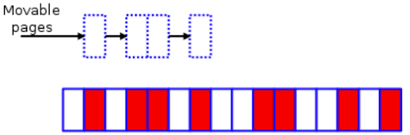
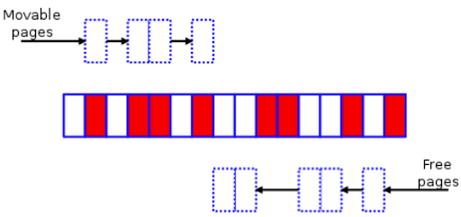
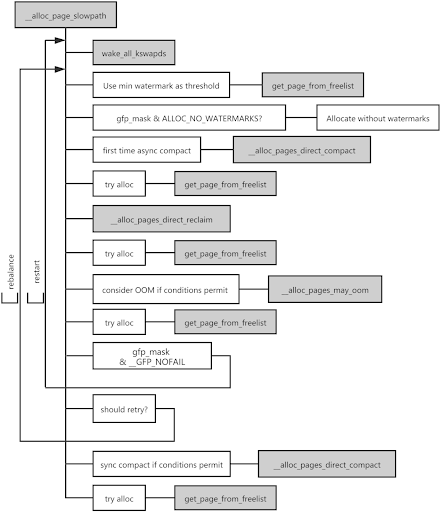

**Author:** [Wenbo Zhang](https://github.com/ethercflow) (Linux Kernel Engineer of the EE team at PingCAP)

**Transcreator:** [Charlotte Liu](https://github.com/CharLotteiu); **Editor:** Tom Dewan

In [Linux Kernel vs. Memory Fragmentation (Part I)](https://pingcap.com/blog/linux-kernel-vs-memory-fragmentation-1), I concluded that grouping by migration types only delays memory fragmentation, but does not fundamentally solve it. As the memory fragmentation increases and it does not have enough contiguous physical memory, performance degrades.

Therefore, to mitigate the performance degradation, the Linux kernel community introduced **memory compaction** to the kernel.

In this post, I'll explain the principle of memory compaction, how to view the fragmentation index, and how to quantify the latency overheads caused by memory compaction.

## Memory compaction

Before memory compaction, the kernel used lumpy reclaim for defragmentation. However, this feature was removed from v3.10 (currently the most widely used kernel version). If you'd like to learn more, you can read about lumpy reclaim in the articles I listed in [A brief history of defragmentation](https://pingcap.com/blog/linux-kernel-vs-memory-fragmentation-1#a-brief-history-of-defragmentation). For now, let me bring your mind to memory compaction.

### Algorithm introduction

The article [Memory compaction](https://lwn.net/Articles/368869/) on LWN.net explains the algorithmic idea of memory compaction in detail. You can take the following fragmented zone as a simple example:

 A small fragmented memory zone - LWN.net 

The white boxes are free pages, while those in red are allocated pages.

Memory compaction for this zone breaks down into three major steps:

1. Scan this zone from left to right for red pages of the MIGRATE_MOVABLE migration type.

    
    
 Search for movable pages 

2. At the same time, scan this zone from right to left for free pages.

    
    
 Search for free pages 

3. Shift movable pages at the bottom to free pages at the top, thus creating a contiguous chunk of free space.

    
    
 The memory zone after memory compaction 

This principle seems relatively simple, and the kernel also provides `/proc/sys/vm/compact_memory` as the interface for manually triggering memory compaction.

However, as mentioned in [Part I](https://pingcap.com/blog/linux-kernel-vs-memory-fragmentation-1) and [Memory compaction issues](https://lwn.net/Articles/591998/), memory compaction is not very efficient in practice—at least for the most commonly-used kernel, v3.10—no matter whether it is triggered automatically or manually. Due to the high overhead it causes, it becomes a performance bottleneck instead.

The open source community did not abandon this feature but continued to optimize it in subsequent versions. For example, the community [introduced kcompactd](https://github.com/torvalds/linux/commit/698b1b3064) to the kernel in v4.6 and [made direct compaction more deterministic](https://lwn.net/Articles/686801/) in v4.8.

### When memory compaction is performed

In kernel v3.10, memory compaction is performed under any of the following situations:

* The `kswapd` kernel thread is called to balance zones after a failed high-order allocation.
* The `khugepaged` kernel thread is called to collapse a huge page.
* Memory compaction is manually triggered via the `/proc` interface.
* The system performs direct reclaim to meet higher-order memory requirements, including handling Transparent Huge Page (THP) page fault exceptions.

In [Why We Disable Linux's THP Feature for Databases](https://pingcap.com/blog/why-we-disable-linux-thp-feature-for-databases), I described how THP slows down performance and recommended disabling this feature. I will put it aside in this article and mainly focus on the memory allocation path.

 Memory allocation in the slow path 

When the kernel allocates pages, if there are no available pages in the free lists of the buddy system, the following occurs:

1. The kernel processes this request in the slow path and tries to allocate pages using the low watermark as the threshold.
2. If the memory allocation fails, which indicates that the memory may be slightly insufficient, the page allocator wakes up the `kswapd` thread to asynchronously reclaim pages and attempts to allocate pages again, also using the low watermark as the threshold.
3. If the allocation fails again, it means that the memory shortage is severe. In this case, the kernel runs asynchronous memory compaction first.
4. If the allocation still does not succeed after the async memory compaction, the kernel directly reclaims memory.
5. After the direct memory reclaim, if the kernel doesn't reclaim enough pages to meet the demand, it performs direct memory compaction. If it doesn't reclaim a single page, the OOM Killer is called to deallocate memory.

The above steps are only a simplified description of the actual workflow. In real practice, it is more complicated and will be different depending on the requested memory order and allocation flags.

As for direct memory reclaim, it is not only performed by the kernel when the memory is severely insufficient, but also triggered due to memory fragmentation in practical scenarios. In a certain period, these two situations may occur simultaneously.

  <a href="https://share.hsforms.com/1e2W03wLJQQKPd1d9rCbj_Q2npzm" onclick="trackViews('Linux Kernel vs. Memory Fragmentation (Part II)', 'subscribe-blog-btn-middle')"><button>Subscribe to Blog</button></a>
  

### How to analyze memory compaction

#### Quantify the performance latency

As mentioned in the previous section, the kernel may perform memory reclaim or memory compaction when allocating memory. To make it easier to quantify the latency caused by direct memory reclaim and memory compaction for each participating thread, I committed two tools, [drsnoop](https://github.com/iovisor/bcc/blob/master/tools/drsnoop_example.txt) and [compactsnoop](https://github.com/iovisor/bcc/blob/master/tools/compactsnoop_example.txt), to the [BCC](https://github.com/iovisor/bcc) project.

Both tools are based on kernel events and come with detailed documentation, but there is one thing I want to note: to reduce the cost of introducing Berkeley Packet Filters (BPF), these two tools capture the latency of each corresponding event. Therefore, you may see from the output that each memory request corresponds to multiple latency results.

The reason for the many-to-one relationship is that, for older kernels like v3.10, it is uncertain how many times the kernel will try to allocate during a memory allocation process in the slow path. The uncertainty also makes OOM Killer start to work either too early or too late, resulting in most tasks on the server being hung up for a long time.

After the kernel merged the patch [mm: fixed 100% CPU kswapd busyloop on unreclaimable nodes](https://github.com/torvalds/linux/commit/c73322d0) in v4.12, the maximum number of direct memory reclaims is limited to 16. Let's assume that the average latency of a direct memory reclaim is 10 ms. (Shrinking active or inactive LRU chain tables is time consuming for today's servers with several hundred gigabytes of RAM. There is also an additional delay if the server needs to wait for a dirty page to be written back.)

If a thread asks the page allocator for pages and gets enough memory after only one direct memory reclaim, the latency of this allocation increases by 10 ms. If the kernel tries 16 times before reclaiming enough memory spaces, then the increased latency of this allocation is 160 ms instead of 10 ms, which may severely degrade performance.

#### View the fragmentation index

Let's come back to memory compaction. There are four main steps for the core logic of memory compaction:

1. Determine whether a memory zone is suitable for memory compaction.
2. Set the starting page frame number for scanning.
3. Isolate pages of the MIGRATE_MOVABLE type.
4. Migrate pages of the MIGRATE_MOVABLE type to the top of the zone.

If the zone still needs compaction after one migration, the kernel loops the above process for three to four times until the compaction is finished. This operation consumes a lot of CPU resources; therefore, you can often see from the monitoring that the system CPU usage is full.

Well then, how does the kernel determine whether a zone is suitable for memory compaction?

If you use the `/proc/sys/vm/compact_memory` interface to forcibly require memory compaction for a zone, there is no need for the kernel to determine it.

If memory compaction is automatically triggered, the kernel calculates the fragmentation index of the requested order to determine whether the zone has enough memory left for compaction. The closer the index is to 0, the more the memory allocation is likely to fail due to insufficient memory. This means memory reclaim is more suitable than memory compaction at this time. The closer the index is to 1,000, the more the allocation is likely to fail due to excessive external fragmentation. Therefore, in this situation, it is appropriate to do memory reclaim, not memory compaction.

Whether the kernel chooses to perform memory compaction or memory reclaim is determined by the external fragmentation threshold. You can view this threshold through the `/proc/sys/vm/extfrag_threshold` interface.

You can execute `cat /sys/kernel/debug/extfrag/extfrag_index` to directly view the fragmentation index through `/sys/kernel/debug/extfrag/extfrag_index`. Note that the following screen shot results are divided by 1,000:

#### Pros and cons

Both the monitoring interfaces based on the `/proc` file system and the tools based on kernel events ([drsnoop](https://github.com/iovisor/bcc/blob/master/tools/drsnoop_example.txt) and [compactsnoop](https://github.com/iovisor/bcc/blob/master/tools/compactsnoop_example.txt)) can be used to analyze memory compaction, but with different pros and cons.

The monitoring interfaces are simple to use, but they cannot perform quantitative analysis on the latency results, and the sampling period is too long. The tools based on kernel events can solve these problems, but you need a certain understanding of the working principle of the kernel-related subsystems to use these tools, and there are certain requirements for the client's kernel version.

Therefore, the monitoring interfaces and the kernel-events-based tools actually complement each other. Using them together can help you to analyze memory compaction thoroughly.

### How to mitigate memory fragmentation

The kernel is designed to take care of slow backend devices. For example, it implements the second chance method and the refault distance based on the LRU algorithm and does not support limiting the percentage of `page cache`. Some companies used to customize their own kernel to limit the `page cache` and tried to submit it to the upstream kernel community, but the community did not accept it. I think it may be because this feature causes problems such as working set refaults.

Therefore, to reduce the frequency of direct memory reclaim and mitigate fragmentation issues, it is a good choice to increase `vm.min_free_kbytes` (up to 5% of the total memory). This indirectly limits the percentage of `page cache` for scenarios with a lot of I/O operations, and the machine has more than 100 GB of memory.

Although setting `vm.min_free_kbytes` to a bigger value wastes some memory, it is negligible. For example, if a server has 256 GB memory and you set `vm.min_free_kbytes` to `"4G"`, it only takes 1.5% of the total memory space.

The community apparently noticed the waste of memory as well, so the kernel merged the patch [mm: scale kswapd watermarks in proportion to memory](http://lkml.iu.edu/hypermail/linux/kernel/1602.3/02009.html) in v4.6 to optimize it.

Another solution is to execute `drop cache` at the right time, but it may cause more jitter to the application performance.

## Conclusion

In [Part I](https://pingcap.com/blog/linux-kernel-vs-memory-fragmentation-1) of this post series, I briefly explained why the external fragmentation affects performance and introduced the efforts the community has made over the years in defragmentation. Here in Part II, I've focused on the defragmentation principles in the kernel v3.10 and how to observe memory fragmentation quantitatively and qualitatively.

I hope this post series will be helpful for you! If you have any other thoughts about Linux memory management, welcome to join the [TiDB Community Slack](https://slack.tidb.io/invite?team=tidb-community&channel=everyone&ref=pingcap-blog) workspace to share and discuss with us.
