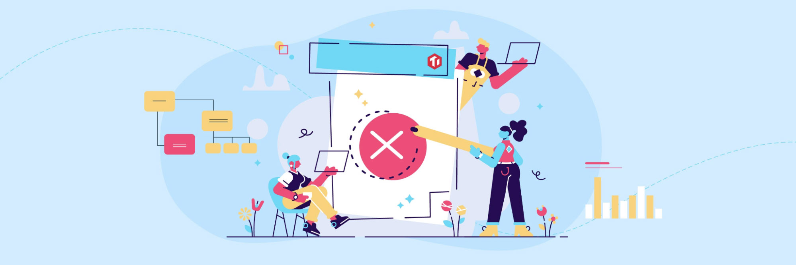
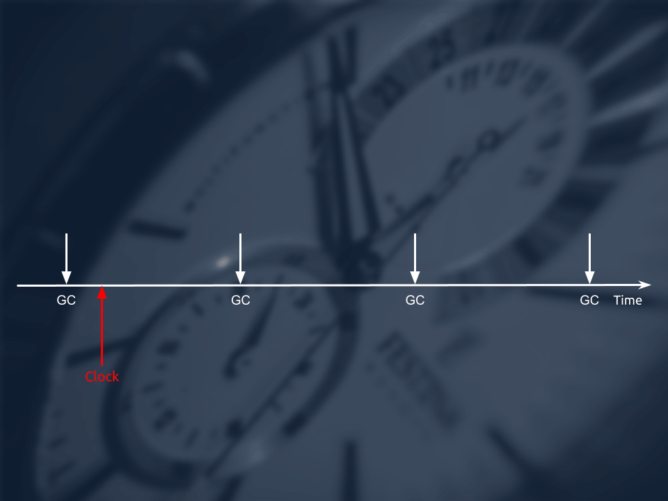
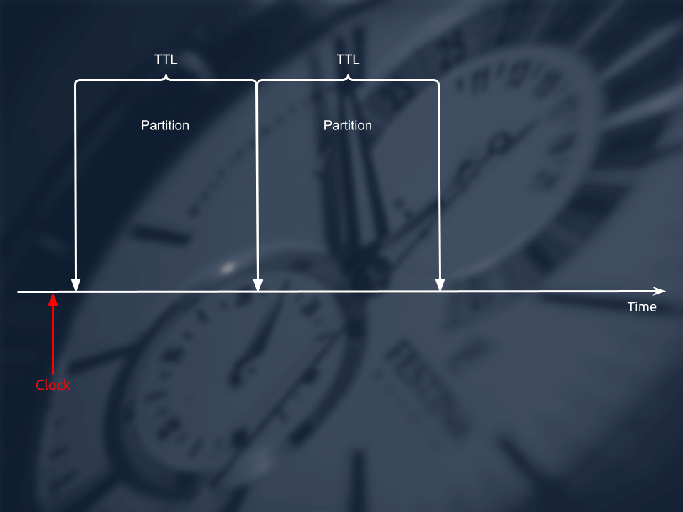

**Author:** [Xiaoguang Sun](https://github.com/sunxiaoguang) (Software Architect at Zhihu, TiKV Project Maintainer)

**Transcreator:** [Ran Huang](https://github.com/ran-huang); **Editor:** Tom Dewan



Your organization is growing with each passing day; so is your data. More data brings more business opportunities, but it also begets higher storage costs. You want a better way to manage the cost? We want the same thing for our open source database, TiDB.

[TiDB](https://docs.pingcap.com/tidb/stable) is a distributed SQL database designed for massive data. Our goal is to support large-scale datasets with a reasonable cost. In [TiDB Hackathon 2020](https://pingcap.com/community/events/hackathon2020/), we took a big step in that direction. **We introduced a feature, [the time to live (TTL) table](https://github.com/tidb-hackathon/t4), that enables TiDB to automatically manage the lifecycle of data according to its lifetime**. TiDB makes sure every portion of its resources is consumed by high-value, fresh data.

In this article, **I'll describe the TTL table in detail and how we implement it in TiDB**. What's more, **I'll share some examples of how the TTL table can be used in open source projects, including dimension reports, Kubernetes long term events storage, MQTT for IoT and others**. Time waits for no one, so let's get started.

## What is the TTL table?

The TiDB community has made many efforts to limit TiDB storage cost. For example, we explored ways to manage data storage hierarchically, which allows the database to store cold data on cheaper storage media. We also wanted to reduce cost by increasing the value of data TiDB stores. **In many cases, the value of a specific dataset is closely associated with its lifetime**. The older the data, the less valuable it becomes. To help TiDB store high-value data, we introduce TTL into TiDB.

**TTL, or time to live, is a mechanism to limit the lifetime of data in a system.** When the specified time elapses, that data is deleted. It is widely used in cache and storage systems, such as Redis, RocksDB, and MyRocks.

In TiDB, TTL is implemented as TTL tables. Similar to the systems above, **the TTL table in TiDB can automatically manage the lifecycle of data written into the table, without manual intervention**. After the data reaches the end of its lifetime, it automatically expires, and TiDB reclaims the occupied resources. This mechanism frees users from tedious lifecycle management and quickly deletes data using fewer resources.

## How we implement the TTL table in TiDB

Considering TiDB's internal mechanism and use complexity, we added two configuration items for data tables: time to live (`TTL`) and time to live granularity (`TTL_GRANULARITY`). With these two parameters, the TTL table can manage your data lifecycle. You can set two types of granularity for your TTL table: `row` and `partition`.

### Row-granularity TTL table

TiDB uses multiversion concurrency control (MVCC) to control transaction concurrency. When you update a range of data, the original data is not deleted immediately but is kept together with the new data, with a timestamp to distinguish the version. Then, a periodic [Garbage Collection](https://docs.pingcap.com/tidb/stable/garbage-collection-overview) (GC) process clears the obsolete data. Every time TiKV conducts GC for a row-granularity TTL table, it also reclaims the rows of data that are eligible for expiration.


<div class="caption-center">Row-granularity TTL table</div>

When TiDB dispatches GC tasks to TiKV, the tasks include the key ranges corresponding to the TTL tables and their TTL configuration. Based on the TTL configuration, TiKV calculates the lifetime of the data within the TTL key range. If TiKV finds data that is valid in MVCC but exceeds TTL, TiKV deletes the data during the GC process and releases the storage space.

Notably, **most TiDB tables currently use [non-clustered indexes](https://docs.pingcap.com/tidb/stable/clustered-indexes)**. If the primary key index or secondary index has inconsistent deletion progress with the record, a set of data that is already deleted from the table might still be visible in the index. This leads to query failure when any index is used. To solve this problem, we split the TTL table into two key ranges: data and index. `The TTL for data =  the TTL for index + the interval between the recent two rounds of GC`. In this way, all data lives longer than the index for at least one GC period.

In addition to deleting expired data during GC, the compaction process is also a good time to reclaim expired data. Because we had limited time at Hackathon, we only implemented TTL for GC, but we plan to optimize TTL's implementation further.

To create a TTL table in row granularity, use the following statement:

```sql
CREATE TABLE ttl_table {
    id BIGINT PRIMARY KEY AUTO_RANDOM,
    author VARCHAR(255),
    post VARCHAR(255)
} TTL='1h', TTL_GRANULARITY='ROW';
```

You can also use `ALTER TABLE` to switch an existing table to a row-granularity TTL table.

### Partition-granularity TTL table

Deleting a large amount of data consumes many resources, so databases usually adopt periodic GC or compaction to conserve resources. You may wonder why not use `TRUNCATE` to remove expired data more efficiently? To address this, we implement the TTL table as a special partitioned table that is invisible to the user.

To create a partition-granularity TTL table, run the following statement:

```sql
CREATE TABLE ttl_table {
    id BIGINT PRIMARY KEY AUTO_RANDOM,
    author VARCHAR(255),
    post VARCHAR(255)
} TTL='1d', TTL_GRANULARITY='PARTITION';
```

By using a sliding window to switch between partitions, we can allocate coarse-grained data to multiple physical partitions in chronological order. A new partition is created in rotation, while the oldest partition is truncated and deleted. All expired data in the oldest partition is quickly deleted at a low cost. In this special delete operation, RocksDB directly deletes the physical files of the deleted logic data. The storage space is then released with almost zero cost.


<div class="caption-center">Partition-granularity TTL table</div>

Currently, TiDB doesn't support switching an ordinary table to a partitioned table, nor does it support switching a partitioned table to another partitioned table. Therefore, you can't change an existing table to the partition-granularity TTL table.

## Where to use TiDB's TTL table

Now that you know how the TTL table works, where can you apply it? We adapted some open source projects so that they could use TiDB as a storage medium and store their data in TTL tables. In these systems, TiDB can automatically maintain the data lifecycle without system awareness.

### Apache Kylin

Dimension reports are widely used in big data scenarios to provide high-value, timely data for decision making. Apache Kylin processes raw data in the multidimensional online analytical processing (MOLAP) way to provide data analytics such as slice, dice, rollup, and drilldown.

In Apache Kylin, the more dimensions and bases that are used in the reporting, the larger the data volume. In many cases, the data volume far exceeds what a standalone database can hold. As time passes, users are less likely to perform real-time analytics on outdated data. The old data loses its relevance to the business. By efficiently cleaning historical data, you can reduce unnecessary resource consumption.

This is where the TTL table comes to your rescue. **The TTL table manages the lifecycle of dimension report data, and, with TiDB's index query capabilities, simplifies the implementation of Apache Kylin. By unifying the management of report data and metadata, TiDB further reduces the cost of managing Apache Kylin.**

### Jaeger Tracing

[Jaeger Tracing](https://github.com/jaegertracing/jaeger) is a distributed tracing platform that supports the OpenTracing standard and provides experimental support for OpenTelemetry. Jaeger can use Cassandra and Elasticsearch as the storage backends, and also provides a gRPC plugin for integration with other storage systems.

We use the plugin to run Jaeger on TiDB. **TiDB brings Jaeger the benefit of TiKV's high throughput and scalability. It automatically manages the lifecycle of historical tracing data, lowering system operations cost.**

### Kubernetes events

The Kubernetes `event` object records all events happening in the cluster. These events help you troubleshoot exceptional behaviors and audit cluster operations. When the Kubernetes cluster is large and sees frequent changes, you might choose to store the cluster events in a separate etcd cluster. However, when Kubernetes is frequently updated, the cluster generates a large amount of events. Because of limited storage space, the etcd cluster can't record all Kubernetes events, but only the recent ones.

To address this issue, **you can store Kubernetes events in TiDB, which stores more data in a longer period of time**. In addition, **TiDB's secondary index enables you to quickly and flexibly query the stored events**. With the help of the TTL table, the historical events stored in TiDB automatically expire, and your storage space is saved.

### MQTT QoS

Message Queuing Telemetry Transport (MQTT) is a lightweight publish/subscribe protocol for Internet of Things (IoT) messaging. Because mobile and IoT devices may have unstable network connections, the system needs to persist messages so that even when the client goes offline for a long time, the message delivery still reaches quality of service (QoS) Level 1 or 2.

**A storage backend with a built-in data expiration mechanism is well suited for applications that require reliable and timely delivery**, such as breaking news, AMBER Alerts, and weather forecasts.

During the Hackathon, we adapted a popular MQTT broker to make it support MySQL as backend storage. Because TiDB is MySQL compatible, **TiDB's TTL table can automatically delete the expired data according to the retention cycle set by the user**.

## Summary

In an era of everything connected with everything, the volume of data is rapidly growing. How to support more data with fewer costs is a question that all DBMSs try to answer. Our answer to this question is the TTL table.

For TiDB, the heart of this question is how to balance the cost of TiDB and the value of data it carries. The more relevant and fresher data is, the more value TiDB creates for your business. After all, time waits for no one, and it's better to make room for more valuable data.

_At TiDB Hackathon 2020, many excellent, interesting projects were born. We'll be telling you about them in future [blog posts](https://pingcap.com/blog/tag/Hackathon). Stay tuned._
