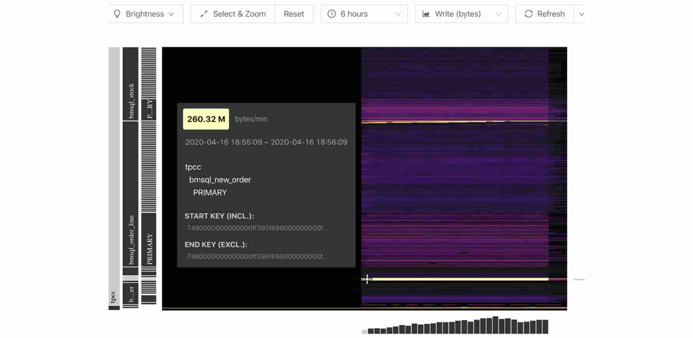
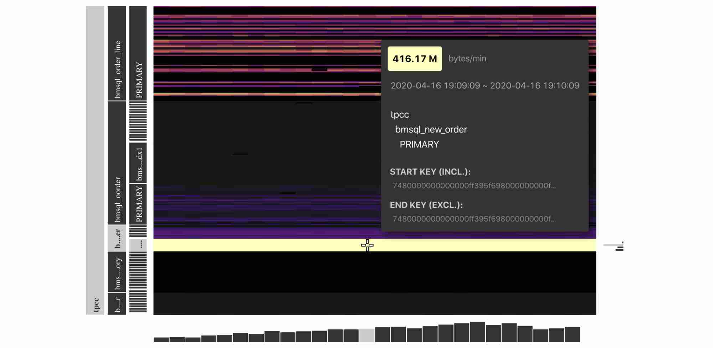

Have you seen what a database workload "looks" like?

A distributed database is a collection of multiple machines that are logically interconnected while physically spread over different sites in a computer network. **It's challenging to troubleshoot issues in a distributed database because the information about the system is scattered in different machines.** For this kind of system, we need a global view of the system and being able to observe the system to discover the unknown to answer the following questions. Can we quickly detect hotspots and potential risks? Can we visually monitor its runtime status? Can we find a way to predict whether a distributed database can run stably for a long time? 

Google's Cloud Bigtable, a non-relational, NoSQL data storage system, has a diagnostic tool called [Key Visualizer](https://cloud.google.com/bigtable/docs/keyvis-overview), that generates visual reports to help users quickly identify hotspots. Could we develop a similar tool in open-source [NewSQL](https://en.wikipedia.org/wiki/NewSQL) distributed databases?

Inspired by Google's Key Visualizer, we have implemented Key Visualizer (KeyViz) in [TiDB](https://en.wikipedia.org/wiki/TiDB), a distributed, relational, NewSQL database. Key Visualizer will be available in TiDB 4.0, which will be generally available later this year. This tool uses different colors to show access frequency and traffic for different areas in a cluster. **Key Visualizer displays system status graphically, which helps database administrators (DBAs) quickly troubleshoot database performance issues and enables users to gain deep insights into their applications**.

<iframe src="https://download.pingcap.com/images/blog/key-visualizer.mp4" width="100%" height="auto" frameborder="0" webkitallowfullscreen mozallowfullscreen allowfullscreen></iframe>

 Key Visualizer 

In this post, we'll do a deep dive on what Key Visualizer is, how it works, how it can help you, and which scenarios it applies to. If you're a DBA or database developer, we hope you can take this knowledge and apply it to your own work. For example, if you're a developer, you could adopt TiDB and Key Visualizer for your own applications, or even design a similar tool to troubleshoot your system.

## Why Key Visualizer?

Since April 2015, we at [PingCAP](https://pingcap.com/en/) have been building [TiDB](https://github.com/pingcap/tidb), an open-source distributed SQL database that supports [hybrid transactional and analytical processing](https://en.wikipedia.org/wiki/Hybrid_transactional/analytical_processing) (HTAP) workloads.

In a TiDB cluster, if only a few nodes are busy while other nodes are not, this means hotspots exist in the cluster. As a distributed database, TiDB automatically moves data among nodes to balance the load within a cluster. But sometimes, when an application's workload suddenly increases, hotspots might occur and trigger a bottleneck in a node. In a distributed architecture, a single node's bottleneck could affect the performance of the whole cluster. Therefore, being able to quickly find the root cause of hotspots is a critical task for database operations. In subsequent blog posts, we will introduce features in TiDB to mitigate hotspots such as auto scaling and load-based splitting.

For TiDB versions earlier than 4.0, diagnosing hotspot issues is tedious and time-consuming. The diagnostic process typically involves using various tools to examine different components and performing in-depth analysis of the application logic. Specifically, a DBA might: 

1. Check whether each node's CPU and I/O usage are balanced.

2. Check hot tables one-by-one based on a cluster's hot areas listings.

3. Analyze the application logic for each hot table to look for hotspot causes.

And this is only the beginning. Troubleshooting can be a lengthy process. Therefore, we need a tool to facilitate troubleshooting.

## What is Key Visualizer?

Key Visualizer is a visual diagnostic tool that lets users observe their TiDB cluster's read and write volume over time. Key Visualizer provides a graphical representation of application status. If you are concerned about data privacy, note that the data powering the Key Visualizer doesn't contain confidential information about the application.

Key Visualiser uses heatmaps to display read and write traffic volume. Here is an example: 

 Key Visualizer's heatmap 

In the heatmap:

* The x-axis represents time.
* The y-axis represents the key ranges, with mappings between key ranges to tables and indices.
* The colors represent the read or write volume of key ranges. The brighter the color, the higher the read or write volume.

The following examples demonstrate how to infer the heatmap's underlying workload.

Example #1: Evenly distributed workload

 Evenly distributed reads or writes 

In this heatmap, bright and dark colors are a fine-grained mix. This indicates that reads or writes are evenly distributed over time and among key ranges. This indicates that the workload is evenly distributed to all nodes.

Example #2: Sequential reads or writes

 Sequential reads or writes 

In this heatmap, we can see a bright line. This means that the data reads or writes are sequential. Typical scenarios of sequential data reads or writes are importing data or scanning tables and indexes. For example, we continuously write data to tables with auto-increment IDs.

Note that the key ranges that correspond to the bright line are hotspots, which are usually the performance bottlenecks.

    <a href="/download" onclick="trackViews('Key Visualizer: Observe Distributed Databases to Discover the Unknowns', 'download-tidb-btn-middle')"><button>Download TiDB</button></a>
    <a href="https://share.hsforms.com/1e2W03wLJQQKPd1d9rCbj_Q2npzm" onclick="trackViews('Key Visualizer: Observe Distributed Databases to Discover the Unknowns', 'subscribe-blog-btn-middle')"><button>Subscribe to Blog</button></a>

## How can Key Visualizer help you?

We can use Key Visualizer to monitor the health of the cluster; however, it is way more powerful than a monitoring tool. With a visual and easy-to-understand report, Key Visualizer enables users to easily diagnose cluster issues and attain deeper knowledge about their applications. We can also take the data powering Key Visualizer and combine it with machine learning to extract more insights for applications.

### Allow users to observe the system and diagnose cluster issues

**Key Visualizer lets users clearly observe the system's running status so that users, even not-so-experienced ones, can correctly diagnose system issues.** 

Traditionally, application developers and DBAs don't have a clear global view of the database workload. They use metrics like queries per second (QPS), transactions per second (TPS), query execution time, and machine loads (CPU, network, disk, etc.) to infer the running status of a database. What's more, in a distributed architecture, they have to dig through a massive number of metrics for useful information.

Similar to the way doctors use computed tomography (CT) to find the root causes of symptoms, TiDB users can use Key Visualizer to directly observe the workload at the key-range level and have a clear view of it.

### Offer deeper insights into applications 

Many database companies face the problem of evaluating the database with a specific application. Traditionally, the information available to them is very limited and is usually obtained by asking questions such as the application's QPS, TPS, read/write ratio, data size, data distribution, table schema, and typical queries to application developers. In many cases, these metrics aren't known by the application developers or are too sensitive to share. As a result, **judging whether a database fits with an application is difficult**.

With Key Visualizer, to evaluate whether TiDB matches an application, we only need to record production traffic and use Key Visualizer to observe the cluster status. In addition, Key Visualizer's visual report can **offer insights into applications and recommend improvements to the application**.

Here we would like to dive a bit deeper into the difference between monitoring and observing a system. Monitoring focuses on **known** metrics, such as CPU load, memory, TPS, and QPS. However, monitoring has limited value because it only reflects the system for specific scenarios, such as whether the system reaches its capacity. But as our systems become more and more complex, we need to **observe** a system that can discover the **unknowns**.

### Bring more possibilities with machine learning

By applying machine learning models to the data powering the Key Visualizer, we could tap more insights for applications. For example, we may be able to predict future application workloads and prepare for them with capacity planning. There are many more possibilities that we could have imagined, and that is the power of observing a system.

## Typical scenarios

In this section, we'll talk about some typical scenarios for Key Visualizer.

### Identify bugs

We want to share with you a real world story of using Key Visualizer to identify bugs. With Key Visualizer, we were able to discover TiDB's bugs in our TPC-C benchmark test program. Here is one heatmap during the TPC-C benchmarking:

 Read traffic for TiDB in a TPC-C test 

From the heatmap, we can see that during the performance testing phase, the Key Visualizer demonstrated that the `bmsql_new_order` table had hotspots in the read traffic.

According to the TPC-C test model, during the performance testing phase, a large amount of SQL statements were reading indexes from this table. However, the read traffic displayed in the heatmap was much higher than expected.

These abnormal behaviors made us think that there might be bugs in TiDB's code. We found an optimizer implementation missing. After we fixed the bug, the average traffic for the index decreased by 75%, and the TPC-C performance was improved.

### Discover application load changes

The load on a database could change slowly over time. For example, customers' demands or attention gradually shifted. With Key Visualizer, we observe application loads at a granular level. By analyzing the application load's historical data, we can quickly discover changing trends and seize marketing and business opportunities.

### Observe applications' health

With the trend shifting to microservice architecture, system monitoring becomes increasingly challenging. With Key Visualizer, we can observe the changes in the database load, usually the most important component, and thus can identify application anomalies in time.

### Simulate scenarios with a high traffic volume

With Key Visualizer, we can simulate scenarios such as promoted sales, anticipate the future traffic pattern, and develop action plans to handle the situation. When similar traffic patterns appear in the production environment, we can cope with them easily with the action plan.

## Try it out

If you're interested in Key Visualizer, you can follow these steps to try it out:

1. Do one of the following:

    * If you've already deployed a TiDB cluster, launch [the master version](https://github.com/pingcap/pd) of Placement Driver (PD), the managing component of the entire cluster.
    * If you haven't deployed TiDB, [deploy TiDB with TiUP](https://tiup.io/) and run `tiup playground nightly` to start up a TiDB cluster.

2. Go to `http://PD_ADDRESS:2379/dashboard` to get started with Key Visualizer.

> **Note:**
>
> If you've modified PD's default port, you need to update the port for `http://PD_ADDRESS:2379/dashboard` to the actual PD port.

## Roadmap

The Key Visualizer is an open-source project located in the [TiDB Dashboard](https://github.com/pingcap-incubator/tidb-dashboard). The Key Visualizer is under active development. In the future, we plan to:

* Preserve statistics when Key Visualizer restarts.
* Support TiKV-only scenarios.
* Differentiate read and write traffic in a heatmap.
* Optimize the calculation of heatmap brightness to make hotspots easier to find.

You're welcome to join us by participating in [TiDB Usability Challenge](https://pingcap.com/blog/tidb-usability-challenge-dare-to-dream-bigger/). We look forward to your contributions.

## Conclusion

It's always a challenge to troubleshoot distributed SQL databases. With Key Visualizer, TiDB users can observe system status, quickly find performance issues in the cluster, and capture deep insights into applications. This also helps TiDB users identify changes in their applications and thus discover new business opportunities.

Key Visualizer will be available in TiDB 4.0. In addition, TiDB 4.0 will provide a dashboard that lets users check the cluster topology and runtime status, operational parameters, system logs, abnormal metrics, and basic performance metrics in one place. The TiDB dashboard will help DBAs better understand the system status and significantly improve their troubleshooting efficiency.
