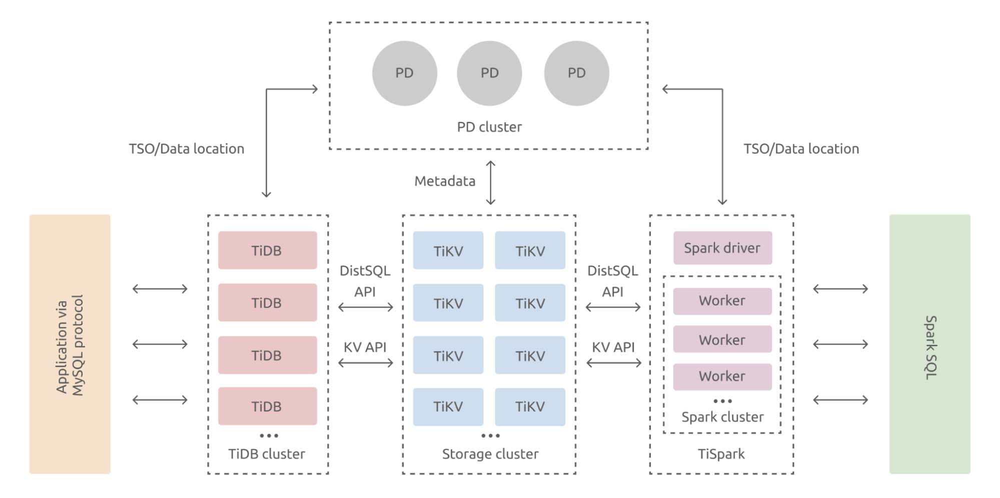
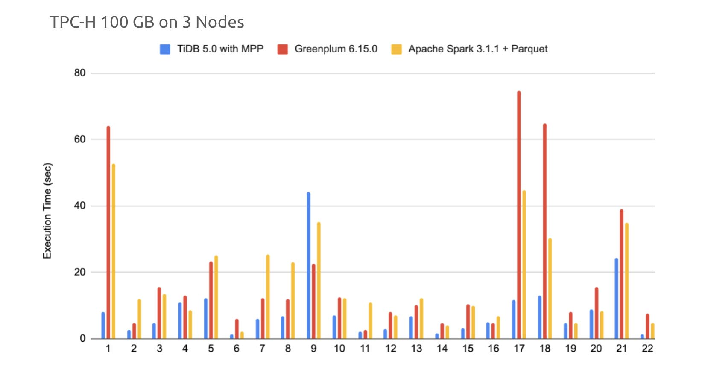
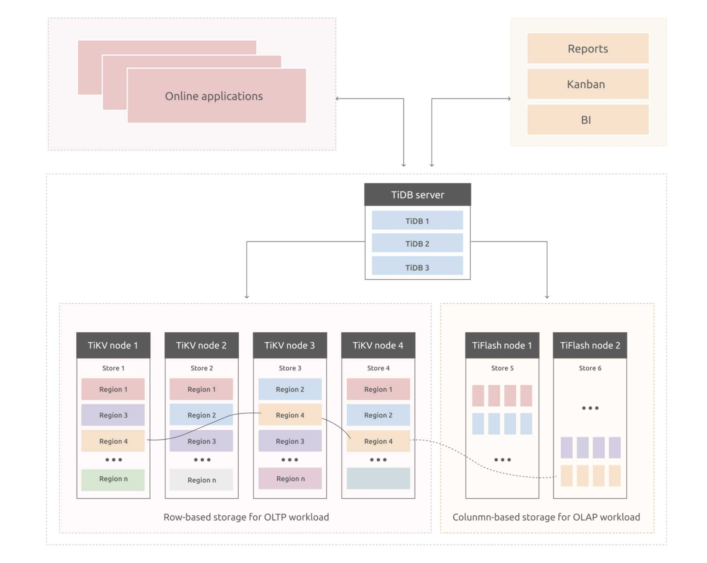
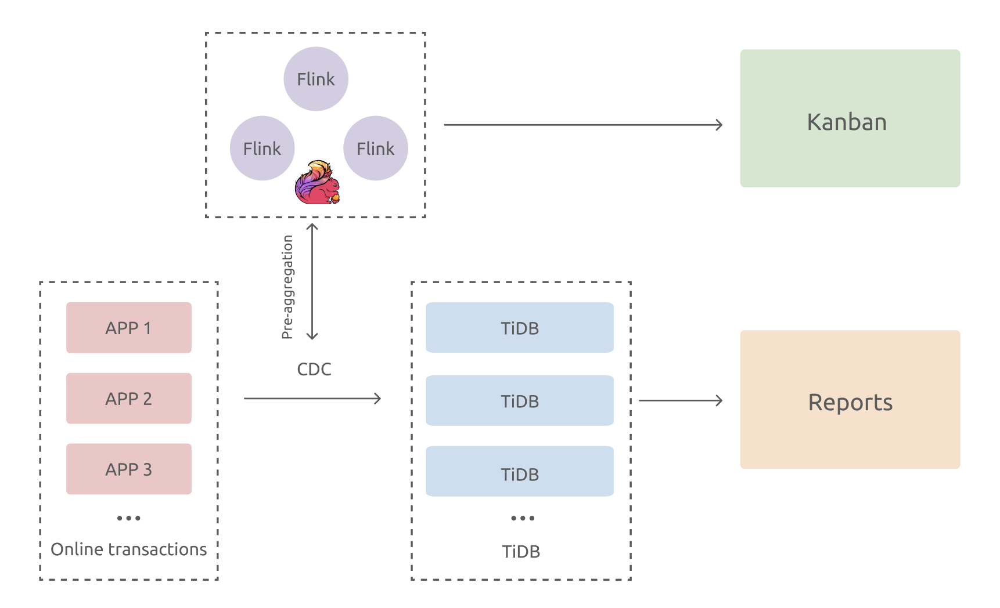
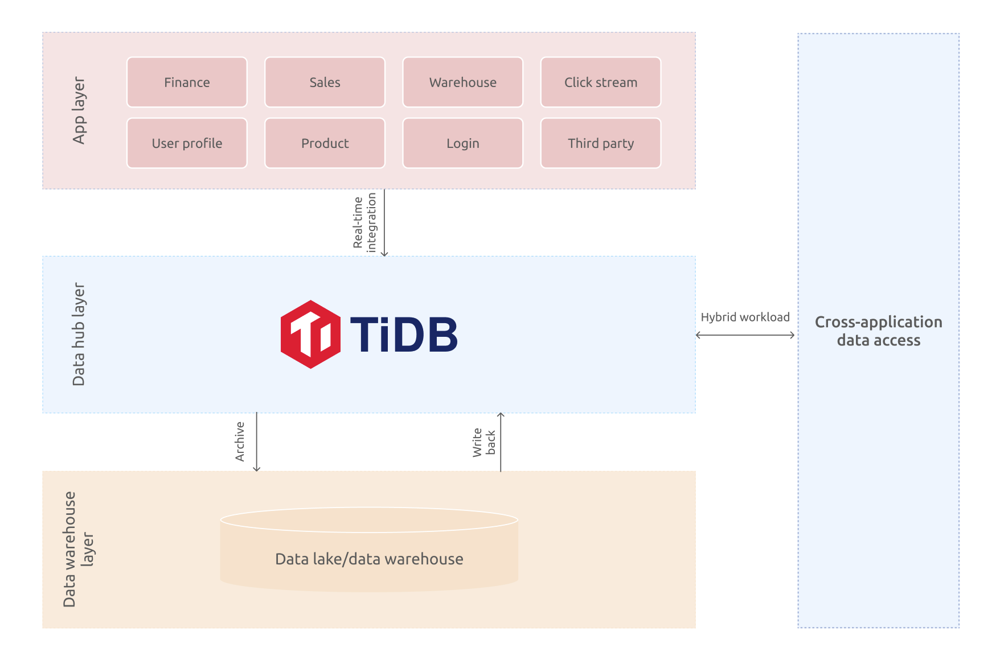

**Author:** [Shawn Ma](https://github.com/ilovesoup) (Tech Lead of the Real-time Analytics team at PingCAP)

**Transcreator:** [Ran Huang](https://github.com/ran-huang); **Editor:** Tom Dewan

As the novel _Romance of the Three Kingdoms_ tells us, "The empire, long divided, must unite; long united, must divide."

The same ebb and flow are taking place in the database world. In the beginning, one type of DBMS served all data requests. But the days of monolithic databases are long gone. As applications grew more complicated, databases were optimized for different use cases and branched out into numerous types.

However, performance is not the only way to judge a database. **A successful database is convenient to use, can satisfy our changing needs, _and_ give us satisfactory performance.**

This is [the philosophy behind TiDB](https://pingcap.com/blog/five-principles-that-guide-tidb-and-pingcap-II#build-a-universal-globally-adopted-database). TiDB is an open-source, distributed SQL database that aims to serve all types of workloads in just one database. The long-divided database architecture shall again be united. The key to this unity? Hybrid transactional and analytical processing (HTAP).

## The evolution of an HTAP database

An HTAP database handles both online transactional processing (OLTP) and online analytical processing (OLAP) workloads. In TiDB's case, this basic idea has gone through three major stages.

TiDB began as an OLTP-oriented database with OLAP coprocessors. TiKV, the storage layer, processed part of the OLAP workload. It aggregated data in shards, and TiDB summarized data on top of that. This approach provided fast, multi-dimensional aggregation.

In its second stage, TiDB introduced an external analytics engine. We realized that aggregating data wasn't enough; we also needed a complex computing engine. We sought help from Apache Spark and built [TiSpark](https://pingcap.com/blog/tispark-more-data-insights-no-more-etl), a Spark plugin for the TiDB platform. TiSpark integrates Spark with TiKV and runs Spark SQL on fresh data in TiKV.

Stage 2: TiDB + Spark

Now, in the third stage of our idea, we have a true HTAP database. By [combining rowstore and columnstore](https://pingcap.com/blog/delivering-real-time-analytics-and-true-htap-by-combining-columnstore-and-rowstore), TiDB can deliver real-time analytics and true HTAP capabilities. We introduce a columnar storage engine, [TiFlash](https://docs.pingcap.com/tidb/stable/tiflash-overview/), which replicates data from TiKV and performs analytical queries on fresh, consistent data.

Stage 3: TiDB + TiFlash

[Equipped with the massively parallel processing (MPP) engine](https://pingcap.com/blog/tidb-5.0-a-one-stop-htap-database-solution#the-evolution-of-tidbs-htap-architecture), TiDB can handle both OLTP and OLAP workloads. Its analytics performance is 2x~3x better than the mainstream analytical engines.

TiDB vs. Greenplum vs. Spark

Though TiKV and TiFlash are two separate storage engines, TiDB provides a unified SQL layer for your application to access data. TiDB identifies the query type and selects the most efficient execution plan and engine to run your query. From the application's point of view, every data it reads, whether from the rowstore or columnstore, is fresh and consistent.

More importantly, this architecture is highly isolated. TiKV and TiFlash run on two sets of resources, so the two types of workloads don't interfere with each other.

If you're interested in how we built TiDB into a HTAP database, check out [my previous post](https://pingcap.com/blog/how-we-build-an-htap-database-that-simplifies-your-data-platform).

  <a href="/download" onclick="trackViews('INSERT TITLE', 'download-tidb-btn-middle')"><button>Download TiDB</button></a>
  <a href="/contact-us" onclick="trackViews('INSERT TITLE', 'contact-us-middle')"><button>Request a Demo</button></a>

## How HTAP benefits users

About 33% of production-level TiDB clusters have deployed TiFlash nodes; they put TiDB's HTAP capabilities to good use. According to our survey, users most often employ HTAP for hybrid workloads, stream computing, and data hub scenarios.

### Hybrid workloads

TiDB can efficiently handle both OLTP and OLAP requests in a single architecture. From a user perspective, all your data go to one place. The app server receives all types of requests and sends them to the TiDB server, which dispatches the requests to different storage engines.

As an example, take an enterprise resource planning (ERP) system. You can use TiDB for OLTP workload and use TiFlash to generate reports and real-time Kanban.

Using TiDB for hybrid workloads

### Stream computing

Stream computing is also a pressing demand. There's a high overlap between TiDB users and Flink users. Many of them use Flink to process change data capture (CDC) and then write these data in TiFlash or TiDB.

Why would you want to use Flink with TiDB? The answer is that TiDB is a horizontally scalable database with both columnstore and rowstore. After TiDB receives data from Flink, you can either perform calculations and generate Kanbans in Flink, or form a real-time data warehouse via extract, transform, load (ETL) and show various reports in TiDB.

TiDB in the stream computing scenario

### Data hub

A data hub is a layer between the application and the data warehouse. It stores hot, fresh data for a limited time to serve real-time queries or process highly concurrent requests.

If your system has Hadoop or another big data architecture, you can use TiDB as a data hub between the applications and the offline data warehouse. Data is integrated into TiDB in real time via CDC, and TiDB provides real-time reports and data access across multiple applications. In addition, TiDB archives data in batch to the offline data lake or data warehouse.

TiDB in the data hub scenario

## Our next move: cloud-native + multi-model

What about the future? What will TiDB's fourth stage be like? Right now, we think TiDB will be **a multi-model and real-time database with cloud-native as its backbone**.

**By combining TiDB and stream, we'll be able to expand the scope of real-time computing.** To achieve that, we plan to introduce materialized views and columnar store fault tolerance. Currently, TiDB can only replicate data from rowstore to columnstore. The columnstore's analytical engine requires the same data modeling as rowstore. But with the future help of materialized views and streams, TiDB can take one step towards a data warehouse and perform lightweight modeling on real-time data.

**Another goal is a TiDB Cloud-centric platform for cloud-native query federation.** The cloud is a vast pool that collects and aggregates data from different applications. Because the computing layer is separate from the storage layer, if TiDB's computing layer is combined with a foreign data wrapper, it can be an independent engine for federated queries. This opens up the possibility of connecting TiDB with other data systems. Also, we can choose external engines to complement TiDB for machine learning and other purposes.

**HTAP is a solid foundation for multi-model databases.** TiDB now supports OLTP and OLAP and provides KV storage. **The TiDB community at large is also exploring other forms of engines, like inverted indexes for fast full-text searches**. These features will be added to our roadmap as well.

## Summary

I often hear the question, **"What do you want to achieve with HTAP?"**

Our goal is to offer a one-stop experience for all data requests. With TiDB, you'll have:

* A scalable OLTP database, which is the source of every piece of data
* Real-time data analytics, powered by stream computing and materialized views
* All capabilities available on the cloud, combining data online and offline

The whole architecture is sewn together via federated queries and the big data ecosystem. **One gateway to all your data.** That's the united, "one-stop" experience we're talking about.

If you want to know more about HTAP, you can join [our Slack channel](https://slack.tidb.io/invite?team=tidb-community&channel=everyone&ref=pingcap-blog) and talk to TiDB experts. You can also [contact us](https://pingcap.com/contact-us/) and request a demo.
