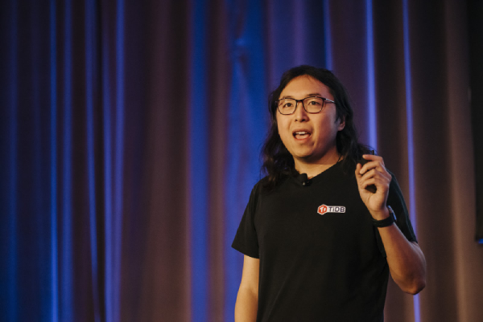
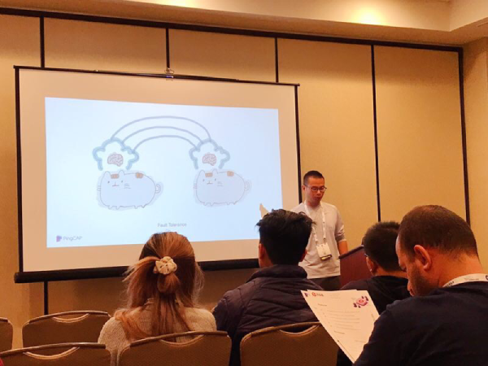
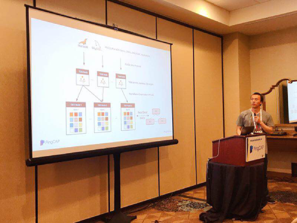
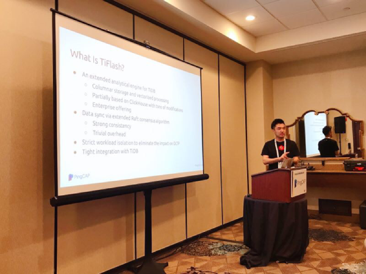
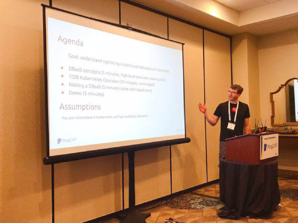
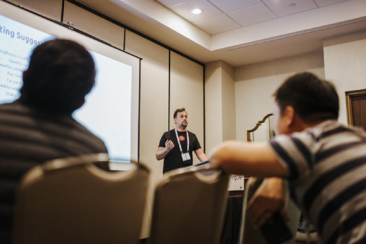
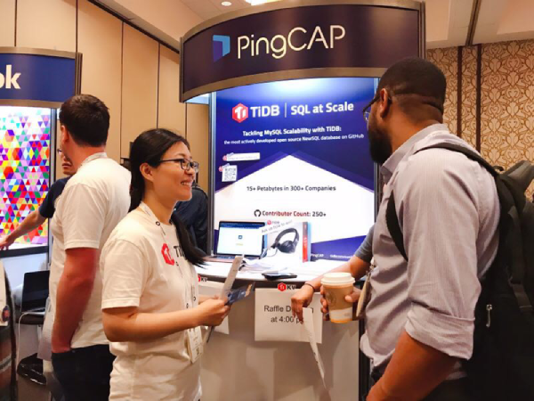
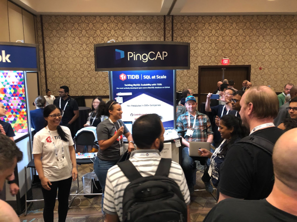
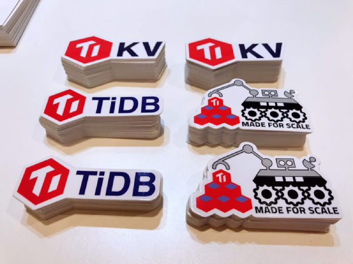

From May 28 to May 30, the PingCAP team attended [Percona Live](https://www.percona.com/live/19/), a leading open-source database conference, in Austin, Texas. It's our 5th Percona Live, and it's clear to us that the Percona-led open-source database community is growing strong, and the TiDB community is growing alongside it.

At last year's Percona Live North America edition in Santa Clara, CA, TiDB was a relative unknown, and we only had one session near the end of Day 2 of the conference to introduce it. Since then, we participated in Percona Live Europe edition in Frankfurt, Germany, where myself and our VP of Engineering, Li Shen, [delivered a keynote](https://www.percona.com/live/e18/sessions/tidb-21-mysql-compatibility-and-multi-cloud-deployment) on TiDB 2.1 and my colleague Morgan Tocker gave [a deep dive talk](https://www.percona.com/live/e18/sessions/tidb-distributed-horizontally-scalable-mysql-compatible) that famously lasted more than an hour for a 25-minute slot. Clearly, the Percona audience was hungry to learn more.

To satisfy that hunger, we decided to organize a keynote plus an entire TiDB track with seven deep dive sessions.  

## Tech Tech Tech

Our presence at Percona Live started off with a bang where Ed Huang, PingCAP's co-founder and CTO, delivered a keynote on all that's new and cool in TiDB 3.0, our newest version that will reach General Availability later this month. It was a very technical talk -- rare for a keynote -- and Ed himself admitted during the keynote that there are just too many new features in 3.0 to cover in a 15-minute window. ([Here are his slides](https://cdn2.hubspot.net/hubfs/4466002/PerconaLive%20Keynote.pdf?utm_source=hs_email&utm_medium=email&_hsenc=p2ANqtz-_9qqk129R8ydcMJWkPxjLT4cNKGctCfS4uVI51iiE8T4Ept8cNY5YGf2qrDwO4hVamWK-U).) Luckily, a full TiDB track awaits to showcase them all.

 Ed Huang on the Percona Live keynote stage 
  

We designed the TiDB track to share with developers, DBAs, and all practitioners technical know-how, reproducible benchmarks, and best practices on how TiDB can solve their problems. Here is the list of topics linked to their respective slides, along with some action shots:

- [TiDB and Amazon Aurora: Compare, Contrast, Combine](https://cdn2.hubspot.net/hubfs/4466002/TiDB%20vs%20Aurora.pdf?utm_source=hs_email&utm_medium=email&_hsenc=p2ANqtz-_9qqk129R8ydcMJWkPxjLT4cNKGctCfS4uVI51iiE8T4Ept8cNY5YGf2qrDwO4hVamWK-U)
- [Using Chaos Engineering to Build a Reliable TiDB](https://cdn2.hubspot.net/hubfs/4466002/Using%20Chaos%20Engineering%20to%20Build%20a%20Reliable%20TiDB.pdf?utm_source=hs_email&utm_medium=email&_hsenc=p2ANqtz-_9qqk129R8ydcMJWkPxjLT4cNKGctCfS4uVI51iiE8T4Ept8cNY5YGf2qrDwO4hVamWK-U)
- [Deep Dive into TiDB SQL Layer](https://cdn2.hubspot.net/hubfs/4466002/Deep%20Dive%20into%20the%20TiDB%20SQL%20Layer.pdf?utm_source=hs_email&utm_medium=email&_hsenc=p2ANqtz-_9qqk129R8ydcMJWkPxjLT4cNKGctCfS4uVI51iiE8T4Ept8cNY5YGf2qrDwO4hVamWK-U)
- [Making HTAP Real with TiFlash -- A TiDB Native Columnar Extension](https://cdn2.hubspot.net/hubfs/4466002/Making%20HTAP%20Real%20with%20TiFlash%20-%20A%20TiDB%20Native%20Columnar%20Extension.pdf?utm_source=hs_email&utm_medium=email&_hsenc=p2ANqtz-_9qqk129R8ydcMJWkPxjLT4cNKGctCfS4uVI51iiE8T4Ept8cNY5YGf2qrDwO4hVamWK-U)
- [Making an 'aaS' out of TiDB: building DBaaS on a Kubernetes Operator](https://cdn2.hubspot.net/hubfs/4466002/Making%20an%20aaS%20out%20of%20TiDB.pdf?utm_source=hs_email&utm_medium=email&_hsenc=p2ANqtz-_9qqk129R8ydcMJWkPxjLT4cNKGctCfS4uVI51iiE8T4Ept8cNY5YGf2qrDwO4hVamWK-U)
- [From MySQL to TiDB and back again](https://cdn2.hubspot.net/hubfs/4466002/From%20MySQL%20to%20TiDB%20and%20back%20again.pdf?utm_source=hs_email&utm_medium=email&_hsenc=p2ANqtz-_9qqk129R8ydcMJWkPxjLT4cNKGctCfS4uVI51iiE8T4Ept8cNY5YGf2qrDwO4hVamWK-U)

 Siddon Tang sharing how our team uses Chaos Engineering to make TiDB more reliable 

 Jason Zhang deep diving into the TiDB SQL layer 

 Ruoxi Sun explaining our new columnar storage, TiFlash 

 Greg Weber introducing how to make an 'aaS' out of TiDB: building DBaaS on a Kubernetes Operator 

 Morgan Tocker sharing how to use open source tools to migrate from MySQL into (and out of) TiDB 

In addition to our own team's presence, we were lucky to have Frank Ober from Intel sharing his take on [how TiDB is leveraging Intel Optane to tackle IO challenges](https://www.percona.com/live/19/sessions/leveraging-optane-to-tackle-your-io-challenges-with-tidb) (download Frank's slides [HERE](https://cdn2.hubspot.net/hubfs/4466002/Intel-TiDB-Percona-May19-FINAL.pdf)), and Jervin Real and Francisco Bordenave from Percona, who shared their own take on how to replicate [MySQL data to TiDB for real-time analytics](https://www.percona.com/live/19/sessions/replicating-mysql-data-to-tidb-for-real-time-analytics).

By our own team's rough estimate, out of the 700+ people who attended this Percona Live, less than half have heard of TiDB *before* the conference. After Ed's keynote, almost all of them know about the technology, and many of whom have either attended the TiDB track or visited our booth to learn more.

## Making Friends, Building Team, Fostering Community

Of course, going to a community-oriented tech conference like Percona Live isn't just about talking, it's also about listening and learning from others. The conference was full of interesting talks, with track topics ranging from stalwarts like MySQL, PostgreSQL and MariaDB, to newer subjects like Kubernetes and Observability & Monitoring. There was something for everyone.

The PingCAP booth was also buzzing with activities as many attendees came by to ask questions about TiDB, enter our raffle, grab stickers, and share learnings about what they were doing with open-source databases. We saw many familiar faces from past Percona conferences, but also made new friends from all over the country and the world. As a case in point, I personally had in-depth conversations with folks from Indeed.com, Kohl's, and one of the largest Internet companies in Turkey!

Open-source is truly a global force.

 Queeny Jin chatting with a TiDB enthusiast at the PingCAP booth 

 Samantha Peters running a raffle for conference attendees 

 Our stickers. Yes we love stickers! 

Going to conferences serves a double purpose for our team. At PingCAP, we are a very remote-friendly workforce with people residing and working from many different cities in China and throughout North America. So going to conferences is also an opportunity to meet other team members face to face, work and live together under one roof, and connect as human beings.

This time, we had 16 people together in Austin, where we did some team-building activities, ate (a lot of) BBQ, and celebrated three birthdays! Here's a homemade video produced by our community and events manager, Samantha, that captured all our favorite moments.

<iframe src="https://player.vimeo.com/video/340116507" width="640" height="564" frameborder="0" allow="autoplay; fullscreen" allowfullscreen></iframe>

Suffice to say, Percona Live Austin edition was a great experience from many angles. We are pleased that an unbiased expert team like Percona is leading the charge to continue bringing together and growing the open-source database community. And we are grateful to be part of it.
