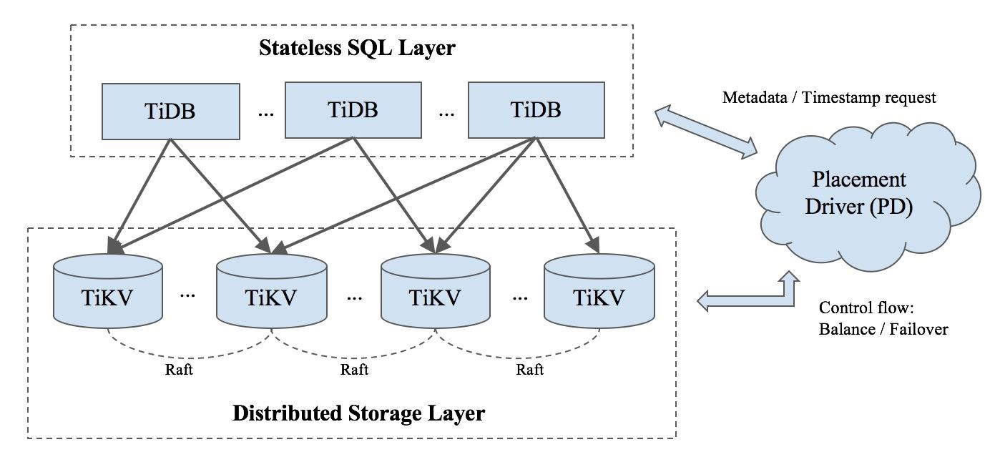
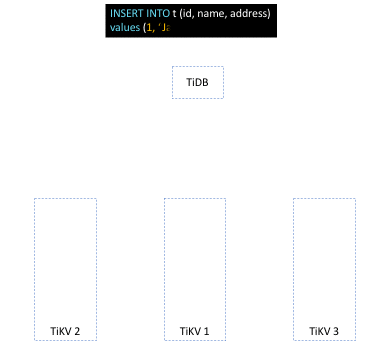
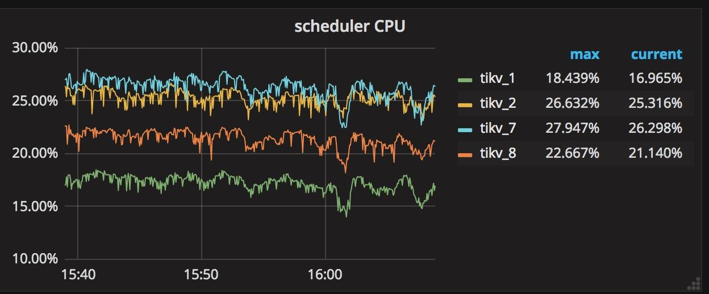
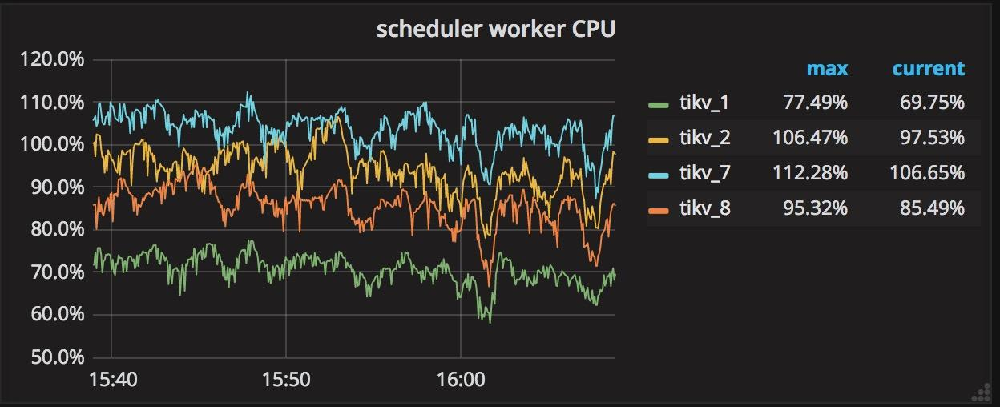
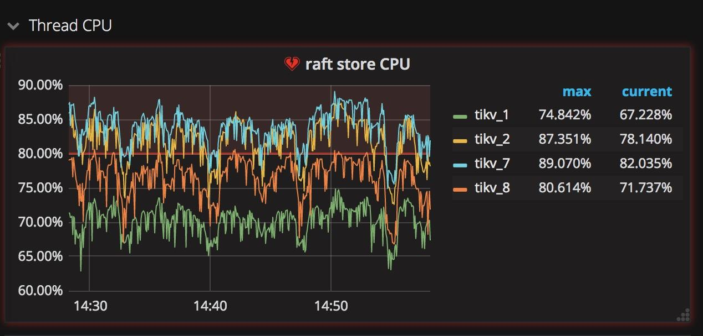
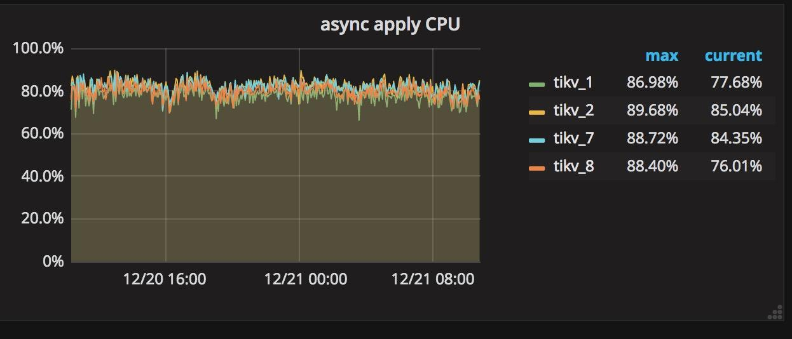
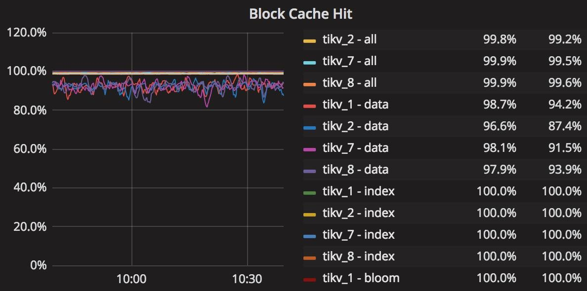
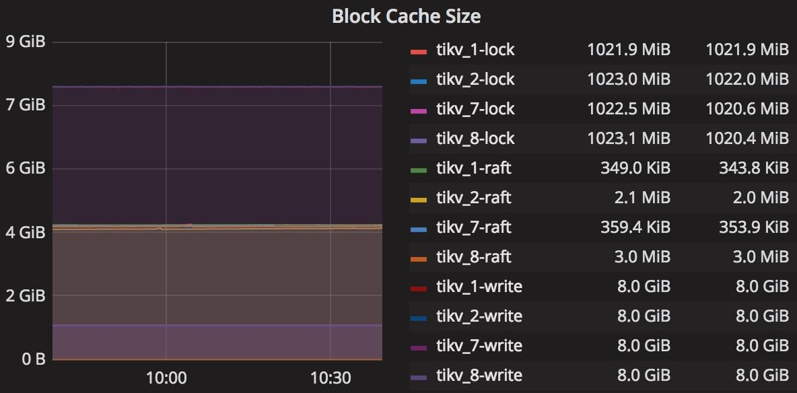

**Author:** Jinpeng Zhang, Database Engineer, Storage Team at PingCAP

Doing performance tuning on distributed systems is no joking matter. It’s much more complicated than on a single node server, and bottlenecks can pop up anywhere, from system resources in a single node or subcomponent, to cooperation between nodes, to even network bandwidth. Performance tuning is a practice that aims to find these bottlenecks and address them, in order to reveal more bottlenecks and address them as well, until the system reaches an optimal performance level. In this article, I will share some best practices on how to tune "write" operations in TiDB to achieve maximum performance. 

[TiDB](http://bit.ly/tidb_repo_publication) is an open source hybrid transactional/analytical processing (HTAP) NewSQL database. One TiDB cluster has several TiDB servers, several TiKV servers , and a group of Placement Drivers (PD) (usually 3 or 5 nodes). The TiDB server is a stateless SQL layer, the TiKV server is the Key-Value storage layer, and PD is a manager component with god view that is responsible for storing metadata and conduct load balancing. Below is the architecture of a TiDB cluster, and you can find more details on each component in the official [TiDB documentation](https://github.com/pingcap/docs).

*TiDB Architecture*

## Gathering Metrics

We gather a lot of metrics inside each component and they are periodically sent to [Prometheus](https://prometheus.io/), an open source system monitoring solution. You can easily observe the behaviors of these metrics in [Grafana](https://grafana.com/), an open source platform for time series analytics. If you deploy the TiDB cluster using [Ansible](https://github.com/pingcap/docs/blob/master/op-guide/ansible-deployment.md), Prometheus and Grafana will be installed by default. By observing various metrics, we can see how each component is working, pinpoint where are the bottlenecks, and address them via tuning. Let’s see an example.

## Writeflow of an Insert SQL Statement

Assuming we use the following SQL statement to insert a record to table t.

mysql >> INSERT INTO t(id, name, address) values(1, "Jack", “Sunnyvale”);

Above is a simplified, animated overview of how this statement is processed in TiDB. After the TiDB server receives this SQL statement, it will transform the statement into one or more Key-Value (KV) pairs, depending on the number of indexes. These KV pairs will then be sent to an associated TiKV-server, where they will be replicated to several other TiKV-servers in the form of Raft log. Finally, when the Raft log has been committed, these KV pairs will be written to the engine for storage. 

There are three key processes at play in processing this statement: transforming SQL to KV pairs, replica by Region, and two-phase commit. Let’s dive into each in more details.

#### From SQL to KV pairs

Unlike other database systems, TiDB only stores KV pairs in order to provide infinite horizontal scalability with strong consistency. So how do we implement high-level concepts, such as database, table, and index? In TiDB, each table has an associated global unique number called "table-id." The keys of all the data in a particular table, including records and indexes, all begin with the 8 bytes table-id. Each index has a table scope unique number called “index-id.” The following two lines show the encoding rules of record keys and index keys.

*Encoding rules of record keys and index keys*

#### The Concept of Region

In TiDB, a Region represents a continuous, left-close-right-open key range [start_key, end_key). Each Region has several replicas, and each replica is called a peer. Every Region also belongs to an individual Raft group, in order to guarantee strong data consistency among all peers. (For more information on how the Raft consensus algorithm is implemented in TiKV, see a related [blog post](https://pingcap.com/blog/optimizing-raft-in-tikv/) by Distinguished Engineer at PingCAP, Liu Tang.) Nearby records of the same table are most likely in the same Region, because of the encoding rules that I mentioned above. 

When the cluster is first initialized, there is only one Region. A Region will dynamically split into two nearby Regions when the Region reaches a certain size (currently the default is 96MB), automatically distributing data across the system to provide horizontal scaling. 

#### Two-Phase Commit

Our transaction model is inspired by [Percolator](https://research.google.com/pubs/pub36726.html), but with some additional optimizations.

Briefly speaking, it is a two-phase commit protocol with prewrite and commit.

There’s a lot more under the hood in each of these components, but a macro-level understanding is enough to set the scene for performance tuning. Now, let’s dig into four specific tuning techniques.  

#### Tuning Technique #1: Scheduler

All write commands are dispatched to the scheduler model before replicating. The scheduler model is comprised of one scheduler thread and several worker threads. Why do we need a scheduler model? Before writing to the database, we need to check whether this write command is allowed and whether it satisfies the constraints of a transaction. All this checking workload, which might need reading from the underlying storage engine, is handled by scheduler workers.

When you see in your metric that the total CPU usage of the scheduler workers exceeds  scheduler-worker-pool-size * 80%, the way to tune your system is to increase the number of the scheduler workers to improve performance.

You can change the scheduler workers count by modifying the ‘scheduler-worker-pool-size’ item in the ‘storage’ section of the configuration file. There are 4 scheduler workers by default on machines whose CPU core count is less than 16, otherwise the default is 8 scheduler workers. See relevant code section: [scheduler-worker-pool-size = 4](https://github.com/pingcap/tikv/blob/master/etc/config-template.toml#L81)

*Monitoring CPU usage per scheduler work*

#### Tuning Technique #2: ‘raftstore’ thread and ‘apply’ thread

As I mentioned above, we use Raft to implement strong consistency between multiple peers. Before we actually write one KV pair into the database, this operation must first be replicated by Raft in the form of Raft log, which also needs to be written to disk in each peer to maintain durability. Only when the Raft log has been committed can the associated KV pair of the write command be written to the database.

Thus, there are two types of write: writing Raft log and writing KV pair to the database. To process each type separately inside TiKV, there is one thread named "raftstore", whose obligations are handling all Raft messages and writing Raft logs to the disk, and another thread named “apply worker,” whose responsibility is writing KV pairs to storage. These two threads, located in the ‘Thread CPU’ sub-panel of the TiKV panel in Grafana (see graphics below), both play significant roles in the write workload. We can easily trace how busy these threads are through Grafana. 

What’s worth paying attention to about these two threads is that if only some TiKV servers’ "apply" or “raftstore” threads are very busy, while other servers’ are not, that means the writing load is extremely unbalanced. These few busy TiKV servers thus become bottlenecks of the whole cluster. One way to accidentally create this hotspot situation is by choosing a column whose value monotonically increases. For example, using AUTOINCREMENT primary key or creating index on the column whose value keeps increasing, e.g. last access timestamp.

To tune this scenario and remove the bottleneck, you must avoid designing primary keys and indexes on columns whose values increase monotonically.

In traditional single node database systems, using the AUTOINCREMENT keyword can offer a lot of benefit for sequential writing. But when it comes to a distributed database system, the most important thing is balancing load well on all components.

#### *TiKV Thead CPU sub-panel*

#### Tuning Technique #3: RocksDB

RocksDB is a persistent KV store with high performance and many useful features. TiKV uses [RocksDB](https://github.com/facebook/rocksdb) as its underlying storage engine, as well as many of its features like column family, delete range, prefix seek, memtable prefix bloom filter, sst user defined properties and so on. RocksDB provides its own detailed [performance tuning documentation](https://github.com/facebook/rocksdb/wiki/RocksDB-Tuning-Guide).

Underneath each TiKV server are two RocksDB instances: one stores the data, which we call kv-engine, and the other one stores the Raft log, which we call raft-engine. The kv-engine has 4 column families: ‘default’, ‘lock’, ‘write’, and ‘raft’. Most records are stored in the ‘default’ column family and all indexes are stored in the ‘write’ column family. You can tune these two RocksDB instances by modifying the block-cache-size value in the associated sections in the configuration file to achieve top performance. The relevants sections are: [rocksdb.defaultcf] [block-cache-size = "1GB"](https://github.com/pingcap/tikv/blob/master/etc/config-template.toml#L336) and [rocksdb.writecf] [block-cache-size = “1GB”](https://github.com/pingcap/tikv/blob/master/etc/config-template.toml#L370)

The reason why we tune block-cache-size is because the TiKV server reads data from the ‘write’ column family frequently to check whether the transaction constraints are satisfied when inserting. So it is important to set an appropriate size for the ‘write’ column family’s block-cache. When block-cache hit rate of ‘write’ column family is below 90%, you should increase the block-cache-size of ‘write’ column family. The default value of block-cache-size for ‘write’ column family is 15% of total memory, and for ‘default’ column family it is 25%. For example, if we deploy a TiKV node on a machine with 32GB memory, then the value of ‘write’ column family’s block-cache-size would be about 4.8GB and 8GB for ‘default’ column family. In heavy write workload, the data in ‘default’ column family is rarely accessed, so when we pinpoint that the cache hit rate of ‘write’ column family is below 90%, for example 50%, then  we know the frequently accessed data in ‘write’ column family is about twice as large as the default 4.8GB. To tune this scenario for better performance, we can explicitly set the ‘write’ column family’s block-cache-size to be say 9GB. However, we also need to decrease the ‘default’ column family’s block-cache-size to 4GB to avoid OOM (Out Of Memory) risk. You can find these detailed statistics for RocksDB in the ‘RocksDB-kv’ panel in Grafana to help you make these adjustments.

*RocksDB-kv panel*

## Tuning Technique #4: Batch Insert

You can achieve better write performance by using batch insert. From the TiDB server’s perspective, batch insert can reduce not only the RPC latency between clients and TiDB servers, but also the SQL parsing time. Inside TiKV, batch insert can reduce the total number of Raft messages by combining multiple records into one Raft log entry. Based on our experience, it is recommended that you keep the batch size between 50~100 rows. When there are more than 10 indexes in one table, you should decrease the batch size, because inserting one row will create more than 10 KV pairs based on the encoding rules I described above.

## Conclusion

I hope this article helps you get a good sense of some common bottleneck scenarios and how to tune these issues away to achieve optimal performance on "write" procedures when using TiDB. In summary:

1. Don’t let a few TiKV nodes handle the majority of "write" workload, by avoid designing primary keys and indexes on a column whose value monotonically increases. 

2. When the total CPU usage of the scheduler workers in TiKV’s scheduler model exceeds scheduler-worker-pool-size * 80%, increase scheduler-worker-pool-size. 

3. When writing task reads the ‘write’ column family frequently and the block-cache hit rate is below 90%, increase its block-cache-size in RocksDB.  

4. Use batch insert to improve performance on "write" operations. 

Many of our customers, from e-commerce marketplace and gaming, to fintech, media, and travel, are already applying these tuning techniques in-production to get the full benefits of TiDB’s design, architecture, and optimizations. We look forward to sharing their use cases and experiences in the near future. 

Illustration by [**Amanda Limardi**](https://www.behance.net/amandalimadff4)

*Reprinted with permission. © IDG Communications, Inc., 2018. All rights reserved. https://www.infoworld.com/article/3258810/sql/tidb-performance-tuning-a-distributed-newsql-database.html*

