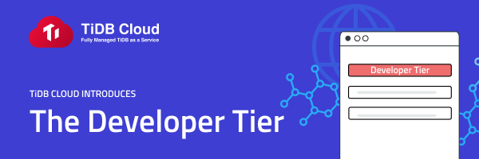

_Through this new Developer Tier offering, PingCAP provides customers with real-world environment testing by offering free, streamlined experience of TiDB Cloud_

**SAN MATEO, CA — November 9, 2021**: [PingCAP](https://pingcap.com/), the leading distributed SQL provider, announced today the availability of its new Developer Tier for TiDB Cloud. The fully-managed database as a service now allows developers to easily launch a small TiDB cluster for free for up to one year. 

The [TiDB Cloud Developer Tier](https://get.pingcap.com/tidb-developer/) introduces a 12-month trial period, in which developers can build and test applications directly in the platform. Through this offering, PingCAP is breaking down the adoption barrier for TiDB, providing the crucial time developers need to experiment first-hand how TiDB and TiDB Cloud can support their mission-critical applications and workloads, while providing decision makers a time frame to properly evaluate and determine where TiDB delivers the highest ROI for their needs.

PingCAP's new offering provides users with storage up to 10GB of OLTP and 10GB of OLAP data. This tier is not meant for production workloads and excludes the 3-copy redundancy that makes high availability possible in regular TiDB Cloud clusters. All Developer Tier clusters are fully functional and run securely in containers and dedicated block storage to ensure the security, safety, and separation of data. TiDB Cloud Developer Tier is now available on Amazon Web Services and will be accessible through the Google Cloud Platform the second half of 2022. 

_"Our commitment to our customers starts before they choose PingCAP as their provider. Through this new developer tier, we are giving users the appropriate time to properly test and evaluate the benefits of TiDB and TiDB Cloud,"_ said Shen Li, SVP, Head of Global Business at PingCAP. _"This new tier aims to ease the decision-making process and give customers the confidence that they are choosing the best option for their projects. Moreover, we are shattering the barrier for TiDB adoption and making it easier for our customers to onboard TiDB in their mission-critical applications."_

TiDB Cloud handles all the behind-the-scenes database management such as infrastructure management, cluster deployment and backup management, leaving developers to focus on creating the next best application. To experience TiDB Cloud visit [our website](https://get.pingcap.com/tidb-developer/) and sign up today, [here](https://tidbcloud.com/signup).

_This press release was originally published on [PR Newswire](https://www.prnewswire.com/news-releases/pingcap-introduces-its-new-developer-tier-to-boost-application-innovation-with-tidb-cloud-301419184.html)._
