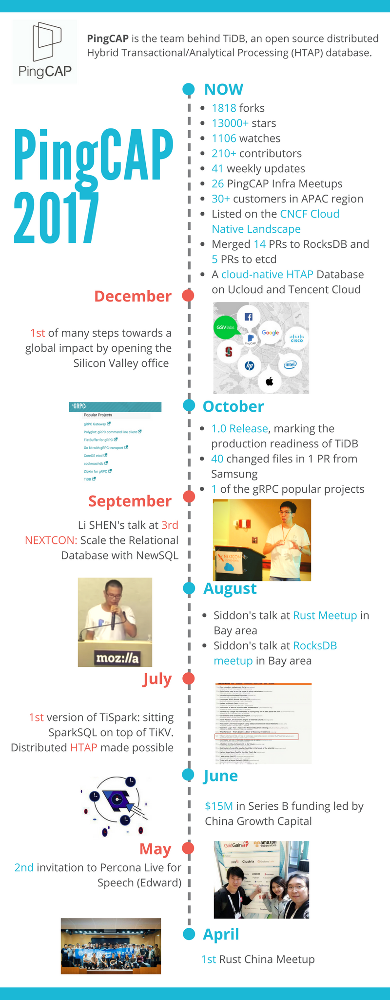

**In open source, we trust!**

2017 has witnessed the growth of PingCAP, from Beijing to Silicon Valley, and the evolution of TiDB, from RC1 to the 1.0 release, and then to the 1.0.5 release. As our CEO Max said in the [TiDB 1.0 announcement](https://www.pingcap.com/blog/2017-10-17-announcement/), "*because of the hard work and dedication of not just every member of our team, but also every contributor, user, and partner in our open source community.*"  

As 2017 draws to a close, let’s take a look back upon the highlights that shape PingCAP and TiDB:

## Community

 - 1818 forks
 - 13000+ stars
 - 1106 watches
 - 210+ contributors
 - 41 weekly updates
 - 26 PingCAP Infra Meetups
 - 1 of the [gRPC popular projects](https://grpc.io/docs/)
 - Listed on the [CNCF Cloud Native Landscape](https://github.com/cncf/landscape#current-version)
 - Merged 14 PRs to RocksDB and 5 PRs to etcd
 - 40 changed files in [1 PR from Samsung Electronics](https://github.com/pingcap/tidb/pull/3956)

## Cloud

- A cloud-native HTAP Database on UCloud and Tencent Cloud

## Product

 - 30+ customers in APAC region
 - [1.0 Release](https://www.pingcap.com/blog/2017-10-17-announcement/), marking the production readiness of TiDB
 - 1st version of [TiSpark](https://github.com/pingcap/tispark): sitting SparkSQL on top of TiKV. Distributed HTAP made possible

## Meetup

 - 1st [Rust China Meetup](https://www.pingcap.com/blog/2017-05-27-rust-in-tikv/)
 - Siddon's talk at[ Rust](https://www.pingcap.com/blog/2017-09-12-futuresandgrpc/) meetup in Bay area
 - Siddon's talk at [RocksDB meetup ](https://www.pingcap.com/blog/2017-09-15-rocksdbintikv/)in Bay area
 - 2nd invitation to Percona Live for Speech ([Edward](https://www.youtube.com/watch?v=dijsN0bddck&feature=youtu.be))

## Company

 - [$15M in Series B funding](https://www.chinamoneynetwork.com/2017/06/13/china-growth-capital-leads-15m-round-in-open-source-database-firm-pingcap) led by China Growth Capital
 - 1st of many steps towards a global impact [by opening the Silicon Valley office](https://www.pingcap.com/blog/Silicon-Valley-Office-Announcement/)

We connect, contribute, collaborate, and we will never stop.

Thank you all, our beloved contributors, customers, and partners, for an amazing 2017! 

Hello, 2018!

See the following infographic for a recap of PingCAP in 2017:

