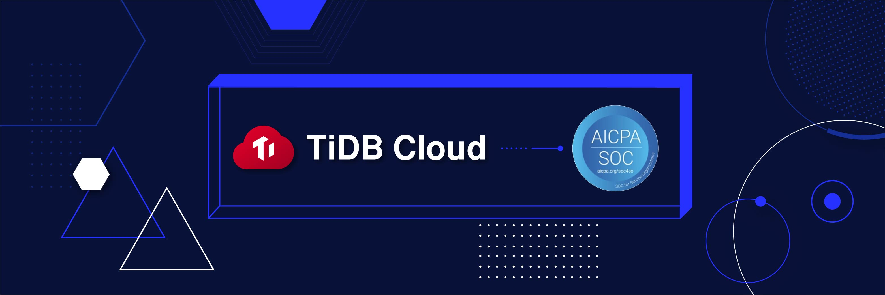

San Mateo, CA - May 10, 2021 - [PingCAP](https://pingcap.com/) is proud to announce the completion of our first SOC 2 Type 2 examination for the [TiDB Cloud](https://pingcap.com/products/tidbcloud) service. After an extensive audit conducted by an independent third party organization, PingCAP has demonstrated the operating effectiveness of our controls designed to keep our service and our customers’ data secure throughout the period of August 1, 2020, to January 31, 2021. Customers are looking to deploy a database platform that helps them realize their digital cloud transformation while meeting ever increasing security compliance initiatives. With this examination, PingCAP delivers on its vision of making TiDB the leading trusted database platform for Cloud deployment, enabling enterprises to confidently deploy and manage their data while meeting the most demanding compliance and security requirements. 

## What is a SOC 2 Type 2 examination?

A System and Organization Controls (SOC) 2 examination inspects the controls at an organization relevant to the applicable Trust Services Categories (TSCs). In August 2020, PingCAP announced the successful completion of our SOC 2 Type 1 examination conducted by Schellman & Company, LLC, attesting to the suitable design of PingCAP’s controls to meet the requirements of the Security, Availability, and Confidentiality TSCs. While a SOC 2 Type 1 report provides customers a level of assurance of the controls in place as of the report date, a SOC 2 Type 2 examination offers greater assurance that the designed controls operated effectively over a period of time (i.e., the report review period). After an independent auditor has performed audit testing of each control, an attestation report is produced with detailed information on how the controls operated and whether there were any lapses in control maintenance. Customers often utilize these reports as an efficient alternative to security questionnaires when meeting their own compliance requirements. 

## What is included in PingCAP’s SOC 2 report?

The report contains descriptions of PingCAP’s various controls designed to ensure the security, availability, and confidentiality of the TiDB Cloud service. Details on the infrastructure, software, data, people, and processes that support these controls are also provided so readers can understand how the PingCAP team protects customers’ data and keeps the TiDB Cloud service running. Lastly, the results of the controls testing are included so customers can make informed decisions. Below are a few examples of the types of controls covered in the report:

- Security and availability monitoring
- Vulnerability management
- Access control to production environments
- Employee onboarding and termination procedures
- Endpoint protection
- Risk assessments
- Customer communications
- Incident response and disaster recovery

If you are interested in learning more about PingCAP’s extensive compliance program, you can request a copy of the full report from your account representative.

## What is next?

While PingCAP is extremely proud to have completed our first Type 2 examination, we understand that the work does not stop here. PingCAP is committed to demonstrating our SOC 2 compliance through continuous examinations in the future. As PingCAP continues to develop the TiDB Cloud service, PingCAP is devoted to further maturing our compliance program so that our customers can deploy a trusted and secure cloud database platform-as-a-service, without missing a beat. Continuous examinations are a great way to identify room for improvement so that we not only earn our customers’ trust but continue to strengthen it over time.
